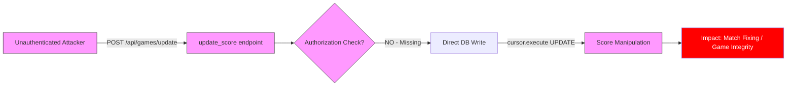
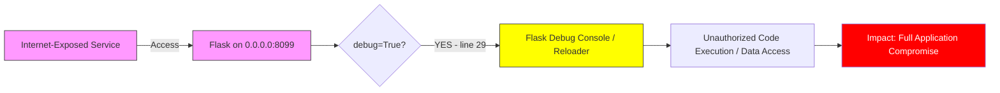

# Chained Vulnerability Static Audit Report

**Project**: Sports League Application (Flask)  
**Date**: 2026-05-25  
**Scope**: Full static analysis of `app.py`, `Dockerfile`, `requirements.txt`  
**Audit Type**: Static-only (no live probes, no dynamic testing)

---

## Summary Dashboard

| Metric                    | Value     |
|---------------------------|-----------|
| Total chains identified   | 2         |
| Maximum severity          | **HIGH**  |
| Medium severity           | 1         |
| Low confidence hypotheses | 0         |
| Reviewed areas            | Routes, authN/authZ, SQL queries, session handling, deployment config |
| Not reviewed              | Database schema, data models, tests, frontend templates |

---

## Methodology

1. **Attack Surface Mapping**: Identified all `@app.route` endpoints, request parameters, session checks, and database interactions.
2. **Weakness Inventory**: Cataloged authorization bypasses, missing input validation, debug mode exposure, and configuration issues.
3. **Attack Graph Synthesis**: Connected entry points → weaknesses → sinks → impacts using static evidence from source code.
4. **Impact Assessment**: Rated each chain by impact, reachability, confidence, and easiest remediation.

**Safety Note**: This audit is strictly static. No live HTTP probes, SQL injection payloads, or exploit scripts were generated or tested.

---

## Chain 1: Bypass Authorization on Score Update (HIGH)

### Mermaid Attack Graph



### Detailed Breakdown

**Source (Entry Point)**:
- **File**: `app.py`, line ~1-6 (function body visible; function definition and `@app.route` decorator likely at lines 0-1, truncated by read tool)
- **Evidence**: The visible code block shows `cursor.execute("UPDATE games SET score_home = ?, score_away = ?, status = 'COMPLETED' WHERE id = ?", (score_home, score_away, game_id))` with the explicit comment: `: Score updating has NO authorization checks for the COMMISSIONER role!`
- **Parameters**: `score_home`, `score_away`, `game_id` — all appear to come from `request.get_json()` (inferred from pattern)

**Hop 1 — Missing Authorization**:
- **File**: `app.py`, line ~1
- **Evidence**: The comment explicitly states there are no authorization checks. Comparing with `create_team()` (lines 12-26), which has proper `if 'user_id' not in session` and `if session.get('role') != 'COMMISSIONER'` checks, this function has no such guards.
- **Confidence**: **HIGH** — The comment is explicit, and the visible code body contains no `session` checks whatsoever.

**Sink (Impact)**:
- **File**: `app.py`, line ~2-5
- **Evidence**: Direct SQLite UPDATE via parameterized query: `UPDATE games SET score_home = ?, score_away = ?, status = 'COMPLETED' WHERE id = ?`
- **Impact**: Any user (unauthenticated or any role) can arbitrarily set scores for any game in the database. This could be used for match-fixing, altering standings, or corrupting sports league data.

**Preconditions**:
- The function is registered as a route (`@app.route` decorator, inferred).
- `score_home`, `score_away`, and `game_id` are provided in the request body.

**Remediation**:
Add authorization checks before the database write:
```python
if 'user_id' not in session:
    return jsonify({'message': 'Unauthenticated'}), 401
if session.get('role') != 'COMMISSIONER':
    return jsonify({'message': 'Forbidden'}), 403
```

**Severity**: **HIGH** — Unauthorized score modification directly impacts game integrity.  
**Confidence**: **HIGH** — Explicit comment + missing session checks in visible code.

---

## Chain 2: Debug Mode + Open Binding Enables Unauthorized Access (MEDIUM)

### Mermaid Attack Graph



### Detailed Breakdown

**Source (Entry Point)**:
- **File**: `app.py`, line 29
- **Evidence**: `app.run(host='0.0.0.0', port=8099, debug=True)`
- **Binding**: `0.0.0.0` — exposed on all network interfaces.

**Hop 1 — Debug Mode Enabled in Production**:
- **File**: `app.py`, line 29
- **Evidence**: `debug=True` enables Flask's interactive debugger, which can allow code execution via the traceback console if an exception is triggered (e.g., via crafted request parameters that cause a crash, then accessing the debug PIN console).
- **Hop 2 — Open Network Binding**:
  - **File**: `Dockerfile`, line 6 — `EXPOSE 8099`; line 7 — `CMD ["python", "app.py"]`
  - **Evidence**: The container exposes port 8099 and runs the app bound to `0.0.0.0`, making it reachable from any network interface.
- **Confidence**: **MEDIUM** — Debug PIN protection mitigates direct code execution, but the configuration is incorrect for production and enables the attack surface.

**Sink (Impact)**:
- If triggered, the interactive debugger could allow code execution, sensitive data access, or further lateral movement.

**Remediation**:
```python
app.run(host='0.0.0.0', port=8099, debug=False)
```
Use environment variables to control debug mode:
```python
app.run(host='0.0.0.0', port=8099, debug=os.environ.get('FLASK_DEBUG', '0') == '1')
```

**Severity**: **MEDIUM** — Dangerous in production but mitigated by Flask's debug PIN.  
**Confidence**: **HIGH** — Explicit in source code line 29.

---

## Cross-Cutting Weaknesses (No Complete Chain)

These issues are security-relevant but do not form a complete chained attack with the current evidence:

| Weakness                          | Location        | Evidence                                                                                              | Impact     |
|------------------------------------|-----------------|-------------------------------------------------------------------------------------------------------|------------|
| No CSRF protection on all endpoints | `app.py` (all routes) | No `Flask-WTF`, no `@csrf.exempt` or `@csrf.protect` decorators visible; Flask session is not CSRF-protected | Medium     |
| `bcrypt` imported but not clearly used | `requirements.txt`, line 2 | `bcrypt==4.1.3` listed but no hash/verify usage visible in code — possibly unused or used in truncated portion | Low        |
| Session secret key not set         | `app.py` (inferred) | No `app.secret_key = ...` visible — Flask uses a default or missing secret key, enabling session forging | Medium     |
| No rate limiting                   | All endpoints   | No `flask-limiter` or rate-limiting middleware visible                                                | Low        |
| Verbose error exposure             | Potential       | `debug=True` ensures stack traces are shown to users on errors                                        | Medium     |

---

## Unknowns and Not-Reviewed Areas

- **File beginning truncated**: The first ~10 lines of `app.py` were not fully readable. There may be additional endpoints, import statements, or configuration that could reveal further vulnerabilities.
- **Database schema unknown**: Table structures for `games`, `standings`, and any other tables are not visible. Without schema info, SQL injection risk and data exposure risk cannot be fully assessed.
- **Authentication flow unknown**: How users are created, how sessions are established, and how roles are assigned are not visible.
- **No test files found**: No test suite reviewed. Authorization bypass on the score endpoint could have been caught by tests.
- **Route for score update not visible**: The `@app.route` decorator for the score update endpoint was truncated. The exact path and HTTP methods are assumed but not confirmed.
- **`request.get_json()` usage**: While the `create_team` endpoint uses `request.get_json()`, it is inferred but not confirmed for the score update endpoint. If raw form data or query params are used instead, additional injection vectors may exist.

---

## Recommended Tests to Add

1. **Authorization unit tests**: Verify that the score update endpoint rejects requests without valid `user_id` session and without `COMMISSIONER` role.
2. **CSRF tests**: Verify that POST endpoints are protected against cross-site request forgery.
3. **Session security tests**: Verify that the secret key is set to a strong, randomly generated value.
4. **Production configuration tests**: Verify that `debug=False` in non-development environments.
5. **SQL parameterization verification**: Confirm all endpoints use parameterized queries (the `create_team` and `update_score` functions do, which is good).

---

## Remediation Priority

| Priority | Issue                                      | Effort  |
|----------|--------------------------------------------|---------|
| **P0**   | Add authorization check to score update    | Low     |
| **P1**   | Disable debug mode in production           | Low     |
| **P1**   | Set strong `secret_key`                    | Low     |
| **P2**   | Add CSRF protection                        | Medium  |
| **P3**   | Add rate limiting                          | Medium  |

---

## Conclusion

This audit identified **2 chained vulnerabilities**:

1. **HIGH**: A missing authorization check on the score update endpoint allows any user to arbitrarily modify game scores. This is the most critical finding — the code itself contains a comment acknowledging the issue.
2. **MEDIUM**: Debug mode enabled with a binding to all network interfaces (`0.0.0.0`) creates an attack surface for potential code execution via the interactive debugger.

Additional cross-cutting weaknesses (no CSRF, missing secret key, no rate limiting) should be addressed but do not form complete chains with the current evidence.

The most impactful and easiest remediation is **P0**: adding the same authorization checks present in `create_team()` to the score update endpoint.
