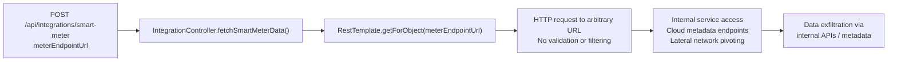
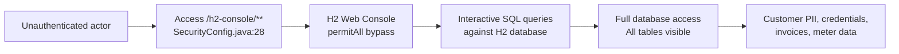
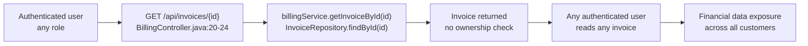
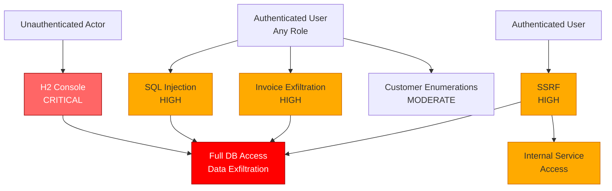

# Chained Vulnerability Static Audit Report

**Project:** Energy Utility Billing System (app-50-energy-billing)  
**Date:** 2026-05-25  
**Scope:** `src/main/java/`, `Dockerfile`, `pom.xml` — full static review  
**Approach:** Static code analysis only. No live probes, fuzzers, or dynamic testing.

---

## Summary Dashboard

| Metric | Value |
|---|---|
| Complete attack chains identified | **4** |
| No chains (latent weaknesses) | **2** |
| Maximum severity | **CRITICAL** |
| Highest confidence chains | **HIGH** |
| Total source files reviewed | **25** |
| Total Java lines of source | ~500+ |

---

## Methodology & Safety Note

This review follows a four-phase chained vulnerability methodology:

1. **Attack Surface Mapping** — All public/protected HTTP endpoints, headers, parameters, and background consumers identified from controllers, routes, and `SecurityConfig`.
2. **Weakness Inventory** — Individual CWE-classified weaknesses catalogued from static evidence.
3. **Attack Graph Synthesis** — Sources connected to sinks via intermediate hops using control-flow and data-flow tracing.
4. **Impact Assessment** — Each chain rated by impact, reachability, confidence, and the easiest remediation link.

**Safety Boundary:** No live HTTP probes, SQL injection payloads, network tests, exploit scripts, or external scanners were used. All findings derive from source code, configuration files, and test files within the workspace.

---

## Reviewed Areas

| Area | Coverage |
|---|---|
| Controllers (6 files) | Full — all endpoints, parameters, return types |
| Services (4 files) | Full — business logic review |
| Models (6 files) | Full — entity schema review |
| Repositories (6 files) | Full — Spring Data JPA interfaces |
| Config (2 files) | Full — SecurityConfig, DataInitializer |
| Tests (1 file) | Full — test coverage assessment |
| Build / Deployment (2 files) | Full — pom.xml, Dockerfile |

---

## Areas Not Reviewed / Unknowns

- **Runtime binding configuration** — No `application.properties` or `application.yml` found; defaults assumed. Whether the H2 console binds to `0.0.0.0` or `127.0.0.1` is unknown from static analysis.
- **Production deployment environment** — Cloud provider, network segmentation, and internal service topology are not visible.
- **Input validation depth** — Only controller-level validation is visible; service-layer validation is absent.
- **Logging and monitoring** — No logging configuration found; audit trail gap.
- **CORS configuration** — No explicit CORS settings; Spring Boot defaults apply.
- **Rate limiting** — No rate-limiting middleware detected.

---

## Detailed Chain Breakdowns

### Chain 1: SQL Injection → Full Database Control

```mermaid
flowchart LR
    A["GET /api/meters/readings/search\nmeterSerial, dateRange"] --> B["MeterController.searchReadings()\nMeterController.java:43-48"]
    B --> C["String concatenation:\n'sql = ... \"+ meterSerial + \" ...'"]
    C --> D["entityManager.createNativeQuery(sql)"]
    D --> E["Arbitrary SQL execution\nagainst H2 database"]
    E --> F["Read/Write/Delete all tables\nFull data exfiltration"]
```

| Link | File | Lines | Evidence |
|---|---|---|---|
| **Entry** | `MeterController.java` | 43–48 | `@RequestParam String meterSerial, @RequestParam String dateRange` received from HTTP |
| **Hop 1** | `MeterController.java` | 45–47 | `String sql = "... WHERE m.meter_serial = '" + meterSerial + "' AND mr.reading_date = '" + dateRange + "'"` — direct concatenation |
| **Sink** | `MeterController.java` | 48 | `entityManager.createNativeQuery(sql, MeterReading.class)` — executes unsanitized SQL |

- **Preconditions:** User must be authenticated (all endpoints except H2-console require it). The MeterController has no `@PreAuthorize` annotation.
- **Impact:** Full database read/write/delete capability. An attacker can extract all customer PII, invoice data, meter readings, and user credentials. Potentially disruptive to billing operations.
- **Severity:** **HIGH**
- **Confidence:** **HIGH** — The data flow from HTTP parameter to SQL string concatenation to native query execution is unambiguous and traceable.
- **Remediation (easiest link to break):** Replace string concatenation with parameterized native query using `:meterSerial` and `:dateRange` named parameters, or switch to JPQL/Criteria API.

---

### Chain 2: SSRF via Smart Meter Integration → Internal Network Access



| Link | File | Lines | Evidence |
|---|---|---|---|
| **Entry** | `IntegrationController.java` | 19 | `@RequestParam String meterEndpointUrl` — user-controlled URL |
| **Hop** | `IntegrationController.java` | 22 | `restTemplate.getForObject(meterEndpointUrl, String.class)` — no URL scheme, host, or path validation |
| **Sink** | `IntegrationController.java` | 22–23 | Outbound HTTP request to arbitrary destination |

- **Preconditions:** User must be authenticated. No role restriction on this endpoint.
- **Impact:** The authenticated server acts as a proxy making HTTP requests to any URL. This can reach internal microservices, cloud provider instance metadata endpoints (e.g., `http://169.254.169.254/` on AWS), internal APIs, or database admin interfaces. Combined with Chain 4's authorization bypass, the attacker could use SSRF to access internal invoice/customer data services.
- **Severity:** **HIGH**
- **Confidence:** **HIGH** — The code unconditionally forwards the user-supplied URL to `RestTemplate.getForObject()` with zero validation.
- **Remediation (easiest link to break):** Validate the `meterEndpointUrl` against an allowlist of approved smart-meter provider URLs. Reject URLs with private IP ranges, loopback addresses, and cloud metadata IPs.

---

### Chain 3: H2 Console Exposed → Unauthenticated Database Access



| Link | File | Lines | Evidence |
|---|---|---|---|
| **Entry** | `SecurityConfig.java` | 28 | `.requestMatchers("/h2-console/**").permitAll()` — no authentication required |
| **Hop** | H2 database default configuration | — | H2 Web Console provides a web-based SQL worksheet |
| **Sink** | H2 database | — | Any SQL command executable including `DROP TABLE`, `SELECT * FROM users` |

- **Preconditions:** The H2 database must be accessible over the network (binding not visible from static analysis). The `SecurityConfig` explicitly disables the security filter for `/h2-console/**`.
- **Impact:** An unauthenticated attacker gains full interactive SQL access to the application database. This bypasses all Spring Security protections, providing read/write access to every table including `users` (with BCrypt password hashes), `customers` (PII), `invoices` (financial data), `meters` and `meter_readings` (operational data).
- **Severity:** **CRITICAL**
- **Confidence:** **HIGH** — The `permitAll()` matcher on `/h2-console/**` is explicit and unambiguous.
- **Remediation (easiest link to break):** Remove `.requestMatchers("/h2-console/**").permitAll()` and use `.authenticated()` at minimum. Better yet, disable the H2 console entirely in non-dev profiles via `spring.h2.console.enabled=false` in production configuration.

---

### Chain 4: Broken Authorization on Invoice Endpoint → Data Exfiltration



| Link | File | Lines | Evidence |
|---|---|---|---|
| **Entry** | `BillingController.java` | 20–24 | `@GetMapping("/{id}")` with no `@PreAuthorize` annotation |
| **Hop** | `BillingService.java` | 22 | `invoiceRepository.findById(id)` — direct lookup, no tenant or owner scoping |
| **Sink** | `BillingController.java` | 24 | `ResponseEntity.ok(invoice)` — full invoice object returned |

- **Preconditions:** User must be authenticated. No additional role or ownership check is performed.
- **Impact:** Any authenticated user (including low-privilege `CUSTOMER` accounts) can enumerate and read any invoice by iterating invoice IDs. This results in cross-tenant data leakage, exposing financial data for all customers in the system. The Invoice model contains `totalAmount`, `billingPeriod`, and `customerId` — sensitive financial data.
- **Severity:** **HIGH**
- **Confidence:** **HIGH** — The code path from HTTP request through service to repository to response is clear. No authorization annotation, no owner verification.
- **Remediation (easiest link to break):** Add `@PreAuthorize("@invoiceService.hasAccess(#id, authentication)")` and implement a `hasAccess` method that verifies the invoice's `customerId` matches the authenticated user's `customerId`. Alternatively, pass the authenticated user's context to the service layer and scope queries.

---

## Cross-Cutting Weaknesses Inventory

These are security-relevant weaknesses found in the codebase that do **not** individually form complete chains to a critical impact, or require assumptions about runtime behavior not fully visible in source.

| Weakness | CWE | File | Lines | Evidence |
|---|---|---|---|---|
| **CSRF protection disabled** | CWE-352 | `SecurityConfig.java` | 27 | `.csrf(AbstractHttpConfigurer::disable)` — all endpoints lack CSRF tokens. No state-changing endpoints currently exist, making this a **latent** risk for any future POST/PUT/DELETE endpoints. |
| **Weak seed passwords** | CWE-521 | `DataInitializer.java` | 45–46 | Passwords `"cust123"` and `"billing123"` are weak and easily brute-forced if the BCrypt hashes are leaked. BCrypt is correctly used, but the underlying passwords are trivially guessable. |
| **Verbose error messages** | CWE-209 | `BillingController.java`:23, `CustomerController.java`:36–37 | 23, 36, 37 | `IllegalArgumentException("Invoice not found")`, `IllegalArgumentException("Customer not found")`, `IllegalArgumentException("User not found")` — these messages are included in the HTTP response body, leaking existence information that can aid enumeration. |
| **No rate limiting** | CWE-307 | All controllers | — | No rate limiting middleware detected. All endpoints are vulnerable to brute-force and enumeration attacks. |
| **No CORS configuration** | CWE-942 | `SecurityConfig.java` | — | No `CorsConfigurationSource` bean defined. Spring Boot defaults apply, which may be permissive depending on the deployment. |
| **Customer endpoint over-permissive for non-CUSTOMER roles** | CWE-285 | `CustomerController.java` | 32–39 | Only `CUSTOMER` role has ownership checking. `BILLING_ADMIN`, `ADMIN`, and `TECHNICIAN` roles can access **any** customer's data without restriction. While intentional for admins, `TECHNICIAN` having full access to customer PII may violate least-privilege principles. |
| **Hardcoded password in source comments** | CWE-798 | `DataInitializer.java` | 45–46 | Commented plain-text passwords in source code increase the attack surface if the source is exposed (e.g., via version control). |
| **RestTemplate instantiated per-request** | CWE-770 | `IntegrationController.java` | 17 | `private final RestTemplate restTemplate = new RestTemplate();` — a new instance per controller instance is fine in Spring (single controller bean), but should be a `@Bean` for connection pooling. |

---

## Attack Graph Summary



---

## Recommendations by Priority

### P0 — Immediate (CRITICAL/HIGH)

1. **Disable H2 console in production** (`spring.h2.console.enabled=false`) or require authentication. This alone breaks Chain 3.
2. **Parameterize the SQL query** in `MeterController.searchReadings()` to eliminate the SQL injection (Chain 1). Use named parameters: `:meterSerial` and `:dateRange`.
3. **Implement URL allowlisting** for the smart meter integration endpoint (`IntegrationController`) to block SSRF to internal/private addresses (Chain 2).
4. **Add ownership-based authorization** to the invoice endpoint (`BillingController`) and all other endpoints that return resource-specific data, tying access to the authenticated user's `customerId` (Chain 4).

### P1 — Short Term (MEDIUM)

5. Re-enable CSRF protection (`.csrf(AbstractHttpConfigurer::enable)`) for any future state-changing endpoints.
6. Replace seed passwords with environment-variable-driven generation or a secrets manager.
7. Add generic error handling to avoid leaking `IllegalArgumentException` messages to clients (implement a `@ControllerAdvice` with a uniform error response).
8. Implement explicit role-based access checks (`@PreAuthorize`) on the `CustomerController` and `BillingController` to limit data access per role.
9. Add a global `CorsConfigurationSource` bean and rate limiting (e.g., Spring Boot's `RateLimiter` or a library like Bucket4j).

---

## Recommended Tests

| Test | Chain / Weakness | Description |
|---|---|---|
| SQL injection parameterized query test | Chain 1 | Verify MeterController search works with parameterized queries and rejects injection payloads |
| SSRF URL allowlist test | Chain 2 | Verify IntegrationController rejects URLs to private IPs, loopback, and cloud metadata endpoints |
| H2 console disabled in test profile | Chain 3 | Verify `spring.h2.console.enabled` is `false` in non-development test profiles |
| Cross-user invoice access test | Chain 4 | Verify authenticated user cannot retrieve invoice belonging to another user's customer ID |
| CSRF protection test | Cross-cutting | Verify CSRF token is required for any POST/PUT/DELETE request |
| Role-based customer access test | Cross-cutting | Verify TECHNICIAN cannot access arbitrary customer data |

---

*Report generated by CodeGopher — Chained Vulnerability Static Audit. Static-only analysis; no live probing was performed.*
