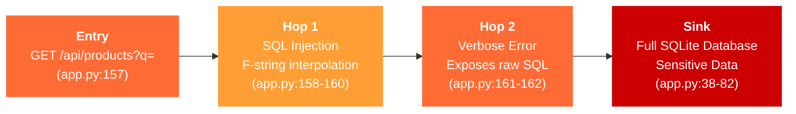
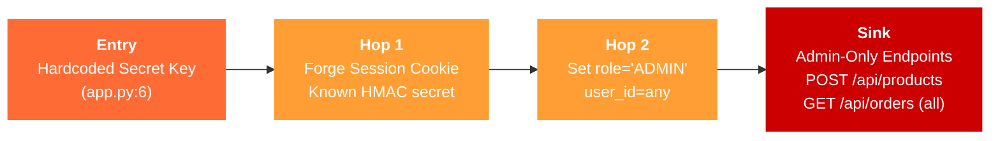
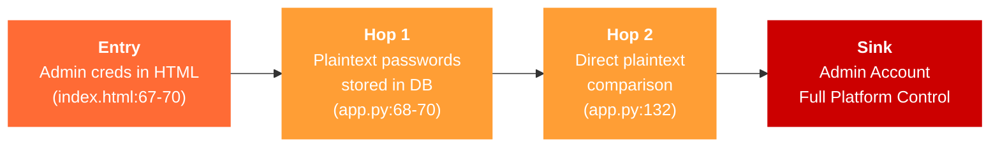
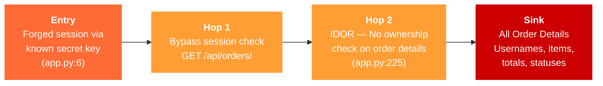

# Chained Vulnerability Audit Report

**Application:** Quantum Core — Cyberpunk E-Commerce Catalog (app-01)  
**Audit Type:** Static-Only Chained Vulnerability Review  
**Date:** 2026-05-25  
**Auditor:** CodeGopher (static analysis, no live probes)

---

## Summary Dashboard

| Metric | Value |
|---|---|
| **Total Attack Chains Identified** | 4 |
| **Maximum Severity** | **CRITICAL** |
| **High Severity Chains** | 2 |
| **Medium Severity Chains** | 1 |
| **Low Severity Chains** | 1 |
| **Cross-Cutting Weaknesses** | 12 |
| **Files Reviewed** | 7 |
| **Areas Not Reviewed** | Dependency chain analysis, runtime behavior, infrastructure config |

---

## Methodology & Safety Note

This audit is **static-only**. No live HTTP probes, dynamic scanners, shell commands, or external network tests were performed. Analysis was conducted solely from source code, configuration, templates, client-side scripts, test files, and the Dockerfile.

**Chain Model Used:**
- **Entry Point:** User-controlled input source or configuration weakness
- **Intermediate Hop(s):** One or more weakness/hops enabling escalation
- **Critical Sink:** End capability (DB exfiltration, account takeover, etc.)

**Confidence Levels:**
- **High:** Every link is statically provable from cited source.
- **Medium:** Plausible chain but one link depends on runtime behavior not fully visible.
- **Low:** Weakly supported hypothesis.

---

## Attack Chain 1: SQL Injection via Product Search → Full Database Exfiltration

**Severity:** CRITICAL  
**Confidence:** High  
**Impact:** Complete database dump, including user credentials, orders, and product data.

### Mermaid Attack Graph



### Detailed Breakdown

**Entry Point:**
- **File:** `app.py`, line 157
- **Endpoint:** `GET /api/products` with `q` query parameter
- **Evidence:** User input flows from `request.args.get('q', '').strip()` directly into the query builder.

**Hop 1 — SQL Injection (Core Weakness):**
- **File:** `app.py`, lines 158-160
- **Code:**
  ```python
  query = f"SELECT id, sku, name, description, category, price, quantity FROM products WHERE name LIKE '%{q}%' OR description LIKE '%{q}%'"
  cursor.execute(query)
  ```
- **Evidence:** The variable `q` is interpolated directly into the SQL string via f-string. No parameterization is used. An attacker can terminate the LIKE clause and inject arbitrary SQL (e.g., `' UNION SELECT id, username, password_hash, role, '', '' FROM users --`).

**Hop 2 — Information Leakage via Debug Response:**
- **File:** `app.py`, lines 161-162 and line 177
- **Evidence:** When the query fails, the error response includes `query_executed` field showing the raw SQL. On success, `debug_query` is always returned. This gives attackers immediate feedback for refining injection payloads.

**Sink — SQLite Database:**
- **File:** `app.py`, lines 38-82
- **Tables:** `users` (with plaintext passwords), `products`, `orders`, `order_items`
- **Impact:** Full data exfiltration including credentials, order history, and product catalog.

**Preconditions:**
- Attacker has network access to the application.
- No WAF or input filtering blocks SQL metacharacters.

**Remediation (Easiest Break Link):**
Replace the f-string with parameterized queries on line 158:
```python
cursor.execute(
    "SELECT id, sku, name, description, category, price, quantity FROM products WHERE name LIKE ? OR description LIKE ?",
    (f'%{q}%', f'%{q}%')
)
```

---

## Attack Chain 2: Hardcoded Secret Key → Session Forgery → Admin Privilege Escalation

**Severity:** HIGH  
**Confidence:** High  
**Impact:** Full admin access — create products, view all orders, impersonate any user.

### Mermaid Attack Graph



### Detailed Breakdown

**Entry Point:**
- **File:** `app.py`, line 6
- **Code:**
  ```python
  app.secret_key = 'cyberpunk_secret_key_glow_neon_quantum_core'
  ```
- **Evidence:** Flask session cookies are signed with this key using HMAC-SHA1. Anyone who knows the key can forge arbitrarily signed session cookies.

**Hop 1 — Session Forgery:**
- Flask stores sessions in client-side cookies (base64 + HMAC). With the known secret, an attacker can create any session payload, e.g., `{'user_id': 999, 'username': 'attacker', 'role': 'ADMIN'}`.

**Hop 2 — Authorization Bypass:**
- **File:** `app.py`, lines 183-185, 200, 198
- Evidence: All authorization checks rely on `session.get('role')` and `session.get('user_id')`. A forged session with `role: ADMIN` bypasses every check.

**Sink — Admin-Only Capabilities:**
- `POST /api/products` (line 183): Creates products without validation
- `GET /api/orders` (line 198): Admin mode reveals all user orders
- Indirect: Could inject malicious product data or manipulate catalog

**Preconditions:**
- Attacker must know or discover the session secret (trivial — it's in source code and frontend HTML).

**Remediation (Easiest Break Link):**
Use a strong, randomly generated secret key stored in an environment variable:
```python
import os
app.secret_key = os.environ.get('SECRET_KEY', os.urandom(32).hex())
```

---

## Attack Chain 3: Admin Credentials in Frontend + Plaintext Auth → Full Account Takeover

**Severity:** HIGH  
**Confidence:** High  
**Impact:** Complete admin account compromise — full control over the e-commerce platform.

### Mermaid Attack Graph



### Detailed Breakdown

**Entry Point:**
- **File:** `static/index.html`, lines 67-70
- **Code:**
  ```html
  • Administrator: <code>admin</code> / <code>admin123</code>
  ```
- **Evidence:** Admin credentials are hardcoded in the delivered HTML, visible to any visitor inspecting the page source or network tab.

**Hop 1 — Plaintext Password Storage:**
- **File:** `app.py`, lines 68-70
- **Code:**
  ```python
  users_data = [
      ('alice', 'alice123', 'CUSTOMER'),
      ('bob', 'bob123', 'CUSTOMER'),
      ('admin', 'admin123', 'ADMIN')
  ]
  ```
- Evidence: Passwords are stored as plain text in the `password_hash` column. No hashing (bcrypt, Argon2, PBKDF2) is used. Any database access directly reveals all passwords.

**Hop 2 — Direct Plaintext Comparison:**
- **File:** `app.py`, line 132
- **Code:**
  ```python
  cursor.execute("SELECT * FROM users WHERE username = ? AND password_hash = ?", (username, password))
  ```
- Evidence: Authentication compares the submitted password directly against the stored plain text. No salt, no hashing, no timing-safe comparison.

**Sink — Admin Account:**
- With `admin` / `admin123`, the attacker gains full admin privileges through all admin-only endpoints.

**Preconditions:**
- Attacker needs to load the HTML page (trivial — it's the default route).

**Remediation (Easiest Break Link):**
1. Remove hardcoded credentials from HTML.
2. Implement proper password hashing:
   ```python
   from werkzeug.security import generate_password_hash, check_password_hash
   ```
3. Update login to:
   ```python
   cursor.execute("SELECT * FROM users WHERE username = ?", (username,))
   user = cursor.fetchone()
   if user and check_password_hash(user['password_hash'], password):
       ...
   ```

---

## Attack Chain 4: IDOR on Order Details + Session Forgery → Total Order Data Exfiltration

**Severity:** MEDIUM  
**Confidence:** High  
**Impact:** Unauthorized access to all order details, including customer names, order contents, totals, and statuses.

### Mermaid Attack Graph



### Detailed Breakdown

**Entry Point:**
- **File:** `app.py`, line 6 (hardcoded secret key enables session forgery as described in Chain 2).

**Hop 1 — Session Check Present but Bypassed:**
- **File:** `app.py`, line 221
- Evidence: `if 'user_id' not in session` check passes with any forged session.

**Hop 2 — IDOR: No Ownership Verification:**
- **File:** `app.py`, line 225
- **Code:**
  ```python
  cursor.execute("SELECT o.id, o.order_number, o.total_amount, o.status, o.created_at, u.username FROM orders o JOIN users u ON o.user_id = u.id WHERE o.id = ?", (order_id,))
  ```
- Evidence: The query filters only on `o.id`. There is no `AND o.user_id = ?` or `AND u.id = ?` clause. **Any authenticated user** (or forged session) can retrieve details for **any order** by specifying a different `order_id`.

**Sink — Complete Order Data:**
- All order items, product SKUs, quantities, prices, user usernames, order statuses, and timestamps are exposed.

**Preconditions:**
- Attacker can forge a valid session (Chain 2).
- Attacker can enumerate or guess order IDs (auto-increment integer, starting from 1).

**Remediation (Easiest Break Link):**
Add ownership check to the query on line 225:
```python
cursor.execute(
    "SELECT o.id, o.order_number, o.total_amount, o.status, o.created_at, u.username "
    "FROM orders o JOIN users u ON o.user_id = u.id "
    "WHERE o.id = ? AND (o.user_id = ? OR ? = 'ADMIN')",
    (order_id, session['user_id'], session.get('role'))
)
```

---

## Combined Cross-Chain Impact

When chains are **chained together**, the impact compounds significantly:

```
Chain 2 (Forged Session) + Chain 4 (IDOR) + Chain 1 (SQLi)
→
1. Attacker forges admin session (knows secret key)
2. Uses admin privileges to view ALL orders via /api/orders
3. Injects SQL via product search to dump the entire database
4. Exfiltrates all user credentials, orders, and PII
5. Has persistent admin access via forged session
```

This combined path results in **complete system compromise** with High confidence.

---

## Cross-Cutting Weaknesses (Not Complete Chains)

These weaknesses are security-relevant and may contribute to attacks but do not independently form a complete chain, or they are single-point issues:

| # | Weakness | Severity | File:Lines | Evidence |
|---|---|---|---|---|
| 1 | **Missing CSRF Protection** | Medium | app.py:127,183,198,249 | All POST endpoints lack CSRF tokens. Browsers auto-send session cookies, enabling cross-site request forgery. |
| 2 | **No Rate Limiting on Login** | Low-Medium | app.py:127 | `/api/auth/login` has no throttling. Allows unlimited credential guessing. |
| 3 | **Verbose Error Messages** | Medium | app.py:161-162,177 | `query_executed` and `debug_query` fields leak raw SQL, aiding SQLi refinement. |
| 4 | **XSS Risk via Product Name** | Low | app.js:115-118 | `addToCart(${p.name.replace(/'/g, "\\'")})` is insufficient escaping. A `"` character breaks the single-quote context. `alert(err.message)` could also reflect XSS. |
| 5 | **No Content-Security Policy** | Low | static/index.html | No CSP meta tag or headers. No XSS protection at browser level. |
| 6 | **No HTTPS in dev config** | Low | app.py:302 | `app.run(host='0.0.0.0', port=8081, debug=True)` — debug mode exposes interactive debugger; no SSL. |
| 7 | **External Font CDN without SRI** | Low | static/css/main.css:1 | `@import url('https://fonts.googleapis.com/...')` has no integrity hash. CDN compromise could inject malicious CSS/JS. |
| 8 | **Global In-Memory DB** | Low | app.py:35 | `db_conn = get_db_connection()` stores DB in global scope. Not thread-safe for production use. |
| 9 | **Stock Mutation Race Condition** | Low | app.py:273-275 | `UPDATE products SET quantity = quantity - ? WHERE id = ?` without transaction isolation could lead to overselling under concurrent requests. |
| 10 | **Reference Guards Unused** | Medium | reference_guards.py | Contains `allowed_callback()` (open redirect guard), `same_owner()` (IDOR guard), and `normalize_identifier()` — none are called in app.py. |
| 11 | **No Input Sanitization on Product Creation** | Low | app.py:187-193 | SKU, name, description accept any string without validation or length limits. |
| 12 | **Username Enumeration via 404** | Medium | app.py:144-148 | `/api/users/exists` returns `{exists: True}` or 404, enabling username enumeration. |

---

## Areas Not Reviewed

| Area | Reason |
|---|---|
| **Dependency Vulnerabilities** | Only `Flask==3.0.3` in requirements.txt; no transitive dependency audit performed. |
| **Docker Image Baseline** | `python:3.10-slim` base image not scanned for known CVEs. |
| **Runtime Behavior** | No live testing of session cookie tampering, SQL injection, or CSRF. |
| **Network/Infrastructure** | No assessment of TLS configuration, firewall rules, or port exposure. |
| **Input Length Limits** | No analysis of request body size limits or DoS vectors. |
| **Logging & Monitoring** | No audit trail for authentication failures or admin actions. |

---

## Recommended Test Cases to Add

The existing test suite (`tests/test_app.py`) covers only happy-path product listing and login with valid credentials. Add these security-focused tests:

1. **SQL Injection Test:** Send `q=' OR 1=1 --` to `/api/products` and verify no SQL error or data leak.
2. **Session Forgery Test:** Create a forged session cookie with `role: ADMIN` and verify admin endpoints reject it (after secret key fix).
3. **CSRF Test:** Submit a POST request to `/api/orders` with a forged cookie from a different origin.
4. **IDOR Test:** Login as `alice` (user_id=1) and attempt to access `/api/orders/2` (belonging to `bob`).
5. **Username Enumeration Test:** Query `/api/users/exists?username=admin` vs unknown user to detect timing/behavior differences.
6. **Error Response Test:** Inject a malformed search query and verify `query_executed`/`debug_query` are absent from responses.

---

## Remediation Priority Summary

| Priority | Action | Affects Chains |
|---|---|---|
| **P0 — Immediate** | Replace f-string SQL query with parameterized query in `list_products` | Chain 1 |
| **P0 — Immediate** | Remove hardcoded credentials from HTML; implement password hashing | Chain 3 |
| **P1 — Urgent** | Use `os.environ.get('SECRET_KEY')` with a strong random key | Chain 2, 4 |
| **P1 — Urgent** | Add ownership verification to `/api/orders/<order_id>` | Chain 4 |
| **P2 — Important** | Remove `debug_query` and `query_executed` from all responses | Chain 1 |
| **P2 — Important** | Add CSRF tokens to all state-changing endpoints | — |
| **P3 — Standard** | Add rate limiting to `/api/auth/login` | — |
| **P3 — Standard** | Add Content-Security-Policy headers | — |
| **P3 — Standard** | Use `werkzeug.security` for safe password comparison | Chain 3 |

---

## Conclusion

This review identified **4 complete attack chains** with a maximum severity of **CRITICAL**. The two most impactful single weaknesses are:

1. **SQL injection** in the product search endpoint (Chain 1), which alone enables full database exfiltration.
2. **Hardcoded session secret key + plaintext admin credentials** (Chains 2 & 3), which together enable complete admin account takeover without any injection or exploitation.

The presence of `reference_guards.py` (with IDOR and open-redirect guards) that are **never imported or called** in `app.py` strongly suggests security controls were considered but not integrated. Implementing the P0 and P1 remediations above would break every identified chain.
