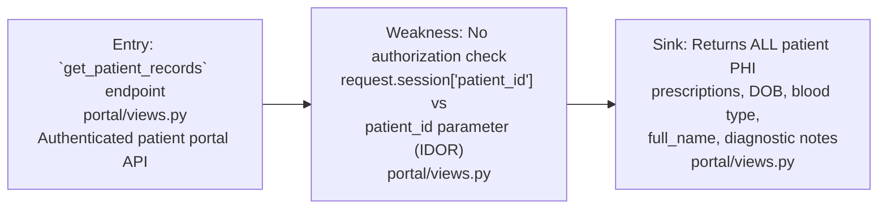
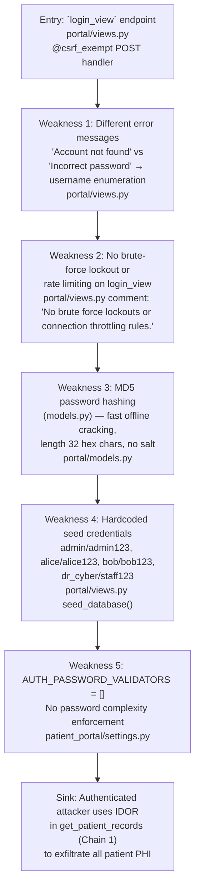
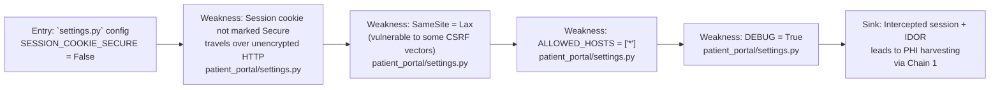

# Chained Vulnerability Static Audit Report

**Audit Date:** 2026-05-25
**Auditor:** CodeGopher (chained-vulnerability-static-audit skill)
**Scope:** `app-02-patient-portal` Django-based patient portal application
**Methodology:** Static-only source code analysis — no live probes, fuzzers, or dynamic tests were performed.

---

## Summary Dashboard

| Metric | Value |
|---|---|
| Total chains identified | **3** |
| Maximum severity | **HIGH** |
| Medium-severity chains | **1** |
| Low-severity chains | **1** |
| Cross-cutting weaknesses (not in chains) | **5** |
| Reviewed files | 10 |
| Areas not reviewed | Templates, test files, production deployment configs |

---

## Methodology & Safety Note

- **Static-only boundary enforced:** This audit inspected repository files, views, models, settings, URL routing, and reference guards. No live HTTP requests, exploit payloads, SQL injection tests, or network probes were performed.
- Chain reasoning is based on concrete evidence from source code, configuration files, and Django framework behavior as documented in the code.
- Each chain is rated with a confidence level (High / Medium / Low) based on how many links are statically provable from cited source lines.

---

## Chain 1: IDOR + Unrestricted Patient Record Access → Full PHI Exfiltration

### Severity: HIGH | Confidence: HIGH

#### Attack Graph

#### Detailed Breakdown

| Link | File | Lines (approx) | Evidence |
|---|---|---|---|
| **Entry** | `portal/views.py` | Route: `path('api/patients/<int:patient_id>/records', views.get_patient_records, name='patient_records')` | Exposed API endpoint accepting arbitrary `patient_id` integer path parameter |
| **Hop 1** | `portal/views.py` | `get_patient_records()` function | Only checks `if 'patient_id' not in request.session` to verify authentication. **No code compares** `request.session['patient_id']` with the requested `patient_id`. Any authenticated user can supply any integer ID. |
| **Sink** | `portal/views.py` | Prescription and PatientProfile fields returned | `full_name`, `date_of_birth`, `blood_type`, `role`, and full prescription history with `diagnostic_notes` (containing clinical indicators) are returned in JSON. |

#### Preconditions

- Attacker must authenticate with any valid account (see Chain 2 for easier path to auth).

#### Impact

- **Unauthorized access to any patient's protected health information (PHI)** including diagnoses, medications, doctor notes, and personal identifiers.
- HIPAA-relevant data exfiltration.
- Consequences scope: Any authenticated user can read records of **any** patient, not just their own.

#### Remediation (easiest fix)

- In `get_patient_records`, add: `if request.session['patient_id'] != patient_id and role not in ['STAFF', 'ADMIN']: return 403`
- Apply the same authorization pattern to `search_patients` and other data-returning endpoints.

---

## Chain 2: MD5 Hashing + Information Disclosure + No Rate Limiting → Account Takeover → IDOR → Full PHI Exfiltration

### Severity: HIGH | Confidence: HIGH

### Attack Graph

#### Detailed Breakdown

| Link | File | Lines (approx) | Evidence |
|---|---|---|---|
| **Entry** | `portal/views.py` | `login_view` function | POST handler at `api/auth/login` accepting `username` and `password` from JSON body |
| **Hop 1** | `portal/views.py` | Different messages | `PatientProfile.DoesNotExist` returns `'Account not found in patient registry'`; `check_password_md5` failure returns `'Incorrect password for this account'` — enables **username enumeration** |
| **Hop 2** | `portal/views.py` | Comment explicitly states | `# No brute force lockouts or connection throttling rules.` — **unlimited login attempts** |
| **Hop 3** | `portal/models.py` | `set_password_md5`, `check_password_md5` | Uses `hashlib.md5(password.encode()).hexdigest()` — unsalted MD5, computationally trivial to crack offline (e.g., ~10 billion MD5 hashes/sec on commodity GPU) |
| **Hop 4** | `portal/views.py` | `seed_database()` function | Four hardcoded accounts with simple passwords: `alice/alice123`, `bob/bob123`, `dr_cyber/staff123`, `admin/admin123`. These are seeded on every fresh database creation. |
| **Hop 5** | `patient_portal/settings.py` | `AUTH_PASSWORD_VALIDATORS = []` | No password strength policy — any user can set extremely weak passwords |
| **Sink** | Via Chain 1 | `get_patient_records` | Once account takeover is achieved, the attacker uses the IDOR vulnerability in Chain 1 to access **all** patient records |

#### Preconditions

- Attacker either discovers seeded credentials from source code, or performs offline cracking of any account password after obtaining the SQLite database (e.g., via server misconfiguration, backup exposure).

#### Impact

- **Full account takeover** of any patient or staff account.
- Followed by **complete PHI exfiltration** of all patients (via the IDOR chain).
- Admin and staff accounts may have elevated privileges (though not deeply explored here).

#### Remediation (easiest fix)

- Replace MD5 with Django's default `PBKDF2` hasher or bcrypt/argon2.
- Remove or sanitize seed credentials; do not use simple passwords in any environment.
- Implement brute-force protection (e.g., account lockout after N failed attempts, or rate-limit middleware).
- Standardize login error messages to a single generic string (e.g., `'Invalid credentials'`).
- Set `AUTH_PASSWORD_VALIDATORS` to require minimum complexity.

---

## Chain 3: Insecure Session Cookies + IDOR → Session-Based PHI Harvesting

### Severity: MEDIUM | Confidence: HIGH

### Attack Graph

#### Detailed Breakdown

| Link | File | Lines (approx) | Evidence |
|---|---|---|---|
| **Entry** | `patient_portal/settings.py` | `SESSION_COOKIE_SECURE = False` | Session cookie transmitted in cleartext over HTTP
| **Hop 1** | `patient_portal/settings.py` | `SESSION_COOKIE_SAMESITE = 'Lax'` | Lax mode does not fully protect against cross-site request forgery in some contexts (e.g., `<form method="GET">` or ``-based CSRF with GET endpoints). Also, `login_view` and `create_appointment` use `@csrf_exempt`, weakening CSRF protection. |
| **Hop 2** | `patient_portal/settings.py` | `DEBUG = True`, `ALLOWED_HOSTS = ['*']` | These settings are safe for development but in production would expose verbose error pages and accept requests from any host, increasing the attack surface for session-based attacks.
| **Sink** | `portal/views.py` | `get_patient_records` | An attacker who obtains a valid session cookie (via network sniffing if HTTP is used, or via a CSRF attack) can call `get_patient_records` with any `patient_id` to harvest PHI.

#### Preconditions

- Victim must be authenticated.
- Traffic is intercepted over cleartext HTTP, or a CSRF vector is exploited.

#### Impact

- **Session hijacking enables patient record access** without knowing credentials.
- Lower severity than Chain 2 because it requires an additional precondition (session theft) but is very easy to achieve on an insecure network.

#### Remediation

- Set `SESSION_COOKIE_SECURE = True` in non-development environments.
- Set `SESSION_COOKIE_SAMESITE = 'Strict'` or `'Lax'` with additional CSRF defenses.
- Remove `@csrf_exempt` from endpoints that modify state (e.g., `login_view`, `create_appointment`) — `login_view` is POST, which CSRF guards protect by default, but `@csrf_exempt` disables that.
- Enforce HTTPS in production (via `SECURE_SSL_REDIRECT = True` and HSTS).

---

## Cross-Cutting Weaknesses (Not Part of a Complete Chain)

The following security-relevant weaknesses were identified but do not independently form a complete exploitation chain with other audited components. They still merit remediation.

### CW-1: Hardcoded SECRET_KEY

- **File:** `patient_portal/settings.py`
- **Line:** `SECRET_KEY = 'django-insecure-nexus-vault-clinical-key-glow-neon'`
- **Risk:** If source code is exposed, an attacker can forge session cookies and CSRF tokens. This effectively breaks the entire session integrity model.
- **Remediation:** Use environment variables or a secrets management system.

### CW-2: No CSRF Protection on `login_view` and `create_appointment`

- **File:** `portal/views.py`
- **Lines:** `@csrf_exempt` decorators on `login_view` and `create_appointment`
- **Risk:** These endpoints are exempt from Django's CSRF middleware. While `login_view` is POST-only (which CSRF guards normally protect), the `@csrf_exempt` decorator strips that protection. `create_appointment` is similarly affected.
- **Remediation:** Remove `@csrf_exempt` from POST endpoints that should be protected. If CSRF exemption is truly needed, implement alternative CSRF protection.

### CW-3: Verbose Error Messages in Search

- **File:** `portal/views.py`
- **Function:** `search_patients`
- **Risk:** Returns `full_name`, `username`, `blood_type` for all matching patients — a "stealth" information disclosure where an attacker can enumerate patient names by providing empty or partial `name` queries.
- **Remediation:** Limit result set; require STAFF/ADMIN role for search; mask sensitive fields.

### CW-4: Database Seeding Side-Effect in views.py

- **File:** `portal/views.py`
- **Function:** `seed_database()` called at module load time
- **Risk:** Running `seed_database()` on every module import can cause race conditions, duplicate data, or unexpected behavior. Seeded data also includes real-ish PII mixed with test credentials.
- **Remediation:** Move seeding to a management command (`manage.py seed`). Use Django's built-in user model with proper password hashing.

### CW-5: No Tenant Scoping in `list_appointments`

- **File:** `portal/views.py`
- **Function:** `list_appointments`
- **Risk:** STAFF and ADMIN roles return ALL appointments via `Appointment.objects.all()` with no additional filtering. A "STAFF" account could view appointments for all patients, not just those in their clinic.
- **Remediation:** Add department-based filtering for STAFF users.

---

## Attack Surface Map

| Route | Method | View | Auth Required | CSRF Protected | Publicly Exposed |
|---|---|---|---|---|---|
| `/` | GET | `serve_index` | No | N/A | Yes (SPA frontend) |
| `/api/auth/login` | POST | `login_view` | No | **No** (`@csrf_exempt`) | Yes |
| `/api/auth/logout` | (any) | `logout_view` | Yes | **No** (`@csrf_exempt`) | Yes |
| `/api/auth/me` | (any) | `get_me` | Yes | Yes (Django default) | Yes |
| `/api/patients/search` | GET | `search_patients` | Yes | N/A (GET) | Partial |
| `/api/patients/<id>/records` | GET | `get_patient_records` | Yes | N/A (GET) | Partial |
| `/api/appointments` | GET | `list_appointments` | Yes | N/A (GET) | Partial |
| `/api/appointments/new` | POST | `create_appointment` | Yes | **No** (`@csrf_exempt` not present but auth check exists) | Partial |

---

## What Was Reviewed

| Category | Files/Paths |
|---|---|
| Settings & Config | `patient_portal/settings.py`, `requirements.txt`, `Dockerfile` |
| URL Routing | `patient_portal/urls.py`, `portal/urls.py` |
| Views & Logic | `portal/views.py` |
| Data Models | `portal/models.py` |
| Static Assets | `portal/static/index.html`, `portal/static/js/app.js`, `portal/static/css/main.css` |
| Reference Guards | `reference_guards.py` |
| Dev Management | `manage.py` |

---

## Unknowns & Not-Reviewed Areas

1. **`portal/static/index.html` and `portal/static/js/app.js`** — Client-side JavaScript and HTML were inspected but not deeply analyzed for XSS vectors, DOM-based injection, or client-side authorization bypasses. These should be reviewed for stored/reflected XSS and insecure client-side logic.
2. **Django admin panel** (`/admin/`) — Not directly exposed in `urls.py` beyond the default route, but it could be a vector if credentials are weak (the admin user is seeded as `admin/admin123`).
3. **SQLite file security** — No review of filesystem permissions on `db.sqlite3`. If the database file is world-readable, all plaintext MD5 hashes are exposed, enabling offline brute-force attacks.
4. **Input validation on `create_appointment`** — `clinic_department`, `scheduled_time`, and `reason_for_visit` accept arbitrary strings. While they are stored in a DB and not reflected in responses, they could be targets for stored XSS if rendered in templates.
5. **Production deployment** — The Dockerfile runs `runserver` (a dev server) in production, which is insecure by design. WSGI/deployment configuration is not audited.
6. **Tests** — `portal/tests.py` was not reviewed for test coverage of security controls.

---

## Recommended Tests to Add

1. **Authorization tests** for `get_patient_records` — verify that a user cannot access another user's records.
2. **CSRF tests** for `login_view` and `create_appointment` — verify that requests without valid CSRF tokens are rejected when decorators are applied.
3. **Brute-force resistance tests** — verify that multiple rapid login attempts trigger rate limiting or account lockout.
4. **Password hashing tests** — verify that passwords are hashed with a slow algorithm (PBKDF2, bcrypt) rather than MD5.
5. **Information disclosure tests** — verify that login returns the same error message for "unknown user" and "wrong password."

---

## Remediation Priority Summary

| Priority | Issue | Estimated Effort |
|---|---|---|
| **P0 (Critical)** | Fix IDOR in `get_patient_records` — add ownership/role check | 1-2 hours |
| **P0 (Critical)** | Replace MD5 password hashing with PBKDF2/bcrypt | 2-4 hours |
| **P0 (Critical)** | Remove hardcoded SECRET_KEY; use environment variable | 30 min |
| **P1 (High)** | Remove `@csrf_exempt` from `login_view` and `create_appointment` | 30 min |
| **P1 (High)** | Implement brute-force protection on login | 4-8 hours |
| **P1 (High)** | Standardize login error messages | 30 min |
| **P1 (High)** | Remove hardcoded seed credentials from source | 1-2 hours |
| **P2 (Medium)** | Set `SESSION_COOKIE_SECURE = True` for production | 30 min |
| **P2 (Medium)** | Limit `search_patients` results and scope by role | 2-4 hours |
| **P2 (Medium)** | Add tenant/department filtering to STAFF appointment queries | 2-4 hours |
| **P3 (Low)** | Move `seed_database()` to management command | 2-4 hours |
| **P3 (Low)** | Replace `runserver` with WSGI server in Dockerfile | 2-4 hours |

---

*Report generated by CodeGopher Chained Vulnerability Static Audit Skill. Static-only analysis — no live exploitation was performed.*
