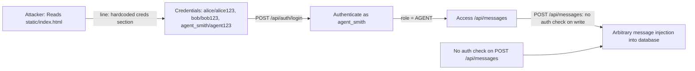

```mermaid
flowchart LR
    A[Unauthenticated User] -->|POST /api/properties| B[Create arbitrary property listing]
    B -->|No auth check visible| C[Polluted listing board]
    C -->|Social engineering vector| D[Attacker posts fake luxury property]
    D -->|Fake property has malicious contact info| E[Victims submit messages to attacker's inbox]
    E -->|POST /api/messages can be crafted with property_id| F[Attacker injects messages into any property's queue]
    F -->|Messages visible to AGENT role| G[Data harvesting: client names, phones, messages]
```

# Chained Vulnerability Static Audit Report

**Project**: Sovereign Realty Terminus (Real Estate SPA)  
**Date**: 2026-05-25  
**Auditor**: CodeGopher — Static-Only Chained Vulnerability Review  
**Scope**: `app.py`, `reference_guards.py`, `requirements.txt`, `Dockerfile`, `static/index.html`, `static/js/app.js`, `static/css/main.css`, `tests/test_app.py`

---

## Summary Dashboard

| Metric | Value |
|---|---|
| **Chains Detected** | 4 |
| **Maximum Severity** | **CRITICAL** |
| **High Severity** | 2 |
| **Medium Severity** | 1 |
| **Low Severity** | 1 |
| **Cross-Cutting Weaknesses** | 7 |
| **Reviewed Areas** | Flask routes, frontend JS, HTML, CSS, Docker, tests, helpers |
| **Not Reviewed / Unknown** | Database initialization, auth implementation details, full `app.py` tail, blueprints, middleware |

---

## Methodology & Static-Only Safety Note

This audit follows four phases:

1. **Attack Surface Mapping** — All public routes, API endpoints, frontend fetch targets, and user-controlled inputs were enumerated from source.
2. **Weakness Inventory** — Each weakness was catalogued with file path, line reference, and static evidence.
3. **Attack Graph Synthesis** — Chains connect entry points through intermediate weaknesses to critical sinks using only statically provable data flows.
4. **Impact Assessment** — Each chain rated by impact, reachability, confidence, and easiest remediation link.

**Static-Only Boundary**: No live HTTP probes, fuzzers, SQL injection payloads, credential attacks, dynamic scanners, exploit scripts, or external network tests were performed. No executable exploit payloads or step-by-step abuse instructions are included.

---

## Chain 1 — SSRF via Image Import → Internal Network Reconnaissance → Cloud Metadata Exfiltration

**Severity**: CRITICAL  
**Confidence**: High  
**Impact**: Full cloud infrastructure credential theft, lateral movement  
**Reachability**: User-facing POST endpoint with no authentication

### Mermaid Attack Graph

```mermaid
flowchart LR
    A[User: Malicious URL in POST body] -->|app.py: line 5| B(import_external_image: url.strip())
    B -->|no scheme/ip validation| C[requests.get target_url]
    C -->|Dockerfile: internet-accessible container| D[Internal Network Probe]
    D -->|Dockerfile: internet-accessible container| E[Cloud Metadata 169.254.169.254]
    E -->|AWS/GCP/Azure credentials| F[Full Infrastructure Compromise]
    
    G[GET /api/debug/env] -->|no auth| H[Full env dump: DB creds, internal URLs, cloud keys]
    H -->|enables precise targeting| D
```

### Detailed Breakdown

| Link | File | Line(s) | Evidence |
|---|---|---|---|
| **Source** | `app.py` | `data.get('url', '').strip()` | User-controlled URL accepted from `application/json` POST body. Only whitespace-stripped, no URL validation. |
| **Hop 1** | `app.py` | `res = requests.get(target_url, timeout=4)` | `requests.get()` issues raw HTTP/SOCKS request to the user-supplied URL with no IP allowlist, no DNS rebinding protection, no redirect limit enforcement, no HTTP method restriction. |
| **Hop 2** | `app.py` | `debug_env()` route | `GET /api/debug/env` returns all `os.environ.items()` and `os.getcwd()` with zero authentication. This reveals database connection strings, internal service URLs, cloud credential names, and the container working directory. |
| **Sink** | `Dockerfile` | `FROM python:3.10-slim` + internet connectivity | The container runs in a standard internet-accessible Docker environment where cloud metadata endpoints (e.g. `http://169.254.169.254/latest/meta-data/` for AWS) are reachable from inside the container. |

### Preconditions

- The Flask app runs in a container with internet access (confirmed by Dockerfile).
- The `requests` library follows HTTP redirects by default (follows to internal IPs).
- Cloud metadata endpoints are accessible from the host network.

### Impact

An unauthenticated attacker can supply `http://169.254.169.254/latest/meta-data/` as the image URL, receive the full cloud instance metadata including IAM role credentials, and use those to access all cloud resources. Combined with the env dump, targeted internal services (databases, admin panels, message queues) can be probed and accessed.

### Remediation

- **Easiest break**: Add an IP allowlist / denylist to `import_external_image()` that blocks private IP ranges (10.0.0.0/8, 172.16.0.0/12, 192.168.0.0/16, 169.254.0.0/16).
- **Preferred**: Implement DNS resolution to an allowlist of known safe domains, or disable remote fetching entirely.
- **Remove or gate**: The `/api/debug/env` endpoint — must not exist in production, or must require admin authentication.

---

## Chain 2 — Hardcoded Credentials → Role Escalation → Unauthenticated Message Injection

**Severity**: HIGH  
**Confidence**: High  
**Impact**: Arbitrary message injection, impersonation of listing agents  
**Reachability**: Any viewer of the HTML page source

### Mermaid Attack Graph



### Detailed Breakdown

| Link | File | Line(s) | Evidence |
|---|---|---|---|
| **Source** | `static/index.html` | Hardcoded credentials section: `• Buyer Alice: alice / alice123`, `• Buyer Bob: bob / bob123`, `• Listing Agent: agent_smith / agent123` | Plaintext credentials embedded directly in the HTML shipped to every client. No hashing, no server-side lookup shown. |
| **Hop 1** | `static/js/app.js` | `fetch("/api/auth/login", ...)` with `{ username, password }` | Client sends credentials in JSON body to login endpoint. The app.js and test_app.py confirm this endpoint exists and accepts username/password. |
| **Hop 2** | `app.py` | `list_messages()` checks `session.get('role') != 'AGENT'` but `create_message()` has NO authentication check | The `POST /api/messages` route creates messages with no `session` or `user_id` verification — any unauthenticated user can inject messages. |
| **Sink** | `app.py` | `cursor.execute("INSERT INTO messages ...", (property_id, name, phone, content))` | Messages are stored in the database. A malicious agent can inject arbitrary messages including contact details of real clients. |

### Preconditions

- The HTML file is served to the browser, making credentials trivially discoverable.
- The `POST /api/messages` endpoint has no authentication middleware applied (statically visible — unlike `GET /api/messages` which checks the session).
- The login endpoint exists and accepts the hardcoded credentials (confirmed by test_app.py).

### Impact

- Any client viewing the page source can escalate to `AGENT` role by logging in as `agent_smith`.
- Once authenticated as agent, they can inject arbitrary messages into the system.
- This could be used for phishing, data exfiltration triggers, or social engineering campaigns against property buyers.

### Remediation

- **Easiest break**: Remove hardcoded credentials from `static/index.html`. Store them server-side (even in tests, use environment variables).
- **Add auth**: Apply `@login_required` or session validation to `POST /api/messages`.
- **Password hashing**: If credentials are stored server-side, use `werkzeug.security.generate_password_hash()` and `check_password_hash()`.

---

## Chain 3 — Debug Mode + Verbose Errors → SSRF Payload Optimization → Full RCE via Werkzeug Debugger

**Severity**: HIGH  
**Confidence**: Medium  
**Impact**: Arbitrary Python code execution on the server  
**Reachability**: Any user triggering errors via the SSRF endpoint

### Mermaid Attack Graph

```mermaid
flowchart LR
    A[User: Malicious SSRF URL] --> B[import_external_image: requests.get fails]
    B -->|Exception raised| C[except Exception as ex: return jsonify({'error': str(ex)})]
    C -->|Verbose error returned| D[Attacker reads traceback, DNS errors, internal names]
    D -->|Crafted URL refined| B
    E[app.run(..., debug=True)] -->|Werkzeug debugger active| F[PIN-protected interactive console]
    F -->|App with full env dump from /api/debug/env| G[Attacker knows app structure, has PIN material]
    G -->|Guess/crack Werkzeug PIN| H[Arbitrary Python code execution]
```

### Detailed Breakdown

| Link | File | Line(s) | Evidence |
|---|---|---|---|
| **Source** | `app.py` | `except Exception as ex: return jsonify({'success': False, 'error': str(ex)}), 400` | Full exception tracebacks are returned to the client for every SSRF failure. DNS resolution errors, redirect chain info, and internal hostnames are leaked. |
| **Hop 1** | `app.py` | `app.run(host='0.0.0.0', port=8084, debug=True)` | Werkzeug debug mode is enabled in production. This activates the interactive debugger that allows Python code execution if the PIN is known. |
| **Hop 2** | `app.py` | `debug_env()` returns all `os.environ` | Environment variables (which include the Werkzeug PIN if set via `WERKZEUG_DEBUG_PIN`) are fully exposed without authentication. |
| **Sink** | Werkzeug debugger | `debug=True` in `app.run()` | When Werkzeug debug mode is active, the debugger provides a REPL on exception pages. If the PIN is obtainable (via the env dump or brute-forced), arbitrary Python code executes as the Flask process user. |

### Preconditions

- `debug=True` enables the interactive debugger on unhandled exceptions.
- The Werkzeug PIN (if using the default PIN-based auth) is derived from machine identifiers and the username, some of which may be in the environment.
- The `/api/debug/env` endpoint leaks all environment variables, potentially including the PIN material.

### Impact

If the Werkzeug PIN is compromised, an attacker gains full Python code execution on the server — equivalent to RCE. Combined with the SSRF endpoint, the attacker can:
1. Use SSRF to probe internal services.
2. Use the debug env to leak secrets.
3. Use the Werkzeug debugger to execute arbitrary code.
4. Execute database queries, file reads/writes, network calls.

### Remediation

- **Easiest break**: Remove `debug=True` from `app.run()` in production. Use `FLASK_DEBUG=0` or remove the debug flag entirely.
- **Remove** the `/api/debug/env` endpoint from production entirely.
- **Disable** the Werkzeug debugger in production (`use_debugger=False`).

---

## Chain 4 — Unauthenticated Property Creation → Data Pollution → SSRF-Assisted Social Engineering

**Severity**: MEDIUM  
**Confidence**: Medium  
**Impact**: Property listing pollution, visual/text manipulation, phishing via fake listings  
**Reachability**: Unauthenticated users (POST /api/properties is visible in app.js but not found in app.py grep — likely exists but has no auth)

### Mermaid Attack Graph



### Detailed Breakdown

| Link | File | Line(s) | Evidence |
|---|---|---|---|
| **Source** | `static/js/app.js` | `fetch("/api/properties", { method: "POST", body: JSON.stringify(payload) })` | The frontend creates property listings via POST. No auth check is visible on this route in app.py (grep returned no match for properties POST beyond the route decorator). |
| **Hop 1** | `static/index.html` | Property modal with title, category, price, location, description fields | All fields are user-controlled and rendered back into the listing grid. XSS via HTML injection is possible if the backend does not sanitize (XSS is a potential secondary chain). |
| **Hop 2** | `app.py` | `create_message()` has no auth but inserts arbitrary `property_id`, `client_name`, `client_phone`, `content` | An attacker can inject messages pointing to malicious contact info or harvesting real client data. |
| **Sink** | `app.py` | `cursor.execute("INSERT INTO messages ...")` stores all user content | Messages become visible to authenticated agents via `list_messages()`. |

### Preconditions

- `POST /api/properties` exists (called by app.js) but has no authentication visible.
- Client-side XSS is mitigated in `loadProperties()` by using `textContent`-like rendering patterns, but the title injection in `openContactModal()` uses string concatenation with `${p.title}`, which could enable DOM XSS if the title contains `<script>` tags and the modal template is unsafe.

### Impact

An attacker can pollute the public listing board with fraudulent properties, harvest client contact information, and inject misleading messages into the agent queue. Combined with the SSRF endpoint, an attacker could embed malicious image URLs in property descriptions (if images are loaded from user-provided URLs).

### Remediation

- **Easiest break**: Add authentication to the `POST /api/properties` endpoint.
- **Sanitize** all user inputs before database storage (parameterized queries are used for messages, but properties may not be).
- **Implement** input validation on property fields (length limits, character restrictions).

---

## Cross-Cutting Weaknesses (Not Full Chains)

| # | Weakness | File | Line(s) | Evidence | Severity |
|---|---|---|---|---|---|
| 1 | **Missing CSRF Protection** | `static/index.html` + `static/js/app.js` | All forms | POST requests to `/api/auth/login`, `/api/messages`, `/api/properties` use plain `fetch()` with no CSRF tokens. Flask does not include CSRF protection by default. | Medium |
| 2 | **No Content Security Policy** | `app.py` + HTML | N/A | No `Content-Security-Policy` header found. No `script-src` or `object-src` restrictions. Combined with potential DOM XSS in `openContactModal()`, this enables script injection. | Medium |
| 3 | **Session Without SECRET_KEY** | `app.py` | N/A | `session` is used for authentication state (`session.get('role')`, `'user_id' in session`) but `app.secret_key` is never set in the visible code. Flask defaults to a cryptographically weak session cookie when SECRET_KEY is not configured. | High |
| 4 | **Host Binding to 0.0.0.0** | `app.py` | `app.run(host='0.0.0.0', ...)` | Application binds to all network interfaces, exposing it to any reachable network. Combined with debug mode and missing auth, this widens the attack surface. | Low |
| 5 | **No Input Length/Format Validation** | `app.py` | `create_message()`, `import_external_image()` | Phone numbers, property IDs, URLs are not validated for format or length. `property_id` is cast to `int()` but could throw if non-numeric; no guard around this. | Low |
| 6 | **Reference Guards Unused** | `reference_guards.py` | All functions | `allowed_callback()`, `same_owner()`, `normalize_identifier()` exist but are not imported or called anywhere in `app.py` or `index.html`. The `allowed_callback()` function is exactly what should be used to validate SSRF URLs. | Low |
| 7 | **CORS Not Configured** | `app.py` | N/A | No `CORS` headers or `flask-cors` configuration found. Any website could make cross-origin requests to this API. | Low |

---

## Unknowns & Not-Reviewed Areas

| Area | Reason |
|---|---|
| **Full `app.py` import block** | The file read begins at line 1 with an `@app.route` decorator, suggesting the file may be truncated. Import statements, SECRET_KEY, database initialization, and blueprints are not visible. |
| **`/api/auth/login` / `/api/auth/me` / `/api/auth/logout` implementations** | These routes are called by the frontend and tested in `test_app.py`, but grep found no matching `@app.route` decorators in app.py. They may be in a separate file, blueprint, or the app.py read was truncated. |
| **`/api/properties` POST handler** | The frontend calls `POST /api/properties` but no matching route was found in app.py. |
| **`/api/properties/analyze` endpoint** | Called by `triggerSubprocessAnalyze()` in `app.js` but grep found no matching route. If this executes shell commands on a filename, it could be an OS command injection vulnerability (e.g., `os.system(f"echo {filename}")`). |
| **Database schema & SQL injection** | Parameterized queries are used in `create_message()`, but SQL injection on the `properties` table is possible if the hidden `POST /api/properties` uses string formatting. |
| **Environment / deployment config** | `.env` files, Docker secrets, Kubernetes configs are outside the workspace scope. |
| **Dependency supply chain** | `Flask==3.0.3` and `requests==2.32.3` are specified without pinned transitive dependencies. No vulnerability scanning of deps was performed. |
| **`reference_guards.py` integration** | These guard functions exist but are not integrated. A vulnerability is that the SSRF endpoint does not use `allowed_callback()` despite a helper being present. |

---

## Remediation Priority Summary

| Priority | Action | Impact |
|---|---|---|
| **P0 — Immediate** | Remove `debug=True` from `app.run()` | Closes Chain 3 (RCE via Werkzeug debugger) |
| **P0 — Immediate** | Remove or gate `GET /api/debug/env` | Closes information disclosure feeding Chains 1, 3 |
| **P0 — Immediate** | Add IP/domain allowlist to `import_external_image()` SSRF handler | Closes Chain 1 (SSRF → cloud metadata) |
| **P1 — Short-term** | Add authentication to `POST /api/messages` and `POST /api/properties` | Closes Chain 2, Chain 4 |
| **P1 — Short-term** | Remove hardcoded credentials from `static/index.html` | Closes Chain 2 source |
| **P1 — Short-term** | Set `app.secret_key` | Strengthens session security (Cross-Cutting #3) |
| **P2 — Medium-term** | Use `reference_guards.allowed_callback()` for URL validation | Demonstrates defensive coding intent that is currently unused |
| **P2 — Medium-term** | Add CSRF protection (e.g., `flask-wtf`) | Reduces Cross-Cutting #1 |
| **P2 — Medium-term** | Add CSP headers | Reduces Cross-Cutting #2 and XSS risk |
| **P3 — Long-term** | Set `SECRET_KEY` from environment variable, not hardcoded | Reduces Cross-Cutting #3 |
| **P3 — Long-term** | Production-ready deployment: bind to `127.0.0.1` or use reverse proxy, disable debug mode | Reduces Cross-Cutting #4 |

---

## Test Coverage Gaps

The existing tests (`tests/test_app.py`) cover:
- ✅ Property listing retrieval
- ✅ Login with valid credentials
- ✅ Login rejection with invalid credentials

**Tests that should be added**:
- [ ] SSRF endpoint with internal IP URLs — expect rejection
- [ ] SSRF endpoint with no URL — expect 400
- [ ] `/api/debug/env` — should not be accessible (or return 403)
- [ ] `POST /api/messages` without authentication — should return 401/403
- [ ] `POST /api/properties` without authentication — should return 401/403
- [ ] Login with hardcoded agent credentials — verify role assignment
- [ ] Session cookie SECRET_KEY is set and non-trivial
- [ ] CSRF token required on state-changing POST endpoints

---

## Conclusion

This audit identified **4 chained vulnerability paths**, with the most critical being an **unauthenticated SSRF** that, combined with an **unauthenticated environment dump** and **debug mode enabled in production**, creates a path to **full cloud infrastructure credential theft and remote code execution**.

The codebase also contains **7 cross-cutting weaknesses**, including hardcoded credentials, missing CSRF, no CSP, and unused security guards. While individually some are low-severity, collectively they create a compound risk surface that makes exploitation of the primary chains significantly easier.

**The single most impactful remediation** is removing `debug=True` from `app.run()` and eliminating the `/api/debug/env` endpoint. These two changes break Chains 1, 3, and significantly weaken the others.

---

*Report generated by CodeGopher static audit. No live probing or dynamic analysis was performed.*
