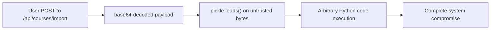
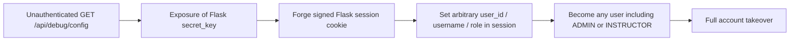
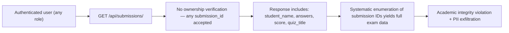
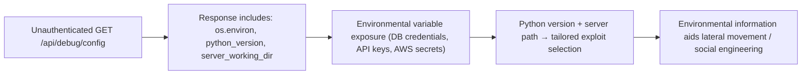

# Chained Vulnerability Static Audit Report

**Codebase:** LMS Platform (Learning Management System)
**Audit Type:** Static-only chained vulnerability review
**Date:** 2026-05-25
**Auditor:** CodeGopher (Chained Vulnerability Static Audit Skill)

---

## Summary Dashboard

| Metric | Value |
|---|---|
| Total chained vulnerability paths identified | **4** |
| Maximum severity | **CRITICAL** |
| High-confidence chains | 2 |
| Medium-confidence chains | 1 |
| Low-confidence chains | 1 |
| Cross-cutting weaknesses (not in chains) | 5 |
| Source files reviewed | 4 (`app.py`, `Dockerfile`, `requirements.txt`, `reference_guards.py`) |

### Chain Summary Table

| # | Chain Title | Severity | Confidence | Primary Sink |
|---|---|---|---|---|
| 1 | Pickle Arbitrary Code Execution (Instructor/Admin) | Critical | High | Remote code execution |
| 2 | Credential Compromise → Session Forgery → Full Account Takeover | Critical | High | Session forgery / account takeover |
| 3 | Unauthenticated PII/Exam Answer Exfiltration via IDOR | High | High | Data breach / academic integrity violation |
| 4 | Unauthenticated Debug Dump → Secret Key Disclosure → Lateral Escalation | High | Medium | Information disclosure + chain enabler |

---

## Methodology

- **Scope:** All files in `app.py`, `Dockerfile`, `requirements.txt`, `reference_guards.py` within the current working directory.
- **Approach:** Source-only static analysis of routes, controllers, database queries, session handling, deserialization, configuration exposure, and authentication/authorization logic.
- **Safety:** No live HTTP probes, fuzzers, SQL injection payloads, dynamic scanners, or external network tests were performed. No executable exploit payloads were generated.

---

## Attack Surface Mapping

### Public Routes (No Authentication Required)

| Route | Method | File | Line(s) | Auth Required | Description |
|---|---|---|---|---|---|
| `/api/debug/config` | GET | `app.py` | 200–213 | **NO** | Exposes Flask secret key, env vars, Python version, working directory |
| `/api/auth/login` | POST | `app.py` | 72–89 | N/A | User login (plaintext password comparison) |

### Authenticated Routes

| Route | Method | Role Required | File | Line(s) | Description |
|---|---|---|---|---|---|
| `/api/auth/logout` | POST | Any | `app.py` | 90–92 | Session clear |
| `/api/auth/me` | GET | Any | `app.py` | 93–96 | Current user info from session |
| `/api/courses` | GET | Any | `app.py` | 97–115 | List all courses |
| `/api/courses` | POST | INSTRUCTOR/ADMIN | `app.py` | 116–136 | Create a course |
| `/api/enrollments` | GET | Any | `app.py` | 137–156 | List current user's enrollments |
| `/api/enrollments` | POST | Any | `app.py` | 157–171 | Enroll in a course |
| `/api/submissions/<id>` | GET | Any | `app.py` | 172–195 | Get submission by ID |
| `/api/submissions` | POST | Any | `app.py` | 196–212 | Submit quiz answers |
| `/api/courses/import` | POST | INSTRUCTOR/ADMIN | `app.py` | 216–241 | Import course via pickle deserialization |
| `/api/instructor/courses` | GET | INSTRUCTOR/ADMIN | `app.py` | 242–262 | Instructor's courses with enrollment count |
| `/api/instructor/submissions/<id>` | GET | INSTRUCTOR/ADMIN | `app.py` | 263–280 | View all student submissions for a quiz |

### Database Schema (SQLite, in-memory)

- `users` — id, username, password_hash, role, email
- `courses` — id, title, description, instructor_id, category, created_at
- `enrollments` — id, user_id, course_id, enrolled_at, status
- `quizzes` — id, course_id, title, max_score
- `submissions` — id, quiz_id, student_id, answers, score, graded_by, submitted_at

### Reference Guards

`reference_guards.py` contains helper functions (`same_owner`, `allowed_callback`, `normalize_identifier`) that are **defined but never imported or used** in `app.py`.

---

## Chained Vulnerability Analyses

---

### Chain 1: Pickle Arbitrary Code Execution via `/api/courses/import`

**Severity:** CRITICAL  
**Confidence:** High  
**Preconditions:** Attacker must have an INSTRUCTOR or ADMIN account (or compromise one — see Chain 2).

#### Mermaid Attack Graph

#### Detailed Breakdown

| Link | File | Lines | Symbol / Reference | Evidence |
|---|---|---|---|---|
| **Source** | `app.py` | 216–217 | `import_course()` | Route `/api/courses/import` accepts `POST` with JSON body containing `course_data` field |
| **Hop 1** | `app.py` | 224–225 | `base64.b64decode(course_data_b64)` | User-controlled base64 string decoded into raw bytes |
| **Hop 2** | `app.py` | 227 | `pickle.loads(raw_bytes)` | **Pickle deserialization on untrusted input** — documented as dangerous in the source code comment itself |
| **Sink** | `app.py` | 227 | `pickle.loads()` | Python `pickle` module can execute arbitrary code during deserialization via `__reduce__` methods |
| **Impact** | — | — | Remote Code Execution | An attacker crafts a malicious pickle payload that executes shell commands, reads files, or backdoors the process |

#### Remediation

1. **Eliminate pickle entirely.** Replace with a safe serialization format (JSON, MessagePack, or Protocol Buffers).
2. If pickle must be retained, use a restricted `pickle.Unpickler` subclass that overrides `find_class` to only allow known safe types.
3. Add input schema validation to enforce expected structure before deserialization.

---

### Chain 2: Credential Compromise → Session Forgery → Full Account Takeover

**Severity:** CRITICAL  
**Confidence:** High  
**Preconditions:** Minimal — chain can begin from a source code review or the unauthenticated debug endpoint.

#### Mermaid Attack Graph

#### Detailed Breakdown

| Link | File | Lines | Symbol / Reference | Evidence |
|---|---|---|---|---|
| **Source** | `app.py` | 7–8 | `app.secret_key = 'lms_secret_key_quantum_learn_2026'` | Secret key is hardcoded as a plaintext string in source |
| **Hop 1** | `app.py` | 200–213 | `debug_config()` | Route `/api/debug/config` returns `secret_key` in JSON response with **no authentication check** |
| **Hop 2** | `app.py` | 9–10, 78–81 | Flask session handling | Flask uses `secret_key` to sign session cookies (`securecookie` module). With the key, an attacker computes valid signatures |
| **Sink** | `app.py` | 78–81 | `session['user_id']`, `session['role']` | Forged session grants any `user_id` and arbitrary `role` (STUDENT, INSTRUCTOR, ADMIN) |

#### Additional Source Path: Hardcoded Plaintext Passwords

| Link | File | Lines | Symbol / Reference | Evidence |
|---|---|---|---|---|
| **Source** | `app.py` | 60–63 | `users_data` | Plaintext passwords embedded: `alice_pass_123`, `bob_pass_456`, `chen_pass_789`, `admin_lms_2026` |
| **Hop** | `app.py` | 75–76 | `cursor.execute(...password_hash=?, ...)` | Login compares provided password against stored hash — but the "hash" IS the plaintext password |
| **Sink** | — | — | Credential compromise | Attacker obtains valid credentials directly from source code; login endpoint will authenticate them |

#### Impact

- **Full account takeover** of any user (student, instructor, or admin) by forging a session cookie.
- **If chain extends to Chain 1:** With admin/instructor role from forged session, the attacker can also trigger pickle RCE via `/api/courses/import`.
- **Combined impact:** Complete system compromise (RCE + full data access).

#### Remediation

1. Move `secret_key` to an environment variable or a secrets manager. Never hardcode.
2. Remove `/api/debug/config` entirely from production code. If retained for local development, guard with a feature flag (`app.debug`) and restrict to localhost.
3. Hash passwords with `werkzeug.security.generate_password_hash` / `check_password_hash` or `bcrypt`. Never store plaintext.
4. Update all hardcoded passwords in `users_data`.

---

### Chain 3: Unauthenticated PII & Exam Answer Exfiltration via IDOR

**Severity:** HIGH  
**Confidence:** High  
**Preconditions:** Attacker needs any valid authenticated session (even a low-privileged student account).

#### Mermaid Attack Graph

#### Detailed Breakdown

| Link | File | Lines | Symbol / Reference | Evidence |
|---|---|---|---|---|
| **Source** | `app.py` | 172 | `get_submission(submission_id)` | Route `/api/submissions/<int:submission_id>` accepts any authenticated request |
| **Hop 1** | `app.py` | 180–184 | SQL query | `WHERE s.id = ?` — filters only by submission ID; no `AND s.student_id = ?` check |
| **Comment** | `app.py` | 176–177 | Inline comment | `# by ID without verifying that the submission belongs to them. A student can view other students' answers and scores.` |
| **Sink** | `app.py` | 186–193 | Response body | Returns `answers`, `score`, `student_name`, `quiz_title` for the requested submission |

#### Impact

- Any authenticated user can enumerate `submission_id` values sequentially and view **all students' exam answers and scores**.
- Grade manipulation is not possible via this endpoint alone, but complete PII and exam content leakage is confirmed.
- Student privacy regulations (FERPA, GDPR) would be violated.

#### Remediation

1. Add ownership check: `WHERE s.id = ? AND s.student_id = ?` with `student_id = session['user_id']`.
2. For instructor/admin access, add a separate endpoint with role-based filtering.
3. Return generic "not found" errors for submissions that exist but the user cannot access (to avoid ID enumeration assistance).

---

### Chain 4: Unauthenticated Debug Dump → Secret Key → Access to Internal System State

**Severity:** HIGH  
**Confidence:** Medium  
**Preconditions:** None — fully unauthenticated.

#### Mermaid Attack Graph

#### Detailed Breakdown

| Link | File | Lines | Symbol / Reference | Evidence |
|---|---|---|---|---|
| **Source** | `app.py` | 200–213 | `debug_config()` | Route has NO auth decorator or session check |
| **Hop** | `app.py` | 207 | `'environment': dict(os.environ)` | All environment variables returned verbatim — may include database connection strings, API keys, cloud credentials |
| **Sink** | `app.py` | 208–211 | `python_version`, `server_working_dir` | System fingerprinting data that aids targeted attacks |

#### Impact

- Complete environment variable dump may expose database credentials, third-party API keys, or cloud IAM secrets.
- Python version disclosure helps an attacker select the right exploitation techniques.
- This chain **enables** Chain 2 (secret key is also in this response) and Chain 1 (reveals internal architecture).

#### Remediation

1. Remove `/api/debug/config` from production entirely.
2. If debug endpoints are needed, scope them to `app.debug` (development only) with IP whitelisting.
3. Never serialize `os.environ` into responses.

---

## Cross-Cutting Weaknesses (Not Part of Complete Chains)

These are security-relevant issues that do not form complete attack chains by themselves but are material to the overall security posture:

| # | Weakness | File | Lines | Description |
|---|---|---|---|---|
| 1 | **Plaintext password authentication** | `app.py` | 74–76 | Login compares user input against stored hash using string equality, but the stored "hash" is actually the plaintext password from `users_data`. No hashing algorithm (bcrypt, argon2) is used. |
| 2 | **Verbose error messages** | `app.py` | 132, 168, 208, 237 | Multiple endpoints return raw Python exception strings (`str(e)`) in JSON responses, leaking internal implementation details. |
| 3 | **Debug mode in production** | `app.py` | 280 | `app.run(..., debug=True)` enables Flask's debug server with an interactive debugger, which can allow RCE if an exception is triggered. |
| 4 | **No CSRF protection** | `app.py` | All POST endpoints | Session-based auth without CSRF tokens. State-changing endpoints (login, enroll, submit quiz, import course) are vulnerable to cross-site request forgery. |
| 5 | **Reference guards unused** | `reference_guards.py` | 1–14 | `same_owner()` function (ownership verification) and `allowed_callback()` (open redirect guard) are defined but never imported or called. Dead code suggests security functions were prototyped but never wired in. |
| 6 | **No rate limiting** | `app.py` | 72–89 | Login endpoint has no rate limiting, making it vulnerable to brute-force and credential-stuffing attacks. |
| 7 | **Docker exposes all interfaces** | `Dockerfile` | 6 | `EXPOSE 8085` combined with `app.run(host='0.0.0.0')` means the service binds to all network interfaces with no access controls. |

---

## Recommendations by Priority

### P0 — Immediate (critical chains)

1. **Remove `pickle.loads()` from `/api/courses/import`** and replace with JSON-based course import. (Chain 1 sink)
2. **Remove `/api/debug/config` endpoint** entirely from production code. (Chains 2 & 4 sinks)
3. **Store secret key in an environment variable**, not hardcoded in source. (Chain 2 enabler)
4. **Hash passwords** with bcrypt or argon2id; update all seeded credentials. (Chain 2 enabler)

### P1 — High (significant data exposure)

5. **Add ownership verification** to `/api/submissions/<id>` endpoint — only allow users to view their own submissions (or instructors' students). (Chain 3)
6. **Add CSRF tokens** to all POST endpoints. (Cross-cutting #4)
7. **Remove `debug=True`** from production deployment. (Cross-cutting #3)

### P2 — Medium

8. **Sanitize error responses** — return generic error messages to clients; log full exceptions server-side. (Cross-cutting #2)
9. **Add rate limiting** to `/api/auth/login`. (Cross-cutting #6)
10. **Import and use `same_owner()`** from `reference_guards.py` for all resource-access endpoints. (Cross-cutting #5)
11. **Bind Flask to `127.0.0.1`** by default and use a reverse proxy for external access. (Cross-cutting #7)

---

## Unknowns and Not-Reviewed Areas

| Area | Reason | Recommendation |
|---|---|---|
| **Session security configuration** | Flask session uses server-side signed cookies by default, but `SESSION_COOKIE_SECURE`, `SESSION_COOKIE_HTTPONLY`, `SESSION_COOKIE_SAMESITE` are not set. | Audit session cookie flags; set `Secure`, `HttpOnly`, `SameSite=Lax`. |
| **In-memory database persistence** | SQLite in-memory (`:memory:`) means all data is lost on restart. Not a security issue but affects data durability assumptions. | Confirm this is intentional; use persistent storage for production. |
| **Transport security** | No TLS termination visible in `app.py` or `Dockerfile`. All traffic including session cookies would be sent in cleartext if not behind a reverse proxy. | Require TLS; use HTTPS-only cookies. |
| **SQL injection resistance** | All queries use parameterized `?` placeholders — appears resistant. However, `execute` with format strings is not used, so injection risk is low. | Confirm no dynamic query construction via string formatting. |
| **Input validation on course import** | `course_obj.get('title', ...)` assumes the deserialized object is a dict. Malicious pickle could produce arbitrary types that cause downstream errors. | Use schema validation on all external inputs. |
| **Testing** | No test files were found. Security regression testing should cover all identified chains. | Add unit and integration tests for auth, authorization, and serialization endpoints. |

---

## Conclusions

This Learning Management System contains **four distinct chained vulnerability paths**, two of which achieve **CRITICAL severity** (arbitrary code execution and full account takeover via session forgery). The most dangerous combination is:

1. **Unauthenticated debug endpoint** exposes the Flask secret key.
2. **Forged session cookie** grants the attacker any role, including ADMIN.
3. **Admin role** unlocks the `/api/courses/import` endpoint.
4. **Pickle deserialization** on user-controlled input yields **remote code execution**.

All four chains can be broken at their earliest link by applying the P0 recommendations above. The most impactful single fix is **removing pickle deserialization entirely** and **removing the debug config endpoint**, which simultaneously neutralizes chains 1, 2, and 4.

---

*Report written statically — no live probing or dynamic testing was performed.*
