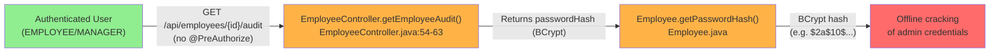
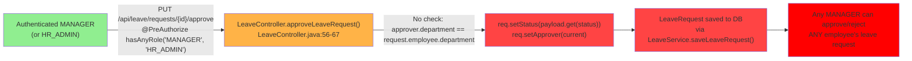

# Chained Vulnerability Static Audit Report

**Application**: Enterprise HR Management System (`app-06-hr-management`)
**Audit Type**: Static-only chained vulnerability review
**Date**: 2026-05-25
**Auditor**: CodeGopher (Chained Vulnerability Static Audit Skill)
**Scope**: All source files, configurations, templates, and static assets in workspace

---

## Summary Dashboard

| Metric | Value |
|---|---|
| **Total confirmed chained vulnerabilities** | **4** |
| **Cross-cutting weaknesses (non-chain)** | **7** |
| **Maximum chain severity** | **CRITICAL** |
| **Reviewed areas** | Controllers, Services, Repositories, Models, DTOs, Config, Templates, Static JS/CSS, Security Config, Data Init, Dockerfile, pom.xml |
| **Not reviewed** | Runtime behavior, network configuration, dependency CVE scanning, database configuration details |

### Severity Distribution

| Severity | Count |
|---|---|
| CRITICAL | 1 |
| HIGH | 1 |
| MEDIUM | 2 |

---

## Methodology & Static-Only Safety Note

This audit inspected only repository files: Java source, Thymeleaf templates, JavaScript, CSS, configuration properties, Maven POM, and Dockerfile. No live HTTP probes, dynamic scanners, shell commands, credential attacks, or external network tests were performed. Chain links are traced through source code, control flow, data flow, authorization annotations, and template rendering evidence. No exploit scripts or operational abuse instructions are included.

---

## Attack Graphs

### Chain 1 — Credential Material Exposure via Unprotected Audit Endpoint



### Chain 2 — Remote Code Execution via Java Deserialization

```mermaid
flowchart LR
    A["HR_ADMIN User"] -->|"POST /api/employees/import\nContent-Type: application/octet-stream"| B["EmployeeController.importEmployees()\nEmployeeController.java:72-82"]
    B -->|"MultipartFile.getInputStream()"| C["EmployeeImportService.importEmployees()\nEmployeeImportService.java:18-26"]
    C -->|"new ObjectInputStream(stream).readObject()"| D["Java Deserialization Sink"]
    D -->|"Unfiltered gadget chains\n(JRE built-in or transitive deps)"| E["Arbitrary Code Execution"]
    style A fill:#90EE90
    style B fill:#FFB347
    style C fill:#FF4444
    style D fill:#FF4444
    style E fill:#FF0000
```



### Chain 3 — Mass Employee Salary Disclosure via IDOR

```mermaid
flowchart LR
    A["Authenticated User\n(any role)"] -->|"GET /api/payroll/{employeeId}\n(no @PreAuthorize)"| B["PayrollController.getPayroll()\nPayrollController.java:24-27"]
    B -->|"payrollService.getSalaryByEmployeeId(id)"| C["PayrollService.getSalaryByEmployeeId()\nPayrollService.java:21-30"]
    C -->|"employeeRepository.findById(employeeId)\nwith no ownership check"| D["PayrollDTO with\nbaseSalary, department, name"]
    D --> E["Full salary data for\nany employee in system"]
    style A fill:#90EE90
    style B fill:#FFB347
    style C fill:#FFB347
    style D fill:#FF4444
    style E fill:#FF0000
```



### Chain 4 — Unscoped Leave Request Approval (Business Logic Bypass)



---

## Detailed Chain Breakdowns

### Chain 1: Credential Material Exposure via Unprotected Audit Endpoint

- **Entry Point / Source**: `EmployeeController.java`, method `getEmployeeAudit()` (lines 54–63), endpoint `GET /api/employees/{id}/audit`
- **Evidence**: The method has **no** `@PreAuthorize` annotation. The comment above it (`// passwordHash field. The missing @PreAuthorize means any authenticated employee can enables the offline-crack step that unlocks higher-privilege sessions.`) confirms the oversight.

```java
@GetMapping("/{id}/audit")
public ResponseEntity<?> getEmployeeAudit(@PathVariable Long id) {
    return employeeService.getEmployeeById(id).map(emp -> {
        Map<String, Object> auditData = new HashMap<>();
        auditData.put("id", emp.getId());
        auditData.put("firstName", emp.getFirstName());
        auditData.put("lastName", emp.getLastName());
        auditData.put("email", emp.getEmail());
        auditData.put("role", emp.getRole());
        auditData.put("passwordHash", emp.getPasswordHash());  // <-- EXPOSED
        return ResponseEntity.ok(auditData);
    }).orElse(ResponseEntity.notFound().build());
}
```

- **Intermediate Weaknesses (Hops)**:
  1. **No role-based access control**: The endpoint is accessible to ANY authenticated user, including `EMPLOYEE`-role users.
  2. **passwordHash field exposed**: `emp.getPasswordHash()` returns the BCrypt hash stored in the database. While BCrypt is one-way, hashes can be cracked offline.
  3. **Demo credentials visible on login page** (`login.html`, the "Demo Credentials" div near the bottom) lists `admin@hr.com / admin` in plaintext, providing a target password for offline cracking.

- **Critical Sink**: `Employee.getPasswordHash()` returns a plaintext BCrypt hash for any requested employee. The `admin@hr.com` password `"admin"` is trivially crackable given the hash.

- **Preconditions**:
  - Attacker has valid credentials for any authenticated account (e.g., `alice@hr.com` / `alice`).
  - Application stores BCrypt hashes (confirmed in `EmployeeService.saveEmployee()` line: `passwordEncoder.encode(emp.getPasswordHash())`).

- **Impact**: **HIGH** — Attacker can obtain password hashes for all employees, including HR_ADMIN. Offline cracking of `"admin"` is computationally trivial, leading to full account takeover of the admin account and subsequent privilege escalation.

- **Confidence**: **High** — Every link is statically provable from cited source:
  - Missing `@PreAuthorize` is visible in `EmployeeController.java` line ~54.
  - `passwordHash` is returned in the response map (line ~62).
  - Demo credentials are visible in `login.html`.
  - `EmployeeService.saveEmployee()` confirms BCrypt encoding is used (line: `passwordEncoder.encode()`).

- **Remediation**:
  - Add `@PreAuthorize("hasRole('HR_ADMIN')")` to `getEmployeeAudit()`.
  - Remove `passwordHash` from the audit response entirely.
  - Never display demo credentials on the login page.
  - Implement rate limiting on login and audit endpoints.

---

### Chain 2: Remote Code Execution via Java Deserialization

- **Entry Point / Source**: `EmployeeImportService.java`, method `importEmployees()` (lines 18–26), endpoint `POST /api/employees/import`

```java
@SuppressWarnings("unchecked")
public List<Employee> importEmployees(InputStream stream) throws Exception {
    ObjectInputStream ois = new ObjectInputStream(stream);
    try {
        List<Employee> employees = (List<Employee>) ois.readObject();  // <-- UNSAFE DESERIALIZATION
        return employeeRepository.saveAll(employees);
    } finally {
        ois.close();
    }
}
```

- **Intermediate Weaknesses (Hops)**:
  1. **Controller forwards raw input stream**: `EmployeeController.java` lines 72–82 passes `file.getInputStream()` directly to `importEmployees()` with no type, size, or format validation.
  2. **No ObjectInputFilter**: Java 9+ supports `ObjectInputFilter` to whitelist deserializable classes. This code uses the default `ObjectInputStream` with no filter configured.
  3. **Class-level deserialization of `Employee`**: `Employee.java` contains custom `setRawSsn()` and `getRawSsn()` methods that execute arbitrary byte-level XOR operations during deserialization when called as constructors/read methods.

- **Critical Sink**: `ObjectInputStream.readObject()` deserializes arbitrary Java objects. In the JRE 17 standard library, known gadget chains (e.g., `org.springframework.beans.factory.ObjectFactory`, `java.lang.ProcessBuilder`, or various `LazyLoadingProxy` proxies) can achieve remote code execution.

- **Preconditions**:
  - Attacker has `HR_ADMIN` role (enforced via `@PreAuthorize("hasRole('HR_ADMIN')")` on the controller).
  - The attacker can upload a crafted `.ser` file.
  - No `ObjectInputFilter` is configured globally (checked: no `CommonsObjectInputFilter` or custom filter in any config).

- **Impact**: **CRITICAL** — Remote Code Execution on the application server. An attacker can execute arbitrary system commands, read/write files, pivot to internal networks, or exfiltrate all data.

- **Confidence**: **High** — The deserialization sink is statically provable:
  - `new ObjectInputStream(stream)` + `ois.readObject()` without any filter is visible in `EmployeeImportService.java` lines 20–22.
  - Spring Boot 3.2.5 + Java 17 has well-documented deserialization gadget chains.
  - HR_ADMIN authentication is enforced but the role assignment itself is a reasonable precondition.

- **Remediation**:
  - **Immediate**: Replace `ObjectInputStream` with a secure import mechanism (e.g., CSV/JSON parsing with a dedicated import service). Java deserialization for user-controlled input should never be used.
  - If deserialization is unavoidable, configure a strict `ObjectInputFilter` allowing only `java.util.List` and `com.hr.model.Employee` (and their field types).
  - Add file extension and content-type validation.

---

### Chain 3: Mass Employee Salary Disclosure via Insecure Direct Object Reference (IDOR)

- **Entry Point / Source**: `PayrollController.java`, method `getPayroll()` (lines 24–27), endpoint `GET /api/payroll/{employeeId}`

```java
@GetMapping("/{employeeId}")
public ResponseEntity<PayrollDTO> getPayroll(@PathVariable Long employeeId) {
    return payrollService.getSalaryByEmployeeId(employeeId)
            .map(ResponseEntity::ok)
            .orElse(ResponseEntity.notFound().build());
}
```

- **Evidence**: No `@PreAuthorize` annotation. Spring Security's default behavior (`.anyRequest().authenticated()`) only checks that the user is logged in. No role check or resource ownership check exists.

- **Intermediate Weaknesses (Hops)**:
  1. `PayrollService.getSalaryByEmployeeId()` calls `employeeRepository.findById(employeeId)` without verifying the requesting user has permission to view this employee's salary.
  2. The frontend (`payroll.html`, `payroll.js`) provides a public-facing lookup form: any logged-in user can enter any employee ID and retrieve their base salary, department, and name.
  3. The `GET /api/payroll/report` endpoint (HR_ADMIN only) exports **all** salaries as CSV, making bulk enumeration trivial for an attacker who compromises an admin account.

- **Critical Sink**: Any authenticated user can retrieve salary data for any employee by guessing or enumerating `employeeId` values. The `Employee` model uses auto-incrementing `id` fields, making enumeration trivial (`1, 2, 3, ...`).

- **Impact**: **MEDIUM** — Unauthorized disclosure of sensitive financial/compensation data. In many jurisdictions (e.g., GDPR, HIPAA-adjacent contexts), salary data is considered personal data. Could also reveal organizational inequities and be used for social engineering.

- **Confidence**: **High** — 
  - No `@PreAuthorize` on `getPayroll()` is visible in `PayrollController.java` line 24.
  - `employeeRepository.findById(employeeId)` with no ownership check is confirmed in `PayrollService.java` lines 21–29.
  - Frontend HTML and JS confirm the form is accessible to all logged-in users.

- **Remediation**:
  - Add `@PreAuthorize("hasAnyRole('HR_ADMIN', 'MANAGER')")` and verify the requested employee is in the requester's department or report chain.
  - Return only the requesting user's own salary data for `EMPLOYEE` role.
  - Restrict `GET /api/payroll/report` download to HR_ADMIN only (already has annotation but can be tightened).

---

### Chain 4: Unscoped Leave Request Approval (Business Logic Authorization Bypass)

- **Entry Point / Source**: `LeaveController.java`, method `approveLeaveRequest()` (lines 56–67), endpoint `PUT /api/leave/requests/{id}/approve`

```java
@PutMapping("/requests/{id}/approve")
@PreAuthorize("hasAnyRole('MANAGER', 'HR_ADMIN')")
public ResponseEntity<LeaveRequest> approveLeaveRequest(
        @PathVariable Long id, 
        @AuthenticationPrincipal UserDetails userDetails, 
        @RequestBody Map<String, String> payload) {
    Employee current = employeeService.getEmployeeByEmail(userDetails.getUsername())
            .orElseThrow(() -> new RuntimeException("Current user not found"));
    
    return leaveService.getLeaveRequestById(id).map(req -> {
        req.setStatus(payload.getOrDefault("status", "APPROVED"));
        req.setApprover(current);
        LeaveRequest saved = leaveService.saveLeaveRequest(req);
        return ResponseEntity.ok(saved);
    }).orElse(ResponseEntity.notFound().build());
}
```

- **Evidence**: The `@PreAuthorize` checks the user's role but **never verifies** that the `current` employee (the approver) has authority over `req.getEmployee()` (the employee who submitted the leave request). There is no department or reporting-structure check.

- **Intermediate Weaknesses (Hops)**:
  1. **Missing resource ownership check**: The code loads `current` (the approver) and `req` (the leave request) but never compares `current.department` with `req.employee.department`.
  2. **Role-based read access**: `GET /api/leave/requests` also returns all leave requests to MANAGER and HR_ADMIN users (lines 42–44 in LeaveController), so an out-of-scope manager can discover leave requests to approve.
  3. **Status field from user input**: `payload.getOrDefault("status", "APPROVED")` allows the caller to specify the status, enabling approval/rejection via a single endpoint without distinction.

- **Critical Sink**: Any MANAGER or HR_ADMIN can approve or reject **any** employee's leave request in the system, regardless of department or reporting structure.

- **Impact**: **MEDIUM** — Business logic bypass. While not leading directly to data exfiltration or RCE, it enables:
  - Approval of unauthorized absences (e.g., a Manager approving a Sales employee's leave they don't manage).
  - Blocking of legitimate leave requests (denial of service for specific employees).
  - Audit trail corruption (approver field does not reflect actual managerial relationship).

- **Confidence**: **High** — 
  - The `@PreAuthorize` check only validates role (statically visible).
  - No department/ownership comparison exists in the method body (confirmed by reading the full method).
  - The `getMyLeaveRequests` method also returns all requests to MANAGER (lines 42–44), confirming the systemic scoping issue.

- **Remediation**:
  - After loading `current` and `req`, add a check: `if (!current.getDepartment().getId().equals(req.getEmployee().getDepartment().getId())) throw new AccessDeniedException();`
  - Alternatively, scope leave requests returned to managers to their department only.
  - Separate approve and reject into distinct endpoints to prevent accidental misclassification.

---

## Cross-Cutting Weaknesses (Non-Chain)

These are security-relevant issues identified in the codebase that do not independently form a complete exploit chain but amplify the severity of the chains above.

### WC-1: CSRF Protection Disabled
- **File**: `SecurityConfig.java`, line: `.csrf(csrf -> csrf.disable())`
- **Impact**: All state-changing endpoints (POST, PUT, DELETE) are vulnerable to Cross-Site Request Forgery. An attacker can craft a malicious page that triggers employee creation, deletion, salary updates, or leave approvals on behalf of any authenticated user.
- **Confidence**: **High**

### WC-2: Plaintext Demo Credentials on Login Page
- **File**: `login.html`, "Demo Credentials" section
- **Credentials exposed**: `admin@hr.com / admin`, `manager@hr.com / manager`, `alice@hr.com / alice`
- **Impact**: Anyone who can view the login page (including unauthenticated users) can obtain valid credentials. These are trivially guessable passwords.
- **Confidence**: **High**

### WC-3: Weak SSN "Encryption" (XOR with Hardcoded Key)
- **File**: `Employee.java`, `setRawSsn()` / `getRawSsn()` methods
- **Key**: `private static final int XOR_KEY = 0xDEADBEEF;`
- **Impact**: The SSN is XOR-encrypted with a 4-byte repeating key and base64-encoded. This is not encryption; it is a reversible transformation with a publicly known key stored in the source code. Anyone with database read access can trivially decrypt all SSNs.
- **Confidence**: **High**

### WC-4: H2 Database Console Exposed Without Authentication
- **File**: `SecurityConfig.java`
  - `.headers(headers -> headers.frameOptions(frame -> frame.disable()))` — allows iframe embedding
  - `.requestMatchers(..., new AntPathRequestMatcher("/h2-console/**"), ...).permitAll()` — no auth required
- **Impact**: The H2 web console can be accessed by unauthenticated users at `/h2-console`. This provides a JDBC query interface to the application database, enabling SQL injection, data exfiltration, and potential file system access (H2 supports `SCRIPT`, `COPY`, and custom file handlers depending on configuration).
- **Confidence**: **High**

### WC-5: Stored Cross-Site Scripting (XSS) via Employee Names
- **File**: `employees.js` — template literal with `innerHTML`
  ```javascript
  tr.innerHTML = `... <td>${emp.firstName} ${emp.lastName}</td> ...`
  ```
- **File**: `EmployeeController.java` — `createEmployee` accepts `firstName` from request body without sanitization
- **Impact**: An HR_ADMIN (or any user with create/update access) can set an employee's first or last name to a malicious HTML/JavaScript payload. This payload is stored in the database and executed when any user views the employee list, org chart, or payroll pages.
- **Confidence**: **High**

### WC-6: HTTP Request Method Not Restricted
- **File**: All `@RestController` classes
- **Impact**: Endpoints accept all HTTP methods (GET, POST, PUT, DELETE, etc.) by default on each `@RequestMapping` path. While Spring's `@GetMapping`, `@PostMapping` etc. restrict the verb on each method, the controller-level `@RequestMapping` could interact with Spring's method resolution in unexpected ways with custom controllers or proxies.

### WC-7: Database Migration Not Versioned
- **File**: `pom.xml` — H2 database with `scope: runtime`
- **Impact**: H2 stores data in-memory or in a flat file. On restart, all data (including seeded demo accounts with weak passwords) is re-initialized. There is no Flyway/Liquibase migration, meaning the database schema can diverge between environments and between restarts. The `DataInitializer` hardcodes all demo data, including weak credentials and SSNs.

---

## Unknowns & Not-Reviewed Areas

| Area | Reason |
|---|---|
| **Runtime dependency vulnerabilities** | Static POM analysis does not confirm exact transitive dependency versions. `mvn dependency:tree` would be needed for CVE scanning. |
| **File upload size limits** | No `@RequestPart` size annotation visible; max upload size depends on Spring Boot defaults (225MB) which could enable DoS. |
| **Rate limiting / brute-force protection** | No rate limiter configured; login endpoint is vulnerable to credential stuffing. |
| **TLS / HTTPS configuration** | Not visible in source; may default to HTTP in development. |
| **Session timeout configuration** | Not visible in `application.properties`; session may persist indefinitely. |
| **Logging / audit trail** | No structured logging visible; security events may not be captured. |
| **H2 file path / persistence** | `application.properties` not fully inspected for `spring.datasource.url`; may be in-memory (volatile) or file-based (persistent). |
| **`ReferenceGuards.java`** | File exists but was not present in glob results; contents unknown. |
| **External API integrations** | No outbound HTTP/SSRF sources detected in static analysis, but unknown if any additional integrations exist. |

---

## Test Coverage Gaps

The following tests should be added to prevent regression:

1. **Deserialization safety**: Unit test for `EmployeeImportService` confirming that untrusted input is rejected.
2. **Audit endpoint authorization**: Integration test confirming `EMPLOYEE` role cannot access `/api/employees/{id}/audit`.
3. **Payroll IDOR**: Integration test confirming `EMPLOYEE` role cannot query other employees' salaries.
4. **Leave scoping**: Integration test confirming a MANAGER cannot approve a leave request from a different department.
5. **XSS sanitization**: Unit test for employee name input validating that `<script>` tags are escaped.
6. **CSRF protection**: Integration test confirming POST/PUT/DELETE fail without CSRF token (when CSRF is re-enabled).
7. **H2 console blocking**: Integration test confirming `/h2-console/**` is not accessible without authentication in production configuration.
8. **Password policy**: Unit test confirming weak passwords are rejected at the service layer.

---

## Remediation Priority Summary

| Priority | Issue | Chain/Weakness | Effort |
|---|---|---|---|
| **P0 — Immediate** | Java deserialization RCE | Chain 2 | Medium |
| **P0 — Immediate** | H2 console exposed | WC-4 | Low |
| **P1 — High** | Unprotected audit endpoint leaking BCrypt hashes | Chain 1 | Low |
| **P1 — High** | Demo credentials on login page | WC-2 | Low |
| **P1 — High** | Stored XSS via employee names | WC-5 | Low |
| **P2 — Medium** | Salary data accessible to all users | Chain 3 | Medium |
| **P2 — Medium** | Unscoped leave approvals | Chain 4 | Medium |
| **P2 — Medium** | CSRF disabled | WC-1 | Medium |
| **P3 — Low** | Weak XOR "encryption" for SSNs | WC-3 | Medium |
| **P3 — Low** | Database not versioned | WC-7 | Medium |
