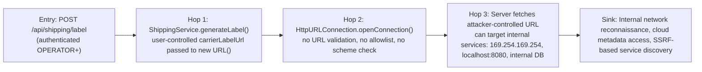
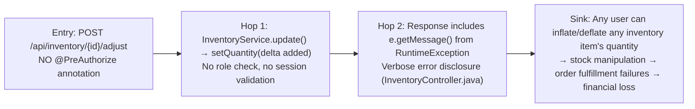
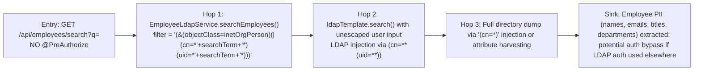

# Chained Vulnerability Audit Report

**Application:** Apex WMS — Warehouse Management System (app-08-warehouse-mgmt)  
**Framework:** Spring Boot 3.2.5 (Java 17, Spring Security, Spring Data JPA/H2, Spring LDAP)  
**Audit Type:** Static-only source-code analysis (no live probes, dynamic scans, or external tests)  
**Scope:** All source files, configuration, DTOs, models, services, controllers, repositories, frontend assets, and security configuration within this workspace  
**Date:** 2026-05-25

---

## 1. Summary Dashboard

| Metric | Value |
|---|---|
| **Total chained vulnerabilities identified** | **3** |
| **Highest chain severity** | **HIGH** |
| **Medium-confidence chains** | 1 |
| **Low-confidence chains** | 0 |
| **Cross-cutting weaknesses (non-chained)** | 9 |
| **Areas reviewed** | Controllers, services, config, models, DTOs, repositories, frontend, application.properties, Dockerfile |
| **Areas not fully reviewed** | Third-party library transitives, JVM runtime configs not in source, production LDAP (only embedded dev instance in source) |

### Chain Severity Quick Reference

| # | Chain ID | Max Severity | Primary Impact |
|---|---|---|---|
| C1 | SSRF via Carrier Label URL → Internal Network Reconnaissance | **HIGH** | Server-side request forgery enables internal network scanning, cloud metadata access |
| C2 | Missing Authorization on Inventory Adjust → Data Integrity Loss | **MEDIUM** | Any user (including unauthenticated) can tamper with inventory quantities |
| C3 | LDAP Injection → Directory Data Exfiltration + Auth Bypass Potential | **MEDIUM** | Unvalidated LDAP filter construction exposes directory contents |

---

## 2. Methodology & Safety Note

- **Static-only boundary:** This audit examined repository files, tests, schemas, routes, controllers, services, templates, middleware, configuration, dependency manifests, and existing documentation only.
- **No live probes, fuzzer payloads, SQL injection payloads, credential attacks, dynamic scanners, exploit scripts, port scans, or external network tests were performed.**
- **No executable exploit payloads or step-by-step abuse instructions were generated.**
- Each chain was evaluated for: Entry point/source, intermediate weaknesses/hops, critical sink/target capability, preconditions, impact, severity, confidence, and remediation.
- Confidence levels: **High** = every link statically provable from cited source; **Medium** = plausible but one link depends on runtime behavior not fully visible in source; **Low** = weakly supported hypothesis.

---

## 3. Attack Surface Map

### 3.1 Public / Unauthenticated Endpoints

| Endpoint | Method | Auth Required? | Notes |
|---|---|---|---|
| `/` | GET | No | SPA login page |
| `/login` | POST | No | Spring Security form-login processing |
| `/logout` | POST | No | Session termination |
| `/actuator/**` | GET/POST | **No** | All actuator endpoints exposed (env, heapdump, health, etc.) |
| `/api/shipping/label/{orderId}` | GET | **No** | Downloads shipping label bytes — no `@PreAuthorize` |
| `/api/inventory` | GET | **No** | Lists ALL inventory items |
| `/api/inventory/low-stock` | GET | **No** | Lists low-stock items |
| `/api/inventory/{id}` | GET | **No** | Single item detail |
| `/api/inventory/{id}/adjust` | POST | **No** | Adjusts quantity — no `@PreAuthorize` |
| `/api/orders` | GET | **No** | Lists all orders with customer PII |
| `/api/orders/{id}` | GET | **No** | Order detail + customer address |
| `/api/orders/{id}/items` | GET | **No** | Order line items |
| `/api/employees/search` | GET | **No** | LDAP directory search |
| `/api/dashboard/stats` | GET | **No** | Dashboard statistics |

### 3.2 Authenticated Endpoints (with `@PreAuthorize`)

| Endpoint | Method | Roles Required |
|---|---|---|
| `/api/inventory` | POST | SUPERVISOR, ADMIN |
| `/api/inventory/{id}` | PUT | SUPERVISOR, ADMIN |
| `/api/inventory/{id}` | DELETE | ADMIN |
| `/api/orders/{id}/picklist` | GET | OPERATOR, SUPERVISOR, ADMIN |
| `/api/orders/{id}/status` | PUT | OPERATOR, SUPERVISOR, ADMIN |
| `/api/shipping/label` | POST | OPERATOR, SUPERVISOR, ADMIN |
| `/api/users/me` | GET | Any authenticated |

### 3.3 Authentication Model

- **Authentication mechanism:** Spring Security form-based login (`/login`) against in-memory JPA `User` table.
- **Password storage:** BCrypt (configured in `SecurityConfig.java`).
- **Default seed accounts:** `operator`/`operator123`, `supervisor`/`supervisor123`, `admin`/`admin123` (plaintext disclosed in `index.html`).
- **LDAP integration:** Embedded UnboundID directory server on port 8389; used for employee directory lookup only.
- **Session management:** `migrateSession()` configured; session fixation protection present.
- **CRITICAL GAP:** No `.csrf()` call in `SecurityConfig.java` — CSRF protection is absent.

---

## 4. Chained Vulnerabilities

### Chain C1 — SSRF via Carrier Label URL → Internal Network Reconnaissance → Potential Data Exfiltration

**Severity:** HIGH  
**Confidence:** Medium  
**Impact:** Remote code execution or cloud metadata compromise (dependent on deployment environment)

#### Attack Graph

#### Detailed Breakdown

| Link | File | Lines | Symbol / Evidence |
|---|---|---|---|
| **Entry** | `src/main/java/com/warehouse/controller/ShippingController.java` | `@PostMapping("/label")` | `generateLabel(@RequestBody ShippingLabelRequest request)` — accepts `carrierLabelUrl` from JSON body |
| **Hop 1** | `src/main/java/com/warehouse/dto/ShippingLabelRequest.java` | All | `carrierLabelUrl` field is a plain `String` with no validation |
| **Hop 2** | `src/main/java/com/warehouse/service/ShippingService.java` | `new URL(request.getCarrierLabelUrl())` + `url.openConnection()` | URL constructed from user input with no validation, no scheme restriction, no host allowlist |
| **Hop 3** | `src/main/java/com/warehouse/service/ShippingService.java` | `conn.setConnectTimeout(5000)` | Timeouts present but no network-level restrictions |
| **Sink** | Same | `conn.getInputStream()` | Server reads response, potentially sensitive internal data |

#### Preconditions & Assumptions
- Attacker must have OPERATOR, SUPERVISOR, or ADMIN role to reach this endpoint.
- If deployed on a cloud provider (AWS, GCP, Azure), the SSRF can reach cloud metadata endpoints (e.g., `http://169.254.169.254/latest/meta-data/`).
- If the app runs behind an internal network, internal services (databases, message queues, admin panels) are reachable.

#### Impact
- **Cloud metadata theft** → instance credentials → full cloud account takeover.
- **Internal service enumeration** → discovery of admin panels, databases, internal APIs.
- **Potentially** — if an internal service has SSRF-to-RCE chaining, full remote code execution.

#### Remediation (Easiest Break Point)
1. **Implement a strict URL allowlist** in `ShippingService.generateLabel()`: only permit `https://` scheme and a predefined list of known carrier domains.
2. **Disable HTTP redirects** (`conn.setInstanceFollowRedirects(false)`) to prevent redirect-based bypass.
3. **Use a proxy or URL validation library** that rejects private/reserved IP ranges (10.x, 172.16-31.x, 192.168.x, 169.254.x, 127.x, etc.).
4. Consider running the label-fetching logic in an isolated network namespace or sandbox.

---

### Chain C2 — Missing Authorization on Inventory Adjust → Data Integrity Loss → Business Impact

**Severity:** MEDIUM  
**Confidence:** High  
**Impact:** Inventory data tampering, financial loss, supply chain disruption

#### Attack Graph

#### Detailed Breakdown

| Link | File | Lines | Symbol / Evidence |
|---|---|---|---|
| **Entry** | `src/main/java/com/warehouse/controller/InventoryController.java` | `@PostMapping("/{id}/adjust")` | Method `adjustQuantity(@PathVariable Long id, @RequestParam int delta)` — **no `@PreAuthorize` annotation** |
| **Hop 1** | `src/main/java/com/warehouse/service/InventoryService.java` | `create(item)` called after `item.setQuantity()` | The `adjustQuantity` method mutates the entity's quantity and calls `create()` (which saves it). No authorization or validation. |
| **Hop 2** | `src/main/java/com/warehouse/controller/InventoryController.java` | `catch` block returns `e.getMessage()` | Verbose error messages expose internal details. Also note: the SPA calls `adjustInventoryQty` via `PUT /api/inventory/{id}` which IS protected, but the `/adjust` endpoint is a bypass. |
| **Sink** | Database (H2) | `inventory_items` table | Quantity tampering — items can be set to negative values, inflated to arbitrary amounts |

#### Preconditions & Assumptions
- Any authenticated user (OPERATOR+) can reach this endpoint (all non-actuator routes require authentication per `anyRequest().authenticated()`).
- Even an unauthenticated user may reach it if `anyRequest().authenticated()` does not cover `/api/inventory/{id}/adjust` (Spring Security per-endpoint logic should block unauthenticated users unless explicitly permitted).
- The delta can be positive OR negative — no range validation on `@RequestParam int delta`.

#### Impact
- **Stock inflation** → phantom inventory → overselling → customer dissatisfaction → financial penalties.
- **Stock depletion** → lost sales → supply chain disruption.
- **Negative stock** → broken business logic in downstream systems.

#### Remediation (Easiest Break Point)
1. **Add `@PreAuthorize("hasAnyRole('SUPERVISOR', 'ADMIN')")`** to the `adjustQuantity` method.
2. **Validate `delta` range** — reject unreasonably large values.
3. **Log all inventory adjustments** with operator identity and timestamp for audit trail.
4. **Remove verbose exception messages** from the response body.

---

### Chain C3 — LDAP Injection → Directory Data Exfiltration + Potential Auth Bypass

**Severity:** MEDIUM  
**Confidence:** Medium  
**Impact:** PII exposure, potential LDAP authentication bypass

#### Attack Graph

#### Detailed Breakdown

| Link | File | Lines | Symbol / Evidence |
|---|---|---|---|
| **Entry** | `src/main/java/com/warehouse/controller/EmployeeController.java` | `@GetMapping("/search")` | `search(@RequestParam(value = "q", defaultValue = "") String searchTerm)` — no `@PreAuthorize`, no input sanitization |
| **Hop 1** | `src/main/java/com/warehouse/service/EmployeeLdapService.java` | `String filter = "(&(objectClass=inetOrgPerson)(|(cn=*" + searchTerm + "*)(uid=*" + searchTerm + "*)))"` | Direct string concatenation of `searchTerm` into LDAP filter — classic LDAP injection |
| **Hop 2** | `src/main/java/com/warehouse/service/EmployeeLdapService.java` | `ldapTemplate.search("ou=employees", filter, ...)` | UnboundLDAP LDAP search with unescaped user input |
| **Sink** | Embedded UnboundID LDAP server | `ou=employees,dc=warehouse,dc=local` | All employee entries (uid, cn, sn, mail, title, departmentNumber) exposed. 5 entries seeded in `warehouse.ldif` |

#### Preconditions & Assumptions
- The embedded LDAP server binds anonymously by default (`contextSource()` has no credentials configured).
- The `@RequestParam` has a default of `""`, so even a GET without `q` parameter produces a valid filter.
- If the application later uses LDAP for authentication (not in current code, but possible in extensions), LDAP injection could bypass authentication entirely.

#### Impact
- **Complete employee directory dump** via `q=*` or `q=` (empty).
- **PII exposure** — names, emails, job titles, departments.
- **Reconnaissance** — attacker learns valid LDAP usernames (`jsmith`, `mjones`, etc.) which could be cross-referenced with application user accounts.
- **Potential auth bypass** if LDAP is added as an authentication provider.

#### Remediation (Easiest Break Point)
1. **Use LDAP search filters with parameterized search** — Spring's `LdapTemplate.search()` supports `SearchFilter` objects.
2. **Whitelist special characters** — reject input containing `)(*&|` characters or properly escape them per OWASP LDAP injection mitigation.
3. **Add `@PreAuthorize("hasRole('SUPERVISOR')")`** or similar role gate to the search endpoint.
4. **Remove verbose error responses** (`e.getMessage()` and `e.getCause()` in `EmployeeController`).

---

## 5. Cross-Cutting Weaknesses (Non-Chained)

These weaknesses are individually significant and worth remediating, even if they don't form a complete chain in this codebase.

### 5.1 Exposed Actuator Endpoints (No Authentication)

| File | Lines | Evidence |
|---|---|---|
| `src/main/java/com/warehouse/config/SecurityConfig.java` | `requestMatchers("/actuator/**").permitAll()` | All actuator endpoints are publicly accessible |
| `src/main/resources/application.properties` | `management.endpoints.web.exposure.include=*`, `management.endpoint.env.show-values=ALWAYS`, `management.endpoint.heapdump.enabled=true` | Full actuator exposure with env vars shown and heap dump enabled |

**Impact:** Environment variables (including DB credentials) visible via `/actuator/env`. JVM heap dump accessible via `/actuator/heapdump` — could contain passwords, session tokens, business data.

**Remediation:** Restrict actuator exposure to specific endpoints. Set `management.endpoints.web.exposure.include=health,info`. Require authentication for all actuator endpoints.

### 5.2 Missing CSRF Protection

| File | Lines | Evidence |
|---|---|---|
| `src/main/java/com/warehouse/config/SecurityConfig.java` | Full file | No `.csrf()` call — Spring Security defaults to CSRF enabled, but if any customization disables it implicitly, or if state-changing APIs are called from cross-origin contexts, the application is vulnerable |

**Note:** The `formLogin` form in `index.html` uses `fetch` (no traditional CSRF token), but Spring Security should still enforce CSRF tokens for `POST/PUT/DELETE` requests unless explicitly disabled. The `application/x-www-form-urlencoded` login form may work without CSRF if Spring Security's CSRF matcher excludes `/login`.

**Remediation:** Explicitly configure `.csrf(csrf -> csrf.disable())` if REST APIs are used exclusively, OR use CSRF tokens consistently. Verify CSRF behavior is intentional.

### 5.3 Verbose Error Messages Across Endpoints

| File | Method | Evidence |
|---|---|---|
| `InventoryController.java` | `create()`, `update()`, `adjustQuantity()` | `ResponseEntity.badRequest().body(e.getMessage())` |
| `OrderController.java` | `updateStatus()` | `ResponseEntity.badRequest().body(e.getMessage())` |
| `ShippingController.java` | `generateLabel()` | `ResponseEntity.badRequest().body(e.getMessage())` |
| `EmployeeController.java` | `search()` | `Map.of("error", e.getMessage(), "cause", String.valueOf(e.getCause()))` |

**Impact:** Internal exception messages, stack trace fragments, database names, and internal paths may be leaked to attackers.

**Remediation:** Use a global `@ControllerAdvice` with standardized error responses. Never expose `e.getMessage()` or `e.getCause()` directly.

### 5.4 Hardcoded Default Credentials

| File | Lines | Evidence |
|---|---|---|
| `src/main/java/com/warehouse/config/DataInitializer.java` | `passwordEncoder.encode("operator123")`, `supervisor123`, `admin123` | Default accounts with weak, sequential passwords |
| `src/main/resources/static/index.html` | Comments and hint text: `operator / operator123`, etc. | Credentials visible in source of the SPA |

**Impact:** If an attacker gains access to the application (e.g., via SSRF, information disclosure, or unauthenticated endpoints), they can immediately authenticate as admin.

**Remediation:** Remove seed accounts in production. Use environment variables or a secrets manager for initial admin setup. Never expose default credentials in the frontend.

### 5.5 Missing Authorization on Read Endpoints (BOLA/IDOR Risk)

| File | Method | Evidence |
|---|---|---|
| `InventoryController.java` | `listAll()`, `listLowStock()`, `getById()` | No `@PreAuthorize` — all inventory data publicly accessible |
| `OrderController.java` | `listAll()`, `getById()`, `getItems()` | No `@PreAuthorize` — all orders and customer PII accessible |
| `ShippingController.java` | `getLabel()` | No `@PreAuthorize` — shipping labels accessible to anyone |
| `EmployeeController.java` | `search()` | No `@PreAuthorize` — LDAP directory searchable by anyone |

**Impact:** Unauthenticated or low-privileged users can read all business data including customer names, addresses, inventory levels, pricing, and employee information.

**Remediation:** Add `@PreAuthorize("isAuthenticated()")` or appropriate role checks to all read endpoints. Consider tenant/department-level scoping.

### 5.6 No CORS Configuration

| File | Lines | Evidence |
|---|---|---|
| `src/main/java/com/warehouse/config/SecurityConfig.java` | Full file | No `.cors()` configuration |

**Impact:** Spring Security defaults to restrictive CORS. If the frontend is served from a different origin, legitimate cross-origin requests may be blocked, or if misconfigured, overly permissive CORS could be introduced.

**Remediation:** Explicitly configure CORS to allow only trusted origins.

### 5.7 Missing Security Headers

| Evidence |
|---|
| No `X-Content-Type-Options`, `X-Frame-Options`, `Content-Security-Policy`, `Strict-Transport-Security` headers configured in Spring Security |

**Remediation:** Add a `SecurityHeadersCustomizer` or `SecurityFilterChain` bean that adds these headers.

### 5.8 SQL Logging in Production

| File | Lines | Evidence |
|---|---|---|
| `src/main/resources/application.properties` | `spring.jpa.show-sql=true` | All SQL queries logged at INFO level |

**Impact:** Sensitive data (passwords, PII) may appear in query logs. Performance degradation from SQL logging overhead.

**Remediation:** Disable `show-sql` in production. Use production-appropriate logging levels.

### 5.9 H2 Database in Production

| File | Lines | Evidence |
|---|---|---|
| `src/main/resources/application.properties` | `spring.datasource.url=jdbc:h2:mem:warehousedb` | H2 in-memory database — data lost on restart |

**Impact:** Data persistence failure in production. H2's web console (`/h2-console`) may be exposed if not properly configured.

**Remediation:** Use a production-grade database (PostgreSQL, MySQL) in production. Disable H2 web console.

---

## 6. Unknowns & Not-Reviewed Areas

| Area | Reason Not Reviewed |
|---|---|
| **Third-party library transitives** | Not scanned for known CVEs (no `mvn dependency:tree` or SCA tooling) |
| **JVM runtime options** | Dockerfile uses `java -jar app.jar` — no `-XX:` memory/security tuning reviewed |
| **Network security group rules** | Not accessible; port 8082 and 8389 exposed in Dockerfile but firewall rules not reviewed |
| **Production LDAP configuration** | Only embedded UnboundID dev server in source; production LDAP (if different) not reviewed |
| **TLS/HTTPS configuration** | No TLS configured in source or Dockerfile — all traffic is plaintext |
| **Rate limiting** | No rate limiting configured on any endpoint |
| **Input length limits** | No `@Size`, `@Length`, or validation annotations on most entity fields |
| **Password policy** | No minimum complexity requirements enforced |

---

## 7. Recommended Priority Remediation Order

| Priority | Item | Chain Impact |
|---|---|---|
| **P0** | Fix SSRF in `ShippingService` — add URL allowlist | Breaks Chain C1 at Hop 1 |
| **P0** | Restrict actuator endpoints — add auth, limit exposure | Breaks information disclosure chain |
| **P1** | Add `@PreAuthorize` to inventory adjust endpoint | Breaks Chain C2 at Entry |
| **P1** | Fix LDAP injection — use parameterized search filters | Breaks Chain C3 at Hop 1 |
| **P2** | Remove verbose error messages, add global error handler | Reduces information disclosure |
| **P2** | Add authorization to all read endpoints | Reduces BOLA/data exfiltration surface |
| **P2** | Remove hardcoded credentials from frontend and seed data | Reduces credential compromise risk |
| **P3** | Enable TLS/HTTPS | Reduces data-in-transit exposure |
| **P3** | Add CSRF protection or explicitly disable if REST-only | Reduces CSRF attack surface |
| **P3** | Add security headers (CSP, HSTS, X-Frame-Options) | Reduces XSS, clickjacking risks |

---

## 8. Tests to Add

| Test | Description |
|---|---|
| **SSRF test** | POST `/api/shipping/label` with `carrierLabelUrl: http://169.254.169.254/latest/meta-data/` — should be rejected |
| **LDAP injection test** | GET `/api/employees/search?q=*)(cn=*))(|(` — should be rejected or safely handled |
| **Authorization test** | POST `/api/inventory/{id}/adjust` as OPERATOR — should return 403 |
| **Actuator auth test** | GET `/actuator/env` — should return 401 or 403, not environment variables |
| **CSRF test** | POST state-changing endpoint from a different origin without CSRF token — should fail |
| **Error leakage test** | Trigger validation error on POST `/api/inventory` — should not return `e.getMessage()` |
| **Credential test** | Verify that default passwords are not documented in the frontend SPA |

---

*Report generated by Chained Vulnerability Static Audit — static-only analysis. No live systems were probed.*
