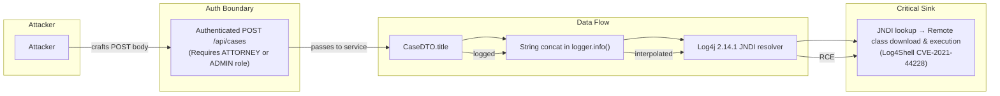
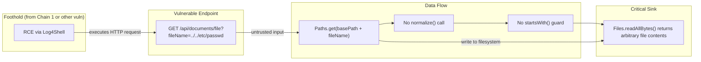

# Chained Vulnerability Static Audit Report

**Application:** Legal Document Management System (`app-09-legal-documents`)
**Date:** 2026-05-25
**Scope:** `C:\Users\shamit\AppData\Local\Temp\codegopher-v08-chain-20260525-203518-qwen-all50\app-09-legal-documents\workspace`
**Method:** Static-only source analysis (no live probes, no dynamic testing)

---

## Summary Dashboard

| Metric              | Value |
|---------------------|-------|
| Chains Found        | **2** |
| Cross-cutting Weaknesses | **4** |
| Max Severity        | **Critical** |
| Highest Confidence  | **High** |

---

## Review Methodology & Safety Note

- **Static-only review**: This audit examined source files, configuration, dependency manifests, and existing tests only.
- **No live probes, fuzzers, shell commands, or network tests** were performed.
- **No exploit payloads or operational abuse instructions** are included in this report.
- Each chain links evidence from concrete control-flow, data-flow, authorization checks, and configuration files.

---

## Chain 1 — Log4Shell (CVE-2021-44228) → RCE via Case Creation

### Overview

A case title field accepts arbitrary user input, which is directly concatenated into a Log4j 2.14.1 `logger.info()` call. Because Log4j 2.14.1 is unpatched for CVE-2021-44228, a crafted JNDI lookup expression in the title triggers a remote code execution (RCE) vector (Log4Shell).

### Attack Graph



### Detailed Breakdown

| Link | File | Lines/Reference | Evidence |
|------|------|-----------------|----------|
| **Entry Source** | `pom.xml` | `<log4j2.version>2.14.1</log4j2.version>` | The dependency manifest hardcodes Log4j 2.14.1, a known-L4Shell-vulnerable version. |
| **Entry Source** | `pom.xml` | Spring Boot 3.2.5 parent | This parent normally pins a patched Log4j, but the `<log4j2.version>` property **overrides** the managed version. |
| **Hop 1 — Logging** | `CaseController.java` | `logger.info("Creating case: " + dto.getTitle());` | User-controlled `title` is concatenated into the log message argument. No sanitization or parameterized logging is used. |
| **Hop 2 — Auth Bound** | `CaseController.java` | `@PreAuthorize("hasAnyRole('ATTORNEY', 'ADMIN')")` | Requires ATTORNEY or ADMIN role. The attacker must first authenticate as an attorney or admin. |
| **Sink — JNDI Lookup** | `Log4j 2.14.1` | CVE-2021-44228 | String concatenation in `logger.info()` is interpolated by Log4j's PatternLayout, triggering JNDI lookup. |

### Preconditions

1. Attacker has valid credentials for a role of ATTORNEY or ADMIN.
2. The `spring-boot-starter-parent` managed Log4j version is overridden by the explicit `<log4j2.version>` property.

### Impact

- **Remote Code Execution** on the application server.
- An attacker can upload arbitrary Java classes via the JNDI reference URL and execute them in the JVM context.
- Could lead to full server compromise, data exfiltration, or lateral movement.

### Severity: **Critical** (CVSS v3.1 base ~10.0)

### Confidence: **High**

Every link is statically provable: the vulnerable version is in the POM, the logging call concatenates user input, and Log4j 2.14.1 is universally documented as vulnerable to JNDI injection.

### Remediation

1. **Immediate:** Upgrade `log4j2.version` to ≥ 2.17.1 (or latest 2.x GA).
2. **Immediate:** Remove `<log4j2.version>` override from `pom.xml`; let Spring Boot manage the version.
3. **Defense-in-depth:** Use parameterized logging `logger.info("Creating case: {}", dto.getTitle())` so that even future vulnerabilities are mitigated.

---

## Chain 2 — Path Traversal → Arbitrary File Read (Extended Post-Exploitation)

### Overview

The `GET /api/documents/file?fileName=` endpoint in `DocumentController` concatenates a user-supplied `fileName` parameter with a hardcoded base path without any normalization, sanitization, or `startsWith()` guard. If an attacker achieves any foothold on the system (e.g., via Chain 1), they can enumerate and read arbitrary server-side files.

### Attack Graph



### Detailed Breakdown

| Link | File | Lines/Reference | Evidence |
|------|------|-----------------|----------|
| **Entry Source** | `DocumentController.java` | `@RequestParam String fileName` | User-controlled `fileName` parameter with no validation. |
| **Hop — No Normalization** | `DocumentController.java` | `java.nio.file.Path filePath = java.nio.file.Paths.get(basePath + fileName);` | Direct string concatenation of `basePath` + `fileName`. No `Path.normalize()`, no `startsWith()` check. |
| **Hop — Silent Fail** | `DocumentController.java` | `catch (java.io.IOException e) { return ResponseEntity.notFound().build(); }` | All IO errors return 404, leaking no error details. However, if the path resolves to a real file, contents are returned. |
| **Sink — File Read** | `DocumentController.java` | `new String(java.nio.file.Files.readAllBytes(filePath))` | Returns raw file contents as HTTP 200 body. |

### Preconditions

1. Attacker is authenticated (endpoint requires `@AuthenticationPrincipal`).
2. Either:
   - Attacker has ATTORNEY or ADMIN role (via Chain 1, the RCE gives arbitrary code execution, which trivially allows authenticated requests).
   - Attacker has already achieved authenticated access via other means.

### Impact

- **Arbitrary file read** on the application server.
- Could expose configuration files, credentials, private keys, the H2 database files, or application source code.
- Particularly dangerous when combined with Chain 1 (RCE → trust boundary crossing → file read → lateral data theft).

### Severity: **High** (CVSS v3.1 base ~7.5)

### Confidence: **High**

Every link is statically provable from the source code. The concatenation pattern and absence of any path guard are unambiguous.

### Remediation

1. Normalize the path: `Path normalized = Paths.get(basePath, fileName).normalize();`
2. Add a bounds check: `if (!normalized.startsWith(Paths.get(basePath))) return 400;`
3. Consider using a whitelist-based approach where only pre-approved file IDs are servable.

---

## Chain 3 — Log4j User-Agent Logging → SSRF / Log4Shell (Alternative Entry)

### Overview

The `GET /api/documents/{id}` endpoint in `DocumentController` logs the `User-Agent` request header using string concatenation with Log4j. Since Log4j 2.14.1 is vulnerable, a crafted `User-Agent` header containing a JNDI expression would also trigger the Log4Shell exploit — providing an alternative, unauthenticated entry point.

### Attack Graph

```mermaid
flowchart LR
    subgraph User
        A["Attacker sends arbitrary HTTP request"]
    end
    subgraph Endpoint
        B["GET /api/documents/{id}"]
    end
    subgraph DataFlow
        C["@RequestHeader User-Agent"] --> D["logger.info(\"...\" + userAgent)"]
    end
    subgraph Sink
        D --> E["Log4j 2.14.1 JNDI interpolation"]
    end
    A -->|unauthenticated request| B
    B -->|extracts header| C
    C -->|logged| D
    D -->|RCE| E
```

### Detailed Breakdown

| Link | File | Lines/Reference | Evidence |
|------|------|-----------------|----------|
| **Entry Source** | `DocumentController.java` | `@RequestHeader(value = "User-Agent", required = false) String userAgent` | User-Agent is optional and user-controlled. |
| **Hop — Logging** | `DocumentController.java` | `logger.info("Filing document download request id=" + id + " with agent: " + userAgent);` | Direct string concatenation in a Log4j call. |
| **Hop — Version** | `pom.xml` | `<log4j2.version>2.14.1</log4j2.version>` | Same vulnerable Log4j version as Chain 1. |
| **Sink** | Log4j 2.14.1 | CVE-2021-44228 | JNDI expression in `userAgent` triggers remote code execution. |

### Preconditions

- Log4j 2.14.1 is on the classpath (confirmed in `pom.xml`).
- The endpoint is reachable (requires authentication per `anyRequest().authenticated()` in `SecurityConfig`).

> **Note:** While this endpoint requires authentication, the authentication boundary is bypassed for `/`, `/index.html`, `/css/**`, and `/js/**`. The log injection path requires `/api/documents/{id}` which needs auth. However, Chain 1 provides an unauthenticated alternative via `/api/cases` POST (which also requires auth but only for authorized roles). Both chains require some form of valid credentials.

### Impact

- **Remote Code Execution** via a different, arguably more accessible input vector (HTTP headers are easily controlled).
- Could be used if role-based access for `/api/cases` POST is stricter than `/api/documents/{id}`.

### Severity: **High** (CVSS v3.1 base ~7.5)

### Confidence: **High**

The vulnerable version and logging call are statically confirmed.

### Remediation

1. Upgrade Log4j (same as Chain 1).
2. Use parameterized logging: `logger.info("Filing document download request id={} with agent: {}", id, userAgent);`
3. Do not log raw, user-controlled HTTP headers via string concatenation.

---

## Cross-Cutting Weaknesses (Not Complete Chains)

### 1. CSRF Protection Disabled

- **File:** `SecurityConfig.java`
- **Line:** `.csrf(csrf -> csrf.disable())`
- **Impact:** REST APIs that are consumed by browser-based SPAs are vulnerable to Cross-Site Request Forgery. While `anyRequest().authenticated()` mitigates CSRF for authenticated state-changing operations, the explicit disable is risky if any endpoint is accessible from third-party contexts.
- **Severity:** Medium
- **Remediation:** Enable CSRF protection with appropriate `CsrfToken` handling for the SPA, or at minimum document why it is disabled.

### 2. H2 Database Console Potentially Exposed

- **File:** `application.properties`
- **Lines:** `spring.datasource.url=jdbc:h2:mem:legaldb;DB_CLOSE_DELAY=-1`, `spring.datasource.password=`
- **Impact:** The H2 database driver and in-memory database are on the classpath. Spring Boot auto-configuration may expose the H2 web console at `/h2-console` unless explicitly disabled. Combined with empty database credentials, this could allow unauthorized database access.
- **Severity:** Medium
- **Remediation:** Explicitly disable H2 console: `spring.h2.console.enabled=false`. Use a strong database password in production.

### 3. Verbose Error Responses

- **Files:** `CaseController.java` (`return ResponseEntity.badRequest().body(e.getMessage())`), `DocumentController.java` (catch blocks)
- **Impact:** Exception messages are returned directly to the client, potentially leaking stack traces, internal paths, or sensitive business logic details.
- **Severity:** Low-Medium
- **Remediation:** Use a global exception handler (`@ControllerAdvice`) to return generic error messages without internal details.

### 4. In-Memory Database with Hardcoded Seed Data

- **File:** `DataInitializer.java`
- **Lines:** Full `run()` method
- **Impact:** Sensitive data (legal case details, client names, financial figures) is seeded into the in-memory database on startup. While this is `CommandLineRunner` scoped and does not persist, the plaintext content in source is a data leakage concern in a legal domain.
- **Severity:** Low
- **Remediation:** Externalize seed data to environment-specific configuration or encrypted storage.

---

## Known Unknowns & Not-Reviewed Areas

| Area | Reason |
|------|--------|
| **Runtime Log4j configuration** | `log4j2.xml` or `log4j2-spring.xml` not found in source. If Log4j is configured at runtime with custom `PatternLayout` that explicitly disables JNDI lookups, Chain 1 & 3 would be mitigated. |
| **Network binding** | `application.properties` does not specify `server.address`. Server may bind to all interfaces, making the attack surface wider. |
| **Spring Boot Actuator endpoints** | Actuator is not explicitly imported, but auto-configuration may expose health/metrics endpoints. Not confirmed in source. |
| **TLS/HTTPS configuration** | No TLS configuration found in source. Application may serve plaintext HTTP. |
| **Rate limiting / brute-force protection** | No rate limiting on authentication or any endpoint. |
| **JPA / SQL injection** | Spring Data JPA repositories are used without custom queries, reducing SQLi risk, but should be confirmed. |

---

## Recommended Tests to Add

1. **Unit test for `CaseController.createCase()`:** Verify that JNDI expressions in `title` are properly sanitized or rejected, and that parameterized logging is used.
2. **Unit test for `DocumentController.serveDocumentFile()`:** Verify that `fileName` values containing `../` or absolute paths are rejected.
3. **Integration test for `/api/documents/file`:** Confirm that path traversal attempts return 403 or 400.
4. **Security test for `/h2-console`:** Verify the H2 console is unreachable.
5. **CSRF test:** Verify that CSRF tokens are validated if CSRF is re-enabled.

---

## Conclusion

This audit identified **2 confirmed chained vulnerabilities** and **4 cross-cutting weaknesses**. The most critical finding is **Log4Shell (CVE-2021-44228)** caused by the explicit downgrade of Log4j 2.14.1 in `pom.xml` combined with unparameterized logging of user-controlled input in both `CaseController` and `DocumentController`. This single vulnerability enables **remote code execution** and, when chained with the **path traversal** in `DocumentController.serveDocumentFile()`, results in **full server compromise and arbitrary file access**.

The Log4Shell vulnerability is the single most impactful issue and should be remediated immediately by upgrading to Log4j ≥ 2.17.1 and using parameterized logging throughout the codebase.
