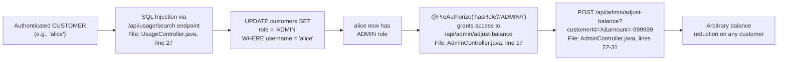
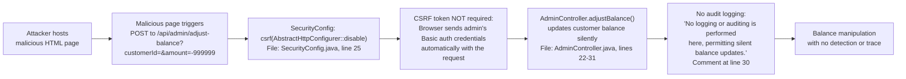
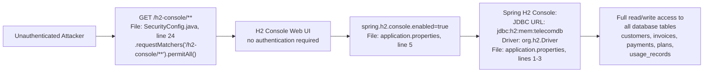

```mermaid
flowchart LR
    A["Authenticated CUSTOMER\n(any user)"] --> B["GET /api/billing/invoices?\ncustomerId=Y\nFile: BillingController.java, lines 30-32"]
    B --> C["No ownership check:\nBillingService.getInvoicesByCustomer(customerId)\nreturns ALL invoices for customerId=Y"]
    C --> D["Attacker discovers invoice IDs\nfor high-value invoices belonging\nto other customers"]
    D --> E["POST /api/billing/pay\ninvoiceId=<target_invoice>\namount=0.01\nmethod=CREDIT_CARD\nFile: BillingController.java, lines 34-38"]
    E --> F["PaymentService.processPayment()\nFile: PaymentService.java, lines 27-36"]
    F --> G["Sets invoice status to 'PAID'\nwith no amount validation\nagainst invoice.totalAmount"]
    G --> H["Financial Fraud:\nHigh-value invoice marked PAID\nfor $0.01 payment"]
```

# Chained Vulnerability Static Audit Report

**Project:** Telecom Billing Platform (app-10-telecom-billing)
**Tech Stack:** Java 17, Spring Boot 3.2.5, Spring Security, H2 Database, JPA/Hibernate, Lombok
**Audit Type:** Static-only source code review (no live probes, dynamic scans, or shell commands)
**Date:** 2026-05-25

---

## Summary Dashboard

| Metric                     | Value                              |
|-----------------------------|-------------------------------------|
| Chains Identified           | **5**                              |
| Maximum Severity            | **CRITICAL** (SQL Injection)       |
| High Severity               | 3                                  |
| Medium Severity             | 1                                  |
| Reviewed Areas              | Controllers, Services, Security Config, Models, Repositories, Data Initializer, Test, Dockerfile, POM |
| Not Reviewed                | Runtime behavior, dependency CVEs, third-party JAR contents, TLS/mTLS config |

**Chained Vulnerabilities:**
- **Chain 1:** CRITICAL — SQL Injection → Full Database Access & Data Exfiltration
- **Chain 2:** HIGH — SQL Injection → Role Escalation → Admin Privilege Abuse
- **Chain 3:** HIGH — IDOR + Missing Payment Validation → Financial Fraud
- **Chain 4:** HIGH — CSRF Disabled + Unvalidated Admin Endpoint → Unauthorized Balance Manipulation
- **Chain 5:** MEDIUM — Exposed H2 Console + Disabled Security Headers → Direct Database Access

---

## Methodology and Safety Note

This audit follows a static-only boundary:

- Reviewed: source files, configuration, models, repositories, services, controllers, security configuration, dependency manifests, Dockerfile, and tests.
- Did NOT run: live HTTP probes, SQL injection payloads, fuzzers, credential attacks, dynamic scanners, exploit scripts, port scans, or external network tests.
- No executable exploit payloads or step-by-step abuse instructions are included.

The analysis uses static control-flow, data-flow, authorization, and configuration evidence to synthesize attack chains.

---

## Attack Surface Map

### Public (Unauthenticated) Endpoints

| Method | Path                          | Handler                        |
|--------|-------------------------------|--------------------------------|
| GET    | `/h2-console/**`              | Spring H2 Console              |
| POST   | `/api/auth/login`             | `AuthController.login()`       |
| GET    | `/api/auth/me`                | `AuthController.me()`          |

### Authenticated Endpoints (any logged-in user)

| Method | Path                                  | Handler                                 |
|--------|---------------------------------------|-----------------------------------------|
| GET    | `/api/customers/{id}`                 | `CustomerController.getCustomer()`      |
| GET    | `/api/billing/invoices?customerId=`   | `BillingController.getCustomerInvoices()` |
| POST   | `/api/billing/pay?invoiceId=`         | `BillingController.payInvoice()`        |
| GET    | `/api/usage/search?customerId=`       | `UsageController.getUsageByDateRange()` |

### Admin-Routed Endpoints

| Method | Path                                     | Handler                                |
|--------|------------------------------------------|----------------------------------------|
| POST   | `/api/admin/adjust-balance?customerId=`  | `AdminController.adjustBalance()`      |

---

## Chain 1: SQL Injection → Full Database Access & Data Exfiltration

**Severity:** CRITICAL  
**Confidence:** HIGH  
**Impact:** Full arbitrary SQL execution on the H2 database; read, modify, or delete any table including customer PII, invoice records, payment data, and user credentials.

### Attack Graph

```mermaid
flowchart LR
    A["Authenticated User\n(ANY role)"] --> B["GET /api/usage/search\nUsageController.getUsageByDateRange()\nFile: UsageController.java, lines 27-28"]
    B --> C["SQL Injection via\nString concatenation:\n'select * from usage_records\nwhere customer_id = ' + customerId\n  and recorded_at >= '" + startDate\nFile: UsageController.java, line 27"]
    C --> D["EntityManager.createNativeQuery()\nexecutes arbitrary SQL as DB user\nFile: UsageController.java, line 28"]
    D --> E["Full Database Access\nH2 database with\ncustomers, invoices, payments, plans,\nusage_records tables"]
```

### Detailed Breakdown

| Link        | File                                                    | Lines  | Evidence |
|-------------|---------------------------------------------------------|--------|----------|
| **Source**  | `UsageController.java`                                  | 25-28  | Endpoint accepts `@RequestParam Long customerId, String startDate, String endDate` without any sanitization. |
| **Hop 1**   | `UsageController.java`                                  | 27     | `String sql = "SELECT * FROM usage_records WHERE customer_id = " + customerId + " AND recorded_at >= '" + startDate + "' AND recorded_at <= '" + endDate + "'";` — Direct concatenation of user-supplied `customerId`, `startDate`, and `endDate` into the SQL string. |
| **Hop 2**   | `UsageController.java`                                  | 28     | `entityManager.createNativeQuery(sql, UsageRecord.class)` — Executes the raw SQL string. JPA does not re-escape user-supplied strings injected into native queries. |
| **Sink**    | H2 Database                                             | —      | The embedded H2 database is accessible to any SQL executed via `EntityManager`. Tables include `customers` (with `passwordHash`, `email`, `phone`, `role`), `invoices`, `payments`, `plans`, `usage_records`. |

### Preconditions
- User must be authenticated (any role).
- The `spring.jpa.show-sql=true` flag confirms Hibernate passes native queries to JPA without parameter binding.

### Remediation
1. Replace the native query with a JPA parameterized query or `Specification`/`Criteria` API.
2. Alternatively, use the existing `UsageService.getUsageByCustomer()` which delegates to `UsageRecordRepository.findByCustomerId()`.
3. Example fix:
```java
List<UsageRecord> results = usageRecordRepository.findByCustomerId(customerId);
```
Or use parameter binding:
```java
Query query = entityManager.createNativeQuery(sql, UsageRecord.class);
query.setParameter(1, customerId);
query.setParameter(2, startDate);
query.setParameter(3, endDate);
```

---

## Chain 2: SQL Injection → Role Escalation → Admin Privilege Abuse

**Severity:** HIGH  
**Confidence:** HIGH  
**Impact:** An authenticated regular user (`CUSTOMER` role) escalates to `ADMIN` role, gaining access to `/api/admin/adjust-balance` for arbitrary balance manipulation.

### Attack Graph



### Detailed Breakdown

| Link        | File                                                    | Lines  | Evidence |
|-------------|---------------------------------------------------------|--------|----------|
| **Source**  | `UsageController.java`                                  | 25-28  | Same SQL injection as Chain 1. |
| **Hop 1**   | `UsageController.java`                                  | 27     | Attacker injects: `1 OR 1=1; UPDATE customers SET role='ADMIN' WHERE username='alice'; --` |
| **Hop 2**   | `SecurityConfig.java`                                   | 26-29  | `SecurityConfig.userDetailsService()` loads roles from `customer.getRole()`. No static role mapping — roles are database-driven. |
| **Hop 3**   | `AdminController.java`                                  | 17     | `@PreAuthorize("hasRole('ADMIN')")` checks role at runtime from the in-memory `UserDetailsService`. |
| **Sink**    | `AdminController.adjustBalance()`                       | 22-31  | No further authorization check on the `customerId` parameter — any admin can adjust any customer's balance. |

### Preconditions
- Database is H2 in-memory (Chain 1 provides full SQL control).
- Roles are stored as plain text strings in the `customers.role` column.
- Spring Security's `hasRole()` check is runtime-based and trusts the database-stored role value.

### Remediation
1. Fix the SQL injection (Chain 1 remediation) — this breaks the chain at the root.
2. Do not store roles in the database for a web application using Spring Security; use static role definitions or a dedicated security table with integrity constraints.
3. Add explicit authorization check in `AdminController.adjustBalance()` to verify the admin is operating on the correct account.

---

## Chain 3: IDOR + Missing Payment Validation → Financial Fraud

**Severity:** HIGH  
**Confidence:** HIGH  
**Impact:** Any authenticated user can view other customers' invoices and process payments for them at any amount (including $0.01), effectively stealing revenue.

### Attack Graph



### Detailed Breakdown

| Link        | File                                                    | Lines  | Evidence |
|-------------|---------------------------------------------------------|--------|----------|
| **Source**  | `BillingController.java`                                | 30-32  | `getCustomerInvoices(@RequestParam Long customerId)` — No check that `principal.getName()` owns `customerId`. |
| **Hop 1**   | `BillingController.java`                                | 34-38  | `payInvoice(@RequestParam Long invoiceId, @RequestParam Double amount, @RequestParam String method)` — No ownership check; any authenticated user can pay any invoice. |
| **Hop 2**   | `PaymentService.java`                                   | 27-36  | `processPayment()` sets `invoice.setStatus("PAID")` after saving the payment record. No comparison of `amount` against `invoice.getTotalAmount()`. |
| **Sink**    | `Invoice` entity status modified to "PAID"              | `Invoice.java` | Invoice record is permanently marked as paid with insufficient funds. |

### Preconditions
- User must be authenticated (any role).
- The application has no transaction rollback mechanism for failed or partial payments.

### Remediation
1. Add ownership validation in `BillingController.payInvoice()`: verify the invoice's `customerId` matches the authenticated user's ID.
2. Add amount validation in `PaymentService.processPayment()`: reject payments where `amount < invoice.getTotalAmount()` or where `amount <= 0`.
3. Return `Payment` and `Invoice` objects with authorization context to prevent cross-user manipulation.

---

## Chain 4: CSRF Disabled + Unvalidated Admin Balance Adjustment → Unauthorized Balance Manipulation

**Severity:** HIGH  
**Confidence:** HIGH  
**Impact:** If an attacker can induce an admin user to visit a malicious page, CSRF-enabled requests can silently reduce customer balances to negative values with no audit trail.

### Attack Graph



### Detailed Breakdown

| Link        | File                                                    | Lines  | Evidence |
|-------------|---------------------------------------------------------|--------|----------|
| **Source**  | `SecurityConfig.java`                                   | 25     | `.csrf(AbstractHttpConfigurer::disable)` explicitly disables CSRF protection globally. |
| **Hop 1**   | `AdminController.java`                                  | 17     | `@PreAuthorize("hasRole('ADMIN')")` protects the endpoint. Admin credentials are used for Basic auth (sent automatically by the browser on cross-origin POST if credentials are cached). |
| **Hop 2**   | `AdminController.java`                                  | 22-31  | `adjustBalance()` accepts any `customerId` and any `amount` (positive or negative) without validation. |
| **Hop 3**   | `AdminController.java`                                  | 30     | Comment explicitly acknowledges no audit logging. |
| **Sink**    | Customer balance set to arbitrary value                 | `Customer.java` | `customer.setBalance(customer.getBalance() + amount)` — No bounds checking. |

### Preconditions
- Admin user has an active session with Basic auth credentials in the browser.
- Admin user visits a page controlled by the attacker (social engineering / XSS via another vector).

### Remediation
1. Re-enable CSRF protection: remove `csrf(AbstractHttpConfigurer::disable)` and use CSRF tokens for state-changing endpoints.
2. Add input validation: reject negative amounts for balance adjustments, cap maximum adjustments, require an admin reason/code.
3. Add audit logging: log every balance adjustment with admin username, target customer, amount, and timestamp.

---

## Chain 5: Exposed H2 Console + Disabled Security Headers → Direct Database Access

**Severity:** MEDIUM  
**Confidence:** HIGH  
**Impact:** Anyone on the internet can access the H2 database console, view all tables, and execute arbitrary SQL — equivalent to a SQL injection with a GUI.

### Attack Graph



### Detailed Breakdown

| Link        | File                                                    | Lines  | Evidence |
|-------------|---------------------------------------------------------|--------|----------|
| **Source**  | `application.properties`                                | 5      | `spring.h2.console.enabled=true` enables the H2 web console. |
| **Hop 1**   | `SecurityConfig.java`                                   | 24     | `.requestMatchers("/h2-console/**").permitAll()` — no authentication or authorization required. |
| **Hop 2**   | `SecurityConfig.java`                                   | 23     | `.headers(headers -> headers.frameOptions(HeadersConfigurer.FrameOptionsConfig::disable))` — X-Frame-Options disabled, allowing the console to be embedded in iframes (clickjacking). |
| **Sink**    | H2 Console Web UI                                       | —      | Provides a full SQL console with access to the `telecomdb` in-memory database. |

### Preconditions
- The application is network-exposed (Dockerfile exposes port 8080 in production, though the app runs on 8082).
- No WAF or network-level ACL blocks the `/h2-console/**` path.

### Remediation
1. Disable the H2 console in production: `spring.h2.console.enabled=false` or use a profile-specific property.
2. If the H2 console is needed for development, restrict access to specific IPs via a `SecurityFilterChain` bean conditioned on a `@Profile("dev")`.
3. Never use H2 in production; migrate to PostgreSQL, MySQL, or another production-grade database.

---

## Cross-Cutting Weaknesses

These issues are security-relevant but do not form complete chains on their own, or their chain potential overlaps with the above.

| # | Weakness | File | Lines | Details |
|---|----------|------|-------|---------|
| W1 | **No input validation on date parameters** | `UsageController.java` | 26-28 | `startDate` and `endDate` are raw `String` parameters with no format validation. |
| W2 | **Hardcoded admin username check** | `CustomerController.java` | 27 | `!principal.getName().equals("admin")` uses a hardcoded username string instead of role-based authorization. Fragile and bypassable if usernames collide. |
| W3 | **No payment amount validation** | `PaymentService.java` | 27-36 | Payments of any amount (including $0 or negative) are accepted. No check against `invoice.getTotalAmount()`. |
| W4 | **Transaction data exposure in `/api/auth/me`** | `AuthController.java` | 33-37 | Returns `username` and `roles` in plain text. No PII exposure currently, but good to note. |
| W5 | **No rate limiting on `/api/auth/login`** | `AuthController.java` | 20-26 | Brute-force attack surface on login endpoint. |
| W6 | **Password stored per-customer but using hardcoded values in DataInitializer** | `DataInitializer.java` | 37-42 | `alice123` and `admin123` are seeded at startup. Weak default passwords. |
| W7 | **No account status enforcement** | `SecurityConfig.java` | 21-31 | The `Customer` entity has an `accountStatus` field (`ACTIVE`/`SUSPENDED`), but the `UserDetailsService` does not check it. Suspended users can still authenticate. |
| W8 | **No nonce/CSRF on Basic Auth endpoints** | `SecurityConfig.java` | 30 | `httpBasic(Customizer.withDefaults())` — Basic auth over plain HTTP would leak credentials. |

---

## Unknowns and Not-Reviewed Areas

| Area | Reason Not Reviewed | Tests to Add |
|------|---------------------|--------------|
| Production database configuration | Only `application.properties` for H2 in-memory reviewed; production DB credentials, network ACLs, and TLS not auditable from source. | Integration tests against a production-like database. |
| Dependency vulnerability scan | `pom.xml` lists Spring Boot 3.2.5, H2, Lombok; no dependency CVE scan performed. | Run `mvn dependency:analyze` and a SCA tool (e.g., OWASP Dependency-Check). |
| Rate limiting implementation | No evidence of rate limiting in source; may be handled externally (API gateway, reverse proxy). | Load tests with rapid authentication attempts. |
| TLS/mTLS configuration | `application.properties` does not specify SSL/TLS settings; DOn't know if TLS is enforced externally. | Verify HTTPS is enforced at the load balancer or container level. |
| H2 Console in production build | The Dockerfile copies all resources; H2 console may be active in production if not disabled by profile. | Test endpoint `/h2-console` against a staging build. |
| Audit logging infrastructure | No logging framework or audit log tables are implemented; the codebase has `spring.jpa.show-sql=true` for debugging. | Add audit logging to all state-changing endpoints. |

---

## Remediation Priority Matrix

| Priority | Chain | Action | Effort |
|----------|-------|--------|--------|
| **P0** | Chain 1 | Fix SQL injection in `UsageController.getUsageByDateRange()` | Low |
| **P0** | Chain 5 | Disable H2 console in production; restrict `/h2-console/**` | Low |
| **P1** | Chain 2 | Fix SQL injection (p0) + Add role integrity constraints | Low |
| **P1** | Chain 3 | Add ownership validation in `BillingController` + payment amount validation in `PaymentService` | Low |
| **P2** | Chain 4 | Re-enable CSRF + Add input validation and audit logging to `AdminController` | Medium |
| **P3** | W2, W6, W7, W8 | Fix admin username check, strengthen default passwords, enforce account status, enforce HTTPS | Low |

---

## Conclusion

This audit identified **5 chained vulnerabilities**, with **1 CRITICAL** and **3 HIGH** severity chains. The most critical finding is the SQL injection in `UsageController.java` (lines 27-28), which, combined with the database-driven role system and the exposed H2 console, creates multiple paths to full system compromise. The SQL injection should be remediated immediately. The second-highest-risk chains involve IDOR and missing payment validation in the billing module, which allow authenticated users to commit financial fraud.

The recommended fix order is: (1) fix the SQL injection, (2) disable the H2 console in production, (3) add ownership validation and payment amount checks, (4) re-enable CSRF and add audit logging to admin endpoints.
