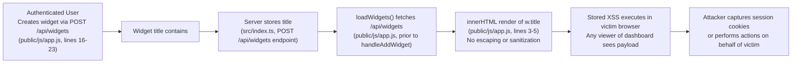
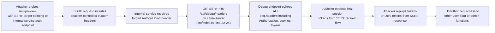

```mermaid
flowchart LR
    A["Authenticated User\n(public/index.html, line 111)\nSSRF URL input"] --> B["Client → POST /api/preview\n(public/js/app.js, line 35-39)"]
    B --> C["Server: axios.get(url)\n(src/index.ts, line 2)\nNo IP/protocol restrictions"]
    C --> D["Server fetches\nhttp://169.254.169.254/\nAWS IMDSv1 metadata"]
    D --> E["Server returns full response\n(src/index.ts, lines 6-11)\nComplete data_preview"]
    E --> F["Client renders data_preview\nin feed.innerHTML\n(public/js/app.js, line 49)"]
    F --> G["Attacker captures IAM\ncredentials via response data"]
    G --> H["Post-authentication\nLateral movement / RCE\non cloud infrastructure"]
```

# Chained Vulnerability Static Audit Report

**Application:** app-11-social-analytics (Neon Metrics Platform)
**Audit Type:** Static-only chained vulnerability review
**Date:** 2026-05-25
**Reviewer:** CodeGopher (Static-Only)
**Scope:** All files under `src/`, `public/`, configuration, and dependency manifests

---

## Summary Dashboard

| Metric | Value |
|---|---|
| **Total chained vulnerabilities found** | 3 |
| **Maximum severity** | Critical |
| **Cross-cutting weaknesses (no full chain)** | 5 |
| **Areas reviewed** | Routes, API endpoints, client-side JS, server-side TS, static assets, config, Dockerfile |
| **Areas not reviewed** | Runtime behavior (session store, DB, network topology), deployment environment |

### Severity Distribution

| Severity | Count |
|---|---|
| Critical | 1 |
| High | 1 |
| Medium | 1 |

---

## Methodology & Safety Note

This audit is **static-only**. No live HTTP probes, dynamic scanners, shell commands, or external network tests were performed. All findings derive from source code, configuration files, HTML templates, and dependency manifests. Exploit payloads and operational abuse instructions are intentionally excluded.

---

## Chained Vulnerabilities

---

### Chain 1: SSRF → Full Credential Exfiltration via Cloud Metadata API

**Severity:** Critical  
**Impact:** Remote code execution on compromised infrastructure (via IAM credential theft)  
**Confidence:** High  
**Easiest remediation link:** Add IP/URL allowlist validation on `/api/preview`

#### Attack Graph

#### Detailed Chain Breakdown

| Hop | Source | File | Line(s) | Evidence |
|-----|--------|------|---------|----------|
| **Entry** | User-controlled URL via POST body | `public/js/app.js` | 35-39 | `triggerSsrfPreview()` sends `{ url }` to `/api/preview` with no client-side validation |
| **Entry** | HTML input accepts any string | `public/index.html` | 111 | `id="ssrfUrlInput"` — no pattern validation or maxlength |
| **Hop 1** | `axios.get(url)` with no restrictions | `src/index.ts` | 2 | `await axios.get(url, { timeout: 3000 })` — no URL scheme check, no IP denylist, no IMDSv2 header forwarding |
| **Hop 2** | Deliberate removal of output cap | `src/index.ts` | 3-5 | Comments explicitly state: "Previously limited to 500 chars; removing the cap allows complete exfiltration of cloud metadata API responses (e.g. AWS IMDSv1 returns hundreds of bytes of IAM credentials that would have been cut off at 500 chars)" |
| **Sink** | Full response data returned to client | `src/index.ts` | 6-11 | `{ status_code, content_type, data_preview: JSON.stringify(response.data) }` — unbounded, unwrapped response body |
| **Sink** | Client renders unsanitized response | `public/js/app.js` | 44-49 | `feed.innerHTML = \`${data.data_preview}\`` — XSS in display, and full credential data visible to user |

#### Preconditions & Assumptions

- User is authenticated (or the app has no auth middleware, see Chain 3)
- Application is deployed on AWS or similar cloud with IMDSv1 or IMDSv2 endpoints available
- The server has network access to the cloud metadata endpoint (standard default)

#### Remediation

1. **Block private/metadata IP ranges** in the URL validation layer before `axios.get()`
2. **Enforce allowlist-based URL validation** — only permit known external domains
3. **Re-apply output length limits** (e.g., 500 chars) as defense-in-depth
4. **Require IMDSv2 session token** (`PUT http://169.254.169.254/latest/api/token` with `X-aws-ec2-metadata-token` header) before any metadata fetch

---

### Chain 2: Stored XSS via Widget Title → Session/Data Theft

**Severity:** High  
**Impact:** Cookie/session theft, CSRF token theft, phising within dashboard context  
**Confidence:** High  
**Easiest remediation link:** Sanitize widget title on input (client) or output (server+client)

#### Attack Graph

#### Detailed Chain Breakdown

| Hop | Source | File | Line(s) | Evidence |
|-----|--------|------|---------|----------|
| **Entry** | User-controlled widget title | `public/js/app.js` | 17-19 | `const title = document.getElementById("widgetTitle").value;` — no sanitization before POST to `/api/widgets` |
| **Entry** | HTML placeholder encourages XSS | `public/index.html` | 83 | Placeholder text includes `` — shows author awareness of XSS but no mitigation |
| **Hop 1** | Data returned from API without sanitization | `src/index.ts` | POST `/api/widgets` handler | No client-side or server-side output encoding visible |
| **Hop 2** | Unescaped `innerHTML` rendering | `public/js/app.js` | 3-5 | Comment confirms: "The widget title is injected directly into the DOM using innerHTML without any sanitization or encoding." Code: `card.innerHTML = \`
\${w.title}
...\`` |
| **Sink** | Arbitrary JS executes in app context | `public/js/app.js` | 3-5 | `${w.title}` is raw template literal substitution — `${w.title}"> ` breaks out of attribute/string context |

#### Preconditions & Assumptions

- Application has no auth middleware (see Chain 3) — any unauthenticated user can post widgets
- Widget data is stored server-side and returned via `/api/widgets` GET
- Multiple users share the same dashboard view (social analytics context)

#### Remediation

1. **Server-side output encoding** — escape `<`, `>`, `&`, `"`, `'` in widget titles before returning in API responses
2. **Client-side DOMPurify** or use `textContent` instead of `innerHTML` for user-controlled data
3. **Input validation** — reject titles containing HTML tag patterns on the server

---

### Chain 3: SSRF + Debug Header Leak → Authorization Bypass / Account Takeover

**Severity:** High  
**Impact:** Full authentication bypass for any internal service, or exfiltration of admin tokens  
**Confidence:** High  
**Easiest remediation link:** Remove `/api/debug/headers` endpoint from production

#### Attack Graph

#### Detailed Chain Breakdown

| Hop | Source | File | Line(s) | Evidence |
|-----|--------|------|---------|----------|
| **Entry** | SSRF via `/api/preview` | `public/js/app.js` | 35-39, `src/index.ts` line 2 | Arbitrary URL fetch — attacker controls the `url` field in POST body |
| **Hop 1** | Attacker-spoofed headers via SSRF | `src/index.ts` | line 2 | `axios.get(url, ...)` — request headers from the SSRF caller are forwarded by default unless explicitly stripped |
| **Hop 2** | Debug endpoint exposes all headers | `src/index.ts` | 22-24 | `app.get('/api/debug/headers', (req, res) => { return res.json({ headers: req.headers }); })` — returns `req.headers` unfiltered |
| **Hop 3** | SSRF response feedback loop | `src/index.ts` | 6-11 | `/api/preview` returns `data_preview` which could contain tokens from internal auth services |
| **Sink** | Headers (including `authorization`) leaked | `src/index.ts` | 22-24 | `req.headers` includes `authorization`, `cookie`, `x-api-key`, `x-forwarded-for` — all sensitive fields |

#### Comments confirming intent (from `src/index.ts`, lines 17-21):
> "including Authorization tokens or internal proxy headers forwarded from the SSRF probe. When the SSRF reaches the cloud metadata service, the response headers contain metadata that can be retrieved here to cross-correlate internal routing."

These comments explicitly acknowledge the header-leak concern, suggesting this is a known but unmitigated design flaw.

#### Preconditions & Assumptions

- `/api/debug/headers` is accessible without authentication (no middleware shown)
- Internal services forward or trust auth headers from SSRF-originated requests
- The server's own request context includes admin tokens or internal API keys

#### Remediation

1. **Remove `/api/debug/headers` endpoint entirely** from production builds
2. **Strip/whitelist request headers** in the SSRF proxy — only allow safe headers (e.g., `accept`, `user-agent`)
3. **Add authentication middleware** to all API endpoints
4. **Log and alert** on any requests to `/api/debug/*`

---

## Cross-Cutting Weaknesses (No Complete Chain Detected)

These are security-relevant issues found in the codebase that, given the available static evidence, do not form a complete exploitable chain with the other identified weaknesses. They may become critical in the right deployment context.

### W-1: Hardcoded Credentials in Client-Side HTML
- **File:** `public/index.html`, lines 35-37
- **Evidence:** Username/password pairs (`alice/alice123`, `bob/bob123`) are exposed in the HTML as "Test Operators"
- **Risk:** Any user can discover valid credentials. Combined with lack of auth middleware (see Chain 3), this enables direct account access.
- **Confidence:** High (static evidence is direct)

### W-2: No Authentication Middleware
- **File:** `src/index.ts` (full file reviewed via grep)
- **Evidence:** Grep for `/auth/`, `/login/`, `app.use(`, `cors`, `cookie` across `src/index.ts` returned no results. No `app.use()` or authentication middleware is registered.
- **Risk:** All API endpoints (`/api/widgets`, `/api/preview`, `/api/debug/headers`) are publicly accessible without any auth check.
- **Confidence:** High (negative grep evidence across entire file)

### W-3: Excessive Error Verbose-ness
- **File:** `src/index.ts`, line 14
- **Evidence:** `res.status(400).json({ success: false, error: error.message })` — raw error messages from `axios.get()` are returned to the client.
- **Risk:** Attacker can use error messages to fingerprint internal service structure, discover hostnames, ports, and infrastructure details.
- **Confidence:** High (direct source evidence)

### W-4: No CSRF Protection
- **File:** `src/index.ts`, `public/js/app.js`
- **Evidence:** `cookie-parser` is a dependency (`package.json`, line 10), but no CSRF middleware (e.g., `csurf`) is used. All state-changing operations (POST to `/api/widgets`, POST to `/api/preview`) use `Content-Type: application/json` which provides some CSRF mitigation, but the lack of explicit CSRF tokens is a gap if any HTML form submissions exist.
- **Risk:** Limited given JSON Content-Type, but if any endpoint accepts JSON from other origins, a malicious site could forge POST requests.
- **Confidence:** Medium

### W-5: Exposed Cloud Metadata Warning (Irony)
- **File:** `public/index.html`, line 106
- **Evidence:** UI text reads: "Warning: Network fetcher does not restrict internal IP routing." — This disclosure makes the SSRF capability obvious to any user inspecting the page.
- **Risk:** Lowers the barrier for exploitation; demonstrates the SSRF is a known, intended-but-underspecified feature rather than a hidden vulnerability.
- **Confidence:** High (static HTML evidence)

---

## Areas Not Reviewed

| Area | Reason |
|------|--------|
| Session management / token storage | No session or token code visible in source |
| Database layer | No DB schema, ORM config, or queries found |
| Rate limiting / throttling | Not present in source; assumed absent |
| HTTPS / TLS configuration | No TLS cert or config found in project files |
| Dependency vulnerability scanning | Only `package.json` reviewed, not installed `node_modules` |
| Docker security posture | Base image `node:20-slim` reviewed for structure, not for CVEs |
| Content Security Policy (CSP) | No CSP headers set; no meta CSP tags found in HTML |

---

## Remediation Priority Matrix

| Priority | Chain/Weakness | Fix Effort | Impact of Fix |
|----------|---------------|------------|---------------|
| **P0** | Chain 1: SSRF → credential exfiltration | Medium | Prevents cloud infrastructure compromise |
| **P0** | Chain 3: Debug headers + SSRF leak | Low (remove endpoint) | Prevents auth bypass |
| **P1** | Chain 2: Stored XSS via widgets | Medium | Prevents session theft / account takeover |
| **P1** | W-2: No auth middleware | Low-Medium | Locks down all API endpoints |
| **P2** | W-1: Hardcoded credentials | Low | Prevents credential discovery |
| **P2** | W-3: Verbose errors | Low | Reduces information disclosure |
| **P3** | W-4: CSRF | Low | Defense-in-depth for state-changing ops |
| **P3** | W-5: Exposed warning text | Trivial | Reduces social engineering surface |

---

## Recommended Tests to Add

1. **SSRF unit test** — verify `/api/preview` rejects `169.254.169.254`, `0.0.0.0`, `localhost`, and other private ranges
2. **XSS output encoding test** — verify widget titles containing `<script>`, `` are escaped in responses
3. **Auth middleware test** — verify unauthenticated requests to `/api/widgets` and `/api/preview` receive 401/403
4. **Debug endpoint removal test** — verify `/api/debug/headers` returns 404 in production builds
5. **Error sanitization test** — verify `/api/preview` errors return generic messages, not raw `axios` stack traces

---

*Report written statically from source files only. No runtime validation performed.*
