```mermaid
flowchart LR
    A[Authenticated User] -->|GET /api/wallet?userId=2| B[WalletController.getWallet]
    B -->|No ownership check| C[WalletService.getWallet]
    C -->|Returns full wallet object including privateKey| D[Wallet Object with Private Key]
    D -->|Exfiltrated to Attacker| E[Attacker has Victim's Private Key]
    E -->|Uses key to sign transactions| F[Complete Control Over Victim's Wallet]
    
    style A fill:#444
    style F fill:#c00,color:#fff
    style B fill:#f90
    style D fill:#f90
```

# Chained Vulnerability Audit Report

**Project**: Crypto Wallet Service (App 12)  
**Audit Type**: Static-Only Chained Vulnerability Review  
**Date**: 2026-05-25  
**Auditor**: CodeGopher Static Audit Engine  

---

## 1. Summary Dashboard

| Metric | Value |
|---|---|
| **Total Chains Identified** | 3 |
| **Maximum Severity** | **CRITICAL** |
| **Reviewed Areas** | Authentication, Authorization, Wallet Operations, Data Storage, Frontend, Configuration, Build/Docker |
| **Static-Only Boundary** | No live probes, dynamic scans, or shell commands used |

### Chain Severity Overview

| Chain | Description | Severity | Confidence |
|---|---|---|---|
| Chain 1 | IDOR via Wallet Endpoint → Private Key Theft → Complete Wallet Control | **CRITICAL** | High |
| Chain 2 | Hardcoded Plaintext Credentials + Predictable Session → Universal Account Takeover | **CRITICAL** | High |
| Chain 3 | Missing Ownership Verification on External Transfer → Unauthorized Fund Transfer | **HIGH** | High |

---

## 2. Methodology & Safety Note

This audit follows a four-phase approach:

1. **Attack surface mapping**: Identified all public API routes (`/api/auth/*`, `/api/wallet/*`), static file serves, cookie-based authentication, and frontend JavaScript entry points.
2. **Weakness inventory**: Cataloged low/medium weaknesses including hardcoded plaintext credentials, missing CSRF tokens, predictable session IDs, permissive cookie settings, plaintext password comparison, and missing ownership verification.
3. **Attack graph synthesis**: Connected user-controlled inputs to authorization gaps, then to sensitive data sinks and state-modifying operations.
4. **Impact assessment**: Rated each chain by impact, reachability, confidence, and the easiest remediation link to break.

**Safety Note**: This review is strictly static. No HTTP probes, credential attacks, dynamic scanners, exploit scripts, or live network tests were performed. All findings are derived solely from source code, configuration files, and frontend assets.

---

## 3. Chain 1 — IDOR → Private Key Theft → Complete Wallet Control

### Mermaid Attack Graph



### Detailed Chain Breakdown

| Link | File | Lines | Symbol / Reference | Evidence |
|---|---|---|---|---|
| **Entry Point** | `src/wallet/wallet.controller.ts` | 9–14 | `getWallet()` | Accepts `@Query('userId')` parameter. Comment in code acknowledges: *"Any authenticated wallet holder can view any other user's wallet by supplying their userId, including their private key."* |
| **Hop 1** | `src/wallet/wallet.controller.ts` | 11–12 | `targetUserId = userId ? parseInt(userId, 10) : user.id` | No authorization check compares `targetUserId` against the authenticated `user.id`. Any authenticated user can supply any integer `userId`. |
| **Hop 2** | `src/wallet/wallet.service.ts` | 7–13 | `getWallet(userId)` | Returns the full wallet object from `db.wallets` — including the `privateKey` field. |
| **Sink** | `src/db.ts` | 13–17 | `privateKey: '0x1234abcd...'` | Private keys stored in plaintext in the in-memory database. |
| **Client-Side Exposure** | `public/js/app.js` | ~68 | `document.getElementById("walletPrivateKey").innerText = wallet.privateKey;` | Dashboard displays the private key in plaintext on the UI. |

### Preconditions & Assumptions
- Attacker possesses valid credentials for any user account (authenticates to obtain a session cookie).
- The `GET /api/wallet` endpoint is the only chained path — no rate limiting or IP restrictions.

### Impact
An authenticated attacker can read **any other user's** wallet address, balance, transaction history, and **private key**. Possession of the private key grants complete control over the victim's crypto wallet — all funds become transferable by the attacker.

### Severity: **CRITICAL**  
### Confidence: **High** — Every link is provable from cited source code. The developer comment itself admits the flaw.

### Remediation
**Easiest break point**: Add authorization check in `getWallet()`:
```typescript
// wallet.controller.ts line 11
if (userId && parseInt(userId, 10) !== user.id) {
  throw new UnauthorizedException('Access denied');
}
```
Additionally, **never expose private keys** via API responses or UI. Remove `privateKey` from wallet DTOs entirely.

---

## 4. Chain 2 — Hardcoded Plaintext Credentials + Predictable Session → Universal Account Takeover

### Mermaid Attack Graph


### Detailed Chain Breakdown

| Link | File | Lines | Symbol / Reference | Evidence |
|---|---|---|---|---|
| **Entry Point** | `src/db.ts` | 3–5 | `users` array | Hardcoded plaintext passwords: `password: 'alice123'`, `password: 'bob123'`. Credentials are visible to anyone with source code access. |
| **Hop 1** | `src/auth/auth.module.ts` | 12–13 | `db.users.find(u => u.username === username && u.password === password)` | **Plaintext password comparison** — no hashing (bcrypt, argon2, etc.). Direct string equality check against in-memory data. |
| **Hop 2** | `src/auth/auth.module.ts` | 14 | `res.cookie('session_id', user.id.toString(), { httpOnly: true, sameSite: 'lax' })` | Session token is simply the user's numeric ID — trivially predictable. No random session generation. |
| **Sink** | `src/wallet/wallet.controller.ts` | 6–34 | All wallet endpoints | Protected only by `AuthGuard` which accepts any valid session. Authenticated user gains full wallet access. |

### Additional Weaknesses in This Chain
- **No CSRF protection** on login/logout endpoints. No CSRF tokens in HTML form. Cookie has `sameSite: 'lax'` but not `secure`.
- **No rate limiting** on `POST /api/auth/login` — enables offline brute-force or credential stuffing.
- **No password hashing** — even if source were exfiltrated, all credentials are immediately usable.

### Preconditions & Assumptions
- Attacker can read source code (or reverse-engineer the binary). For any deployed application, this is realistic given source leaks, npm package bloat, or misconfigured git repositories.

### Impact
Universal account takeover. Any user's account can be accessed by reading the source code. The attacker gains full read/write access to wallet data, transaction history, and can initiate transfers.

### Severity: **CRITICAL**  
### Confidence: **High** — Source code provides direct evidence of plaintext credentials and direct password comparison.

### Remediation
1. **Hash passwords** with bcrypt/argon2 before storage and comparison.
2. **Generate cryptographically random session IDs** — not predictable user IDs.
3. **Set `secure` and `sameSite: 'strict'`** on session cookies.
4. **Add rate limiting** on authentication endpoints.
5. **Remove hardcoded credentials** from source; use environment variables and a real database.

---

## 5. Chain 3 — Missing Ownership Verification on External Transfer → Unauthorized Fund Transfer

### Mermaid Attack Graph

```mermaid
flowchart LR
    A[Authenticated User / Attacker] -->|POST /api/wallet/external-transfer<br/>{fromAddress: '0x99B...1F4C', toAddress: '0xATTACKER', amount: 100}| B[WalletController.externalTransfer]
    B -->|No ownership proof checked| C[WalletService.executeTransferByAddress]
    C -->|Finds senderWallet by fromAddress| D[Sender's wallet found]
    D -->|Subtracts from sender balance| E[Funds debited from victim's wallet]
    E -->|Can chain to regular transfer| F[Attacker moves funds to their own wallet]
    
    style A fill:#444
    style F fill:#c00,color:#fff
    style B fill:#f90
    style C fill:#f90
```

### Detailed Chain Breakdown

| Link | File | Lines | Symbol / Reference | Evidence |
|---|---|---|---|---|
| **Entry Point** | `src/wallet/wallet.controller.ts` | 27–34 | `externalTransfer()` | Endpoint accepts `fromAddress` from request body. Comment explicitly states: *"without verifying the authenticated user owns that address."* |
| **Hop 1** | `src/wallet/wallet.controller.ts` | 33 | `this.walletService.executeTransferByAddress(body.fromAddress, ...)` | Passes user-supplied `fromAddress` directly to service. No proof of ownership (no signature, no key verification, no session-to-address binding). |
| **Hop 2** | `src/wallet/wallet.service.ts` | 38–58 (orphaned body) | `executeTransferByAddress()` | Function body exists but lacks declaration (apparent code error). When present, it performs balance check and transfer based solely on address lookup — no user authorization check. |
| **Sink** | `src/wallet/wallet.service.ts` | 48–52 | Balance modification | `senderWallet.balance -= amount; recipientWallet.balance += amount;` — cold transfer of funds without proof of address ownership. |

### Preconditions & Assumptions
- Attacker is authenticated to any account and can observe wallet addresses from API responses or the `/api/wallet` endpoint.
- Attacker knows a victim's wallet address (e.g., `0x99B...1F4C`).
- Attacker does **not** need the victim's private key to drain the wallet.

### Impact
An attacker can drain any wallet whose address is known, **without the private key**. Combined with Chain 1 (which exposes private keys via the IDOR vulnerability), this creates a redundant but devastating path for wallet takeover.

### Severity: **HIGH**  
### Confidence: **High** — Source code admits the missing verification. The function exists and the transfer logic is clearly identifiable.

### Remediation
- **Remove** the `external-transfer` endpoint entirely if it has no legitimate use case.
- If cross-wallet transfers are needed, **require a cryptographic signature** from the `fromAddress` owner.
- **Bind transfers to the authenticated user's wallet** — disallow `fromAddress` as a user-supplied parameter.
- Use the existing `transferFunds` endpoint, which correctly uses `userId` as the source.

---

## 6. Cross-Cutting Weaknesses (Not Full Chains)

These security-relevant issues do not form complete chains on their own but contribute to overall risk:

| Weakness | File | Lines | Details |
|---|---|---|---|
| **Plaintext Private Keys in Database** | `src/db.ts` | 13, 17 | Wallet private keys stored in cleartext alongside balances. |
| **Private Key Rendered in Browser** | `public/js/app.js` | ~68 | Private key displayed as plaintext on dashboard UI. |
| **Predictable Session Tokens** | `src/auth/auth.module.ts` | 14 | `session_id` = user ID (1, 2, …). No entropy. |
| **No CSRF Tokens** | `src/auth/auth.module.ts` | 14 | `sameSite: 'lax'` offers partial CSRF protection but no token-based defense. |
| **No `secure` Flag on Cookie** | `src/auth/auth.module.ts` | 14 | Cookie transmitted over unencrypted HTTP if server not configured for TLS. |
| **No Rate Limiting** | All controllers | — | No throttling on login, transfers, or wallet queries. |
| **Missing Input Validation on Amount** | `src/wallet/wallet.service.ts` | 20, 38 | Amount must be > 0 but no upper bound. No decimal precision check. |
| **Code Syntax Error (Missing Function Declaration)** | `src/wallet/wallet.service.ts` | 37–58 | `executeTransferByAddress()` body is orphaned — missing `executeTransferByAddress(...) {` declaration. Will cause runtime error in production. |
| **No HTTPS/TLS in Configuration** | `Dockerfile`, `src/main.ts` | — | App listens on port 8012 without any SSL/TLS configuration. |
| **Environment Variables Not Used** | `package.json`, `src/db.ts` | — | No `.env` file; all data hardcoded. |

---

## 7. Unknowns and Areas Not Fully Reviewed

| Area | Reason |
|---|---|
| **Runtime security configuration** | No `app.enableCors()` calls found, but CORS behavior depends on runtime config not visible in source. |
| **True database backend** | This is an in-memory mock DB (`src/db.ts`). Real deployment may use a real database where SQL injection risk would need separate analysis. |
| **Dependencies** | `package.json` lists NestJS and cookie-parser. No known critical vulnerabilities identified in listed versions, but a `npm audit` would confirm. |
| **Deployment environment** | Dockerfile exposes the container without health checks, resource limits, or non-root user enforcement. |
| **Logging/monitoring** | No audit logging for login attempts, transfers, or wallet queries. |
| **Key management practices** | No KMS, HSM, or key rotation mechanisms present. |
| **Frontend security headers** | No CSP, X-Frame-Options, or other security headers configured in the NestJS app. |

---

## 8. Test Recommendations

The following test scenarios should be added to verify remediation:

1. **IDOR test**: Verify `GET /api/wallet?userId=2` returns 403 when authenticated as user 1.
2. **Credential hashing test**: Verify login fails when comparing hashed vs. stored passwords.
3. **Session unpredictability test**: Verify session IDs are cryptographically random (UUIDv4 or equivalent).
4. **External transfer ownership test**: Verify `POST /api/wallet/external-transfer` rejects transfers from addresses not owned by the authenticated user.
5. **Private key exposure test**: Verify wallet API responses never include private keys.
6. **CSRF test**: Verify login and transfer endpoints reject requests without valid CSRF tokens (when using session-cookie-based CSRF).
7. **Rate limiting test**: Verify repeated login attempts are throttled (e.g., max 5 per minute per IP).
8. **HTTPS test**: Verify the server rejects plain HTTP or enforces TLS.

---

## 9. Prioritized Remediation Roadmap

| Priority | Action | Affected Chains |
|---|---|---|
| **P0** | Remove private key from wallet API response and UI | Chain 1 |
| **P0** | Add ownership authorization check in `getWallet()` | Chain 1 |
| **P1** | Hash passwords with bcrypt; remove hardcoded credentials | Chain 2 |
| **P1** | Generate random session tokens; add `secure` + `sameSite: 'strict'` | Chain 2 |
| **P2** | Remove or secure `external-transfer` endpoint | Chain 3 |
| **P2** | Add CSRF tokens to all state-changing endpoints | Cross-cutting |
| **P2** | Add rate limiting on authentication endpoints | Chain 2 |
| **P3** | Enforce HTTPS/TLS | Cross-cutting |
| **P3** | Add audit logging for security events | Cross-cutting |

---

## 10. Conclusion

**Three high-impact chained vulnerabilities** were identified in this Crypto Wallet Service codebase. Two chains are rated **CRITICAL** — both arise from fundamental design flaws in authentication and authorization. The third chain, rated **HIGH**, creates an unauthorized fund transfer path that is independent of cryptographic key possession.

The most impactful single remediation is **removing private keys from all API responses and enforcing ownership checks** on every wallet endpoint. This would break both Chain 1 and most of Chain 3's impact.

This is a **proof-of-concept** demo application and exhibits common beginner-level security anti-patterns. For production use, a complete security rearchitecture addressing authentication, authorization, key management, input validation, and operational security is required.
