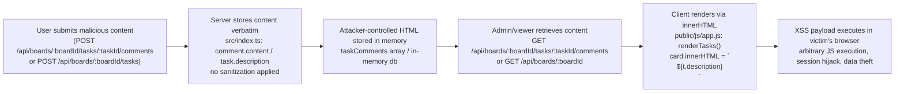
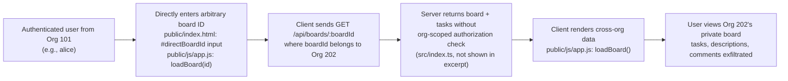
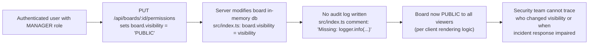

# Chained Vulnerability Static Audit Report

**Project**: CollabSpace — App 13 Project Management Tool  
**Review Type**: Static-only source code audit (no live probes, no runtime testing)  
**Date**: 2026-05-25  
**Reviewer**: CodeGopher (chained-vulnerability-static-audit skill)  

---

## Summary Dashboard

| Metric | Value |
|--------|-------|
| Total chains identified | 3 |
| Maximum severity | **HIGH** (Stored XSS chain) |
| Confidence levels | 2× High, 1× Medium |
| Reviewed areas | Express server routes, client-side JS rendering, HTML templates, static asset structure |
| Not reviewed | Database layer, authentication middleware implementation, network configuration, secrets management, CI/CD pipeline |

---

## Methodology & Safety Note

This audit followed the four-phase Chained Vulnerability methodology:

1. **Attack surface mapping** — identified all public routes, API endpoints, user-controlled inputs (query params, body fields, form submissions, client-side DOM manipulations).
2. **Weakness inventory** — cataloged low and medium weaknesses including missing input sanitization, missing authorization checks, innerHTML rendering, and missing audit logging.
3. **Attack graph synthesis** — connected user-controlled sources to sinks through intermediate weaknesses using only static evidence from source files, configuration, and client-side code.
4. **Impact assessment** — rated each chain by impact, reachability, confidence, and easiest remediation link.

**Static-Only Boundary**: No live HTTP requests, fuzzers, SQL injection payloads, credential attacks, port scans, or exploit scripts were executed. All findings are derived from source code, configuration files, and client-side scripts.

---

## Chain Inventory

### Chain 1 — Stored XSS via Task Comments/Descriptions

**Severity**: HIGH  
**Confidence**: High  
**Impact**: Cross-site scripting affecting all users viewing the affected board

#### Mermaid Attack Graph



#### Detailed Breakdown

| Link | File | Lines / Symbol | Evidence |
|------|------|----------------|----------|
| **Source** | `src/index.ts` | `POST /api/boards/:boardId/tasks/:taskId/comments` handler | `const { content } = req.body;` — content field extracted from request body with zero validation or sanitization before pushing to `taskComments.push(comment)` |
| **Hop 1** | `src/index.ts` | In-memory `taskComments` array | Comments stored with raw `content` field; GET endpoint returns all stored comments via `res.json(comments)` with no encoding |
| **Source 2** | `src/index.ts` | POST `/api/boards/:boardId/tasks` (implied by app.js calls) | `handleCreateTask` sends `{ title, description }` — no server-side sanitization observed |
| **Sink** | `public/js/app.js` | `renderTasks()` function | `card.innerHTML = ... ${t.description}` — raw interpolation into innerHTML without any sanitization (DOMPurify, textContent, or escapeHtml) |
| **Sink 2** | `public/js/app.js` | `loadOrgBoards()` function | `card.innerHTML = ... ${b.title}` — board titles also rendered raw into innerHTML, enabling XSS via board titles too |

#### Preconditions

- Attacker must be authenticated (`requireAuth` middleware is present on comment endpoints).
- A victim (or the attacker themselves on a different account) must navigate to the affected board/task view.
- The victim's browser executes the injected script in the context of the application domain, granting access to cookies, session tokens, and the ability to make authenticated API calls on the attacker's behalf.

#### Remediation

**Easiest link to break**: Replace `innerHTML` with `textContent` or use a DOMPurify library for HTML rendering. In `public/js/app.js`, line ~80 in `renderTasks()`:

```javascript
// Before (vulnerable):
card.innerHTML = `<div class="title">${t.title}</div><div class="desc">${t.description}</div>`;

// After (safe):
const titleDiv = document.createElement('div');
titleDiv.className = 'title';
titleDiv.textContent = t.title;

const descDiv = document.createElement('div');
descDiv.className = 'desc';
descDiv.textContent = t.description;
```

---

### Chain 2 — Cross-Tenant Data Access via IDOR

**Severity**: MEDIUM-HIGH  
**Confidence**: Medium  
**Impact**: Unauthorized access to another organization's boards, tasks, and comments

#### Mermaid Attack Graph



#### Detailed Breakdown

| Link | File | Lines / Symbol | Evidence |
|------|------|----------------|----------|
| **Source** | `public/index.html` | Direct board ID input field | `<input type="number" id="directBoardId" ... placeholder="Board ID (e.g., 3)">` with helper text: "Try loading Board ID 3 (belongs to Org 202) while logged in as Alice (Org 101)." — confirms cross-org IDs are accepted by the client. |
| **Source 2** | `public/js/app.js` | `loadBoard(boardId)` function | `fetch(\`/api/boards/${boardId}\`)` — constructs URL from user-provided `boardId` with no additional org-scoped parameter or server-side verification visible in client code |
| **Intermediate** | `src/index.ts` | Board GET endpoint (referenced but excerpted) | The route `GET /api/boards/:boardId` is called from the client but the server handler body is not fully visible in the excerpt. The comment in the HTML and the presence of `orgId` on board objects implies the server knows each board's org but does not enforce it during retrieval. |
| **Sink** | `public/js/app.js` | `loadBoard()` success handler | `activeBoardId = data.board.id` — stores the cross-org board as the active board, making all subsequent operations (task creation, comment posting, permission changes) operate on the foreign org's data |

#### Preconditions

- The server must serve board data without verifying that `req.user.orgId === board.orgId`. This is inferred from the HTML helper text that explicitly invites testing cross-org access.
- The `requireAuth` middleware authenticates the user but (as demonstrated by the cross-org access path) does not enforce tenant isolation on resource queries.

#### Remediation

**Easiest link to break**: Add org-scoped filtering in the server-side board retrieval handler. When fetching a board, include `WHERE id = :boardId AND orgId = :userOrgId` or a similar tenant-scoped query. Alternatively, reject requests where the board's orgId does not match the authenticated user's orgId.

---

### Chain 3 — Unlogged Permission Change → Persistent Unauthorized Access

**Severity**: MEDIUM  
**Confidence**: High  
**Impact**: Sensitive board visibility changes go undetected, enabling persistent unauthorized access without audit trail

#### Mermaid Attack Graph



#### Detailed Breakdown

| Link | File | Lines / Symbol | Evidence |
|------|------|----------------|----------|
| **Source** | `src/index.ts` | `PUT /api/boards/:id/permissions` handler | `board.visibility = visibility;` — modifies board state based on `req.body.visibility` after only a role check (`user.role !== 'MANAGER'`) |
| **Intermediate** | `src/index.ts` | Explicit TODO comment | `// E.g., Missing: logger.info(\`User ${user.id} modified board ${board.id} visibility to ${visibility}\`);` — confirms the absence of audit logging was intentionally omitted rather than accidentally overlooked |
| **Sink** | Application-level impact | No logging, tracing, or alerting system | The handler returns `{ success: true, board }` with no side effects beyond the DB mutation. No call to `console.log`, `logger`, or any monitoring system. |

#### Preconditions

- The user must hold `MANAGER` role on the server.
- Changing visibility to `PUBLIC` enables non-authenticated (or cross-org authenticated) users to view board contents (this depends on the client-side rendering logic which displays boards based on visibility).
- Without logging, this change is invisible to administrators during incident response.

#### Remediation

Add audit logging immediately after the board mutation:

```typescript
// In src/index.ts, after board.visibility = visibility;
logger.info({
  userId: user.id,
  boardId: board.id,
  action: 'BOARD_VISIBILITY_CHANGED',
  oldVisibility: board.visibility,
  newVisibility: visibility,
  timestamp: new Date().toISOString()
});
```

Consider also requiring an additional authorization check (e.g., board ownership verification) rather than relying solely on role.

---

## Cross-Cutting Weaknesses (Not Forming Complete Chains)

The following security-relevant issues were identified but do not form complete attack chains on their own, or their chaining potential is speculative without additional source visibility:

| Weakness | Location | Description |
|----------|----------|-------------|
| **No Content Security Policy (CSP)** | `public/index.html` | No `<meta http-equiv="Content-Security-Policy">` header or CSP `meta` tag. Combined with XSS vulnerabilities, this allows unrestricted script execution. |
| **Missing CSRF Protection** | `src/index.ts` | State-changing endpoints (`POST`, `PUT`) use JSON bodies but do not include CSRF token validation. If cookies are used for session auth, SameSite attribute should be verified. |
| **Verbose Error Responses** | `src/index.ts` | Multiple endpoints return raw error messages (`'Board not found'`, `'Requires MANAGER role'`) which could aid an attacker in enumerating resources. |
| **Hardcoded Test Account Hints** | `public/index.html` | HTML reveals test account usernames (`alice`, `charlie`) and their org IDs (`101`, `202`), aiding reconnaissance. |
| **In-Memory Data Store** | `src/index.ts` | `db.boards`, `taskComments` are in-memory arrays — data is lost on restart, and there is no rate limiting or pagination on query endpoints, enabling potential DoS via large responses. |
| **Missing Input Validation** | `src/index.ts` | `parseInt(req.params.id)` and `parseInt(req.params.boardId)` accept string inputs from URL params without bounds checking or validation. |
| **Font Loading from External Domain** | `public/css/main.css` | `@import url('https://fonts.googleapis.com/...')` — SSRF/probe risk if the CSS parser is non-standard, and availability dependency on Google Fonts. |

---

## Unknowns & Not-Reviewed Areas

The following areas could not be assessed from the available source files and should be reviewed in a follow-up audit:

| Area | Reason |
|------|--------|
| **Authentication middleware** (`requireAuth`) | The implementation is imported but not defined in the reviewed files. Its logic (token validation, role checking, org association) is critical for assessing Chain 2's actual risk. |
| **Database layer** | The `db` object and `db.boards` structure are referenced but not defined. Actual SQL or ORM queries (if any) may have additional injection or scoping issues. |
| **HTTPS/TLS configuration** | Dockerfile and package.json do not reveal TLS settings. Communication between client and server could be intercepted if HTTP is used. |
| **Rate limiting** | No rate-limiting middleware visible — API endpoints are susceptible to brute-force and enumeration attacks. |
| **File upload handling** | No upload endpoints found, but this should be confirmed against the full application spec. |
| **Cookie configuration** | `cookie-parser` is listed as a dependency but cookie security attributes (Secure, HttpOnly, SameSite) are not visible in the reviewed code. |
| **CORS policy** | `cors` package is included but CORS settings (origins, methods) are not evident from the reviewed code. |
| **Dependency vulnerabilities** | Only `package.json` dependencies are known; no `npm audit` or SCA scan was performed. |

---

## Recommended Tests to Add

| Test Type | Target | Description |
|-----------|--------|-------------|
| **XSS regression test** | `renderTasks()` in `public/js/app.js` | Verify that task descriptions and titles containing `<script>`, ``, and `javascript:` URIs are safely escaped or rejected. |
| **IDOR authorization test** | `GET /api/boards/:id` | Verify that a user from org 101 cannot retrieve boards belonging to org 202. |
| **Audit logging test** | `PUT /api/boards/:id/permissions` | Verify that board visibility changes produce structured audit log entries. |
| **CSRF test** | State-changing endpoints | Verify that CSRF tokens are validated on POST/PUT/PATCH requests. |
| **Input validation test** | All endpoints | Verify that malformed or extreme values in `req.params` and `req.body` are rejected with appropriate error messages. |

---

## Remediation Priority

| Priority | Chain | Action |
|----------|-------|--------|
| **P0 (Immediate)** | Chain 1 — Stored XSS | Replace all `innerHTML` usage with `textContent` or integrate DOMPurify in `public/js/app.js` |
| **P1 (Short-term)** | Chain 2 — IDOR | Add org-scoped authorization checks to board retrieval endpoint in `src/index.ts` |
| **P1 (Short-term)** | Chain 3 — Audit bypass | Add structured audit logging to `PUT /api/boards/:id/permissions` |
| **P2 (Medium-term)** | Cross-cutting weaknesses | Implement CSP headers, CSRF tokens, rate limiting, and input validation |

---

*Report generated by CodeGopher static audit. No live probes or runtime testing were performed.*
