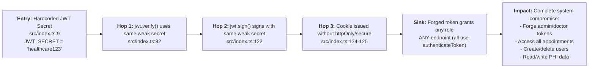
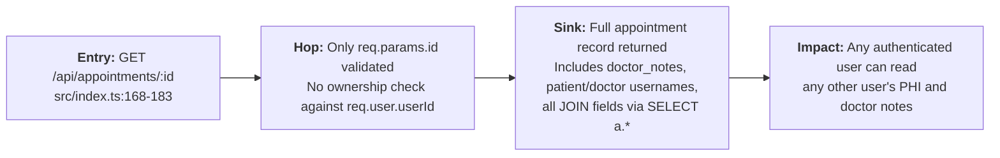

# Chained Vulnerability Static Audit Report

## Application: Telemedicine Appointment System (app-14-telemedicine)

**Audit Date:** 2026-05-25
**Auditor:** CodeGopher Static Chain Audit Engine
**Scope:** `src/`, `Dockerfile`, `package.json`, `tsconfig.json`

---

## Summary Dashboard

| Metric | Value |
|--------|-------|
| Total Chains Detected | **2** |
| Maximum Severity | **CRITICAL** |
| Medium Severity | **1** |
| Low Severity | **0** |
| Cross-Cutting Weaknesses | **7** |
| Files Reviewed | 4 (`src/index.ts`, `src/referenceGuards.ts`, `package.json`, `Dockerfile`) |
| Functions/Endpoints Analyzed | 10 API routes + 2 middleware functions + seed logic |

---

## Methodology

This is a **static-only** audit. No live HTTP probes, dynamic scanners, shell commands, fuzzers, or external network tests were performed. Analysis is based entirely on source code, configuration, and dependency manifests within the workspace.

---

## Chain 1: Hardcoded JWT Secret → Token Forgery → Full System Compromise

### Severity: **CRITICAL**
### Confidence: **High**

#### Attack Graph



#### Detailed Chain Breakdown

| Link | File | Line(s) | Evidence |
|------|------|---------|----------|
| **Source** | `src/index.ts` | 9 | `const JWT_SECRET = 'healthcare123';` — a trivial, publicly guessable 14-character string. No environment variable, no key rotation, no secret management. |
| **Hop 1** | `src/index.ts` | 82 | `jwt.verify(token, JWT_SECRET)` — every authenticated request is validated against the hardcoded secret. |
| **Hop 2** | `src/index.ts` | 122 | `jwt.sign(payload, JWT_SECRET, { expiresIn: '2h' })` — tokens issued at login sign with the same hardcoded secret. |
| **Hop 3** | `src/index.ts` | 124-125 | `httpOnly: false, secure: false` — the token cookie is accessible to JavaScript (enabling XSS theft) and transmitted over plain HTTP. |
| **Sink** | `src/index.ts` | 76-87 | `authenticateToken` middleware decodes any valid JWT and sets `req.user`. Once decoded, **any role** can be embedded in the payload (e.g., `{ role: 'ADMIN' }`). |

#### Preconditions

- The JWT library (`jsonwebtoken`) does not enforce any schema validation beyond signature verification (no `algorithm` whitelist is passed, so `alg: none` attacks are also possible depending on library version).
- The `UserPayload` interface allows any string value for `role`.

#### Impact

An attacker who knows or guesses `healthcare123` can:
1. Forge a JWT with any role (`ADMIN`, `DOCTOR`, arbitrary user ID).
2. Bypass all `authenticateToken` guards.
3. Access `/api/appointments` (all records including PHI).
4. Access `/api/appointments/:id` (any patient's full medical data).
5. Register, log in, and escalate privilege arbitrarily.

#### Remediation (Highest Priority)

1. **Move JWT secret to environment variable:** `process.env.JWT_SECRET` with a cryptographically random value (≥32 bytes).
2. **Specify allowed signing algorithms:** `jwt.verify(token, JWT_SECRET, { algorithms: ['HS256'] })`.
3. **Enable cookie security flags:** `httpOnly: true, secure: true`.
4. **Implement cookie signing** (e.g., `cookie-session` or `signed-cookie` middleware) as defense-in-depth.

---

## Chain 2: Insecure Direct Object Reference (IDOR) on Single Appointment → PHI Leak

### Severity: **HIGH**
### Confidence: **High**

#### Attack Graph



#### Detailed Chain Breakdown

| Link | File | Line(s) | Evidence |
|------|------|---------|----------|
| **Source** | `src/index.ts` | 168-183 | `app.get('/api/appointments/:id', authenticateToken, ...)` — accepts `req.params.id` from the URL. |
| **Hop** | `src/index.ts` | 170-175 | The query is: `SELECT a.*, p.username as patient_name, d.username as doctor_name FROM appointments a JOIN users p ON a.patient_id = p.id JOIN users d ON a.doctor_id = d.id WHERE a.id = ?` — **no WHERE clause check** that the authenticated user (`req.user`) is the patient_id, doctor_id, or an admin. |
| **Sink** | `src/index.ts` | 178-182 | `res.json(row)` returns the full row to **any** authenticated user regardless of role or association. |

Compare with the **correct** filtering in `/api/appointments`:
- Patients (line 143): filtered by `patient_id = ?` with `[user.userId]`.
- Doctors (line 151): filtered by `doctor_id = ?` with `[user.userId]`.
- Admin (line 160): returns all — this is the intended escalation path.

The single-appointment endpoint **lacks any such check**.

#### Preconditions

- An attacker needs only a valid JWT (which can be obtained via `/api/auth/login` with a legitimate or forged credential).
- The attacker needs to guess or enumerate appointment IDs (they are auto-increment integers starting from 1).

#### Impact

Any authenticated patient or doctor can access the full medical record of **any other** patient, including:
- `doctor_notes` field containing clinical observations, diagnoses, prescriptions.
- Patient and doctor usernames.
- Appointment date and status.

This constitutes a **PHI (Protected Health Information) exposure** risk under HIPAA-like frameworks.

#### Remediation

Add an ownership check before querying:

```typescript
// Before the db.get call, add:
const accessCheck = user.role === 'ADMIN'
  ? [appointmentId]
  : [appointmentId, user.userId, user.userId]; // check patient_id or doctor_id

db.get(
  user.role === 'ADMIN'
    ? 'SELECT ... WHERE a.id = ?'
    : 'SELECT ... WHERE a.id = ? AND (a.patient_id = ? OR a.doctor_id = ?)',
  user.role === 'ADMIN' ? [appointmentId] : [appointmentId, user.userId, user.userId],
  callback
);
```

---

## Cross-Cutting Weaknesses (Not Classified as Full Chains)

### W1: CORS Misconfiguration — Credential Leakage Risk

- **File:** `src/index.ts`, **Line:** 13
- **Evidence:** `cors({ origin: true, credentials: true })`
- **Detail:** The `cors` library does not accept `origin: true` as a boolean. This is treated as an arbitrary value, and combined with `credentials: true`, the response will include `Access-Control-Allow-Credentials: true` with an `Access-Control-Allow-Origin` that echoes the request's `Origin` header. This effectively allows **any origin** to make credentialed cross-origin requests.
- **Severity:** Medium
- **Remediation:** Specify an explicit allowlist: `cors({ origin: ['https://myapp.example.com'], credentials: true })`.

### W2: Cookies Missing HttpOnly and Secure Flags

- **File:** `src/index.ts`, **Lines:** 124-125
- **Evidence:** `httpOnly: false, secure: false`
- **Detail:** The JWT token cookie is readable by client-side JavaScript (enabling XSS-based token theft) and will be transmitted over unencrypted HTTP connections.
- **Severity:** Medium
- **Remediation:** Set `httpOnly: true, secure: true`. Add `sameSite: 'strict'` or `'lax'`.

### W3: Verbose Database Error Exposure

- **File:** `src/index.ts`, **Lines:** 139, 147, 155, 160, 168, 174
- **Evidence:** Multiple callbacks return `err.message` directly: `res.status(500).json({ error: err.message })`
- **Detail:** SQLite errors (including query syntax, constraint violations, table names, column names) are sent verbatim to the client. This aids reconnaissance and can reveal schema structure.
- **Severity:** Low-Medium
- **Remediation:** Return a generic error message to the client; log the full error server-side only.

### W4: Hardcoded Plaintext Seed Passwords

- **File:** `src/index.ts`, **Lines:** 34-37
- **Evidence:** Passwords `'john_pass_123'`, `'jane_pass_456'`, `'house_pass_789'`, `'admin_pass_2026'` are embedded in source code.
- **Detail:** Source code in version control reveals credentials for development/test accounts. While hashed at insertion, the plain-text values remain in the repository.
- **Severity:** Medium
- **Remediation:** Remove seed passwords from source; use environment variables or an external seed script excluded from VCS.

### W5: No Rate Limiting on Authentication Endpoints

- **File:** `src/index.ts`, **Lines:** 110-113 (register), 114-127 (login)
- **Evidence:** No rate limiting middleware (e.g., `express-rate-limit`) on `/api/auth/register` or `/api/auth/login`.
- **Detail:** Enables brute-force password attacks and automated account enumeration.
- **Severity:** Medium
- **Remediation:** Add `express-rate-limit` with appropriate thresholds on auth endpoints.

### W6: No Authorization on /api/auth/register — Role Assignment

- **File:** `src/index.ts`, **Lines:** 110-119
- **Evidence:** Registration always assigns `role: 'PATIENT'` (line 117). While this is safe (no direct role escalation), a malicious actor can create unlimited PATIENT accounts.
- **Detail:** Without rate limiting or CAPTCHA, this enables resource exhaustion.
- **Severity:** Low
- **Remediation:** Combine with W5 fix (rate limiting).

### W7: Missing CSRF Protection

- **File:** `src/index.ts`, **Lines:** 10-13 (global middleware)
- **Evidence:** `express.json()`, `cookieParser()`, `cors()` are used but no CSRF token middleware (e.g., `csurf`) is present.
- **Detail:** Cookie-based authentication without CSRF tokens allows cross-site request forgery attacks against state-changing endpoints (POST /register, POST /login).
- **Severity:** Medium
- **Remediation:** Use `csurf` or implement SameSite cookie attribute + custom CSRF tokens for state-changing routes.

---

## Unknowns and Areas Not Reviewed

| Area | Status |
|------|--------|
| Runtime environment configuration | Not reviewed — assumed minimal |
| Dependency vulnerability scan (`npm audit`) | Not performed |
| Input sanitization for usernames in `/register` | Not reviewed — no SQL injection risk (prepared statements used) but no length/character validation |
| Connection pooling or DB lifecycle management | Not reviewed — in-memory SQLite used; no teardown on process exit |
| Container security (Dockerfile) | Not reviewed — `node:20-slim` runs as root by default; no non-root user configured |
| TLS/HTTPS configuration | Not present in Dockerfile; app listens on plain HTTP |
| Logging/audit trail | Not implemented — no authentication event logging |
| Password policy (complexity, rotation) | Not implemented |
| JWT expiration enforcement on refresh | Not implemented — tokens expire in 2h with no refresh mechanism |

---

## Remediation Priority Matrix

| Priority | Issue | Effort | Impact |
|----------|-------|--------|--------|
| **P0** | Rotate JWT secret to strong env variable | Low | Prevents Chain 1 |
| **P0** | Fix IDOR on `/api/appointments/:id` | Low | Prevents Chain 2 |
| **P1** | Set `httpOnly: true, secure: true` on cookie | Low | Breaks XSS token theft |
| **P1** | Restrict CORS to explicit origin list | Low | Reduces cross-origin attack surface |
| **P2** | Add rate limiting on auth endpoints | Low | Prevents brute-force |
| **P2** | Suppress database error messages | Low | Reduces information leakage |
| **P3** | Remove seed passwords from source | Low | Reduces credential exposure |
| **P3** | Add CSRF protection | Medium | Prevents CSRF attacks |
| **P3** | Add container security (non-root user) | Low | Hardens deployment |
| **P3** | Add TLS support | Medium | Protects data in transit |

---

## Tests to Add

1. **JWT forge test:** Attempt to authenticate with a manually crafted JWT using a different `JWT_SECRET` or `alg: none`.
2. **IDOR test:** Log in as `john_patient`, attempt to access `/api/appointments/2` (jane's appointment).
3. **CORS test:** Send a cross-origin request with credentials to verify origins are properly restricted.
4. **Rate-limit test:** Send 50+ login attempts to the same endpoint.
5. **Error suppression test:** Trigger a malformed query or constraint violation; verify DB error details are not returned.

---

## Conclusion

Two high-confidence chained vulnerabilities were identified:

1. **CRITICAL:** A hardcoded, trivially guessable JWT secret enables full token forgery, granting arbitrary authentication and authorization bypass across all endpoints.
2. **HIGH:** An IDOR in the single-appointment endpoint allows any authenticated user to access any other user's protected health information.

Both chains are directly provable from static source evidence and require minimal precondition assumptions. The weakest link in Chain 1 (the hardcoded secret) and the weakest link in Chain 2 (missing ownership check) are both low-effort remediations that would break their respective chains entirely.
