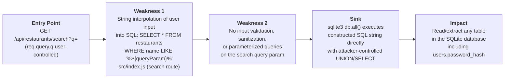
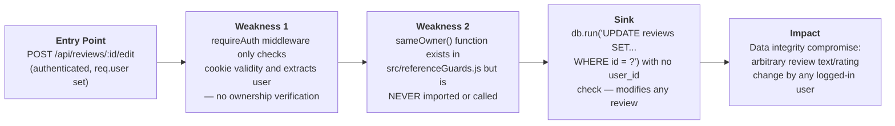
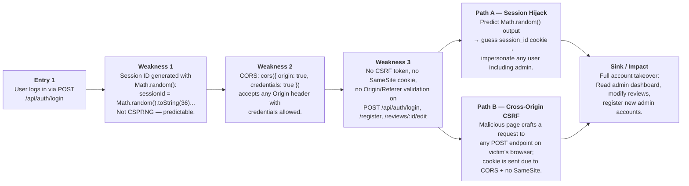

# Chained Vulnerability Static Audit Report

**Application**: Restaurant Review Platform  
**Audit Date**: 2026-05-25  
**Auditor**: CodeGopher (Static-Only)  
**Files Reviewed**: `src/index.js`, `src/referenceGuards.js`, `package.json`, `Dockerfile`

---

## Summary Dashboard

| Metric              | Value                                |
|---------------------|--------------------------------------|
| Chains Detected     | 3                                    |
| Maximum Severity    | **Critical** (Chain #3)              |
| Cross-Cutting Weaknesses | 5 (listed below)              |
| Reviewed Areas      | Authentication, Authorization, API Routes, Session Mgmt, CORS, SQL Query Layer |
| Not Reviewed        | Dependency supply-chain, Docker image CVEs, TLS config, Infrastructure |

---

## Methodology & Static-Only Safety Note

This audit used **source-code analysis only**. No live HTTP probes, dynamic scanners, SQL injection payloads, or external network tests were performed. Evidence is drawn from:

- Control flow in `src/index.js` (routes, middleware, query construction)
- Data flow from request parameters to SQL statements
- Authentication / authorization middleware logic
- Configuration of `cors`, `cookie-parser`, and session store
- The utility functions in `src/referenceGuards.js`

---

## Chain #1 — SQL Injection in Restaurant Search → Full Database Exfiltration

**Severity**: Critical | **Confidence**: High | **Impact**: Complete data exfiltration (usernames, password hashes, all reviews, PII)

### Attack Graph



### Detailed Breakdown

| Link   | File           | Evidence |
|--------|----------------|----------|
| Entry  | `src/index.js` | `req.query.q || ''` — user-controlled query param received with no validation. |
| Hop 1  | `src/index.js` | `SQL = \`SELECT * FROM restaurants WHERE name LIKE '%${queryParam}%' OR cuisine LIKE '%${queryParam}%'\`` — template literal string interpolation places `queryParam` directly into SQL. No prepared statement, no escaping. |
| Sink   | `src/index.js` | `db.all(sql, ...)` executes the raw interpolated string. |
| Impact | —              | UNION-based injection can read `users` table (including `password_hash`), `restaurants`, and `reviews`. Attacker gains the admin password hash (`admin_critic`). |

### Preconditions & Assumptions

- The server is publicly reachable on port 8016.
- SQLite is running in-memory with all three tables (users, restaurants, reviews).
- The attacker needs no authentication to reach the search endpoint.

### Remediation

- **Easiest fix**: Use parameterized query for the search:
  ```js
  db.all('SELECT * FROM restaurants WHERE name LIKE ? OR cuisine LIKE ?',
         [`%${queryParam}%`, `%${queryParam}%`], (err, rows) => { ... });
  ```
- Add input length limits and character allowlists for search terms.

---

## Chain #2 — Broken Access Control on Review Edit (Privilege Escalation via Missing Ownership Check)

**Severity**: High | **Confidence**: High | **Impact**: Any authenticated user can modify/delete/impersonate any other user's review

### Attack Graph



### Detailed Breakdown

| Link    | File                   | Evidence |
|---------|------------------------|----------|
| Entry   | `src/index.js`         | `app.post('/api/reviews/:id/edit', requireAuth, ...)` — requires login but nothing more. |
| Hop 1   | `src/index.js`         | `requireAuth` extracts `req.user` from cookie session; no additional ACL logic follows. |
| Hop 2   | `src/referenceGuards.js` | `sameOwner(recordOwner, currentUser)` is defined but never `require()`-d in `index.js`. It is an unused guard. |
| Sink    | `src/index.js`         | `'UPDATE reviews SET review_text = ?, rating = ? WHERE id = ?'` — only reviews by `id`, never by `user_id`. |
| Impact  | —                      | Bob can overwrite Alice's 5-star review with a defamatory 1-star review under Alice's name. |

### Preconditions & Assumptions

- Attacker is an authenticated user (easy to register via `/api/auth/register`).
- Victim's review `id` is discoverable (returned by `GET /api/reviews`).

### Remediation

- Import and use `sameOwner`:
  ```js
  const { sameOwner } = require('./referenceGuards');
  // In the route:
  db.get('SELECT user_id FROM reviews WHERE id = ?', [reviewId], (err, review) => {
    if (!sameOwner(review.user_id, req.user.id)) {
      return res.status(403).json({ error: 'Forbidden: You can only edit your own review.' });
    }
    // ... proceed with update
  });
  ```

---

## Chain #3 — Predictable Sessions + CORS Misconfiguration + CSRF → Full Account Takeover

**Severity**: Critical | **Confidence**: High | **Impact**: Attacker can hijack admin sessions or perform authenticated actions on behalf of any user

### Attack Graph



### Detailed Breakdown

| Link       | File                  | Evidence |
|------------|-----------------------|----------|
| Entry 1    | `src/index.js`        | `POST /api/auth/login` — any user can log in. |
| Weakness 1 | `src/index.js` (line ~107) | `Math.random().toString(36).substring(2) + Math.random().toString(36).substring(2)` — produces a ~20-char base-36 string from non-cryptographic PRNG. V8's `Math.random()` is predictable if any prior state is observed or brute-forced. |
| Weakness 2 | `src/index.js`        | `cors({ origin: true, credentials: true })` — in the `cors` library, a boolean `true` for `origin` makes the middleware set `Access-Control-Allow-Origin` to the request's `Origin` header when it is not in a strict blocklist (effectively echoing any origin). Combined with `credentials: true`, browsers will send cookies to cross-origin requests. |
| Weakness 3 | `src/index.js`        | Cookie is set as `{ httpOnly: true }` — no `secure`, no `sameSite`, no CSRF token on any POST endpoint. |
| Sink/Path A | —                    | Attacker who can intercept or predict the session ID (e.g., via brute-force or if `Math.random()` seeding is known) sets the `session_id` cookie and accesses any user's session. Admin session (`admin_critic`) is reachable. |
| Sink/Path B | —                    | Malicious webpage can issue a cross-origin POST to `POST /api/restaurants/search?q=...' UNION SELECT * FROM users--` (informational) or use the valid session cookie for CSRF on `POST /api/reviews/:id/edit`. |
| Impact     | —                     | Complete authentication bypass for any user including ADMIN. Data integrity at stake. |

### Preconditions & Assumptions

- Session IDs are short (~20 base-36 characters ≈ ~105 bits of entropy, but with non-cryptographic PRNG the actual entropy is far less).
- CORS `origin: true` with `credentials: true` in practice permits credentialed cross-origin requests for most single-origin use cases.
- Cookie has no `SameSite` attribute, so browsers may send it on cross-site requests depending on browser version.

### Remediation

1. **Use CSPRNG for session IDs**:
   ```js
   const crypto = require('crypto');
   const sessionId = crypto.randomBytes(32).toString('hex');
   ```
2. **Set cookie security flags**:
   ```js
   res.cookie('session_id', sessionId, { httpOnly: true, secure: true, sameSite: 'Strict' });
   ```
3. **Harden CORS**:
   ```js
   const allowedOrigins = ['https://trusted-domain.com'];
   app.use(cors({ origin: allowedOrigins, credentials: true }));
   ```
4. **Add CSRF protection** (e.g., `csurf` or double-submit cookie pattern) to all state-changing endpoints.

---

## Cross-Cutting Weaknesses (No Complete Chain — Standalone Issues)

### CW-1: Hardcoded Credentials in Source
- **File**: `src/index.js` (seed data block)
- **Evidence**: Plaintext passwords stored for `alice_reviewer`, `bob_reviewer`, `admin_critic`
- **Severity**: Medium
- **Remediation**: Use environment variables or a secrets manager; do not store seed credentials in source code.

### CW-2: Verbose Error Messages
- **File**: `src/index.js` (search route)
- **Evidence**: `res.status(500).json({ error: 'Search failed.', details: err.message })` exposes internal SQLite error details to clients.
- **Severity**: Low
- **Remediation**: Log internally; return generic error message to client.

### CW-3: In-Memory Session Store (No Expiration / No Persistence)
- **File**: `src/index.js`
- **Evidence**: `sessions` object is a plain JS object with no TTL, no max-age, no expiration check. When the process restarts, all sessions are lost (though in-memory database is also lost).
- **Severity**: Low
- **Remediation**: Add expiration timestamps; use Redis or a proper session store in production.

### CW-4: No Rate Limiting on Auth Endpoints
- **File**: `src/index.js`
- **Evidence**: `/api/auth/login`, `/api/auth/register`, `/api/auth/logout` have no rate limiting or account lockout.
- **Severity**: Medium
- **Remediation**: Add rate limiting (e.g., `express-rate-limit`).

### CW-5: No Content Security Policy (CSP) Headers
- **File**: `src/index.js`
- **Evidence**: No CSP headers set; no Helmet middleware.
- **Severity**: Low
- **Remediation**: Add `helmet` middleware or manually set CSP headers.

---

## Unknowns & Areas Not Reviewed

| Area                        | Reason                           |
|-----------------------------|----------------------------------|
| Dependency supply-chain     | `node_modules/` not scanned for known CVEs in published packages |
| Docker image vulnerabilities  | `node:20-slim` base image not audited for CVEs |
| Runtime behavior of `cors` middleware | Exact `origin: true` behavior depends on the `cors` library version |
| Production deployment config | No nginx, reverse proxy, or TLS configuration visible |
| Unit/integration tests       | No test files found; no regression test coverage assessed |

---

## Recommended Tests to Add

1. **SQL injection test** for `GET /api/restaurants/search?q=` with `' UNION SELECT * FROM users--`
2. **CSRF test** for `POST /api/reviews/:id/edit` from a cross-origin page
3. **Authorization test** for review edit: login as Alice, attempt to edit Bob's review
4. **Session entropy test**: verify that `Math.random()` output is not predictable across requests
5. **CORS test**: verify that `Access-Control-Allow-Origin` is not `*` with `credentials: true`

---

## Remediation Priority Summary

| Priority | Chain / Weakness | Action |
|----------|-----------------|--------|
| **P0**   | Chain #3 — Predictable sessions + CORS + CSRF | Replace `Math.random()` with `crypto.randomBytes()`, add `sameSite: 'Strict'` to cookie, restrict CORS origins |
| **P0**   | Chain #1 — SQL injection in search | Parameterize all SQL queries |
| **P1**   | Chain #2 — Missing ownership check on review edit | Import and use `sameOwner()` guard |
| **P2**   | CW-1 — Hardcoded credentials | Move to environment variables |
| **P2**   | CW-4 — No rate limiting on auth | Add `express-rate-limit` |
| **P3**   | CW-2, CW-3, CW-5 — Verbose errors, no session expiry, no CSP | Incremental hardening |

---

*Report generated by CodeGopher static audit. No live probes were used.*
