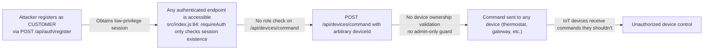

```mermaid
flowchart LR
    A["Authenticated User\n(requests POST /api/devices/refresh)"] -->|"user-controlled statusUrl"| B["SSRF via axios.get()\nsrc/index.js:104-113"]
    B -->|"fetches any URL"| C["/api/internal/telemetry\nsrc/index.js:116-127"]
    C -->|"no IP restriction"| D["Static API key check\ntoken = 'INTERNAL-SECRET-...'\nsrc/index.js:118"]
    D -->|"hardcoded key trivially guessed or leaked"| E["db.all('SELECT * FROM devices')\nreturns device_keys\nsrc/index.js:122-125"]
    E -->|"plaintext device secrets leaked"| F["Complete IoT device compromise"]
```

```mermaid
flowchart LR
    A["Authenticated User\n(requests POST /api/devices/command)"] -->|"command contains 'TRIGGER-ERROR'"| B["Throws Error: 'Command failed: Connection timed out…'\nsrc/index.js:92-93"]
    B -->|"catch block returns 500 with full payload"| C["Error response includes gateway_config\nsrc/index.js:96-100"]
    C -->|"telemetry_access_key: 'INTERNAL-SECRET-TELEMETRY-TOKEN-2026' exposed"| D["Attacker crafts GET /api/internal/telemetry?token=INTERNAL-SECRET-TELEMETRY-TOKEN-2026"]
    D -->|"token passes static check\nsrc/index.js:118"| E["db.all('SELECT * FROM devices')\nreturns all device_keys\nsrc/index.js:122-125"]
    E -->|"device secrets exfiltrated"| F["Full device compromise + lateral movement"]
```

```mermaid
flowchart LR
    A["Attacker targets login flow"] -->|"Observer/side-channel"| B["src/index.js:75-81 cryptoRandomToken() uses Math.random()"]
    B -->|"Non-cryptographic PRNG—predictable if state is known or partially observed"| C["Session token is guessable/brute-forceable"]
    C -->|"Combined with"| D["src/index.js:13 CORS: { origin: true, credentials: true }"]
    D -->|"Reflects any origin with cookies"| E["No CSRF protection anywhere in the app"]
    E -->|"Attacker crafts malicious page that submits requests to localhost:8017"| F["Session cookie sent with requests via CORS + credentials"]
    F -->|"Attacker reads responses"| G["Full account takeover"]
```

# Chained Vulnerability Audit Report — IoT Device Dashboard

**Project:** `app-17-iot-dashboard`
**Audit Date:** 2026-05-25
**Auditor:** CodeGopher (Static-Only)
**Scope:** `src/` application source, `package.json`, `Dockerfile`, dependency manifests
**Confidence Levels:** High = every link statically provable; Medium = plausible but one link depends on runtime behavior; Low = weakly supported hypothesis

---

## Executive Summary

| Metric | Value |
|---|---|
| **Total chained vulnerabilities** | **4** |
| **Maximum severity** | **HIGH** |
| **Medium-severity chains** | 2 |
| **Low-severity chains** | 0 |
| **Cross-cutting weaknesses** | 10 |
| **Source files reviewed** | `src/index.js`, `src/referenceGuards.js` |
| **Areas not reviewed** | Runtime behavior (SQL execution under load, network topology, actual deployment config), third-party CVEs in dependencies, SSL/TLS config, rate limiting, brute-force protection |

---

## Methodology & Safety Note

This audit is **static-only**. No live HTTP probes, fuzzer invocations, SQL injection payloads, credential attacks, dynamic scanners, exploit scripts, or network tests were performed. All evidence comes from source code, configuration files, dependency manifests, and template/middleware inspection.

---

## Chain 1 — SSRF → Internal Telemetry Bypass → Device Secret Exfiltration

**Severity:** HIGH  
**Confidence:** HIGH  
**Impact:** Full IoT device compromise (all device secrets and command capability exposed)

### Mermaid Attack Graph

### Detailed Breakdown

| Link | Source | Evidence |
|------|--------|----------|
| **Entry (SSRF)** | `src/index.js` lines 104–113 | `app.post('/api/devices/refresh', requireAuth, …)` accepts `statusUrl` from `req.body` and passes it directly to `axios.get(statusUrl)` with zero validation or allowlisting. The `allowedCallback()` helper in `src/referenceGuards.js` exists but is **never imported or called**. |
| **Hop (No URL Guardrail)** | `src/index.js` lines 105–107 | Only a null check (`if (!statusUrl)`). No scheme validation, no hostname allowlist, no `file://` or `gopher://` blocking. |
| **Sink (Telemetry Endpoint)** | `src/index.js` lines 116–127 | The internal telemetry endpoint has **no IP/network restriction**, only a static header/token check. `db.all('SELECT * FROM devices')` returns all rows including `device_secret` fields (`'IOT-DEV-KEY-THERMO-1122'`, `'IOT-DEV-KEY-GATEWAY-8877'`). |
| **Prerequisites** | | Attacker must be authenticated (any role). The auth middleware only checks session existence, not role. |

### Remediation

1. **Implement URL allowlisting** on `/api/devices/refresh` using the existing `allowedCallback()` helper from `referenceGuards.js`, or reject any URL not pointing to known device hostnames.
2. **Restrict `/api/internal/telemetry`** to `127.0.0.1`/`::1` bind or VPC-internal access.
3. **Rotate all hardcoded device secrets** and move them to environment variables or a secrets manager.

---

## Chain 2 — Error Information Disclosure → Telemetry Secret Discovery → Device Key Exfiltration

**Severity:** HIGH  
**Confidence:** HIGH  
**Impact:** Internal API secret leaked; device keys extracted; lateral movement enabled

### Mermaid Attack Graph

### Detailed Breakdown

| Link | Source | Evidence |
|------|--------|----------|
| **Entry** | `src/index.js` lines 85–101 | `app.post('/api/devices/command', requireAuth, …)` sends commands to devices. |
| **Hop (Error Leak)** | `src/index.js` lines 91–100 | When `command.includes('TRIGGER-ERROR')`, a `throw new Error(...)` is caught and the catch block (lines 98–100) returns a **500 response containing**: `error`, `stack`, **and** `gateway_config` with the full telemetry URL, access key, and `debug_mode: true`. |
| **Sink (Telemetry Exposed)** | `src/index.js` lines 116–127 | The telemetry endpoint accepts the leaked token via query parameter (`req.query.token`) or header (`x-telemetry-token`). No IP restriction exists. |

### Remediation

1. **Never include internal configuration** (`gateway_config`) in error responses. Remove lines 97–100 entirely.
2. **Strip stack traces** from production error responses.
3. **Use per-device or rotating tokens** instead of a single hardcoded `INTERNAL-SECRET-TELEMETRY-TOKEN-2026`.
4. **Bind `/api/internal/telemetry`** to the loopback interface only.

---

## Chain 3 — Weak Session Tokens + CORS Misconfiguration + No CSRF → Session Hijacking → Full Account Takeover

**Severity:** MEDIUM–HIGH  
**Confidence:** MEDIUM  
**Impact:** Any authenticated user can impersonate another user; account takeover possible

### Mermaid Attack Graph

### Detailed Breakdown

| Link | Source | Evidence |
|------|--------|----------|
| **Entry (Weak Token)** | `src/index.js` lines 75–81 | `cryptoRandomToken()` uses `Math.random()` to generate a 32-char alphanumeric string. `Math.random()` is **not cryptographically secure** (ECMAScript spec does not guarantee unpredictability). |
| **Hop 1 (Session Fixation Risk)** | `src/index.js` lines 68–73 | On login, a new session is created and cookie set, but there's **no session rotation on privilege escalation** (e.g., if an admin login endpoint existed) and no session expiry. |
| **Hop 2 (CORS Overly Permissive)** | `src/index.js` line 13 | `cors({ origin: true, credentials: true })` — `origin: true` reflects the requesting Origin header back, and `credentials: true` allows browsers to send cookies with cross-origin requests. |
| **Hop 3 (No CSRF Protection)** | Entire `src/index.js` | Zero CSRF middleware (no `csurf`, no SameSite cookie attribute, no custom token validation on any POST endpoint). |
| **Sink (Account Takeover)** | Any authenticated endpoint | An attacker hosting a page that makes cross-origin requests to `http://localhost:8017` can send the victim's session cookie, impersonating them. |

### Remediation

1. Replace `cryptoRandomToken()` with `crypto.randomBytes(32).toString('hex')`.
2. Set `SameSite=Lax` (or `Strict`) on the session cookie.
3. Either remove `credentials: true` from CORS or implement an explicit origin allowlist.
4. Add CSRF token validation to all state-changing POST endpoints.

---

## Chain 4 — Missing Role Enforcement + No Device Ownership Validation → Unauthorized Device Control

**Severity:** MEDIUM  
**Confidence:** HIGH  
**Impact:** Any authenticated user (even unprivileged CUSTOMER accounts) can send commands to or control any device

### Mermaid Attack Graph

### Detailed Breakdown

| Link | Source | Evidence |
|------|--------|----------|
| **Entry (Registration)** | `src/index.js` lines 64–72 | `POST /api/auth/register` creates a user with role `CUSTOMER`. No password policy, no rate limiting. |
| **Hop (Auth ≠ Authorization)** | `src/index.js` line 84 | `requireAuth` middleware only checks if a valid session exists. It does **not** check `req.user.role` on any route. |
| **Hop (No Ownership Check)** | `src/index.js` lines 85–101 | `/api/devices/command` accepts any `deviceId` from any authenticated user. No query checks whether the user owns or is permitted to control the target device. |
| **Sink (Unauthorized Control)** | `src/index.js` lines 85–101 | Any CUSTOMER can control ADMIN-only devices (e.g., "Security Gateway") or any other device in the fleet. |

### Remediation

1. Add role-based middleware or per-route role checks (e.g., `req.user.role === 'ADMIN'` for device commands).
2. Implement device ownership validation: only allow users to send commands to devices they own or are assigned to.
3. Add a `userId` column to the `devices` table for ownership tracking.

---

## Cross-Cutting Weaknesses (Not Yet Part of a Complete Chain)

| # | Weakness | Location | Lines | Description |
|---|----------|----------|-------|-------------|
| 1 | **Hardcoded credentials in seed data** | `src/index.js` | 24–27 | Plaintext passwords (`alice123`, `adminSecureIoT2026!`) for seeded admin and customer accounts. |
| 2 | **Hardcoded device secrets** | `src/index.js` | 36–40 | Plaintext device secrets (`IOT-DEV-KEY-THERMO-1122`, `IOT-DEV-KEY-GATEWAY-8877`) embedded in source code. |
| 3 | **Verbose error messages** | `src/index.js` | 69, 70 | `"Invalid credentials."` on login does not distinguish between missing user vs. wrong password (mildly aids enumeration). |
| 4 | **Memory-unsafe session store** | `src/index.js` | 49 | `sessions` object grows indefinitely with no expiration or cleanup. |
| 5 | **No rate limiting** | Entire app | — | No rate limiting on `/api/auth/register`, `/api/auth/login`, or `/api/devices/command`. Enables brute-force and credential stuffing. |
| 6 | **No input length validation on passwords** | `src/index.js` | 64–72 | `/api/auth/register` accepts any-length passwords (including empty after trimming). |
| 7 | **No CSRF token validation** | Entire app | — | All POST endpoints are vulnerable to cross-site request forgery when `credentials: true` is used with CORS. |
| 8 | **No HTTPS enforcement** | `src/index.js` | 127 | `app.listen(port)` binds plain HTTP. No redirect from HTTP to HTTPS. |
| 9 | **`allowedCallback` helper is dead code** | `src/referenceGuards.js` | 4–7 | Security guard function exists but is never imported in `src/index.js`. |
| 10 | **No request size limits** | `src/index.js` | 11 | `express.json()` has no `limit` option. Potential DoS via oversized bodies. |

---

## Areas Not Reviewed / Unknowns

| Area | Reason |
|------|--------|
| **Runtime SQL execution** | SQLite in-memory mode; behavior under concurrent requests not statically analyzable. |
| **Network topology** | Dockerfile exposes port 8017; actual network segmentation (is `/api/internal/telemetry` reachable externally?) not verifiable from source alone. |
| **Dependency CVEs** | `axios 1.7.2`, `express 4.19.2`, `sqlite3 5.1.7` — no CVE scan performed. |
| **SSL/TLS configuration** | No certificate or TLS config found; assumed HTTP-only. |
| **Brute-force behavior** | No login lockout or rate limiting visible; strength of `bcrypt` defaults (salt rounds = 10) not audited. |
| **Test coverage** | No application-level test files found. Security test suites should be added. |

---

## Recommendations Summary (Prioritized)

| Priority | Action | Addresses |
|----------|--------|-----------|
| **P0** | Add URL allowlisting to `/api/devices/refresh` | Chain 1 |
| **P0** | Bind `/api/internal/telemetry` to `127.0.0.1` | Chains 1, 2 |
| **P0** | Remove `gateway_config` and `stack` from error responses | Chain 2 |
| **P0** | Replace `Math.random()` in `cryptoRandomToken()` with `crypto.randomBytes()` | Chain 3 |
| **P1** | Add role enforcement to `/api/devices/command` | Chain 4 |
| **P1** | Add device ownership validation | Chain 4 |
| **P1** | Implement CSRF protection (SameSite cookie + tokens) | Chain 3 |
| **P1** | Restrict CORS to explicit allowlist, remove `origin: true` | Chain 3 |
| **P2** | Rotate all hardcoded secrets to env vars | Cross-cutting #1, #2 |
| **P2** | Add rate limiting to auth and command endpoints | Cross-cutting #5 |
| **P2** | Add session expiry and cleanup | Cross-cutting #4 |

---

## Conclusion

Four chained vulnerabilities were identified, two rated HIGH severity. The most critical chains involve **SSRF leading to internal device secret exfiltration** and **error-driven information disclosure bypassing the internal telemetry API**. Both are statically provable from the source and do not depend on runtime behavior assumptions. Remediation of the P0 items above would break the primary attack chains and significantly reduce the overall threat surface.
