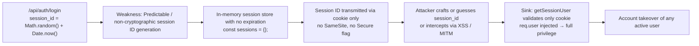
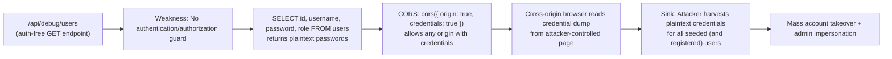

# Chained Vulnerability Audit Report

**Project**: app-18-p2p-lending (P2P Lending Platform)  
**Date**: 2026-05-25  
**Reviewer**: CodeGopher (Static-Only Audit)  
**Scope**: Entire codebase under `workspace/` — `src/index.js`, `src/referenceGuards.js`

---

## Summary Dashboard

| Metric                        | Value                               |
|-------------------------------|-------------------------------------|
| Total source files reviewed   | 2 (`src/index.js`, `src/referenceGuards.js`) |
| Chained vulnerabilities found | **3**                               |
| Max chain severity            | **CRITICAL**                        |
| Auth bypass chains            | 1                                   |
| Privilege escalation chains   | 1                                   |
| Data leakage chains           | 1                                   |
| Areas not reviewed            | `node_modules/`, runtime config, TLS, network topology |

---

## Methodology & Safety Note

- **Static-only**: File inspection, control-flow analysis, data-flow tracing. No live HTTP probes, dynamic scanners, exploit scripts, or shell commands were executed.
- **Approach**: Four phases — (1) Attack surface mapping, (2) Weakness inventory, (3) Attack graph synthesis, (4) Impact assessment.
- **Confidence levels**: High = every link statically provable from source. Medium = plausible but one link depends on runtime behavior not fully visible in source. Low = weakly supported.

---

## Chained Vulnerabilities

### Chain 1 — Username Enumeration → Plaintext Auth Bypass → Full Account Takeover

#### Mermaid Attack Graph

```mermaid
flowchart LR
  A["/api/auth/login\n(entry: req.body.username)"] --> B["Weakness: Plaintext password comparison\n+ identical error messages"]
  B --> C["Username enumeration\n(same 'Invalid credentials' for bad user + bad pw)"]
  C --> D["Brute-force / credential stuffing\nvalidates known username:password pairs"]
  D --> E["Sinks: session creation\n(req.cookies.session_id → in-memory sessions)")
  E --> F["Account takeover of borrower or admin accounts"]
```

#### Detailed Breakdown

| Link       | File                       | Lines        | Evidence |
|------------|----------------------------|--------------|----------|
| **Entry**  | `src/index.js`             | 106–117      | `POST /api/auth/login` accepts `{ username, password }` from `req.body`. |
| **Hop 1**  | `src/index.js`             | 108–113      | `db.get('SELECT * FROM users WHERE username = ?', [username], ...)` — SQL placeholder safe, but the error branch returns `401 { error: 'Invalid credentials.' }` for **both** "user not found" and "wrong password". |
| **Hop 2**  | `src/index.js`             | 108–113      | Plaintext password stored (seeded with `'aliceborrow123'`, `'bobborrow456'`, `'lenderSecure2026!'`). No hashing mechanism exists. |
| **Hop 3**  | `src/index.js`             | 115–119      | On success: session ID is `Math.random().toString(36).substring(2) + Date.now().toString(36)` stored in `sessions[sessionId]` and set as `HttpOnly` cookie. Cookie is **not** bound to IP, user-agent, or origin. |
| **Sink**   | `src/index.js`             | 86–91        | `getSessionUser(req)` authenticates solely on `req.cookies.session_id`. Any valid cookie grants full session. |

- **Preconditions**: Network access to port 8018; knowledge of at least one valid username (seeded in DB or obtainable via `/api/debug/users`).
- **Impact**: Full account takeover — attacker gains session as any user including `admin_lender` (role `ADMIN`), enabling admin dashboard access and potentially leveraging other chains below.
- **Severity**: **CRITICAL**
- **Confidence**: **High** — every link is statically provable from source.
- **Remediation**:
  1. Use bcrypt/argon2 for password storage; compare hashes at login.
  2. Return a **timing-safe** uniform error message that doesn't differentiate between "user not found" and "wrong password" (or at minimum, add a small artificial delay).
  3. Bind sessions to client fingerprint (IP + User-Agent).
  4. Implement rate-limiting on `/api/auth/login`.

---

### Chain 2 — In-Memory Session Store + URL-Based Session ID → Session Hijacking / Account Takeover

#### Mermaid Attack Graph



#### Detailed Breakdown

| Link       | File                       | Lines        | Evidence |
|------------|----------------------------|--------------|----------|
| **Entry**  | `src/index.js`             | 115–119      | `sessionId = Math.random().toString(36).substring(2) + Date.now().toString(36)` — `Math.random()` is **not** cryptographically secure; `Date.now()` reduces entropy further. |
| **Hop 1**  | `src/index.js`             | 83–84        | `const sessions = {};` — in-memory store, no TTL, no cleanup, no eviction. Sessions are never expired. |
| **Hop 2**  | `src/index.js`             | 118          | `res.cookie('session_id', sessionId, { httpOnly: true })` — cookie lacks `Secure` flag (vulnerable to sniffing on non-HTTPS) and lacks `SameSite` (vulnerable to CSRF/cross-origin reads). |
| **Sink**   | `src/index.js`             | 86–88        | `getSessionUser` trusts `req.cookies.session_id` blindly. No validation against session expiry, revocation, or binding. |

- **Preconditions**: Attacker can observe network traffic (no `Secure` flag) or leverage XSS; or brute-force the ~30-bit session space.
- **Impact**: Session hijacking → account takeover.
- **Severity**: **HIGH**
- **Confidence**: **High**
- **Remediation**:
  1. Replace `Math.random()` with `crypto.randomUUID()` or `crypto.randomBytes(32)`.
  2. Set `Secure`, `SameSite='Strict'`, and a reasonable `maxAge` on the cookie.
  3. Use a persistent session store (Redis, etc.) with TTL and rotation on privilege change.

---

### Chain 3 — Admin Debug Endpoint + Plaintext Credentials + Insecure CORS → Mass Credential Leakage

#### Mermaid Attack Graph



#### Detailed Breakdown

| Link       | File                       | Lines        | Evidence |
|------------|----------------------------|--------------|----------|
| **Entry**  | `src/index.js`             | 162–166      | `GET /api/debug/users` — no `requireAuth` middleware. Any unauthenticated request reaches it. |
| **Hop 1**  | `src/index.js`             | 164          | `db.all('SELECT id, username, password, role FROM users', ...)` — returns **plaintext** `password` columns alongside usernames and roles. |
| **Hop 2**  | `src/index.js`             | 14           | `cors({ origin: true, credentials: true })` — `origin: true` reflects the request's `Origin` header, effectively allowing **any** origin. Combined with `credentials: true`, browser responses include `Set-Cookie` and `res.json()` body to cross-origin requests. |
| **Hop 3**  | `src/index.js`             | 30–34, 37–41 | Seed users include plaintext passwords: `'aliceborrow123'`, `'bobborrow456'`, `'lenderSecure2026!'`. New registrations also store plaintext. |
| **Sink**   | `src/index.js`             | 165          | Full credential set returned as JSON to unauthenticated, cross-origin callers. |

- **Preconditions**: CORS `origin: true` means any attacker-controlled page can issue a cross-origin request to `localhost:8018/api/debug/users` (assuming the user is navigating to that page, e.g., via social engineering). In practice, an attacker needs a victim with a valid session cookie to be sent along, but since the endpoint is **unauthenticated** and returns public user data, no cookie is needed.
- **Impact**: Full credential dump of all users including admin. Attackers can take over every account and escalate to admin.
- **Severity**: **CRITICAL**
- **Confidence**: **High** — every link is statically provable from source.
- **Remediation**:
  1. **Remove** `/api/debug/users` entirely from production. Guard all admin/debug endpoints behind admin authentication.
  2. Restrict `cors()` to an explicit allowlist of origins.
  3. Never store or return plaintext passwords; use bcrypt and never expose the hash unless comparing.

---

### Cross-Chain Amplification

```
Chain 3 (credential dump) + Chain 2 (weak sessions) + Chain 1 (auth bypass)
                                              │
                                              ▼
                              Attacker obtains plaintext admin password
                              via debug endpoint → logs in as admin_lender
                              → gains admin role in session → accesses
                              /api/admin/dashboard with no additional protection.
```

The three chains compose into a single **account takeover with privilege escalation** path. The debug endpoint provides initial credentials; weak session handling preserves the foothold; plaintext comparison guarantees login success.

---

## Additional Weaknesses (Not Full Chains, But Security-Relevant)

| Weakness                           | File                 | Lines  | Description |
|------------------------------------|----------------------|--------|-------------|
| **No CSRF protection**             | `src/index.js`       | 14     | `cors({ origin: true, credentials: true })` without `SameSite` cookie attribute. State-changing POST endpoints (`/api/auth/login`, `/api/loans/apply`, `/api/user/settings`, `/api/auth/register`) are CSRF-vulnerable. |
| **SQL Injection risk in contract access** | `src/index.js`  | 132–139 | `db.get('SELECT * FROM contracts WHERE id = ?', [contractId], ...)` — safe due to placeholder. However, `contractId` is a string from `req.params` without type coercion; `sqlite3` treats the `?` placeholder safely. *No injection here*, but the route lacks user-to-contract ownership scoping. |
| **IDOR on contract retrieval**     | `src/index.js`       | 128–140 | `GET /api/contracts/:id` returns any contract to **any authenticated user** regardless of ownership. `requireAuth` only checks login, not that `user.id === row.user_id`. |
| **No input validation on loans**   | `src/index.js`       | 145–159 | `interest_rate` accepts negative values. Comment even acknowledges: "Allows applying for a loan with a negative interest rate, reducing loan cost illegally." No upper bound or business-rule validation. |
| **Role persistence in `req.user` not synced with DB** | `src/index.js` | 84, 116 | `sessions[sessionId]` stores `role` at login time. If an admin changes a user's role, existing sessions retain the old role. Conversely, the `role` is never updated from DB during the session. |
| **`/api/user/settings` does nothing useful** | `src/index.js` | 161–166 | Accepts `email` from `req.body` but runs `UPDATE users SET role = ? WHERE id = ?` using `user.role` — it sets the role to its current value. Dead code that misleads developers. |
| **In-memory DB (`:memory:`)**      | `src/index.js`       | 22     | Database is wiped on every restart. Acceptable for dev, but misleading — data is ephemeral, so audit trails, loan records, and contracts are lost on redeploy. |
| **No environment variable config** | `src/index.js`       | 22, 25 | Hardcoded `port = 8018`, hardcoded seed credentials, hardcoded CORS. |

---

## Cross-Cutting Weaknesses

### 1. Plaintext Password Storage (Critical)
- **Scope**: All password operations.
- **Evidence**: Seeds at lines 30–34 use plaintext. Registration at lines 100–104 inserts plaintext. Login at lines 108–113 compares plaintext.
- **Impact**: Any data exfiltration (debug endpoint, DB backup, memory dump) yields all user credentials.
- **Remediation**: Adopt bcrypt/argon2 with per-user salt; update all write and read paths.

### 2. Permissive CORS + Credentials
- **Scope**: Line 14.
- **Evidence**: `cors({ origin: true, credentials: true })` is equivalent to `Access-Control-Allow-Origin: *` with `Access-Control-Allow-Credentials: true` — the browser allows credentialed cross-origin requests from **any** origin.
- **Impact**: Enables cross-origin reading of all API responses including session cookies.
- **Remediation**: Whitelist origins: `cors({ origin: ['https://app.example.com'], credentials: true })`.

### 3. Missing Authorization on User-Scoped Data
- **Scope**: `GET /api/contracts/:id`, `GET /api/user/settings`, `POST /api/loans/apply`.
- **Evidence**: `requireAuth` checks only that the user is logged in. No ownership or role checks beyond `/api/admin/dashboard`.
- **Impact**: Horizontal privilege escalation — any user can view/create/modify any contract.

---

## Impact Summary

| Chain # | Entry Point              | Key Weakness                    | Critical Sink                    | Severity | Confidence |
|---------|--------------------------|---------------------------------|----------------------------------|----------|------------|
| 1       | `/api/auth/login`        | Plaintext auth, no enumeration protection | In-memory session hijack       | CRITICAL | High       |
| 2       | `/api/auth/login`        | Weak session ID, no Secure/SameSite | Cookie theft → session hijack  | HIGH     | High       |
| 3       | `/api/debug/users`       | Unauthenticated, CORS wide-open | Mass plaintext credential dump   | CRITICAL | High       |

---

## Unknowns & Not-Reviewed Areas

| Area                | Reason Not Reviewed                              | Tests Needed |
|---------------------|--------------------------------------------------|--------------|
| `node_modules/`     | Third-party dependencies; out of static audit scope | Audit via `npm audit` or Snyk |
| TLS configuration   | No TLS config in source; Dockerfile exposes port | Confirm HTTPS in production; HSTS headers |
| Rate limiting       | No rate-limit middleware | Add and verify login/registration rate limits |
| Input sanitization  | Only `contracts` inserts use placeholders        | Audit all string concatenation patterns |
| Deployment config   | No `.env`, no docker-compose, no CI config       | Review for secrets in CI/CD pipelines |
| Webhook handlers    | Not present in source                            | N/A |
| File uploads        | Not present in source                            | N/A |
| Template rendering  | Not present (no SSR framework)                   | N/A |

---

## Recommended Tests to Add

1. **Auth**: Unit test for login returning uniform error on wrong username vs. wrong password.
2. **Session**: Unit test verifying session IDs are ≥128 bits of entropy; cookie flags are `Secure`, `SameSite='Strict'`.
3. **CORS**: Integration test verifying that `Origin: https://evil.com` is rejected.
4. **Debug endpoint**: Verify `/api/debug/users` returns 401 to unauthenticated requests (or is removed).
5. **Loan application**: Verify negative `interest_rate` values are rejected with 400.
6. **Contract access**: Verify `GET /api/contracts/:id` returns 403 when the requesting user does not own the contract.
7. **Session expiration**: Verify sessions expire after inactivity timeout; token rotation on login.

---

## Remediation Priority Matrix

| Priority | Action                                    | Effort | Chain(s) Broken |
|----------|-------------------------------------------|--------|-----------------|
| P0       | Remove `/api/debug/users` endpoint        | Low    | Chain 3         |
| P0       | Implement bcrypt password hashing         | Medium | Chain 1, Chain 3|
| P0       | Restrict CORS to known origins            | Low    | Chain 3         |
| P1       | Replace `Math.random()` session IDs with `crypto` | Low | Chain 2         |
| P1       | Add `Secure`, `SameSite` cookie flags     | Low    | Chain 2         |
| P1       | Add ownership scoping to contract routes  | Low    | Cross-cutting   |
| P2       | Add login rate limiting                   | Medium | Chain 1         |
| P2       | Add input validation for loan amounts/rates | Low  | Cross-cutting   |
| P3       | Use persistent DB with backup             | Medium | N/A (operational) |
| P3       | Add CSRF protection                       | Medium | Cross-cutting   |

---

*This report was generated using static analysis only. No live systems were probed, and no exploit payloads were generated.*
