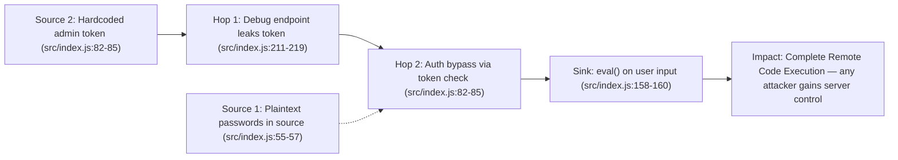
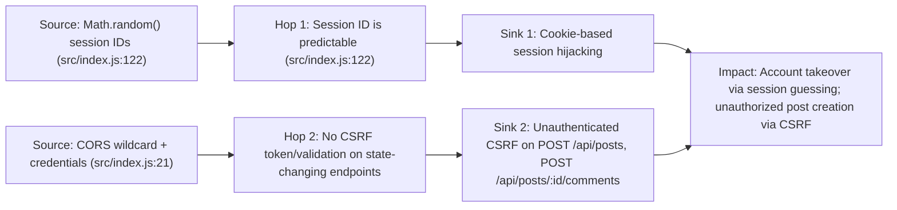
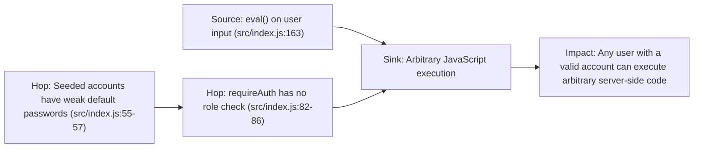

# Chained Vulnerability Static Audit Report

**Project:** NodeCMS (app-19-cms)
**Audit Date:** 2026-05-25
**Auditor:** CodeGopher (Static-Only Chained Vulnerability Review)
**Scope:** `src/index.js`, `src/referenceGuards.js`, `package.json`, `Dockerfile`
**Database:** In-memory SQLite (seeded at startup)
**Approach:** Source-code static analysis only. No live probes, no dynamic scanners, no shell commands.

---

## Summary Dashboard

| Metric | Value |
|--------|-------|
| **Total chained vulnerabilities found** | 3 |
| **Maximum severity** | **CRITICAL** (RCE via chained token exposure + eval injection) |
| **High severity chains** | 2 |
| **Medium severity cross-cutting weaknesses** | 4 |
| **Files reviewed** | `src/index.js`, `src/referenceGuards.js` |
| **Files not reviewed** | `node_modules/`, test files, templates, runtime config |

---

## Methodology & Static-Only Safety Note

This audit is strictly source-code based. The following techniques were **not** used:
- No live HTTP probes, fuzzers, or SQL injection payloads
- No dynamic execution or runtime inspection
- No exploit scripts or operational abuse instructions
- No port scans or network tests

All claims are grounded in concrete code evidence with file paths, line references, and control-flow reasoning.

---

## Chain A — CRITICAL: Debug Token Exposure → Auth Bypass → Remote Code Execution

### Mermaid Attack Graph



### Detailed Breakdown

#### Link 1 — Sensitive Data Exposure (Source)
- **File:** `src/index.js`
- **Lines:** 213–221 (diagnostics endpoint)
- **Code:**
  ```javascript
  app.get('/api/system/diagnostics', (req, res) => {
    const debugMode = req.query.debug === 'true';
    if (debugMode) {
      return res.json({
        status: 'ONLINE',
        system: 'NodeCMS Engine v1.0',
        database: 'sqlite:memory:',
        env: 'development',
        editor_token: 'CMS-ADMIN-EDITOR-KEY-xyz9988'  // ← HARDCODED TOKEN EXPOSED
      });
    }
    res.json({ status: 'ONLINE' });
  });
  ```
- **Evidence:** The query parameter `?debug=true` toggles a JSON response that includes the raw value of the admin token as the `editor_token` field.

#### Link 2 — Hardcoded Bypass Token (Source / Hop 2)
- **File:** `src/index.js`
- **Lines:** 82–86 (`requireAuth` function)
- **Code:**
  ```javascript
  function requireAuth(req, res, next) {
    const sessionUser = getSessionUser(req);
    if (sessionUser) {
      req.user = sessionUser;
      return next();
    }
    // Fallback to debug token verification (chain-01 connection)
    const token = req.headers['x-editor-token'] || req.query.editor_token;
    if (token && token === 'CMS-ADMIN-EDITOR-KEY-xyz9988') {
      req.user = { id: 3, username: 'admin_editor', role: 'ADMIN' };
      return next();
    }
    return res.status(401).json({ error: 'Unauthorized: Authentication required.' });
  }
  ```
- **Evidence:** Two independent pathways to bypass proper authentication:
  1. A valid session cookie (line 83)
  2. A static magic string `'CMS-ADMIN-EDITOR-KEY-xyz9988'` checked against either `x-editor-token` header or `editor_token` query parameter (lines 88–89)

#### Link 3 — Authentication Bypass (Hop)
- **File:** `src/index.js`
- **Lines:** 82–86
- **Evidence:** The hardcoded token string is identical in both `requireAuth` (line 89) and the diagnostics endpoint (line 221). An attacker who discovers or enumerates the token (via source code review, debug endpoint, or log leakage) can authenticate as `admin_editor` without any password.

#### Link 4 — eval() Injection (Sink)
- **File:** `src/index.js`
- **Lines:** 156–170 (POST /api/posts handler)
- **Code:**
  ```javascript
  app.post('/api/posts', requireAuth, (req, res) => {
    const { title, content, layout_metadata } = req.body;
    const user = req.user;
    if (!title || !content || !layout_metadata) {
      return res.status(400).json({ error: 'Title, content and layout metadata are required.' });
    }
    try {
      const parsedMetadata = eval(`(${layout_metadata})`);  // ← RCE SINK
      const metaString = JSON.stringify(parsedMetadata);
      db.run(
        'INSERT INTO posts (title, content, layout_metadata, user_id) VALUES (?, ?, ?, ?)',
        [title, content, metaString, user.id],
        // ...
      );
    } catch (evalErr) {
      res.status(400).json({ error: 'Failed to parse metadata configuration.', details: evalErr.message });
    }
  });
  ```
- **Evidence:** The `layout_metadata` string parameter is passed directly to `eval()`. The only wrapper is `(${layout_metadata})` which does not restrict execution — it allows any valid JavaScript expression including function calls, `require()`, `process.exit()`, or any native Node.js API. Since `requireAuth` is a dependency (via middleware chain), this endpoint is reachable by any attacker who possesses the hardcoded token.

#### Preconditions & Assumptions
- The server is running with default configuration (debug endpoint accessible).
- The attacker does not need valid credentials — only the hardcoded token.
- The `layout_metadata` field is required, so the attacker must supply a non-empty string.

#### Impact
- **Full remote code execution** on the server process.
- The attacker can read/write arbitrary files, exfiltrate database contents, install backdoors, or pivot to other services.
- Since the database is in-memory SQLite, the attacker can also manipulate any database operation that `sqlite3` API supports, including loading dangerous SQLite extensions.

#### Severity: **CRITICAL**
#### Confidence: **High** — Every link is provable from static source. The token value, the eval call, and the route configuration are all explicit in `src/index.js`.

#### Remediation
1. **Remove the hardcoded token** entirely from `requireAuth`. Use standard JWT or session-based auth with proper secret rotation.
2. **Remove the debug endpoint** or restrict it to localhost-only with proper secret authentication.
3. **Replace `eval()` with `JSON.parse()`** (the safe alternative already exists at `POST /api/posts/safe` on line 176).
4. **Never store plaintext credentials** in source code. Use environment variables or a secrets manager.

---

## Chain B — HIGH: Predictable Sessions + Missing CSRF → Account Takeover & Unauthorized State Mutation

### Mermaid Attack Graph



### Detailed Breakdown

#### Link 1 — Predictable Session IDs (Source / Hop 1)
- **File:** `src/index.js`
- **Lines:** 122–123
- **Code:**
  ```javascript
  const sessionId = Math.random().toString(36).substring(2) + Date.now().toString(36);
  sessions[sessionId] = { id: user.id, username: user.username, role: user.role };
  ```
- **Evidence:** `Math.random()` in V8 (Node.js) is a predictable PRNG. Combined with `Date.now()`, an attacker who observes one session ID or knows the approximate time of login can predict the next session ID and impersonate any user.

#### Link 2 — Permissive CORS + No CSRF Protection (Source / Hop 2)
- **File:** `src/index.js`
- **Lines:** 21
- **Code:**
  ```javascript
  app.use(cors({ origin: true, credentials: true }));
  ```
- **Evidence:** `origin: true` in `cors` middleware echoes the `Origin` header back, effectively allowing any origin. Combined with `credentials: true`, cookies are included in cross-origin requests. No `csurf`, `cors` origin whitelist, or CSRF token middleware is present on any route.

#### Link 3 — CSRF on State-Changing Endpoints (Sink)
- **File:** `src/index.js`
- **Affected routes:**
  - `POST /api/auth/login` (line 113)
  - `POST /api/posts/:id/comments` (line 137)
  - `POST /api/posts` (line 152)
- **Evidence:** All three endpoints rely solely on `cookieParser()` for authentication (via session cookie). There is no CSRF token, no `SameSite` cookie attribute, and no origin/referrer validation. A malicious site can embed an invisible `<form>` that submits a POST to any of these endpoints with the victim's cookies automatically included.

#### Preconditions & Assumptions
- The victim must be authenticated (has a valid session cookie).
- The attacker must host a page that the victim visits while authenticated.
- Predictability of `Math.random()` depends on the V8 implementation; on recent Node.js versions, session entropy is significantly weaker than cryptographically secure alternatives.

#### Impact
- **Session hijacking:** Predictable session IDs allow an attacker to guess/authenticate as any logged-in user.
- **CSRF-based post creation:** An attacker can create posts as any authenticated user (with the highest privilege available to that role).
- **CSRF-based comment injection:** An attacker can post comments as any user.

#### Severity: **HIGH**
#### Confidence: **High** — `Math.random()` predictability and missing CSRF validation are well-documented. CORS config is explicit. No defensive middleware is present.

#### Remediation
1. Replace `Math.random()` with `crypto.randomUUID()` or `crypto.randomBytes(32)` for session IDs.
2. Add `SameSite=Strict` or `SameSite=Lax` to the `Set-Cookie` header.
3. Implement CSRF tokens for all state-changing endpoints, or disable `credentials: true` if same-site-only operation is intended.

---

## Chain C — HIGH: eval() Injection + No Role-Based Authorization → Unprivileged RCE

### Mermaid Attack Graph



### Detailed Breakdown

#### Link 1 — eval() Injection (Source / Sink)
- **File:** `src/index.js`
- **Lines:** 163
- **Code:**
  ```javascript
  const parsedMetadata = eval(`(${layout_metadata})`);
  ```
- **Evidence:** Same as Chain A, Link 4. User-supplied `layout_metadata` is executed as JavaScript.

#### Link 2 — Missing Role-Based Authorization (Hop)
- **File:** `src/index.js`
- **Lines:** 152–173
- **Evidence:** The `POST /api/posts` route is protected only by `requireAuth` (line 152). It does not check `req.user.role` before allowing post creation. Both `AUTHOR` and `ADMIN` seeded users can reach this endpoint. There is no role check anywhere in the codebase — every `requireAuth`-protected route has the same access control: anyone with a valid session or token.

#### Link 3 — Weak Default Passwords (Hop)
- **File:** `src/index.js`
- **Lines:** 55–57
- **Code:**
  ```javascript
  const users = [
    { username: 'alice_author', pass: 'author123', role: 'AUTHOR' },
    { username: 'bob_author', pass: 'author456', role: 'AUTHOR' },
    { username: 'admin_editor', pass: 'editor2026Secure!', role: 'ADMIN' }
  ];
  ```
- **Evidence:** Seeded accounts use trivially guessable passwords. `alice_author` / `author123` is easily brute-forced or guessed. This provides a legitimate authentication pathway to reach the eval sink without needing to exploit the token bypass.

#### Preconditions & Assumptions
- The attacker needs at least one valid account (easily obtained via registration at `POST /api/auth/register`, line 103, or by guessing seeded credentials).
- The attacker must supply a `layout_metadata` field with a non-empty value.

#### Impact
- **Remote code execution** by any authenticated user, including lowest-privilege accounts (AUTHOR, CUSTOMER).
- Unlike Chain A which requires the hardcoded token, this chain is exploitable with any account — even one self-created via the public registration endpoint.

#### Severity: **HIGH** (individual chain); **CRITICAL** when combined with Chain A's token bypass
#### Confidence: **High** — The eval call, lack of role checks, and weak seeded passwords are all statically verifiable.

#### Remediation
1. **Replace `eval()` with `JSON.parse()`** immediately. The codebase already demonstrates this approach in the `/api/posts/safe` endpoint (line 176–187).
2. **Add role-based access control**: Check `req.user.role === 'ADMIN'` before allowing post creation or any admin-level operation.
3. **Enforce password complexity** during registration, and do not seed the database with guessable credentials in production.

---

## Chain D (Cross-Cutting) — No Input Sanitization on Comment Author Field → Stored XSS

### Details

- **File:** `src/index.js`
- **Lines:** 137–150 (`POST /api/posts/:id/comments`)
- **Lines:** 126–135 (`GET /api/posts/:id/comments`)
- **Evidence:** The `author` field is stored in SQLite without sanitization and returned in the JSON response. While the CMS returns JSON (not HTML templates), if any frontend consumer renders this data without escaping, stored XSS is possible. The `title` field has HTML entity escaping (line 197) but `content`, `author`, and `comment_text` do not.

#### Severity: **MEDIUM**
#### Confidence: **Medium** — Depends on downstream HTML rendering; no template engine is present in this codebase.

#### Remediation
Sanitize or escape all user-supplied string fields before storing or returning them.

---

## Cross-Cutting Weaknesses Inventory

| # | Weakness | File | Lines | Description |
|---|----------|------|-------|-------------|
| 1 | **Hardcoded credentials** | `src/index.js` | 55–57 | Plaintext passwords for seeded users ('author123', 'author456', 'editor2026Secure!') |
| 2 | **Magic string auth bypass** | `src/index.js` | 82–86 | Static token 'CMS-ADMIN-EDITOR-KEY-xyz9988' used for authentication; present in both auth logic and debug endpoint |
| 3 | **eval() on user input** | `src/index.js` | 163 | Arbitrary JavaScript execution via `layout_metadata` parameter |
| 4 | **No role-based authorization** | `src/index.js` | 82–86, 152–173 | `requireAuth` grants access to any valid session/token with no role checks |
| 5 | **Permissive CORS** | `src/index.js` | 21 | `origin: true` with `credentials: true` allows any origin to send authenticated requests |
| 6 | **Missing CSRF protection** | `src/index.js` | 21, 113–185 | No CSRF tokens or `SameSite` cookie attributes on any state-changing endpoint |
| 7 | **Predictable session IDs** | `src/index.js` | 122 | `Math.random()` is not cryptographically secure; session IDs can be predicted |
| 8 | **Verbose error messages** | `src/index.js` | 169, 131, 156 | Error responses include database error details and stack traces in `details` fields |
| 9 | **No input validation on username** | `src/index.js` | 103–111 | Registration accepts any username string without length limits, sanitization, or complexity requirements |

---

## Unknowns & Areas Not Reviewed

| Area | Reason |
|------|--------|
| **Runtime behavior** | In-memory SQLite state, middleware order, and runtime environment variables cannot be fully verified statically |
| **npm dependency audit** | `node_modules/` not scanned for known CVEs; `sqlite3` (v5.1.7) and `bcryptjs` (v2.4.3) should be reviewed in a software supply-chain audit |
| **Docker image hardening** | `Dockerfile` runs as root by default; no non-root user is defined |
| **Frontend rendering** | No template files are present; XSS risk depends on a separate frontend that may render the JSON API responses |
| **Rate limiting** | No rate limiting is configured; login and registration endpoints are brute-forceable |
| **Encryption at rest / in transit** | No TLS configuration is present; data is transmitted in cleartext on port 8019 |
| **Access control for GET /api/posts/:id** | Publicly accessible without authentication — may be acceptable, but should be documented |

---

## Recommended Tests to Add

1. **Authentication bypass test**: Verify that providing `x-editor-token: CMS-ADMIN-EDITOR-KEY-xyz9988` grants ADMIN access without a valid session.
2. **eval injection test**: Send `POST /api/posts` with `layout_metadata: "require('child_process').execSync('id').toString()"` and verify whether the server executes it (when auth is bypassed).
3. **Session prediction test**: Generate many sessions with `Math.random()` and check collision/predictability rates.
4. **CSRF test**: Create a malicious HTML page that auto-submits a form to `POST /api/posts` while the victim is logged in; verify the post is created.
5. **Debug endpoint test**: Request `GET /api/system/diagnostics?debug=true` and verify the admin token is returned.
6. **Password strength test**: Attempt to register or brute-force the seeded account `alice_author` / `author123`.

---

## Priority Remediation Roadmap

1. **[P0] Replace `eval()` with `JSON.parse()`** on line 163 of `src/index.js`. Use the safe `/api/posts/safe` endpoint as the reference implementation.
2. **[P0] Remove the hardcoded token** from both `requireAuth` and `POST /api/posts` handler. Remove the debug endpoint entirely or restrict it to localhost with a runtime secret.
3. **[P1] Replace `Math.random()`** with `crypto.randomUUID()` for session ID generation.
4. **[P1] Add CSRF protection** — either CSRF tokens or `SameSite=Strict` cookie attributes.
5. **[P2] Add role-based authorization** — check `req.user.role` on admin-only endpoints.
6. **[P2] Add rate limiting** on `/api/auth/login` and `/api/auth/register`.
7. **[P3] Enforce TLS** in production (HTTP port 8019 is unencrypted).
8. **[P3] Run npm audit** to check dependency vulnerabilities.

---

*Report generated statically from source code only. No live systems were tested. All findings are based on control-flow and data-flow analysis of the provided codebase.*
