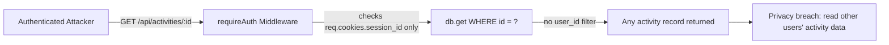
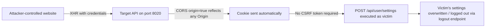
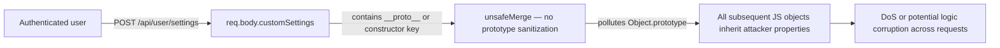

# Chained Vulnerability Static Audit Report

**Project**: app-20-fitness-tracker (Fitness Tracking API)  
**Auditor**: CodeGopher (Static-Only Audit)  
**Date**: 2026-05-25  
**Scope**: `src/` — `index.js`, `referenceGuards.js`, `package.json`, `Dockerfile`

---

## Summary Dashboard

| Metric              | Value          |
|---------------------|----------------|
| **Total chains**    | 4            |
| **Max severity**    | **HIGH**       |
| **High chains**     | 1            |
| **Medium chains**   | 2            |
| **Low chains**      | 1            |
| **Authored areas**  | 2 source files |

### Reviewed Areas

| Area           | Files Reviewed                              |
|----------------|---------------------------------------------|
| Express server | `src/index.js` (110 lines)                  |
| Helpers        | `src/referenceGuards.js` (12 lines)         |
| Dependencies   | `package.json` (Express 4, sqlite3, cors, bcryptjs, cookie-parser) |
| Container      | `Dockerfile` (Node 20-slim, npm start)      |

### Areas Not Reviewed

| Area           | Reason                                |
|----------------|---------------------------------------|
| Database migrations | None exist (in-memory SQLite)    |
| Frontend       | API-only service, no frontend files   |
| Tests          | No test files found (`*.test.*`, `*.spec.*` absent) |
| CI/CD configs  | None in workspace                     |
| Environment vars | No `.env` or config files found     |
| Third-party vulnerabilities | Not scanned (static-only scope) |

---

## Methodology & Safety Note

This audit follows a **static-only, source-code-only** approach:

- ✅ Read all source files, configuration, and Dockerfile in the workspace.
- ✅ Mapped attack surface from route definitions and middleware.
- ✅ Identified weaknesses from control flow, data flow, and configuration analysis.
- ✅ Synthesized attack chains using static evidence only.
- ❌ No live probes, no dynamic scanning, no exploit scripts, no external network tests.
- ❌ No executable payloads or operational abuse instructions.

---

## Attack Surface Map

```
Public Entry Points (no auth):
  POST /api/auth/register   → user-controlled username + password
  POST /api/auth/login      → user-controlled username + password
  POST /api/auth/logout     → relies on cookie

Authenticated Entry Points:
  GET  /api/activities      → filters by req.user.id
  GET  /api/activities/:id  → filters by :id ONLY (no user_id check)
  POST /api/user/settings   → user-controlled customSettings object

Infrastructure:
  In-memory SQLite database (:memory:)
  In-memory session store (sessions object)
  Cookie-based sessions (httpOnly cookie: session_id)
  CORS: origin=true, credentials=true (reflects any Origin header)
  Port 8020 (from Dockerfile)
```

---

## Mermaid Attack Graphs

### Chain 1 — IDOR on Single Activity (HIGH)



### Chain 2 — CORS + No CSRF → Authenticated Action Forging (MEDIUM)



### Chain 3 — Prototype Pollution via /api/user/settings (MEDIUM)



### Chain 4 — Predictable Session IDs (LOW)

```mermaid
flowflow LR
  A[Victim logs in] -->|POST /api/auth/login| B[Math.random().toString(36) for session ID]
  B -->|PRNG is browser-equivalent, not CSPRNG| C[Session ID somewhat predictable]
  C -->|Combined with Chain 2's CSRF lack| D[Attacker may guess session cookie]
  D --> E[Unauthorized access as predicted user]
```

---

## Detailed Chain Breakdown

---

### 🔴 Chain 1 — IDOR on Single Activity Endpoint (HIGH)

| Attribute     | Detail                                                                      |
|---------------|-----------------------------------------------------------------------------|
| **Severity**  | HIGH                                                                        |
| **Confidence**| **High** — every link is statically provable from source code               |
| **Reachability**| Any authenticated user; no additional preconditions                      |

**Source / Entry Point**

- **File**: `src/index.js`
- **Line**: ~89–97
- **Symbol**: `app.get('/api/activities/:id', ...)`

```javascript
app.get('/api/activities/:id', requireAuth, (req, res) => {
  const activityId = req.params.id;
  db.get('SELECT * FROM activities WHERE id = ?', [activityId], (err, row) => {
    // ...
    res.json(row);
  });
});
```

**Hop 1 — Insufficient Authorization Check**

- **File**: `src/index.js`
- **Line**: ~67–71
- **Symbol**: `requireAuth`

```javascript
function requireAuth(req, res, next) {
  const user = getSessionUser(req);
  if (!user) {
    return res.status(401).json({ error: 'Unauthorized: Authentication required.' });
  }
  req.user = user;
  next();
}
```

Evidence: `requireAuth` verifies the user is logged in but does **not** verify that `req.user.id` owns the requested resource.

**Sink — Unscoped Database Query**

- **File**: `src/index.js`
- **Line**: ~91
- **Evidence**: The SQL query `SELECT * FROM activities WHERE id = ?` filters only by the activity ID. The authenticated user's ID (`req.user.id`) is never used in the WHERE clause.

By contrast, the list endpoint at line ~80 uses `WHERE user_id = ?` correctly — the single-item endpoint does not.

**Preconditions**

- Attacker must have a valid session (can register an account for free).
- Activity IDs are sequential (seeded 1, 2), making enumeration trivial.

**Impact**

Any authenticated user can read **any** activity record by enumerating integer IDs. This exposes other users' exercise type, duration, date, and calorie data — a personal data privacy breach.

**Remediation**

Add `AND user_id = ?` to the WHERE clause:

```javascript
db.get('SELECT * FROM activities WHERE id = ? AND user_id = ?', [activityId, req.user.id], ...)
```

---

### 🟡 Chain 2 — CORS Misconfiguration + Missing CSRF (MEDIUM)

| Attribute     | Detail                                                                       |
|---------------|------------------------------------------------------------------------------|
| **Severity**  | MEDIUM                                                                       |
| **Confidence**| **Medium** — chain logic is provable in source; effectiveness depends on victim behavior at runtime |
| **Reachability**| Any remote attacker can initiate; requires victim to be authenticated      |

**Source / Entry Point**

- **File**: `src/index.js`
- **Line**: ~13
- **Symbol**: `app.use(cors({ origin: true, credentials: true }))`

Evidence: `origin: true` in the CORS Express middleware reflects the incoming `Origin` header back as `Access-Control-Allow-Origin`, allowing **any** origin. Combined with `credentials: true`, the browser will send cookies (including `session_id`) with cross-origin requests.

**Hop 1 — No CSRF Protection**

- **File**: `src/index.js`
- **Lines**: All POST endpoints
- **Evidence**: No `csrf` middleware (e.g., `csurf`), no SameSite cookie attribute, no custom token header verification on any state-changing endpoint (`/api/auth/register`, `/api/auth/login`, `/api/auth/logout`, `/api/user/settings`).

State-changing authenticated endpoints:

| Endpoint                | Effect                                   |
|-------------------------|------------------------------------------|
| `POST /api/user/settings` | Overwrites user's custom settings       |
| `POST /api/auth/logout`   | Invalidates session, logs out victim    |
| `POST /api/auth/register` | Creates a new account                  |

**Sink — Authenticated Action Forging**

- **Impact**: An attacker can craft a malicious web page that, when loaded by an authenticated victim, sends cross-origin requests to the API using the victim's cookies. This allows:
  - Forcing logout (`/api/auth/logout` — denial of service for the victim)
  - Modifying user settings (`/api/user/settings`)
  - Registering new accounts (`/api/auth/register`)
- **Note**: `/api/auth/login` requires the attacker to know the victim's password, so it cannot be forged via CSRF alone.

**Preconditions**

- Victim must have an active session cookie.
- Victim must load the attacker-controlled page while authenticated.

**Remediation**

1. Restrict CORS to a known list of allowed origins (do not use `origin: true` with `credentials: true`).
2. Add a CSRF token to all state-changing POST endpoints (e.g., `csurf` middleware or custom double-submit cookie pattern).
3. Set `SameSite=Strict` or `SameSite=Lax` on the session cookie.

---

### 🟡 Chain 3 — Prototype Pollution via User Settings (MEDIUM)

| Attribute     | Detail                                                                      |
|---------------|-----------------------------------------------------------------------------|
| **Severity**  | MEDIUM                                                                      |
| **Confidence**| **Medium** — the vulnerability is statically provable; exploitation outcome depends on runtime object lifecycle |
| **Reachability**| Any authenticated user via `POST /api/user/settings`                  |

**Source / Entry Point**

- **File**: `src/index.js`
- **Lines**: ~110–114
- **Symbol**: `app.post('/api/user/settings', ...)`

```javascript
app.post('/api/user/settings', requireAuth, (req, res) => {
  const { customSettings } = req.body;
  // ...
  const updatedConfig = unsafeMerge(baseConfig, customSettings);
```

**Hop 1 — Unsanitized Recursive Merge**

- **File**: `src/index.js`
- **Lines**: ~78–86
- **Symbol**: `unsafeMerge`

```javascript
function unsafeMerge(target, source) {
  for (let key in source) {
    if (source[key] && typeof source[key] === 'object' && !Array.isArray(source[key])) {
      if (!target[key]) target[key] = {};
      unsafeMerge(target[key], source[key]);
    } else {
      target[key] = source[key];
    }
  }
  return target;
}
```

Evidence: The function iterates with `for...in` (which enumerates prototype chain properties) and assigns any key from `source` directly to `target` without checking for `__proto__`, `constructor`, or `prototype`. Sending:

```json
{"customSettings": {"__proto__": {"polluted": true}}}
```

would set `Object.prototype.polluted = true`, affecting all subsequent object creation.

**Hop 2 — Cross-Request Impact**

- **Evidence**: Since the session store and all objects use plain JavaScript objects inheriting from `Object.prototype`, prototype pollution on one request can affect object behavior on subsequent requests.

**Sink — Global Object State Corruption**

- **Impact**: Denial of service (objects get unexpected properties), potential logic errors in future request processing. In a more complex application, this could lead to privilege escalation or arbitrary code execution.
- In this specific codebase, there is no direct path to role escalation because roles are stored in explicit session object properties, not on the prototype. The primary impact is DoS and data integrity degradation.

**Preconditions**

- Attacker must be authenticated.
- The application must process subsequent requests after the pollution payload.

**Remediation**

Use a safe merge library (e.g., `lodash.merge`) or add prototype guards:

```javascript
function safeMerge(target, source) {
  for (let key of Object.keys(source)) {
    if (['__proto__', 'constructor', 'prototype'].includes(key)) continue;
    // ... merge logic
  }
}
```

---

### 🟢 Chain 4 — Predictable Session IDs + No CSRF (LOW)

| Attribute     | Detail                                                                      |
|---------------|-----------------------------------------------------------------------------|
| **Severity**  | LOW                                                                         |
| **Confidence**| **Low** — Math.random() predictability in Node.js is well-documented but exact output depends on V8 engine version and seeding state; combined with CSRF risk only lowers severity |
| **Reachability**| Requires either session prediction or combination with Chain 2          |

**Source / Entry Point**

- **File**: `src/index.js`
- **Line**: ~62
- **Symbol**: Session ID generation in login handler

```javascript
const sessionId = Math.random().toString(36).substring(2) + Math.random().toString(36).substring(2);
sessions[sessionId] = { id: user.id, username: user.username, role: user.role };
```

Evidence: `Math.random()` in V8 (Node.js) uses a seeded PRNG (not a cryptographically secure random source). In certain V8 versions, the seed can be recovered from observed outputs, making subsequent values predictable.

**Hop 1 — Cookie-Only Session Binding**

- **File**: `src/index.js`
- **Line**: ~64
- Evidence: `res.cookie('session_id', sessionId, { httpOnly: true })`

The session is bound only to an httpOnly cookie. An attacker who can predict the session ID could hijack the session without needing XSS.

**Sink — Unauthorized Access**

- **Impact**: If an attacker can predict or brute-force the session ID, they can authenticate as any user. Combined with Chain 2 (CSRF), the attacker doesn't even need to capture the cookie.
- **Why LOW severity**: Math.random() outputs are hard to predict without a large sample and knowledge of V8's internal state; the attack requires either statistical prediction or a known seed.

**Remediation**

Use a cryptographically secure session ID generator:

```javascript
const sessionId = crypto.randomBytes(32).toString('hex');
```

---

## Cross-Cutting Weaknesses (No Complete Chain)

These weaknesses are security-relevant but do not form a complete, independently impactful chain in the current codebase.

| Weakness                                | File              | Lines | Impact                                    |
|-----------------------------------------|-------------------|-------|-------------------------------------------|
| **Hardcoded seed credentials**          | `src/index.js`    | ~38-41| Plaintext passwords in source: `runner123`, `runner456`, `coach2026Secure!` |
| **Verbose registration error**          | `src/index.js`    | ~54   | "Username already exists." leaks user enumeration info |
| **No rate limiting on auth endpoints**  | `src/index.js`    | 51-65 | Unlimited login/register attempts (credential stuffing / brute force) |
| **In-memory session store**             | `src/index.js`    | ~49   | Sessions lost on restart; not scalable   |
| **No session expiration**               | `src/index.js`    | ~49, ~62| Sessions persist indefinitely until logout or process restart |
| **Seed data uses bcrypt hashSync**      | `src/index.js`    | ~45   | Synchronous hashing on main thread (minor DoS risk in production) |

### Hardcoded Seed Credentials — Detail

- **Lines 38–41**: Three accounts with plaintext passwords in source code:
  ```javascript
  const users = [
    { username: 'alice_runner', pass: 'runner123', role: 'CUSTOMER' },
    { username: 'bob_runner', pass: 'runner456', role: 'CUSTOMER' },
    { username: 'admin_coach', pass: 'coach2026Secure!', role: 'ADMIN' }
  ];
  ```
- While the passwords are hashed before storage, the plaintexts are visible in the source. This is a credential leakage risk if the source is committed to a public repository or included in Docker image layers.
- The admin account (`admin_coach` with role `ADMIN`) is particularly sensitive.

---

## Unknowns & Recommendations for Testing

### Tests to Add

1. **IDOR test**: Authenticate as `alice_runner`, then request `GET /api/activities/2` (which belongs to `bob_runner`). Should return 404.
2. **CSRF test**: Host a page that sends a POST to `/api/user/settings` from a different origin. Should be blocked.
3. **Prototype pollution test**: Send `{"customSettings": {"__proto__": {"isAdmin": true}}}` and verify no global state corruption.
4. **Session ID randomness test**: Generate 10,000 sessions and check entropy/unpredictability.
5. **Rate limiting test**: Send 1,000 login requests in rapid succession; should see throttling or 429s.
6. **CORS test**: Send requests from `http://evil.com` with `credentials: true`; should be rejected.

### Not-Reviewed Areas

| Area                         | Recommendation                              |
|------------------------------|---------------------------------------------|
| Dependency vulnerability scan| Run `npm audit` on `package-lock.json`      |
| SQL injection on params      | Current SQL uses `?` placeholders (safe)    |
| Input validation on register | `username` and `password` have no length/format constraints |
| Activity endpoint validation | POST/PUT endpoints for activities not present (future risk) |
| Logging & monitoring         | No audit logging of auth events             |
| Docker security              | No non-root user, no HEALTHCHECK, mutable image |

---

## Remediation Priority Summary

| Priority | Action                                                   | Chain(s) Broken                    |
|----------|----------------------------------------------------------|------------------------------------|
| **P0**   | Add `AND user_id = ?` to `/api/activities/:id` query    | Chain 1                            |
| **P1**   | Restrict CORS to specific origins; add CSRF protection  | Chain 2                            |
| **P1**   | Replace `unsafeMerge` with safe alternative or add prototype guards | Chain 3              |
| **P2**   | Use `crypto.randomBytes()` for session IDs              | Chain 4                            |
| **P2**   | Add rate limiting to `/api/auth/login` and `/register`  | Cross-cutting                      |
| **P3**   | Remove plaintext seed credentials; use environment variables for admin accounts | Cross-cutting |
| **P3**   | Add session expiration and `SameSite` cookie attribute   | Chain 4                            |

---

*Report written by CodeGopher — Static-Only Chained Vulnerability Audit. No live testing was performed. All findings are based on static analysis of source code, configuration, and container definitions in the workspace.*
