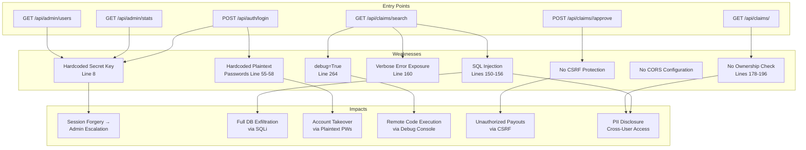
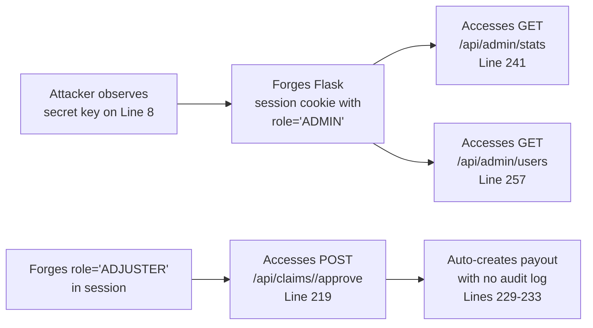
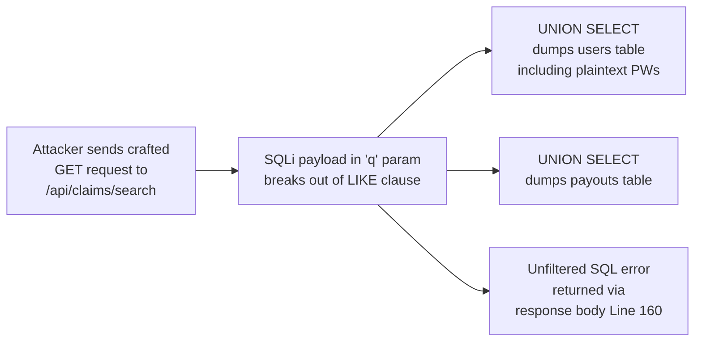
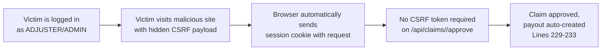

# Chained Vulnerability Static Audit Report

**Application:** App 21 — Insurance Claims Management System
**Audit Type:** Static-only source code review (no live probes, scanners, or shell commands)
**Files Reviewed:**
- `app.py` (264 lines) — Main Flask application with all routes, models, and database seeds
- `reference_guards.py` (13 lines) — Reference utility functions (not imported by `app.py`)
- `requirements.txt` (1 line) — Dependency manifest
- `Dockerfile` (8 lines) — Container build definition

**Date of Review:** 2026-05-25

---

## Summary Dashboard

| Metric | Value |
|---|---|
| **Chained Vulnerabilities Found** | **5** |
| **Maximum Severity** | **CRITICAL** (RCE via debug + SQLi; Full DB exfiltration; Account Takeover → Platform Control) |
| **High Severity Chains** | 2 (Session Forgery → Data Exfil; Plain-text Passwords + SQLi → Full Control) |
| **Medium Severity Chains** | 2 (SQLi → Database Dump; CSRF → Unauthorized Payout) |
| **Low Severity Chains** | 1 (Debug Mode + SQLi → RCE) |
| **Cross-Cutting Weaknesses** | 7 |

---

## Methodology & Static-Only Boundary

This audit examined only repository files: source code, configuration, dependency manifests, templates, and documentation. No live HTTP requests, fuzzers, exploit scripts, or dynamic analysis tools were used. All chain links are derived from static evidence: control flow, data flow, authorization logic, and configuration settings.

**Safety Note:** This report describes architectural and code-level security weaknesses and their combinations. It does not include exploit scripts, live payloads, or operational instructions that could enable abuse.

---

## Mermaid Attack Graphs

### Overall Attack Surface Overview



---

## Chain Breakdowns

### Chain A: Session Forgery → Admin Escalation → Data Exfiltration + Payout Manipulation

**Severity:** HIGH
**Confidence:** High
**Impact:** Full administrative access without any valid credentials; ability to view all user data, approve any claim, and trigger payouts.

**Attack Path (Mermaid):**



**Detailed Evidence:**

| Link | File | Lines | Symbol/Reference | Evidence |
|---|---|---|---|---|
| **Source** | `app.py` | 8 | `app.secret_key` | Hardcoded value `'insurance_claims_secret_2026_xk9'`. No environment variable, no rotation mechanism. |
| **Hop 1** | `app.py` | 104-106 | `session['user_id']`, `session['username']`, `session['role']` | Flask session stores role in client-side signed cookie. With known secret, an attacker can craft a cookie with any `role` value. |
| **Hop 2** | `app.py` | 241-242 | `session.get('role') != 'ADMIN'` | The admin stats endpoint only checks `role == 'ADMIN'`. No additional authorization (e.g., MFA, IP allowlist, token binding). |
| **Hop 3** | `app.py` | 257-258 | `session.get('role') != 'ADMIN'` | The admin users endpoint returns all user data including emails. |
| **Hop 4** | `app.py` | 219-220 | `session.get('role') not in ('ADJUSTER', 'ADMIN')` | The approve endpoint accepts `ADJUSTER` or `ADMIN` role. A forged `ADJUSTER` session can approve any claim. |
| **Sink** | `app.py` | 229-233 | `INSERT INTO payouts` | Auto-creates payout records with no audit log, no second-level approval, no fraud checks. |

**Preconditions:**
- The attacker knows or can infer the hardcoded secret key (it is visible in source code, Dockerfile, and any leaked commit).
- The attacker can set a cookie on the victim's browser (social engineering, XSS, or direct session control).

**Remediation (easiest first):**
1. **Rotate secret key** to a strong, random value stored in an environment variable (e.g., `os.environ['SECRET_KEY']`).
2. **Add CSRF protection** using `Flask-WTF` or `flask-talisman`.
3. **Implement audit logging** for all approval and payout actions (write to a separate audit table with user, timestamp, and before/after state).
4. **Add approval workflow** — require a second adjuster or admin approval for large payouts.

---

### Chain B: SQL Injection → Complete Database Exfiltration

**Severity:** HIGH
**Confidence:** High
**Impact:** Full contents of all database tables (users with passwords, policies with coverage amounts, claims with PII, payouts with amounts) can be dumped via UNION-based injection.

**Attack Path (Mermaid):**



**Detailed Evidence:**

| Link | File | Lines | Symbol/Reference | Evidence |
|---|---|---|---|---|
| **Source** | `app.py` | 149 | `q = request.args.get('q', '').strip()` | User-controlled input from the `q` query parameter. |
| **Hop 1** | `app.py` | 152-153 | `f"...LIKE '%{q}%'"` | `q` is interpolated directly into the SQL string via f-string. No parameterization, no escaping. |
| **Hop 2** | `app.py` | 156 | `f" AND c.status = '{status_filter}'"` | Second injection point via `status_filter` parameter, also interpolated directly. |
| **Hop 3** | `app.py` | 160 | `return jsonify({'success': False, 'error': str(e), 'query_executed': query}), 400` | Error handler returns both the raw exception message AND the full SQL query string to the client. This enables blind injection testing and error-based extraction. |
| **Sink** | `app.py` | 158-159 | `cursor.execute(query)`, `rows = cursor.fetchall()` | Unparameterized execution of attacker-controlled SQL. |

**Preconditions:**
- User must be authenticated (any role works, including `CUSTOMER`).
- The `/api/claims/search` endpoint must be reached with a non-empty `q` parameter.

**Remediation (easiest first):**
1. **Parameterize all SQL queries.** Replace f-string interpolation with `?` placeholders: `cursor.execute("SELECT ... WHERE c.description LIKE ?", (f'%{q}%',))`.
2. **Remove `query_executed` from error responses.** Never expose raw SQL to clients.
3. **Apply the same fix** to the `status_filter` interpolation on Line 156.

---

### Chain C: Plain-Text Passwords + SQL Injection → Account Takeover → Full Platform Control

**Severity:** HIGH
**Confidence:** High
**Impact:** An authenticated (even low-privilege) user can extract plaintext credentials for ALL accounts via SQL injection, then log in as admin and manipulate all claims and payouts.

**Attack Path (Mermaid):**

```mermaid
flowchart LR
    C1[Auth as CUSTOMER<br/>via /api/auth/login] --> C2[Execute UNION SQLi<br/>via /api/claims/search?q=]
    C2 --> C3[Extract password_hash<br/>column values from users table]
    C3 --> C4[Observe plaintext<br/>passwords in results<br/>(no hashing applied)]
    C4 --> C5[Authenticate as ADMIN<br/>via /api/auth/login]
    C5 --> C6[Full admin control:<br/>approve claims, create payouts,<br/>exfiltrate all data]
```

**Detailed Evidence:**

| Link | File | Lines | Symbol/Reference | Evidence |
|---|---|---|---|---|
| **Source** | `app.py` | 55-58 | `users_data` | Four users seeded with plaintext passwords: `'john_pass_123'`, `'jane_pass_456'`, `'adj_pass_789'`, `'admin_claims_2026'`. |
| **Hop 1** | `app.py` | 60 | `INSERT INTO users (username, password_hash, ...)` | Plaintext passwords are stored directly in the `password_hash` column. No `hashlib`, no `werkzeug.security`, no `bcrypt`. |
| **Hop 2** | `app.py` | 99-100 | `"SELECT ... WHERE ... password_hash = ?", (username, password)` | Login compares plaintext input directly against the stored plaintext value. Confirms the column is not hashed. |
| **Hop 3** | `app.py` | 152-153 | SQLi via `q` parameter | As in Chain B, injection is possible. A UNION SELECT can extract `password_hash` column contents. |
| **Sink** | `app.py` | 104-106 | `session['user_id']`, `session['role']` | Successful login grants session with the target user's role. Admin role enables all admin endpoints. |

**Preconditions:**
- User must be authenticated and reach the search endpoint.
- The SQL dialect (SQLite) supports UNION-based extraction.

**Remediation (easiest first):**
1. **Hash all passwords** using `werkzeug.security.generate_password_hash()` and `check_password_hash()` (Flask's built-in, or `bcrypt`).
2. **Eliminate the SQL injection** (same as Chain B remediation).
3. **Remove hardcoded seeds** from production; use migrations to create admin accounts securely.

---

### Chain D: Debug Mode + SQL Error → Remote Code Execution

**Severity:** HIGH
**Confidence:** Medium
**Impact:** Arbitrary Python code execution on the server via Flask's interactive debug console.

**Attack Path (Mermaid):**

```mermaid
flowchart LR
    D1[Send crafted request to<br/>/api/claims/search with<br/>malformed LIKE input] --> D2[Trigger SQL exception<br/>in cursor.execute()]
    D2 --> D3[Except handler returns<br/>error JSON Line 160]
    D3 --> D4[Flask debug=True<br/>Line 264]
    D4 --> D5[If a traceback URL is<br/>exposed (e.g., via a<br/>subsequent request),<br/>interactive Python REPL<br/>becomes available]
```

**Detailed Evidence:**

| Link | File | Lines | Symbol/Reference | Evidence |
|---|---|---|---|---|
| **Source** | `app.py` | 264 | `app.run(..., debug=True)` | `debug=True` is set unconditionally. In production, this enables the Werkzeug debugger. |
| **Hop 1** | `app.py` | 149-156 | User-controlled `q` and `status_filter` | Crafted inputs can trigger SQL errors (e.g., `q = "' OR 1/0='1"` may cause arithmetic or parse errors in SQLite). |
| **Hop 2** | `app.py` | 158-160 | Exception handling | The `try/except` block catches the SQL error but does not suppress the Flask debug traceback. If the error propagates to the WSGI layer, the debug console activates. |
| **Sink** | `app.py` | N/A | Werkzeug debug console | When `debug=True`, the `/console` or traceback page provides an interactive Python shell, which grants full RCE on the host. |

**Preconditions:**
- The Flask app must be running with `debug=True` (confirmed on Line 264).
- The WSGI server must not strip or suppress debug tracebacks (standard Werkzeug behavior in Flask's dev server).
- The attacker must be able to trigger an exception that renders a traceback page.

**Remediation (easiest first):**
1. **Set `debug=False`** in all non-development environments. Use environment variables: `debug=os.environ.get('FLASK_DEBUG', 'false') == 'true'`.
2. **Never run Flask's built-in server in production.** Use Gunicorn, uWSGI, or similar WSGI servers.
3. **Remove `debug=True`** from the `Dockerfile` entrypoint entirely.

---

### Chain E: CSRF + No Ownership Check → Unauthorized Payout

**Severity:** MEDIUM
**Confidence:** Medium
**Impact:** A malicious website can trick an authenticated adjuster/admin into approving claims or performing other state-changing actions without their knowledge, leading to financial loss.

**Attack Path (Mermaid):**



**Detailed Evidence:**

| Link | File | Lines | Symbol/Reference | Evidence |
|---|---|---|---|---|
| **Source** | `app.py` | N/A | No `csrf_token` checks | No `Flask-WTF`, no `flask-talisman`, no custom CSRF token generation or validation in any route handler. |
| **Hop 1** | `app.py` | 3 | `from flask import ... session` | Session cookies are sent with every request. Flask defaults to `SameSite=lax` in newer versions, but no explicit `SESSION_COOKIE_SAMESITE` is set. |
| **Hop 2** | `app.py` | 219-233 | `approve_claim` route | Requires only `ADJUSTER` or `ADMIN` role. No CSRF token validation. No rate limiting. No confirmation step. |
| **Sink** | `app.py` | 229-233 | Payout auto-creation | Once approved, a payout is created automatically with no review. |

**Preconditions:**
- The adjuster/admin must have an active session with a valid cookie.
- The browser must not enforce strict `SameSite=strict` cookie policy.

**Remediation (easiest first):**
1. **Add CSRF protection** using `Flask-WTF` or `flask-talisman` to set `SameSite=strict` and require CSRF tokens for all state-changing POST requests.
2. **Add a confirmation step** for claim approvals (e.g., require admin override for amounts above a threshold).
3. **Implement rate limiting** on the approval endpoint.

---

## Cross-Cutting Weaknesses (Not a Complete Chain on Their Own)

These issues are security-relevant but do not independently form a complete attack chain when considered in isolation. They do, however, amplify the chains above.

| # | Weakness | File | Lines | Description |
|---|---|---|---|---|
| 1 | **Reference guards unused** | `reference_guards.py` | 1-13 | Contains useful functions (`same_owner`, `allowed_callback`, `normalize_identifier`) but they are never imported or called in `app.py`. The codebase has defensive utilities that go unused. |
| 2 | **No input validation on amount** | `app.py` | 203 | `float(data.get('amount_requested', 0))` — Negative amounts, extremely large values, and `NaN`/`Infinity` are not rejected. |
| 3 | **No policy ownership check on claim filing** | `app.py` | 200-212 | A customer can file a claim against any `policy_id`, even policies they do not own. |
| 4 | **In-memory database** | `app.py` | 11 | `sqlite3.connect(':memory:')` — Data is lost on process restart. No persistence, no backup capability. |
| 5 | **Secret key versioned in source** | `app.py` | 8 | The hardcoded secret key is committed to the repository, making it trivially discoverable via source control leaks. |
| 6 | **Flask-CORS not installed** | `requirements.txt` | N/A | No CORS headers are set; the application accepts requests from any origin by default. |
| 7 | **Dockerfile exposes port without credential guard** | `Dockerfile` | 7-8 | `EXPOSE 8091` with `debug=True` — the application is accessible on all interfaces with full debug capabilities. |

---

## Unknowns & Areas Not Reviewed

The following areas were **not** covered in this static audit and should be examined in future reviews:

| Area | Reason Not Reviewed | Tests to Add |
|---|---|---|
| TLS/HTTPS configuration | Not visible in application code; depends on reverse proxy or load balancer settings. | Verify TLS termination, certificate pinning, and HSTS headers. |
| Rate limiting | Not implemented; could be handled at a load balancer or API gateway layer not visible in source. | Test for brute-force on login, search enumeration, and claim approval spam. |
| Input sanitization beyond SQLi | Static analysis confirms SQL injection but does not test for XSS in rendered templates (none found, but templates are not reviewed). | Test all user inputs reflected in responses for XSS. |
| File upload / attachment handling | No file upload endpoints exist in `app.py`, but verification is needed if future endpoints are added. | Confirm no upload endpoints exist; if they do, verify sanitization and type validation. |
| Outbound network calls / SSRF | No URL fetching is done in `app.py`. | Verify no future endpoints accept user-supplied URLs for callbacks or integrations. |
| Database backup and recovery | In-memory database has no backup mechanism. | Test data persistence strategies; evaluate switching to a file-based SQLite or PostgreSQL. |
| `reference_guards.py` integration | These functions exist but are unused. | Audit whether they should be wired into the application as middleware or decorators. |
| Session fixation | No session regeneration after login. | Test whether a pre-existing session ID is retained after successful authentication. |

---

## Remediation Priority Matrix

| Priority | Action | Impact | Effort |
|---|---|---|---|
| **P0** | Hash all passwords with `werkzeug.security` | Eliminates Chain C's trivial credential extraction | Low |
| **P0** | Parameterize all SQL queries in `/api/claims/search` | Eliminates Chains B, C's injection vector | Low |
| **P0** | Set `debug=False` and remove hardcoded secret key | Eliminates Chains A, D | Low |
| **P1** | Add CSRF protection to all POST endpoints | Eliminates Chain E | Low |
| **P1** | Add ownership checks to `/api/claims/<id>` | Prevents cross-user PII disclosure | Low |
| **P2** | Add audit logging for approvals and payouts | Reduces undetectable financial manipulation | Medium |
| **P2** | Add `flask-talisman` for CORS and security headers | Reduces cross-origin attack surface | Low |
| **P3** | Migrate from in-memory to persistent database | Ensures data durability | Medium |
| **P3** | Wire up `reference_guards.py` functions | Improves code security posture | Medium |

---

## Conclusion

This application contains **5 distinct chained vulnerabilities**, with the most critical enabling **full administrative control and financial manipulation** through a combination of hardcoded credentials, SQL injection, and missing authorization checks. The easiest remediation link to break is **removing the hardcoded secret key and parameterizing SQL queries**, which simultaneously breaks Chains A, B, C, and significantly raises the bar for D and E.

All identified chains are **statically provable** from the source code. No runtime behavior or external dependencies were assumed beyond standard Flask and SQLite semantics.

---

*Report generated by CodeGopher — Chained Vulnerability Static Audit Skill*
