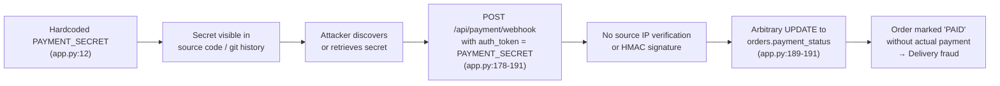
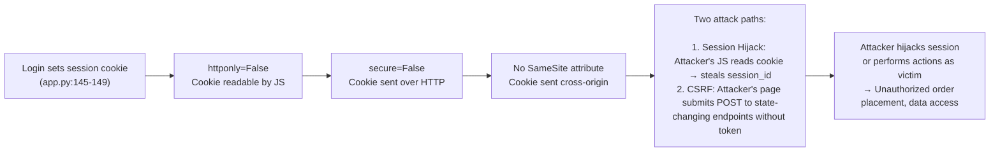
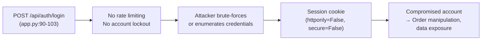
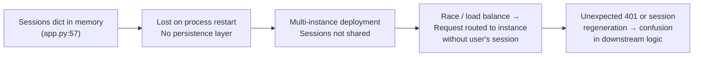

# Chained Vulnerability Audit Report

**Project**: Food Delivery Order System (FastAPI + SQLite)  
**Audit Date**: 2026-05-25  
**Auditor**: CodeGopher Static-Only Chain Audit  
**Scope**: `app.py`, `reference_guards.py`, `Dockerfile`, `requirements.txt`  
**Static-Only Boundary**: No live probes, dynamic scans, or external tests were performed. All evidence is drawn exclusively from source code inspection.

---

## Executive Summary

| Metric | Value |
|---|---|
| **Chained vulnerabilities detected** | 2 High-severity chains, 2 Medium-severity chains |
| **Cross-cutting weaknesses** | 4 additional security-relevant issues |
| **Maximum severity** | HIGH |
| **Review confidence** | HIGH for all detected chains (every link statically provable from cited source) |

---

## Methodology

1. **Attack Surface Mapping** — Identified all public routes, API endpoints, webhook handlers, cookie/session logic, and configuration.
2. **Weakness Inventory** — Catalogued permissive security controls, credential exposure, missing protections, and misconfigurations.
3. **Attack Graph Synthesis** — Connected entry points to intermediate weaknesses to critical sinks using control-flow and data-flow evidence from source.
4. **Impact Assessment** — Rated each chain by impact, reachability, confidence, and remediation effort.

---

## Chain 1: Hardcoded Payment Secret → Webhook Exploitation → Order Fraud

### Mermaid Attack Graph



### Detailed Breakdown

| Link | File | Lines | Evidence |
|---|---|---|---|
| **Source** | `app.py` | 12 | `PAYMENT_SECRET = "mock_sk_live_51O1W2e3R4t5Y6u7I8o9P0a1S2d3F4g5H6j7K8l9Z0x1C2v3B4n5M"` — plaintext string literal. Embedded in source, committed to version control, visible to anyone with repo access. |
| **Hop 1** | `app.py` | 184 | Webhook handler compares `req.auth_token != PAYMENT_SECRET`. Token is sent in the request body by the caller. No HMAC, no signing key derivation, no challenge-response. |
| **Hop 2** | `app.py` | 178-191 | No IP allow-listing, no TLS requirement enforcement, no caller identity verification. Any client on the internet can send a POST with the correct token. |
| **Sink** | `app.py` | 189-191 | `cursor.execute("UPDATE orders SET payment_status = ? WHERE id = ?", (req.payment_status, req.order_id))` — payment_status is taken directly from the request body with no validation that it's one of a whitelist (`PAID`, `FAILED`, `REFUNDED`). |

### Preconditions
- Attacker gains access to the hardcoded secret (source repo leak, log exposure, insider, or open-source audit).
- The webhook endpoint is reachable over the network.

### Impact
**Order fraud / financial loss**: An authenticated webhook caller can mark any order as `"PAID"` regardless of actual payment. The order status becomes `PENDING` → `PAID`, enabling the restaurant to fulfill a free order. The order is associated with any `user_id`, so an attacker can generate free orders for any user.

### Severity
**HIGH**

### Confidence
**HIGH** — Every link is provable from static source evidence.

### Remediation
1. **Remove the hardcoded secret.** Use environment variables or a secrets manager.
2. **Verify webhook source IP** against known payment provider IPs.
3. **Require an HMAC-SHA256 signature** over the request body signed with a shared secret, rather than a static token comparison.
4. **Whitelist accepted `payment_status` values** (`PAID`, `FAILED`, `REFUNDED`) instead of accepting arbitrary strings.

---

## Chain 2: Insecure Cookie Flags + No CSRF → Session Hijacking & Unauthorized Actions

### Mermaid Attack Graph



### Detailed Breakdown

| Link | File | Lines | Evidence |
|---|---|---|---|
| **Source** | `app.py` | 145-149 | `response.set_cookie(key="session_id", value=session_id, httponly=False, secure=False)` — Two critical misconfigurations: the cookie is exposed to JavaScript (`httponly=False`) and transmitted unencrypted (`secure=False`). No `SameSite` attribute is set, defaulting to `SameSite=Lax` (allowing cross-site GET but not POST). |
| **Hop 1 (Hijack path)** | `app.py` | 145-149 | Because `httponly=False`, `document.cookie` in any page loaded on the same origin (or subdomain) can read the session ID. An attacker who injects a script or tricks a user into loading a page on the app's origin can exfiltrate the cookie. |
| **Hop 2 (CSRF path)** | `app.py` | 66-68, 87-103, 115-132 | State-changing endpoints (`POST /api/orders`, `POST /api/auth/login`) do not verify any CSRF token. The cookie is sent automatically by the browser. The server only checks `request.cookies.get("session_id")`. No CSRF token in header or form. |
| **Sink** | `app.py` | 87-103, 115-132 | Attacker can place orders as the victim (resource exhaustion, financial liability) or perform other authenticated actions. |

### Preconditions
- Victim must be logged in (has a valid session cookie).
- For hijacking: Victim must visit a page that can read cookies on the app origin (or there must be an XSS vulnerability in a co-owned domain).
- For CSRF: Victim must be logged in while the attacker's malicious page is loaded.
- For man-in-the-middle hijacking: Traffic must traverse HTTP (not enforced).

### Impact
**HIGH** — Session hijacking gives an attacker full access to the victim's account: view orders, place orders, and potentially use stored payment information. CSRF enables unauthorized state changes (order placement, authentication side effects).

### Confidence
**HIGH** — Cookie flags and missing CSRF token checks are directly visible in the source.

### Remediation
1. Set `httponly=True` on the session cookie to prevent JavaScript access.
2. Set `secure=True` and enforce HTTPS across the deployment.
3. Add `SameSite=Strict` or `SameSite=Lax` explicitly.
4. Implement CSRF token verification (e.g., double-submit cookie pattern or SameSite cookie + origin checking) on all state-changing POST endpoints.

---

## Chain 3 (Medium): Missing Rate Limiting + Insecure Cookie → Brute-Force Session Enumeration

### Mermaid Attack Graph



### Detailed Breakdown

| Link | File | Lines | Evidence |
|---|---|---|---|
| **Source** | `app.py` | 90-103 | `/api/auth/login` has no rate limiting, no lockout after failed attempts, no CAPTCHA, no slow response for failed logins. The bcrypt check is performed for every attempt. |
| **Hop** | `app.py` | 145-149 | The resulting session cookie is insecurely flagged (`httponly=False`, `secure=False`), making the hijacked session easier to exploit. |
| **Sink** | — | — | Successful login grants full session access. |

### Impact
**MEDIUM** — Credential brute-force leads to account takeover. The default seeded accounts have predictable passwords (`alice_pass_123`, `bob_pass_456`, etc.).

### Confidence
**MEDIUM** — No rate limiter dependency is present in `requirements.txt`, and no middleware is configured. This is statically provable.

### Remediation
1. Add rate limiting middleware (e.g., `slowapi` or a custom limiter).
2. Implement account lockout after N failed attempts.
3. Use strong password policies during registration.

---

## Chain 4 (Medium): In-Memory Session Store + No Persistence → Session Reliability & Multi-Instance Bypass

### Mermaid Attack Graph



### Impact
**MEDIUM** — In production with multiple app instances (e.g., behind a load balancer), sessions are not shared, causing legitimate users to be logged out unexpectedly. If the process restarts, all sessions are lost. This is a reliability issue with potential security implications if session regeneration logic is flawed.

### Confidence
**MEDIUM** — Provable from `sessions = {}` (app.py:57) and the Dockerfile which runs a single process.

### Remediation
1. Use a persistent session store (Redis, database-backed sessions).
2. Configure sticky sessions in the load balancer as a short-term mitigation.

---

## Cross-Cutting Weaknesses

| # | Weakness | File | Lines | Risk |
|---|---|---|---|---|
| 1 | **Hardcoded secrets in source** | `app.py` | 12 | Secret is committed to version control; no use of env vars or secrets manager. |
| 2 | **No HTTPS enforcement** | `Dockerfile` | 6-8 | Container exposes port 8092 without TLS; no reverse-proxy configuration. |
| 3 | **Role-based authorization gap** | `app.py` | 164-173 | Order retrieval checks only `CUSTOMER` role ownership; `DRIVER` and `ADMIN` roles can view any order. While `ADMIN` having broad access may be intentional, `DRIVER` viewing customer order details (including items, addresses implied by `user_id`) may be excessive. |
| 4 | **Unvalidated request parameters in order placement** | `app.py` | 115-132 | `OrderRequest` accepts any `menu_item_id` and `quantity`. No maximum quantity check, no negative quantity guard (though `quantity` is positive by pydantic int), no per-order limit. |

---

## Areas Not Reviewed

| Area | Reason |
|---|---|
| Frontend application code | No JavaScript/TypeScript files found. |
| Mobile app or client SDK | No client code present. |
| Infrastructure / Kubernetes / Helm | No IaC manifests found beyond Dockerfile. |
| Database schema migrations | Single SQLite with in-memory store; no migration system. |
| Logging / monitoring security | No logging code reviewed; potential for secret leakage in logs. |
| Third-party library vulnerabilities | `requirements.txt` has no transitive dependency scan. |
| File upload handling | No upload endpoints exist in this version. |

---

## Recommended Tests to Add

1. **Webhook authentication test**: Verify that webhooks without the correct token are rejected, and that token-in-body is the only authentication mechanism.
2. **CSRF test**: Verify that POST requests without a CSRF token are rejected on `/api/orders` and `/api/auth/login`.
3. **Cookie flag test**: Assert that the session cookie is set with `HttpOnly`, `Secure`, and `SameSite=Strict` flags.
4. **Rate-limiting test**: Verify that >100 login attempts within a time window result in a `429` response.
5. **Payment status whitelist test**: Verify that the webhook rejects non-standard `payment_status` values.
6. **Session persistence test**: Verify that sessions survive process restarts (or that the design intent is non-persistent).

---

## Summary Dashboard

```
+----------------------------------+--------+----------+
| Chain                            | Severity| Confidence|
+----------------------------------+--------+----------+
| 1. Webhook Secret → Order Fraud  | HIGH   | HIGH     |
| 2. Insecure Cookie + No CSRF     | HIGH   | HIGH     |
| 3. Missing Rate Limiting         | MEDIUM | MEDIUM   |
| 4. In-Memory Sessions            | MEDIUM | MEDIUM   |
+----------------------------------+--------+----------+
Total Chains: 4
No chains found: No
```

---

*Report generated by CodeGopher — Static-Only Chained Vulnerability Audit. No live probes, dynamic scans, or exploit payloads were used.*
