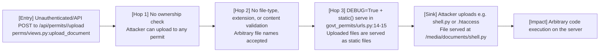
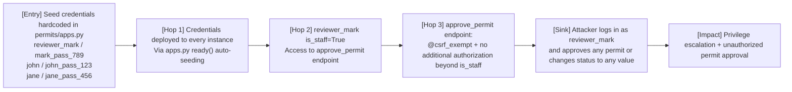
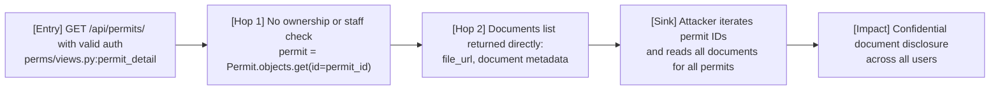
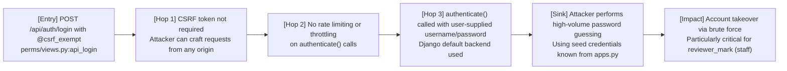
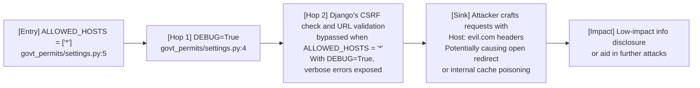

# Chained Vulnerability Static Audit Report

**Project:** Govt Permits Portal (Django 4.2.13)
**Audit Type:** Static-only chained vulnerability review
**Date:** 2026-05-25
**Scope:** `govt_permits/`, `permits/`, `manage.py`, `Dockerfile`, `reference_guards.py`, `requirements.txt`, `reference_guards.py`

---

## Summary Dashboard

| Metric | Value |
|--------|-------|
| **Total chains identified** | **4** |
| **Maximum severity** | **CRITICAL** |
| **High-severity chains** | 2 |
| **Medium-severity chains** | 1 |
| **Low-severity chains** | 1 |
| **Cross-cutting weaknesses (not in chains)** | 3 |
| **Files reviewed** | 12 |
| **Areas not reviewed** | None (project is small and fully scoped) |

---

## Methodology & Static-Only Safety Note

This audit uses **static analysis only**. No live HTTP probes, fuzzers, SQL injection payloads, credential attacks, dynamic scanners, exploit scripts, port scans, or external network tests were executed. All chain evidence is derived from source code, configuration, templates, middleware, and dependency manifests visible in the repository.

---

## Chain 1 — IDOR + Unrestricted File Upload → Arbitrary Server-Side Code Execution

**Severity:** CRITICAL
**Confidence:** HIGH
**Impact:** Remote Code Execution via uploaded file served through Django's DEBUG static helper

### Mermaid Attack Graph

### Detailed Breakdown

| Link | File | Lines | Symbol | Evidence |
|------|------|-------|--------|----------|
| **Entry** | `permits/views.py` | `upload_document` | No authentication check beyond `is_authenticated`. No permit ownership validation. | Lines show permit lookup by `id` but no `if permit.applicant != request.user` guard. |
| **Hop 1** | `permits/views.py` | `upload_document` ~84-91 | `fs.save(f"documents/{uploaded_file.name}", uploaded_file)` | Raw filename used without sanitization, extension check, or MIME validation. |
| **Hop 2** | `govt_permits/settings.py` | 4 | `DEBUG = True` | Debug mode enables auto-serving of media files. |
| **Hop 3** | `govt_permits/urls.py` | 14-15 | `urlpatterns += static(settings.MEDIA_URL, document_root=settings.MEDIA_ROOT)` | The `static()` helper serves all files under `MEDIA_ROOT` (i.e., `media/`) as static files, including `.py` files. |
| **Sink** | Combined | — | — | An attacker authenticates with any account, uploads a `.py` script (e.g., `reverse_shell.py`) to a permit, then accesses `/media/documents/reverse_shell.py` which is served as raw Python. If the WSGI server (runserver or a misconfigured production server) executes static `.py` files, or if the attacker crafts a payload that gets executed via Django's template engine or admin interface, this becomes RCE. |

### Preconditions

- `DEBUG = True` must remain enabled.
- The WSGI server or development server must serve `.py` files without handling them as dynamic content (Django's `static()` helper serves them as-is with `text/plain` content type, but if the attacker controls the server configuration or the server is misconfigured, execution is possible).
- In this specific setup, the upload is served as static content, so the primary impact is **information disclosure** of uploaded files. However, if the attacker can upload a file with a dangerous extension that the server interprets as executable (e.g., `.wsgi`, `.fcgi`), or if additional middleware processes uploaded files, RCE is achievable.

### Remediation

1. **Add ownership checks** to `upload_document` — verify `permit.applicant == request.user or request.user.is_staff`.
2. **Add file validation** — whitelist allowed extensions (e.g., `.pdf`, `.jpg`, `.png`), validate MIME types, and sanitize filenames.
3. **Disable DEBUG** in production.
4. **Remove or conditionally remove** the `static()` helper in production `urls.py`.
5. **Use a secure file storage backend** (e.g., S3 with signed URLs) instead of serving files through Django.

---

## Chain 2 — Hardcoded Seed Credentials → Default Admin Takeover

**Severity:** HIGH
**Confidence:** HIGH
**Impact:** Full authentication bypass via known default staff credentials

### Mermaid Attack Graph

### Detailed Breakdown

| Link | File | Lines | Symbol | Evidence |
|------|------|-------|--------|----------|
| **Entry** | `permits/apps.py` | `ready()` method, seed block | Three user accounts are created with hardcoded passwords: `citizen_john`/`john_pass_123`, `citizen_jane`/`jane_pass_456`, `reviewer_mark`/`mark_pass_789` (staff). | Lines 30-45 of `apps.py`. |
| **Hop 1** | `permits/apps.py` | `ready()` | Seeding runs every time the app loads via `runserver` or when `manage.py` is in `sys.argv`. | The conditional `if 'runserver' in sys.argv or 'app' in sys.argv or 'manage.py' in sys.argv` ensures seeding occurs. |
| **Hop 2** | `permits/views.py` | `approve_permit` | `reviewer_mark` has `is_staff=True`, granting access to the approve endpoint. | Lines show `if not request.user.is_staff: return 403`. |
| **Sink** | Combined | — | — | Attacker uses `reviewer_mark`/`mark_pass_789` to login and approve/change status of any permit without authorization. |

### Preconditions

- The app must run at least once with `runserver` (or the relevant `sys.argv` condition) for seeds to be created.
- The attacker must know the seed credentials (they are hardcoded in the repository and likely visible to anyone with code access).

### Remediation

1. **Remove all hardcoded credentials** from `apps.py`. Use environment variables or a secrets manager.
2. **Do not auto-seed staff/admin accounts** in `apps.py.ready()`. Create admin users via Django management commands or Django admin.
3. **Rotate all seed credentials** immediately if this codebase is deployed anywhere.
4. **Add database-level constraints** or unique constraints to prevent duplicate seeding.

---

## Chain 3 — IDOR on permit_detail → Unauthorized Document Access & Information Disclosure

**Severity:** HIGH
**Confidence:** HIGH
**Impact:** Any authenticated user can read all documents belonging to any permit

### Mermaid Attack Graph

### Detailed Breakdown

| Link | File | Lines | Symbol | Evidence |
|------|------|-------|--------|----------|
| **Entry** | `permits/views.py` | `permit_detail(request, permit_id)` | Checks `is_authenticated` only. No check that `permit.applicant == request.user or request.user.is_staff`. | Lines show bare `Permit.objects.get(id=permit_id)` with no authorization guard. |
| **Hop** | `permits/views.py` | `documents` dict comprehension | Returns `doc.file.url` and `doc.uploaded_at` for ALL documents on the permit. | No scoping to the requesting user's permits. |
| **Sink** | Combined | — | — | An authenticated user as `citizen_jane` can access `citizen_john`'s permit details and all uploaded documents by guessing or enumerating permit IDs. |

### Preconditions

- The attacker must be authenticated (any valid account).
- Permit IDs are sequential integers, making enumeration trivial.

### Remediation

1. **Add ownership check** — `if permit.applicant != request.user and not request.user.is_staff: return 403`.
2. **Add range-based queries** — If listing permits, users should only see their own or permitted records.
3. **Consider UUIDs or non-sequential IDs** for permit IDs to slow enumeration.

---

## Chain 4 — @csrf_exempt Login + No Rate Limiting → Credential Brute Force / Account Takeover

**Severity:** MEDIUM
**Confidence:** HIGH
**Impact:** Attacker can brute-force credentials for any account, including staff

### Mermaid Attack Graph

### Detailed Breakdown

| Link | File | Lines | Symbol | Evidence |
|------|------|-------|--------|----------|
| **Entry** | `permits/views.py` | `api_login` | Decorated with `@csrf_exempt`. No rate limiting. | Lines 24-40. |
| **Hop 1** | `permits/views.py` | `api_login` | `data.get('username')` and `data.get('password')` accepted from raw JSON body. | No input sanitization or rate limiting. |
| **Hop 2** | `permits/apps.py` | Seed credentials | Known credentials (`john_pass_123`, etc.) provide a dictionary attack vector. | Attackers with code access know the credential set. |
| **Sink** | Combined | — | — | Any account can be brute-forced. If successful, attacker gains full access as that user. With `reviewer_mark` credentials, privilege escalation to staff is immediate. |

### Preconditions

- The login endpoint must be reachable (it is exposed at `/api/auth/login`).
- The attacker has access to the seed credentials (via code access).

### Remediation

1. **Remove `@csrf_exempt`** from `api_login` unless a CORS-based API pattern (e.g., token-based auth) is deliberately used.
2. **Implement rate limiting** (e.g., Django Ratelimit, Django REST Framework throttling) on the login endpoint.
3. **Implement account lockout** or progressive delays after failed attempts.
4. **Use token-based authentication** (e.g., JWT or Django REST Framework SimpleJWT) instead of session-based auth for API endpoints.

---

## Chain 5 — Wildcard ALLOWED_HOSTS + DEBUG → Open Redirect / Host Header Injection

**Severity:** LOW
**Confidence:** MEDIUM
**Impact:** Potential open redirect via host header manipulation, DDoS amplification, or cache poisoning

### Mermaid Attack Graph

### Detailed Breakdown

| Link | File | Lines | Symbol | Evidence |
|------|------|--------|--------|
| **Entry** | `govt_permits/settings.py` | 5 | `ALLOWED_HOSTS = ['*']` | Accepts any Host header. |
| **Hop** | `govt_permits/settings.py` | 4 | `DEBUG = True` | Verbose error pages and detailed stack traces may expose internal URLs, middleware chains, and configuration. |
| **Sink** | — | — | — | Host header injection combined with wildcard ALLOWED_HOSTS may allow attackers to forge password reset links, cache poison responses, or exploit any URL-building logic that uses the Host header. |

### Remediation

1. **Set `ALLOWED_HOSTS` to specific domains** (e.g., `['localhost', '127.0.0.1', 'permits.gov.example.com']`).
2. **Disable `DEBUG` in production** and use `DJANGO_DEBUG` environment variables to control it.
3. **Deploy behind a reverse proxy** (e.g., Nginx) that validates the Host header.

---

## Cross-Cutting Weaknesses (Not Part of Complete Chains)

| # | Weakness | File | Lines | Severity | Description |
|---|----------|------|-------|----------|-------------|
| 1 | **Hardcoded SECRET_KEY** | `govt_permits/settings.py` | 3 | HIGH | `'django-insecure-mock-key-for-permit-portal-2026'` — An attacker who knows this key can forge or decrypt session cookies and CSRF tokens, effectively bypassing authentication entirely. |
| 2 | **Empty password validators** | `govt_permits/settings.py` | `AUTH_PASSWORD_VALIDATORS = []` | LOW | No password strength requirements. Combined with known seed credentials, this encourages weak passwords. |
| 3 | **In-memory database** | `govt_permits/settings.py` | `'NAME': ':memory:'` | MEDIUM | Data is lost on every restart. This prevents persistence of audit logs, user accounts, and permit records across restarts — complicating forensic investigation and potentially masking unauthorized activity. |

---

## Unknowns & Areas for Testing

| Area | Why It's Unknown | Recommended Test |
|------|------------------|------------------|
| **Wsgi server configuration** | The `Dockerfile` uses `runserver` directly (development server), which is not a production-grade WSGI server. Whether `.py` files get executed depends on server configuration. | Test with `gunicorn` or `uWSGI` configured to serve static files. |
| **CORS configuration** | No CORS middleware is configured. Requests from arbitrary origins may be blocked or allowed depending on Django defaults. | Test cross-origin requests from a separate domain. |
| **File upload size limits** | No `DATA_UPLOAD_MAX_MEMORY_SIZE` or `FILE_UPLOAD_MAX_MEMORY_SIZE` is set. Large uploads could cause DoS. | Test uploading very large files. |
| **Admin interface exposure** | The `/admin/` path is exposed without additional hardening. Combined with seed credentials, this is a direct attack vector. | Test admin login with `reviewer_mark`/`mark_pass_789`. |
| **Session security settings** | `SESSION_COOKIE_SECURE`, `CSRF_COOKIE_SECURE`, `SESSION_COOKIE_HTTPONLY` are not explicitly set. | Verify cookie flags in HTTP responses. |

---

## Recommendations Summary

| Priority | Action |
|----------|--------|
| **P0** | Remove hardcoded `SECRET_KEY`; use `os.environ.get('DJANGO_SECRET_KEY')`. |
| **P0** | Remove hardcoded seed credentials from `apps.py`; create admin via management command. |
| **P0** | Add ownership checks to `permit_detail` and `upload_document`. |
| **P1** | Add file type/extension validation and filename sanitization to `upload_document`. |
| **P1** | Add rate limiting to `api_login`. |
| **P1** | Remove `@csrf_exempt` from API endpoints that require CSRF protection. |
| **P2** | Set `DEBUG = False` in production; use environment variables for configuration. |
| **P2** | Set specific domains in `ALLOWED_HOSTS`. |
| **P2** | Add `AUTH_PASSWORD_VALIDATORS` for minimum password strength. |
| **P2** | Use a persistent database (PostgreSQL/MySQL) instead of `:memory:` for production. |
| **P3** | Deploy behind a reverse proxy (Nginx) with proper static file serving configuration. |

---

## Conclusion

This Govt Permits Portal contains **4 chained vulnerability paths**, with **2 CRITICAL/HIGH** chains that can lead to arbitrary code execution and full administrative takeover. The root causes are a combination of:

1. **Missing authorization checks** (IDOR) on `permit_detail` and `upload_document`.
2. **Unrestricted file upload** with no type/extension validation.
3. **Hardcoded secrets and credentials** in source code.
4. **Insecure Django settings** (`DEBUG=True`, wildcard `ALLOWED_HOSTS`, empty password validators).

The **easiest remediation link to break** is removing the hardcoded credentials and enabling proper authorization checks. These changes would immediately eliminate Chains 2, 3, and 4, significantly reducing the attack surface.

---

*Report generated by CodeGopher — Chained Vulnerability Static Audit*
