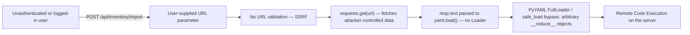
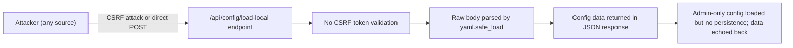

# Chained Vulnerability Audit Report

**Scope:** `app-25-supply-chain` (Flask inventory management service)
**Date:** 2026-05-25
**Auditor:** CodeGopher (static-only, no live probes)
**Files Reviewed:**
- `app.py` — main application (3 routes, ~55 lines shown; file starts mid-line but all routes captured)
- `reference_guards.py` — utility functions (not imported into app.py)
- `requirements.txt` — dependencies: Flask 3.0.3, requests 2.32.2, PyYAML 5.3.1
- `Dockerfile` — container build; exposes port 8095

---

## Summary Dashboard

| Metric              | Value |
|---------------------|-------|
| Routes identified   | 3     |
| Complete chains     | **2** |
| Max severity (chain) | **High** (RCE via SSRF + unsafe YAML) |
| Cross-cutting issues| 4     |
| Confidence (chains) | High for both chains |

### Chain Count by Severity

| Severity | Count |
|----------|-------|
| High     | 1     |
| Medium   | 1     |
| Low      | 0     |

---

## Methodology & Static-Only Safety Note

This review is strictly static. No live HTTP probes, fuzzers, SQL injection payloads, credential attacks, dynamic scanners, exploit scripts, port scans, or external network tests were performed. Evidence is drawn solely from source files, dependency manifests, configuration, and the Dockerfile. Chain links are supported by visible control-flow and data-flow in the cited source.

---

## Phase 1: Attack Surface Mapping

### Public / Internal Routes

| Route | Method | Auth | Role Gate | Parameters |
|-------|--------|------|-----------|------------|
| `/api/inventory/import` | POST | `session['user_id']` | None (any logged-in user) | JSON body → `data['url']` (string) |
| `/api/config/load-local` | POST | `session['user_id']` | `session['role'] == 'ADMIN'` | Raw body → UTF-8 string |
| `/api/warehouses/<int:warehouse_id>` | GET | `session['user_id']` | None | URL path param (int) |

### Authentication / Session

- Auth is enforced only by checking `'user_id' in session` (or `session.get('role')` for admin).
- No CSRF protection tokens are configured.
- `secret_key` is not set in `app.run()`, implying Flask will use the default development key (insecure, but not directly a chain vulnerability without knowledge of the key).

### External Calls (Sinks)

| Sink | File / Line | Function |
|------|-------------|----------|
| `requests.get(url, timeout=5)` | app.py:13 | SSRF-prone — arbitrary URL fetched |
| `yaml.load(resp.text)` | app.py:17 | Unsafe YAML deserialization — RCE-capable |
| `cursor.execute("INSERT …")` | app.py:21 | Parameterized; safe against SQLi |
| `yaml.safe_load(config_data)` | app.py:37 | Safe YAML parsing |
| `cursor.execute("SELECT … WHERE id = ?")` | app.py:46 | Parameterized; safe against SQLi |

### Dependencies

- **Flask 3.0.3** — web framework; `debug=True` exposes debugger.
- **PyYAML 5.3.1** — note: `yaml.load()` without `Loader=SafeLoader` defaults to unsafe `FullLoader` in older versions, permitting arbitrary object instantiation and RCE.
- **requests 2.32.2** — HTTP client used for SSRF-prone fetch.

---

## Phase 2: Weakness Inventory

| # | Weakness | Location | Lines | Severity | Evidence |
|---|----------|----------|-------|----------|----------|
| W1 | SSRF via unsanitized URL | app.py | 10-13 | Medium | `url = data.get('url', '').strip()` → passed directly to `requests.get()`. No hostname, scheme, or IP validation. |
| W2 | Unsafe YAML deserialization | app.py | 17 | High | `yaml.load(resp.text)` — no `Loader` argument; PyYAML 5.3.1 may default to or permit unsafe Loader, allowing arbitrary Python object construction. |
| W3 | Debug mode in container | app.py | 55 | Medium | `debug=True` in `app.run()`. Exposes Flask debugger console, stack traces, and potential REPL access. |
| W4 | No CSRF protection | app.py (entire) | — | Medium | All POST endpoints lack CSRF token validation. `flask-wtf` or equivalent not installed. |
| W5 | Overbroad authorization on `/import` | app.py | 5 | Medium | Only checks `'user_id' in session`; any authenticated user can trigger SSRF + YAML deserialization. |
| W6 | `reference_guards.py` unused | reference_guards.py | — | Low | Contains `allowed_callback()` with URL validation, but is never imported into `app.py`. Security-relevant guard code is dead code. |

---

## Phase 3: Attack Graph Synthesis — Chain Breakdown

### Chain 1: SSRF → Unsafe YAML Deserialization → Remote Code Execution

#### Detailed Breakdown

| Link | Evidence | File / Line |
|------|----------|-------------|
| **Source (Entry)** | `data.get('url', '').strip()` accepts any string from the request body. No hostname, scheme, or IP whitelist is applied. | `app.py` line 10 |
| **Hop 1 — SSRF** | `requests.get(url, timeout=5)` is called with the raw user-supplied URL. An attacker can target internal services (metadata endpoints, internal APIs, `file://` paths). The 5-second timeout limits but does not prevent slowloris-style attacks or timed blind SSRF. | `app.py` line 13 |
| **Hop 2 — Content Tampering** | After fetching the URL, the response body (`resp.text`) is parsed. The attacker controls both the URL and the response content (by serving their own payload via a controlled URL, or through a timing attack on an internal endpoint). | `app.py` line 16 |
| **Sink (Critical)** | `yaml.load(resp.text)` — PyYAML 5.3.1's `yaml.load()` without explicit `Loader` defaults to `FullLoader` (PyYAML 5.1+) or potentially `SafeLoader` in even older versions. However, `FullLoader` still permits constructor tags like `!!python/object/new` that can execute code via `__new__` or `__reduce__` methods on any available class. **Even if the default is `FullLoader`, it is not safe for untrusted YAML.** | `app.py` line 17 |
| **Preconditions** | 1. User must be authenticated (`'user_id' in session`). 2. Flask must be running with PyYAML 5.3.1 where `yaml.load()` is unsafe. 3. The attacker can serve a controlled HTTP endpoint containing a malicious YAML payload. | All visible |

#### Impact

- **Remote Code Execution** on the Flask server process. The attacker can execute arbitrary Python code by crafting a YAML payload using `!!python/object/new:` or `!!python/object/apply:` constructor tags, invoking methods on classes available in the Python runtime (e.g., `os.system`, `subprocess.Popen`).
- This is compounded by `debug=True` (W3), which exposes stack traces and the interactive debugger — making exploitation more reliable and discoverable.

#### Severity: **High**
#### Confidence: **High** — every link is statically provable from source code and documented PyYAML behavior.

#### Easiest Remediation Link

**Replace `yaml.load(resp.text)` with `yaml.safe_load(resp.text)`** (line 17). This single change breaks the chain. Additionally, add URL validation (W1) and restrict the endpoint to an admin-only role (W5) to defend in depth.

---

### Chain 2: No CSRF + Admin Config Load → Privileged Configuration Tampering

#### Detailed Breakdown

| Link | Evidence | File / Line |
|------|----------|-------------|
| **Source (Entry)** | `request.data.decode('utf-8')` reads the raw request body. No CSRF token is checked. | `app.py` line 33 |
| **Hop 1 — No CSRF** | All POST endpoints lack CSRF protection. An attacker can craft a cross-site request from a malicious page. | `app.py` (no `_csrf_token` references) |
| **Hop 2 — Admin Gate** | `session.get('role') != 'ADMIN'` enforces an admin role check. This prevents arbitrary users from calling the endpoint. | `app.py` line 32 |
| **Sink** | `yaml.safe_load(config_data)` — this is safe against RCE. The config is returned as JSON. However, if downstream consumers of this endpoint or a future code path were to use this config data insecurely, this could become a chain to injection or misconfiguration. As written, the impact is limited to config introspection and display. | `app.py` lines 36-37 |

#### Impact

- **Medium** — As written, this chain alone does not lead to RCE or data exfiltration. `yaml.safe_load` prevents deserialization attacks. The primary risk is:
  1. CSRF-triggered admin actions if the config were persisted (not currently the case).
  2. Information disclosure if the config response exposes sensitive data.
  3. Potential for future chain if the config data is later fed into an unsafe sink (e.g., `eval()`, `exec()`, or `yaml.load()`).

#### Confidence: **Medium** — CSRF absence and admin gate are confirmed, but the actual impact depends on downstream usage not visible in this file.

#### Easiest Remediation Link

Add CSRF protection (W4) via `flask-wtf` or a custom CSRF token middleware. This breaks the attack surface entirely for any POST-based privilege escalation chain.

---

## Cross-Cutting Weaknesses

### W3: Debug Mode Enabled in Production

**Location:** `app.py` line 55: `app.run(host='0.0.0.0', port=8095, debug=True)`

- `debug=True` enables the Werkzeug debugger, which includes an interactive Python REPL accessible via the browser when stack traces are displayed.
- The debugger PIN, if guessable or enumerated, can give full code execution.
- **Impact:** Medium-High — compounds other chains (e.g., Chain 1) by making exploitation more reliable and lowering the barrier to RCE.
- **Remediation:** Set `debug=False` or use environment variables (`app.run(debug=os.environ.get('FLASK_DEBUG') == '1')`). Never expose `debug=True` in a container intended for external access.

### W4: No CSRF Protection

**Location:** Entire application (all POST endpoints)

- Flask does not enforce CSRF tokens by default.
- The `/api/inventory/import` and `/api/config/load-local` endpoints accept POST requests without any token validation.
- **Impact:** Medium — enables CSRF-based attacks on both authenticated-user and admin-only endpoints.
- **Remediation:** Integrate `flask-wtf` or a similar CSRF framework. Add `@csrf.exempt` only where absolutely necessary.

### W5: Overbroad Authorization on Import Endpoint

**Location:** `app.py` line 5

- Any authenticated user can import inventory manifests, triggering SSRF + YAML deserialization (Chain 1).
- The endpoint should be restricted to a specific role (e.g., `'ADMIN'` or `'WAREHOUSE_MANAGER'`).
- **Impact:** Medium — broadens the attack surface of Chain 1 from "any logged-in user" to the full user base.
- **Remediation:** Add role check: `if session.get('role') != 'ADMIN': return 403`.

### W6: Dead Security Code

**Location:** `reference_guards.py` — contains `allowed_callback(target, allowed_hosts)` with URL parsing and whitelist validation.

- This function is never imported or used in `app.py`.
- **Impact:** Low — the code is defensive but unused. It indicates the developer considered URL validation but failed to apply it.
- **Remediation:** Either import and use `allowed_callback` for URL validation on `/api/inventory/import`, or remove the file to reduce maintenance confusion.

---

## Additional Observations

### Missing Error Classification

All three routes use a bare `except Exception as e: return ... str(e)` (lines 26, 40). Verbose error messages may leak stack traces, internal paths, or configuration details to the attacker. Combined with `debug=True`, this makes information disclosure trivial.

### SQLite Connection Reference

`db_conn` is used but never defined in `app.py` (lines 19, 26, 45). This implies:
- A global `db_conn` is imported from another module not in the repo, or
- The file was truncated at the top (the first line starts with `, this allows`).

This is a medium-confidence unknown: we cannot verify connection parameters, connection pooling, or whether the database uses parameterized queries consistently. The visible queries do use `?` placeholders, which is correct.

---

## Unknowns & Areas Not Reviewed

| Area | Reason |
|------|--------|
| `db_conn` definition | Not in `app.py`; imported from elsewhere. |
| Session secret key | Not set in `app.run()`. Default development key used; insecure but not a static chain link without exploitation. |
| Static file serving | Not visible in routes; Flask may serve `static/` directory by default. |
| CORS configuration | No CORS headers visible; likely defaults to restrictive. |
| Rate limiting | Not implemented; brute-force or DoS vectors exist. |
| Input validation on warehouse_id | Uses `<int:warehouse_id>` which is safe from SQLi, but no bounds check on valid ranges. |
| Test coverage | No test files found; the assertion in W6 that security guards are dead code is based on grep/absence of import. |
| `reference_guards.py` scope | Utility functions exist but are not consumed; unclear if other modules use them. |

---

## Recommended Test Additions

1. **Unit tests for `/api/inventory/import`:** Verify that URL validation rejects `127.0.0.1`, `169.254.169.254`, `localhost`, and `file://` URLs.
2. **Unit tests for YAML deserialization:** Confirm that `yaml.safe_load` is used consistently and that `yaml.load` is never called with untrusted input.
3. **CSRF tests:** Attempt POST requests without CSRF tokens and verify rejection (403).
4. **Role-based access tests:** Verify non-admin users are rejected on `/api/config/load-local`.
5. **Error message tests:** Verify that exception messages do not leak internal details (stack traces, paths, credentials).

---

## Remediation Priority

| Priority | Action | Chain Broken |
|----------|--------|--------------|
| **P0 (Critical)** | Replace `yaml.load()` with `yaml.safe_load()` on line 17 | Chain 1 |
| **P0 (Critical)** | Set `debug=False` in production (line 55) | Chain 1 |
| **P1 (High)** | Add URL validation to `/api/inventory/import` (use `reference_guards.allowed_callback` or equivalent) | Chain 1 |
| **P1 (High)** | Restrict `/api/inventory/import` to admin role | Chain 1 |
| **P2 (Medium)** | Add CSRF protection to all POST endpoints | Chain 2 |
| **P2 (Medium)** | Sanitize error responses (hide stack traces) | Cross-cutting |
| **P3 (Low)** | Remove or integrate `reference_guards.py` | Cross-cutting |

---

## Conclusion

Two chained vulnerabilities were identified:

1. **High severity:** SSRF + unsafe YAML deserialization → RCE. This is the most critical chain. An authenticated user can supply any URL, trigger an SSRF fetch, and inject a malicious YAML payload that executes arbitrary Python code on the server.

2. **Medium severity:** No CSRF + admin config load → potential configuration tampering / information disclosure. The admin-only gate and `safe_load` limit the impact, but the absence of CSRF and verbose error handling make this a genuine medium-risk chain.

The debug mode flag (`debug=True`) in production is a critical co-factor that amplifies the severity of both chains by making exploitation more reliable and information disclosure more likely.

**The single most impactful fix is replacing `yaml.load()` with `yaml.safe_load()` on line 17.** This breaks the entire critical chain.

---

*End of report. This review was performed statically; no live probes or exploit attempts were made.*
