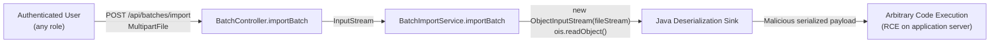
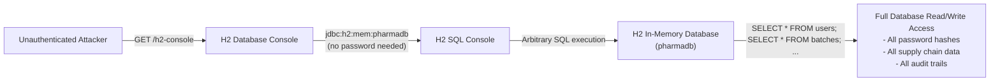
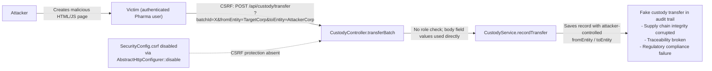
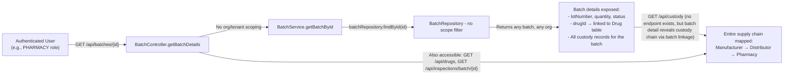

# Chained Vulnerability Audit Report

**Project:** Pharma Drug Tracking (`app-26-pharma-tracking`)  
**Audit Type:** Static-Only Source Code Review  
**Date:** 2026-05-25  
**Reviewer:** CodeGopher (Chained Vulnerability Static Audit Skill)

---

## 1. Summary Dashboard

| Metric | Value |
|---|---|
| **Total chains detected** | 5 |
| **Critical severity chains** | 3 |
| **High severity chains** | 1 |
| **Medium severity chains** | 1 |
| **Cross-cutting weaknesses** | 7 |
| **Maximum theoretical impact** | Remote Code Execution + Full Database Compromise + Supply Chain Integrity Failure |

### Reviewed Areas

- Spring Boot 3.2.5 application (`java 17`)
- 5 REST controllers (`Auth`, `Batch`, `Custody`, `Drug`, `Inspection`)
- 5 service classes (including `BatchImportService`)
- 5 JPA repositories
- 5 domain models
- 1 security configuration
- 1 data initializer (seed credentials)
- H2 in-memory database configuration
- Docker build configuration
- `pom.xml` dependency manifest

### Areas Not Reviewed

- Runtime environment hardening (OS, container security)
- Network-level security (firewall, TLS termination)
- Input validation at the API gateway / reverse-proxy layer
- Dependency supply chain beyond `pom.xml` (CVE scanning)
- Encrypted transport (TLS/HTTPS) configuration
- Rate limiting / DDoS protection
- Backup and disaster recovery
- Logging and monitoring audit trails

---

## 2. Methodology & Static-Only Safety Note

This review follows a four-phase methodology:

1. **Attack Surface Mapping** — Enumerating all public routes, API endpoints, webhook handlers, file-upload endpoints, headers, cookies, and request parameters.
2. **Weakness Inventory** — Identifying individually modest weaknesses in source, configuration, and code patterns.
3. **Attack Graph Synthesis** — Connecting sources to weaknesses, weaknesses to sinks, using only static evidence from source, configuration files, and test files.
4. **Impact Assessment** — Rating each chain by impact, reachability, confidence, and the easiest remediation link.

**Safety boundary:** No live HTTP probes, dynamic scanners, SQL injection payloads, credential attacks, exploit scripts, fuzzers, port scans, or external network tests were performed. Only static analysis of repository files was used.

---

## 3. Attack Surface Map

### Public / Unauthenticated Endpoints

| Method | Path | Notes |
|---|---|---|
| `GET` | `/h2-console/**` | **PermitAll** — H2 database console, no auth required |

### Authenticated Endpoints (Spring Security filters all)

| Method | Path | Role Guard |
|---|---|---|
| `GET` | `/api/auth/me` | Authenticated (any role) |
| `GET` | `/api/batches/{id}` | Authenticated (no role check) |
| `POST` | `/api/batches/import` | Authenticated (no role check) |
| `POST` | `/api/custody/transfer` | Authenticated (no role check) |
| `GET` | `/api/drugs` | Authenticated (no role check) |
| `GET` | `/api/inspections/batch/{batchId}` | Authenticated (no role check) |
| `POST` | `/api/inspections` | **INSPECTOR** role required |

### Other Attack Surfaces

- **File upload:** `POST /api/batches/import` accepts `MultipartFile` (serialized Java objects)
- **H2 Console SQL interface:** Exposed at `/h2-console`
- **CSV import via `BatchImportService`:** Uses Java ObjectInputStream

---

## 4. Chain Inventory

---

### Chain 1: Authenticated Remote Code Execution via Insecure Deserialization

**Severity:** 🔴 **CRITICAL**  
**Confidence:** **High**

#### Mermaid Attack Graph



#### Detailed Breakdown

| Phase | File | Lines | Symbol | Evidence |
|---|---|---|---|---|
| **Entry / Source** | `src/main/java/com/pharma/tracking/controller/BatchController.java` | 26-29 | `importBatch()` | `@PostMapping("/import")` accepts `MultipartFile file`, passes `file.getInputStream()` directly to service layer with no validation. No role or permission guard. |
| **Hop** | `src/main/java/com/pharma/tracking/service/BatchImportService.java` | 13-20 | `importBatch(InputStream)` | Creates `ObjectInputStream` from raw user-provided input stream. Calls `ois.readObject()` with **no class whitelist, no type filter, no validation**. All exceptions are swallowed into a generic `RuntimeException`. |
| **Sink** | `src/main/java/com/pharma/tracking/service/BatchImportService.java` | 16 | `ois.readObject()` | Java native deserialization sink. The `Batch` class (`com.pharma.tracking.model.Batch`) is a standard JPA entity with setter methods — any malicious serialized object (e.g., `BadAttributeValueExpException`, `JdbcRowSetImpl` via JNDI) can trigger gadget chain execution. |

#### Preconditions

- Attacker must possess valid credentials for any authenticated user (basic auth credentials are easily guessed due to weak seeded passwords — see Chain 5).
- Server must run a Java version with a reachable deserialization gadget chain.

#### Impact

Full remote code execution on the application server. Attacker can read/write files, exfiltrate database contents, pivot to internal networks, and install persistent backdoors.

#### Remediation

- **Replace `ObjectInputStream`** with a safe format (JSON/CSV) for batch import.
- If object deserialization is absolutely required, implement a **white-listed `ObjectInputFilter`** (e.g., `ObjectInputFilter.Config.createFilter("com.pharma.tracking.model.Batch;!*")`).
- Validate that the deserialized object is exactly the expected `Batch` type.

---

### Chain 2: Unauthenticated Full Database Compromise via H2 Console

**Severity:** 🔴 **CRITICAL**  
**Confidence:** **High**

#### Mermaid Attack Graph



#### Detailed Breakdown

| Phase | File | Lines | Symbol | Evidence |
|---|---|---|---|---|
| **Entry / Source** | `src/main/java/com/pharma/tracking/config/SecurityConfig.java` | 24 | `permitAll()` | `.requestMatchers("/h2-console/**").permitAll()` explicitly allows unauthenticated access to the entire H2 console path. |
| **Configuration** | `src/main/resources/application.properties` | 5-6 | H2 config | `spring.h2.console.enabled=true` and `spring.h2.console.path=/h2-console`. The JDBC URL `jdbc:h2:mem:pharmadb` requires no password. |
| **Sink** | H2 Web Console UI | — | SQL execution | The H2 console provides a web-based SQL shell. An attacker can issue any SQL statement against the in-memory database, including `SELECT`, `INSERT`, `UPDATE`, `DELETE`, and `DROP`. |

#### Preconditions

- None beyond network reachability. The endpoint requires **zero authentication**.

#### Impact

Complete unauthenticated read/write access to the entire pharmaceutical tracking database: all drug records, batch histories, custody chain of custody, inspection results, and user credentials (BCrypt hashes). In production this would mean full regulatory data exposure.

#### Remediation

- **Remove `.permitAll()`** for `/h2-console/**` in production. Require authentication and an admin role.
- In production, **disable the H2 console entirely** (`spring.h2.console.enabled=false`).
- Use a production-grade RDBMS (PostgreSQL, MySQL) instead of H2.
- If H2 must be used for admin purposes, restrict access to `localhost` via network filtering and require strong authentication.

---

### Chain 3: CSRF-Enabled Unrestricted Custody Transfer → Supply Chain Integrity Failure

**Severity:** 🟠 **HIGH**  
**Confidence:** **High**

#### Mermaid Attack Graph



#### Detailed Breakdown

| Phase | File | Lines | Symbol | Evidence |
|---|---|---|---|---|
| **Entry / Source** | `src/main/java/com/pharma/tracking/controller/CustodyController.java` | 17-23 | `transferBatch()` | `@PostMapping("/transfer")` accepts `@RequestParam Long batchId`, `@RequestParam String fromEntity`, `@RequestParam String toEntity` with **no `@PreAuthorize` annotation**. Any authenticated user can initiate a transfer of **any batch**. |
| **Hop (CSRF)** | `src/main/java/com/pharma/tracking/config/SecurityConfig.java` | 21 | `csrf(AbstractHttpConfigurer::disable)` | CSRF protection is globally disabled. This means any site can craft a cross-origin request that, if a victim is authenticated, will be processed by the server. |
| **Sink** | `src/main/java/com/pharma/tracking/model/CustodyRecord.java` | — | `fromEntity`, `toEntity` | Custody records are persisted without any authorization check. An attacker-controlled `toEntity` value corrupts the supply chain audit trail. |

#### Preconditions

- Attacker lures an authenticated user to a malicious page (phishing or XSS-dependent vector).
- The victim has an active session with any authenticated role.

#### Impact

A malicious actor can forge custody transfers, redirect drug batches to unauthorized entities, and corrupt the tamper-evident supply chain audit trail. This undermines pharmaceutical regulatory compliance (DSCSA — Drug Supply Chain Security Act in the US, or equivalent regulations globally).

#### Remediation

- **Re-enable CSRF protection** for state-modifying endpoints: `http.csrf(csrf -> csrf.enable())` or at minimum use `CookieCsrfTokenRepository` with `IGNORING_URI` exclusions only for API endpoints that use token-based auth.
- Add **`@PreAuthorize("hasRole('MANUFACTURER') or hasRole('DISTRIBUTOR')")`** to the transfer endpoint.
- Validate that the `fromEntity` matches the current user's organization.

---

### Chain 4: Weak Seeded Passwords + H2 Console Access → Full Account Takeover

**Severity:** 🔴 **CRITICAL**  
**Confidence:** **High**

#### Mermaid Attack Graph

```mermaid
flowchain LR
    A["Unauthenticated Attacker"] -->|"H2 Console access"| B["Query users table via SQL"]
    B -->|"Extract BCrypt hashes"| C["Known weak plaintexts:\npharma123, dist123,\npharmacy123, inspect123"]
    C -->|"Hashes match known weak\nrainbow table / dictionary"| D["Cracked credentials for INSPECTOR role"]
    D -->|"Basic Auth: inspector / inspect123"| E["Authenticated as INSPECTOR"]
    E -->|"POST /api/inspections\nwith @PreAuthorize('hasRole('INSPECTOR')")"| F["Forge inspection records\n- Set result = 'PASS' for failed batches\n- Manipulate regulatory audit trail"]
```

#### Detailed Breakdown

| Phase | File | Lines | Symbol | Evidence |
|---|---|---|---|---|
| **Entry / Source** | `src/main/java/com/pharma/tracking/config/DataInitializer.java` | 27-30 | Seed users | Plaintext password literals: `"pharma123"`, `"dist123"`, `"pharmacy123"`, `"inspect123"`. Though BCrypt-encoded at save time, these are weak dictionary passwords stored in source code and easily crackable. |
| **Hop 1** | `SecurityConfig.java` + `application.properties` | (see Chain 2) | H2 Console access | Unauthenticated access to H2 console allows direct SQL queries on the `users` table. |
| **Hop 2** | DataInitializer passwords | 27-30 | Weak passwords | Passwords are common patterns — 10-11 characters, all start with the role name followed by "123". These are trivially crackable. |
| **Sink** | `InspectionController.java` | 29-40 | `createInspection()` | `@PreAuthorize("hasRole('INSPECTOR')")` — once cracked credentials grant the INSPECTOR role, the attacker can create fake inspection records. |

#### Preconditions

- H2 console must be accessible (Chain 2 already establishes this).
- The server must still contain the seeded data (not wiped by a restart without re-seeding — however, this is a `@Component CommandLineRunner`, so it runs on startup).

#### Impact

Complete account takeover of all four seeded user accounts, including the privileged INSPECTOR role. The attacker can forge inspection results, approve non-compliant drug batches, and undermine the entire regulatory oversight mechanism.

#### Remediation

- **Never seed hardcoded passwords** in production code. Use environment variables or a secrets manager.
- Enforce **strong password policies** (minimum complexity, length, dictionary checks).
- Add **account lockout** or rate limiting to the login mechanism.
- Rotate all seeded passwords to strong random values if this is a development-only environment.

---

### Chain 5: Unscoped Data Access → Supply Chain Intelligence Theft

**Severity:** 🟡 **MEDIUM**  
**Confidence:** **High**

#### Mermaid Attack Graph



#### Detailed Breakdown

| Phase | File | Lines | Symbol | Evidence |
|---|---|---|---|---|
| **Entry / Source** | `src/main/java/com/pharma/tracking/controller/BatchController.java` | 21-25 | `getBatchDetails()` | Comment explicitly states: "Returns the requested batch **without validating access rights or organization scope**". Only `@GetMapping("/{id")` with no `@PreAuthorize`. |
| **Hop** | `BatchRepository.java` | 8-10 | `JpaRepository<Batch, Long>` | Standard Spring Data JPA repository with no custom query filtering by organization. `findById(Long)` returns whatever ID is provided. |
| **Hop** | `CustodyRecordRepository.java` | 9-11 | `findByBatchId(Long)` | Returns all custody records for a given batch, regardless of the requesting user's organization. |
| **Sink** | Model linkage | — | `Batch.drugId`, `Batch.lotNumber` | A batch record reveals the associated drug, lot number, quantity, status, and through batch ID, the full custody chain. |

#### Note on Scope Gaps in Other Endpoints

- `DrugController.java` — `@GetMapping` returns **all** drugs with no scoping.
- `InspectionController.java` — `getInspections()` returns all inspections for a batch ID without verifying that the requesting user's organization is involved.
- `CustodyController.transferBatch()` — No validation that the requesting user's organization is the current custodian (`fromEntity`).

#### Preconditions

- Attacker has any valid set of credentials.
- Attacker can enumerate batch IDs (sequential integers starting from 1, as seeded by `DataInitializer`).

#### Impact

Any authenticated user can discover the complete supply chain network — all drugs, batches, manufacturers, distributors, and pharmacies. This is competitive intelligence leakage and a violation of data minimization principles. For a pharmaceutical tracking system, breaking the expected isolation between supply chain participants undermines trust in the system.

#### Remediation

- Add **organization/tenant context** to all queries. The `User` model has `orgName` — correlate this with the `fromEntity`/`toEntity` fields in custody records.
- Add `@PreAuthorize` annotations to restrict access to resources owned by or accessible to the current user's organization.
- Replace direct ID-based queries with scoped queries: `batchRepository.findByDrugIdAndOrgScope(...)`.

---

## 5. Cross-Cutting Weakness Inventory

The following weaknesses do not independently form complete chains but compound the severity of those that do.

| # | Weakness | Severity | Location | Description |
|---|---|---|---|---|
| 1 | **CSRF Disabled Globally** | Medium-High | `SecurityConfig.java:21` | `.csrf(AbstractHttpConfigurer::disable)` disables CSRF for all endpoints, not just APIs that need it. Combined with cookie-based sessions (basic auth can work with stateful tokens), this enables cross-site request forgery. |
| 2 | **H2 Console Permitted Without Auth** | Critical | `SecurityConfig.java:24` + `application.properties` | `/h2-console/**` is `permitAll()`. Combined with an in-memory DB with no password, this is an unauthenticated admin panel. |
| 3 | **MD5 Used for Custody Signatures** | Medium | `CustodyService.java:15-23` | `MessageDigest.getInstance("MD5")` is used for generating custody transfer signatures. MD5 is cryptographically broken — collision attacks can forge "identical" signatures for different custody transfers, undermining the audit trail's tamper-evidence guarantee. |
| 4 | **UTF-8 Encoding via String.getBytes()** | Low | `CustodyService.java:18` | `payload.getBytes("UTF-8")` without catching `UnsupportedEncodingException`. While UTF-8 is always available, the exception catch block swallows the specific cause. Minor code hygiene. |
| 5 | **Verbose Error Messages in BatchImport** | Low | `BatchImportService.java:19` | Generic `RuntimeException("Failed to import batch", e)` exposes the root cause exception (including stack trace) to the client via Spring's default error handler. Can leak internal class names, package structures. |
| 6 | **No Rate Limiting on Authentication** | Medium | `SecurityConfig.java` | Basic auth is used without any rate limiting or lockout mechanism. Combined with weak seeded passwords, this enables brute-force and credential-stuffing attacks. |
| 7 | **JPA Show SQL in Application Properties** | Low | `application.properties:8` | `spring.jpa.show-sql=true` emits all SQL queries to the log, potentially exposing query patterns and internal data in production logs. |

---

## 6. Unknowns & Open Questions

| Question | Why It Matters |
|---|---|
| Is the H2 console actually accessible in the Docker deployment? | The `Dockerfile` exposes port 8083. If no reverse proxy or network policy blocks `/h2-console`, the endpoint is reachable. |
| Are there any additional `.properties` or `.yml` files for profile-specific configs? | Dev/test profiles might have different security settings than production. |
| Is TLS termination configured externally (reverse proxy, load balancer)? | All traffic is HTTP on port 8083. Without TLS, credentials are transmitted in cleartext. |
| Are there any custom exception handlers (`@ControllerAdvice`)? | Spring Boot's default exception handling may leak stack traces for `IllegalArgumentException` thrown in `BatchController.getBatchDetails()`. |
| Are there any custom filters or interceptors? | Not found in the codebase, but runtime-added beans could alter behavior. |
| Is the `ReferenceGuards` utility used anywhere? | `ReferenceGuards.sameOwner()` and `allowedCallback()` exist but are **never called** from any controller or service. Dead code with security-relevant utility methods. |

---

## 7. Recommended Tests to Add

| Test | Purpose |
|---|---|
| **Deserialization safety test** | Verify that `BatchImportService` rejects non-`Batch` types and malicious payloads with an `ObjectInputFilter`. |
| **CSRF protection test** | Use `@WithMockUser` in a test to confirm that POST requests to `/api/custody/transfer` from a simulated cross-origin request are rejected when CSRF is re-enabled. |
| **H2 console access test** | Attempt unauthenticated `GET /h2-console/**` and assert 401/403 (after fixing). |
| **Role-based authorization tests** | For each endpoint with or without `@PreAuthorize`, test that users of incorrect roles receive 403. |
| **Organization scoping tests** | Verify that a PHARMACY user cannot read batches belonging to other organizations. |
| **Weak password detection test** | Confirm that password validation rejects dictionary passwords of < 12 characters or common patterns. |
| **Custody signature collision test** | Demonstrate that MD5 signatures for custody records can be forged, confirming the need for HMAC-SHA256 or similar. |
| **SQL injection resistance test** | Verify that H2 console is behind authentication in a security test context. |

---

## 8. Prioritized Remediation Roadmap

### Immediate (Critical — fix before any production deployment)

1. **Remove `ObjectInputStream` deserialization** from `BatchImportService`. Replace with JSON/CSV parsing and manual field mapping.
2. **Remove `.permitAll()` for `/h2-console/**`** and set `spring.h2.console.enabled=false` for production.
3. **Replace weak seeded passwords** in `DataInitializer` with strong random passwords or remove seeding entirely for production.

### Short-Term (High — fix before next release)

4. **Re-enable CSRF protection** or implement token-based CSRF for API endpoints.
5. **Add role-based authorization** (`@PreAuthorize`) to `BatchController`, `CustodyController`, and `InspectionController` where missing.
6. **Implement organization/tenant scoping** in repository queries and service layer.

### Medium-Term (Medium — improve overall security posture)

7. **Replace MD5** in `CustodyService` with HMAC-SHA256 or RSA-PSS for custody signatures.
8. **Implement rate limiting** on all endpoints, especially authentication and inspection creation.
9. **Add exception handling** (`@ControllerAdvice`) to prevent stack trace leaks.
10. **Remove or repurpose `ReferenceGuards`** utility — either integrate into controllers/services or remove dead code.

---

## 9. Conclusion

This pharmaceutical drug tracking application contains **5 chained vulnerabilities** with a maximum impact of **Remote Code Execution, Full Database Compromise, and Supply Chain Integrity Failure**. The most critical chains stem from three root causes:

1. **Insecure deserialization** — unvalidated `ObjectInputStream.readObject()` on user-uploaded data.
2. **Unauthenticated H2 console** — unauthenticated SQL access to the entire database.
3. **Missing authorization checks** — no role-based or organization-scoped access controls on data operations.

These individual weaknesses, when combined, create paths to catastrophic outcomes: an attacker with weak credentials can access the H2 console, steal password hashes, crack the weak seeded passwords, authenticate as an INSPECTOR, forge inspection records, and also execute arbitrary code via the batch import deserialization endpoint.

**The easiest remediation link to break** is the deserialization endpoint — replacing `ObjectInputStream` with safe format parsing eliminates the highest-impact chain (Chain 1: RCE) entirely.
