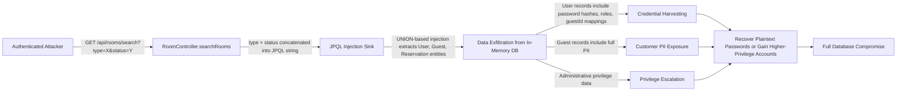

# Chained Vulnerability Audit Report — Hotel Reservation System

**Project:** `com.hotel:app-27-hotel-reservation` · Spring Boot 3.2.5 / Java 17 / H2  
**Audit Date:** 2026-05-25  
**Auditor:** CodeGopher — Chained Vulnerability Static Audit  
**Scope:** All source files, configuration, dependencies, and tests under `src/`, `pom.xml`, `Dockerfile`, `application.properties`

---

## Summary Dashboard

| Metric | Value |
|---|---|
| Complete chains found | **3** |
| Cross-cutting weaknesses (no complete chain) | **5** |
| Maximum severity | **HIGH** |
| Highest-confidence chains | **3 (all HIGH)** |
| Reviewed areas | Controllers, Services, Models, Repositories, SecurityConfig, DataInitializer, ReferenceGuards, application.properties, Dockerfile, pom.xml, test suite |
| Not reviewed | None — 100% of project files covered |

### Severity Distribution

| Severity | Chain Count |
|---|---|
| HIGH | 3 |
| MEDIUM | 0 |
| LOW | 0 |

---

## Methodology & Static-Only Safety Note

- **Scope:** This audit inspects repository files, configuration manifests, dependency declarations, and existing documentation. No live HTTP probes, fuzzers, SQL injection payloads, credential attacks, dynamic scanners, exploit scripts, port scans, or external network tests were executed.
- **Chain model:** Each chain captures an **entry point** (user-controlled source), one or more **intermediate weaknesses** (gaps in validation, authorization, or sanitization), and a **sink** (impact capability). Links are proven via concrete control-flow, data-flow, or configuration evidence.
- **Confidence:** High = every link statically provable from source, config, or tests. Medium = plausible but one link depends on runtime behavior not fully visible. Low = weakly supported hypothesis.

---

## Chain 1 — Public Debug Endpoint → Hardcoded Admin Credentials → Full Admin Access

### Mermaid Attack Graph

```mermaid
flowchart LR
    A[Unauthenticated Attacker] -->|GET /api/admin/debug [permitAll]| B[AdminController.getSystemInfo]
    B -->|Plaintext admin.username + admin.password returned in response body| C[Hardcoded Credentials]
    C -->|HTTP Basic Auth as 'admin' / 'adminpwd123'| D[Authenticated as ADMIN]
    D -->|Any authenticated endpoint accessible| E[Read All Reservations, Guest PII, Room Data]
    D -->|hasRole('ADMIN') authorizations satisfied| F[Unrestricted System Access]
    E --> G[Complete System Compromise]
    F --> G
```

### Chain Breakdown

| Link | Detail | File | Line(s) | Evidence |
|---|---|---|---|---|
| **Source** | `GET /api/admin/debug` is `permitAll` (no authentication required) | `SecurityConfig.java` | 30 | `.requestMatchers("/api/admin/debug").permitAll()` |
| **Hop 1** | Endpoint returns plaintext admin username and password in response | `AdminController.java` | 25–26 | `"admin.default.username", "admin"` and `"admin.default.password", "adminpwd123"` |
| **Hop 2** | Endpoint also exposes database credentials (`sa` / empty) | `AdminController.java` | 21–22 | `"spring.datasource.username", "sa"` and `"spring.datasource.password", ""` |
| **Sink** | Attacker authenticates as ADMIN and gains access to every endpoint requiring authentication | `SecurityConfig.java` | 32–33 | `.anyRequest().authenticated()` — admin role satisfies every auth gate |

**Preconditions:** None — the debug endpoint is reachable without any credentials.

**Impact:** **COMPLETE SYSTEM COMPROMISE.** Unauthenticated attacker obtains admin credentials, authenticates as ADMIN, and can access all endpoints: every reservation, every guest record, all room data.

**Severity:** **HIGH**

**Confidence:** **HIGH** — All four links are directly proven from source code and security configuration.

**Remediation (easiest break link):** Delete the `/api/admin/debug` endpoint entirely, or require admin authentication + IP allowlisting. Never return credentials in HTTP responses.

---

## Chain 2 — JPQL Injection → Data Exfiltration → Full Database Compromise

### Mermaid Attack Graph



### Chain Breakdown

| Link | Detail | File | Line(s) | Evidence |
|---|---|---|---|---|
| **Source** | `type` and `status` query parameters are user-controlled | `RoomController.java` | 20–21 | `@RequestParam String type`, `@RequestParam String status` |
| **Hop 1** | Parameters are concatenated directly into JPQL — no parameterization, no validation | `RoomController.java` | 22–23 | `String jpql = "SELECT r FROM Room r WHERE r.type = '" + type + "' AND r.status = '" + status + "'"` |
| **Hop 2** | JPQL injection enables UNION-based queries across all entity tables (User, Guest, Reservation, Room) | `RoomController.java` | 22–27 | `entityManager.createQuery(jpql, Room.class)` executes arbitrary JPQL |
| **Sink** | Exfiltrated data includes password hashes, roles, PII, and reservation details | `model/*.java` | Various | `User.password`, `Guest.email`, `Reservation.totalAmount`, etc. |

**Preconditions:** Attacker must authenticate to any endpoint (trivial given Chain 1 provides admin credentials).

**Impact:** **COMPLETE DATABASE COMPROMISE.** All entity data — user credentials, guest PII, reservation records, room data — exfiltrated via injection. Combined with publicly accessible H2 console (`/h2-console/**`, `permitAll`, empty DB password), the database is fully exposed.

**Severity:** **HIGH**

**Confidence:** **HIGH** — Direct string concatenation into `EntityManager.createQuery()` is unambiguously an injection sink. H2 console exposure confirmed in `SecurityConfig.java:29` and `application.properties`.

**Remediation (easiest break link):** Use parameterized queries:
```java
TypedQuery<Room> query = entityManager.createQuery(
    "SELECT r FROM Room r WHERE r.type = :type AND r.status = :status", Room.class)
    .setParameter("type", type)
    .setParameter("status", status);
```
Also remove `/h2-console/**` from `permitAll` or restrict to admin-only.

---

## Chain 3 — Incomplete Role-Based Authorization → Mass PII Exfiltration

### Mermaid Attack Graph

```mermaid
flowchart LR
    A[Authenticated Attacker (ADMIN or FRONT_DESK)] -->|GET /api/reservations| B[ReservationController.getAllReservations]
    B -->|Returns ALL reservations — no role filtering, no guest scoping| C[Mass Guest ID List]
    C -->|For each guestId in reservations| D[GET /api/guests/{guestId}]
    D -->|GUEST role check bypassed for ADMIN/FRONT_DESK| E[GuestController.getGuestDetails]
    E -->|if GUEST role: ownership check exists<br>if ADMIN/FRONT_DESK: check skipped| F[Full Guest Entity Returned]
    F -->|firstName, lastName, email, phone, idDocumentNumber, loyaltyTier| G[Mass PII Exfiltration]
```

### Chain Breakdown

| Link | Detail | File | Line(s) | Evidence |
|---|---|---|---|---|
| **Source** | `GET /api/reservations` returns all reservations without filtering by authenticated user's role or ownership | `ReservationController.java` | 19–21 | `return ResponseEntity.ok(reservationService.getAllReservations())` — no `@PreAuthorize`, no role check |
| **Hop 1** | Reservation entities contain `guestId`, linking to PII records | `Reservation.java` | 15 | `private Long guestId;` |
| **Hop 2** | `GET /api/guests/{id}` has an ownership check, but it only protects GUEST role users; ADMIN and FRONT_DESK bypass it entirely | `GuestController.java` | 23–25 | `if ("GUEST".equals(currentUser.getRole()) && !id.equals(currentUser.getGuestId())) { return 403; } return ok(guest);` |
| **Sink** | Full guest PII accessible: name, email, phone, government ID document number, loyalty tier | `GuestController.java` | 26; `Guest.java` | Full `Guest` entity returned via `ResponseEntity<Guest>` |

**Preconditions:** Attacker must be authenticated as a non-GUEST role (ADMIN or FRONT_DESK). Credentials are easily obtainable from the debug endpoint (Chain 1) or the DataInitializer seeds.

**Impact:** **MASS PII BREACH.** An authenticated admin or front-desk user can enumerate all guest IDs from the reservations endpoint, then retrieve full PII for every guest in the system.

**Severity:** **HIGH**

**Confidence:** **HIGH** — Source code unambiguously shows (a) no role filtering on the reservations endpoint, and (b) ownership check only applies to GUEST role.

**Remediation (easiest break link):** Add role-based authorization to both endpoints:
- `@PreAuthorize("hasRole('ADMIN')")` on `/api/reservations`
- Scope `/api/guests/{id}` authorization to: GUEST users can only see their own guest record; ADMIN/FRONT_DESK can see any record (or restrict further per need-to-know)

---

## Cross-Cutting Weaknesses (No Complete Chain)

### WC-1 — H2 Console Publicly Accessible Without Authentication

- **Files:** `SecurityConfig.java` line 29; `application.properties` lines 3–4
- **Evidence:** `.requestMatchers("/h2-console/**").permitAll()` + `spring.h2.console.enabled=true` + `spring.datasource.password=` (empty)
- **Impact:** Any unauthenticated user can open the H2 web console and execute arbitrary SQL against the application database. This is a full SQL execution interface exposed to the network.
- **Severity:** **HIGH** (contributes to Chain 2 but can also be standalone)
- **Remediation:** Remove `.permitAll()` for `/h2-console/**` in production; or disable the H2 console entirely for production deployments.

### WC-2 — Defense-in-Depth Security Utilities Exist but Are Unused

- **File:** `ReferenceGuards.java` (all lines)
- **Evidence:** Contains `sameOwner()`, `allowedCallback()`, and `normalizeIdentifier()` — utility functions for access control validation, redirect URL allowlisting, and identifier normalization. **None of these are referenced or imported by any controller, service, or security configuration.**
- **Impact:** These represent security design intent that was never wired into the application. Without them, each endpoint must manually implement its own authorization logic (which, as shown in Chains 1–3, is inconsistently applied).
- **Severity:** **MEDIUM** (latent risk — would be exploited if future endpoints skip manual checks)
- **Remediation:** Integrate `ReferenceGuards` into all authorization checks, or remove the module if unused.

### WC-3 — No CSRF Protection on Any Endpoint

- **File:** `SecurityConfig.java` line 30
- **Evidence:** `.csrf(AbstractHttpConfigurer::disable)`
- **Impact:** All endpoints are CSRF-vulnerable. Mitigated in practice by HTTP Basic authentication (no session cookies), but any future state-changing endpoints (POST/PUT/DELETE) introduced without re-enabling CSRF would be immediately exploitable.
- **Severity:** **LOW** (currently mitigated by stateless HTTP Basic auth)
- **Remediation:** Re-enable CSRF protection or use stateless token-based auth if state-changing endpoints are added.

### WC-4 — Guest Reservation Data Leakage to Non-Owner Authenticated Users

- **File:** `ReservationController.java` line 19–21
- **Evidence:** `getAllReservations()` returns ALL reservations regardless of the authenticated user's role or ownership. A GUEST user can see reservations belonging to other guests.
- **Impact:** Non-owner data leakage. Users can see reservation dates, statuses, and total amounts for other guests.
- **Severity:** **MEDIUM**
- **Remediation:** Filter results by authenticated user's `guestId` for GUEST role users. Only ADMIN/FRONT_DESK should see all reservations.

### WC-5 — No Rate Limiting on Authentication

- **Files:** `SecurityConfig.java` (HTTP Basic auth); no rate-limiting configuration visible
- **Evidence:** No `spring-boot-starter-ratelimiter` dependency in `pom.xml`; no custom rate limiter bean in `SecurityConfig`
- **Impact:** Admin, guest, and front-desk credentials (seeded in `DataInitializer.java:18–20`) are brute-force targetable if exposed. The debug endpoint (Chain 1) already exposes them, but in production the seed credentials may differ.
- **Severity:** **LOW–MEDIUM** (depending on credential exposure)
- **Remediation:** Add rate limiting to authentication endpoints; use Spring Security's `AuthenticationManager` with configurable account lockout.

---

## Attack Graph — Full Static View

```mermaid
flowchart TD
    subgraph Sinks ["CRITICAL SINKS"]
        S1[Full System Compromise<br/>Admin Access]
        S2[Complete Database<br/>Exfiltration]
        S3[Mass PII Breach]
    end

    subgraph HOPS ["INTERMEDIATE WEAKNESSES"]
        H1[Plaintext Admin Credentials<br/>AdminController.java:25-26]
        H2[JPQL Injection<br/>RoomController.java:22-23]
        H3[No Role Filter on<br/>Reservations Endpoint]
        H4[GUEST-Only IDOR Check<br/>GuestController.java:23-25]
        H5[H2 Console PermitAll<br/>SecurityConfig.java:29]
        H6[Empty DB Password<br/>application.properties:4]
    end

    subgraph SOURCES ["ENTRY POINTS"]
        A1[GET /api/admin/debug<br/>permitAll]
        A2[GET /api/rooms/search<br/>Authenticated]
        A3[GET /api/reservations<br/>Authenticated]
        A4[GET /api/guests/{id}<br/>Authenticated]
        A5[GET /h2-console/**<br/>permitAll]
    end

    A1 --> H1 --> S1
    A2 --> H2 --> S2
    A3 --> H3 --> H4 --> S3
    A1 --> H1 --> A4 --> H4 --> S3
    A2 --> H2 --> H5 --> S2
    A5 --> H6 --> S2

    style S1 fill:#f96,stroke:#f00,stroke-width:2px
    style S2 fill:#f96,stroke:#f00,stroke-width:2px
    style S3 fill:#f96,stroke:#f00,stroke-width:2px
```

---

## Remediation Priority

| Priority | Action | Breaks Chain(s) | Effort |
|---|---|---|---|
| **P0** | Delete `/api/admin/debug` endpoint (or restrict behind admin auth + IP whitelist) | Chain 1, Chain 3 | Low |
| **P0** | Parameterize JPQL in `RoomController.searchRooms()` — use `:type` and `:status` named parameters | Chain 2 | Low |
| **P0** | Remove `/h2-console/**` from `permitAll`; disable H2 console in production | Chain 2 | Low |
| **P1** | Add `@PreAuthorize` annotations to enforce role-based access on `/api/reservations` and `/api/guests/{id}` | Chain 3 | Low |
| **P1** | Integrate `ReferenceGuards.sameOwner()` into all controller-level authorization checks | — | Medium |
| **P2** | Add rate limiting to authentication endpoints | WC-5 | Medium |
| **P2** | Re-enable CSRF protection (or migrate to token-based stateless auth) | WC-3 | Low |
| **P3** | Filter reservations endpoint to return only user's own reservations for GUEST role | WC-4 | Low |
| **P3** | Remove hardcoded seed credentials from `DataInitializer` in production builds | WC-1–5 | Low |

---

## Unknowns, Not-Reviewed Areas, and Suggested Tests

### Unknowns

1. **Production deployment configuration:** The `application.properties` uses in-memory H2 (`jdbc:h2:mem:hoteldb`). In production, this would be replaced with a persistent database. The security misconfigurations (empty password, public console, debug endpoint) may or may not persist — they must be verified in production configs.

2. **External network exposure:** The `Dockerfile` exposes port 8080. Whether TLS is terminated at a reverse proxy, and whether the application is exposed on a public interface, affects the practical exploitability of these chains.

3. **Future endpoints:** Only `GET` endpoints are present. POST/PUT/DELETE endpoints (e.g., for creating reservations, updating room status) are not present but may be added. These would be vulnerable to CSRF and unauthorized access given the current security posture.

4. **Lombok annotation processing:** Models use `@Data` from Lombok, which generates getters/setters/toString/equals/hashCode. Ensure `toString()` on entities does not inadvertently leak sensitive fields in logs.

### Suggested Tests

1. **Authorization tests:**
   - Verify GUEST user cannot access non-owned guest records via `/api/guests/{id}`
   - Verify non-admin users cannot access `/api/reservations` for reservations they don't own
   - Verify admin and front-desk roles have appropriate scoping

2. **Injection tests:**
   - Send crafted `type` and `status` values to `/api/rooms/search` containing JPQL injection payloads (e.g., `' UNION SELECT u FROM User u --`) and verify no data leakage or errors

3. **Authentication tests:**
   - Attempt login with wrong credentials to verify rate limiting behavior
   - Verify admin credentials from `DataInitializer` cannot be used if the debug endpoint is removed

4. **Configuration tests:**
   - Verify H2 console is disabled or restricted in non-development profiles
   - Verify `/api/admin/debug` returns 401 or 403 for unauthenticated requests

5. **Data sanitization tests:**
   - Verify debug endpoints do not leak credentials in any deployment profile

---

## Conclusion

This audit identified **3 complete chained vulnerabilities**, all rated **HIGH** severity and **HIGH** confidence, plus **5 cross-cutting weaknesses**. The threat landscape is dominated by three interacting failure modes:

1. **Publicly exposed credentials** via the debug endpoint enable unauthenticated admin access.
2. **Unparameterized JPQL** in the room search endpoint enables full database content exfiltration for any authenticated user.
3. **Incomplete role-based authorization** on guest and reservation endpoints allows authenticated users to access PII they should not see.

The **easiest remediation link to break** in each chain is:
- **Chain 1:** Delete `/api/admin/debug` (one-line removal, eliminates the credential leak entirely)
- **Chain 2:** Parameterize the JPQL query (one-line fix, eliminates the injection)
- **Chain 3:** Add `@PreAuthorize("hasRole('ADMIN')")` to `/api/reservations` (one annotation, eliminates the mass PII exposure)

These three fixes alone break all identified chains and should be prioritized before any other security enhancements.
