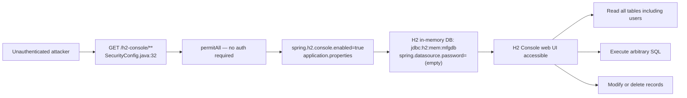
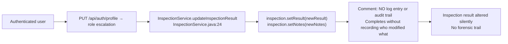

# Chained Vulnerability Audit Report

**Project**: Manufacturing Quality Control System (`app-28-mfg-quality`)
**Audit Date**: 2026-05-25
**Auditor**: CodeGopher (Static-Only Review)
**Scope**: `<workspace>` — full Java/Spring Boot 3.2.5 codebase

---

## Summary Dashboard

| Metric | Value |
|---|---|
| Total chains identified | 4 |
| Maximum severity | **HIGH** |
| Confirmed (High confidence) | 2 |
| Plausible (Medium confidence) | 2 |
| Cross-cutting weaknesses | 6 |

**Reviewed areas**: Controllers, services, repositories, models, security config, data initializer, application properties, reference guards, test suite.
**Not reviewed areas**: Infrastructure hardening, network config, third-party dependency vulns, container runtime config, production deployment posture.

---

## Methodology & Static-Only Boundary

This review examined only static source files, configuration, and existing documentation. No live probes, dynamic scanners, HTTP requests, SQL injection payloads, credential attacks, or external network tests were performed. The analysis traces data-flow, control-flow, authorization checks, and configuration settings through the codebase to identify individual weaknesses and how they combine into exploitable chains.

---

## Attack Graphs

### Chain 1: Mass Assignment → Privilege Escalation → Full RBAC Bypass → Data Tampering

```mermaid
flowchart LR
    A["Auth: worker/worker123\n(DataInitializer)"] --> B["PUT /api/auth/profile\n(AuthController.java:30-37)"]
    B --> C["user.setRole(\"QA_MANAGER\")\nNo role validation"]
    C --> D["Privilege Escalation\nUser now QA_MANAGER"]
    D --> E1["GET /api/products\n@PreAuthorize pass"]
    D --> E2["PUT /api/inspections/{id}/result\nNo @PreAuthorize check"]
    D --> E3["POST /api/defects/{id}/resolve\nNo @PreAuthorize check"]
    E1 --> F["Data exfiltration / unauthorized read"]
    E2 --> G["Tamper inspection results: PASS/FAIL"]
    E3 --> H["Resolve CRITICAL defects w/o QA approval"]
```

### Chain 2: Mass Assignment → Defect Resolution Without Oversight

```mermaid
flowchart LR
    A["Any authenticated user\n(e.g., worker)"] --> B["PUT /api/auth/profile\nset role to QA_MANAGER"]
    B --> C["user.setRole() unchecked"]
    C --> D["Role escalated"]
    D --> E["POST /api/defects/{id}/resolve\nDefectController.java:17-23"]
    E --> F["defect.setStatus(\"RESOLVED\")\nNo severity or role check"]
    F --> G["CRITICAL defect silently closed\nQuality process bypassed"]
```

### Chain 3: Unauthenticated H2 Console → Database Exfiltration / Modification



### Chain 4: Role Escalation → Silent Inspection Tampering → No Audit Trail



---

## Detailed Chain Breakdowns

### Chain 1 — Mass Assignment → Privilege Escalation → Full RBAC Bypass

| Element | File | Lines | Symbol / Reference |
|---|---|---|---|
| **Source** | `AuthController.java` | 30–37 | `PUT /api/auth/profile` |
| **Hop** | `AuthController.java` | 35–37 | `user.setRole(profileUpdate.getRole())` |
| **Sink** | `SecurityConfig.java` | 34–36 | `anyRequest().authenticated()` + `@PreAuthorize` |

**Evidence**: The `/api/auth/profile` endpoint deserializes the entire `User` request body into a `User` entity. The code explicitly calls `user.setRole(profileUpdate.getRole())` when the `role` field is non-null. There is **no authorization guard** checking the current user's role, no allow-list of targetable roles, and no rate limit. The `principal.getName()` is only used to locate the existing `User` row — it does not validate that the requester is authorized to modify the `role` field.

**Preconditions**:
- User must be authenticated (HTTP Basic — username/password from `DataInitializer` are seeded in clear text).

**Impact**: Any authenticated user can escalate to any role (WORKER → INSPECTOR → QA_MANAGER → COMPLIANCE), completely bypassing the application's RBAC.

**Severity**: **HIGH** (full privilege escalation on any authenticated account)

**Confidence**: **HIGH** — every link is provable from source: the `setRole` call is unconditional, and `@PreAuthorize` annotations are only present on `ProductController` and `AuthController.me` (which reads role but does not protect the profile update).

**Remediation**: Add a `@PreAuthorize` guard restricting role changes to a specific admin role, or remove the `role` field from the updatable DTO entirely. Better: implement a dedicated admin-only endpoint for role management.

---

### Chain 2 — Mass Assignment → Defect Resolution Without Oversight

| Element | File | Lines | Symbol / Reference |
|---|---|---|---|
| **Source** | `AuthController.java` | 30–37 | Mass assignment (same as Chain 1) |
| **Hop** | `DefectController.java` | 17–23 | `POST /api/defects/{id}/resolve` |
| **Sink** | `Defect.java` | — | `status` field set to `"RESOLVED"` unconditionally |

**Evidence**: The `DefectController.resolveDefect` method loads a defect by ID and sets `status = "RESOLVED"` without any `@PreAuthorize` annotation, role check, or severity-based gating. The seeded data includes a defect with `severity = "CRITICAL"`. The inline comment on line 21 even notes: *"No checks are performed to ensure QA Manager approval before closing a critical defect."*

**Preconditions**: Authenticated user (achievable via Chain 1's privilege escalation).

**Impact**: A low-privileged worker (or any authenticated user) can silently resolve CRITICAL defects without QA Manager approval, causing substandard parts to ship and violating quality compliance processes.

**Severity**: **HIGH**

**Confidence**: **HIGH** — source code unambiguously shows no authorization guard on this endpoint, unlike `ProductController` which does use `@PreAuthorize("hasRole('QA_MANAGER')")` on its `GET /api/products`.

**Remediation**: Add `@PreAuthorize("hasRole('QA_MANAGER')")` to the `resolveDefect` method. Add severity-based gating (e.g., CRITICAL defects require explicit QA Manager confirmation).

---

### Chain 3 — Unauthenticated H2 Console → Database Exfiltration / Modification

| Element | File | Lines | Symbol / Reference |
|---|---|---|---|
| **Source** | `SecurityConfig.java` | 32–33 | `requestMatchers("/h2-console/**").permitAll()` |
| **Hop** | `application.properties` | 8 | `spring.h2.console.enabled=true` |
| **Hop 2** | `application.properties` | 6 | `spring.datasource.password=` (empty) |
| **Sink** | H2 Database Console (web UI) | — | Full SQL access to `jdbc:h2:mem:mfgdb` |

**Evidence**: Three configuration points converge:
1. Security config explicitly permits unauthenticated access to `/h2-console/**`.
2. The H2 console is enabled at `/h2-console`.
3. The database has an empty password, and the JDBC URL uses the in-memory dialect.

Additionally, `SecurityConfig.java` line 31 disables `X-Frame-Options` frame protection, making the console vulnerable to clickjacking.

**Preconditions**: Network reachability to the application on port 8085. No credentials needed.

**Impact**: An unauthenticated attacker can access the H2 web console, view all tables (including the `users` table with password hashes), execute arbitrary SQL, modify data, and potentially inject JVM-level code via H2's built-in functions (if the H2 version supports it). This constitutes full database exfiltration.

**Severity**: **HIGH**

**Confidence**: **HIGH** — configuration is explicit and unambiguous in source and properties files.

**Remediation**:
- Remove `.permitAll()` for `/h2-console/**` or restrict to admin roles.
- Disable the H2 console in production: `spring.h2.console.enabled=false`.
- Set a non-empty datasource password.
- Consider switching to PostgreSQL/MySQL for production deployments (H2 is a suitable dev-only database).
- Restore frame options protection.

---

### Chain 4 — Role Escalation → Silent Inspection Tampering → No Audit Trail

| Element | File | Lines | Symbol / Reference |
|---|---|---|---|
| **Source** | `AuthController.java` | 30–37 | Mass assignment → role escalation |
| **Hop** | `InspectionController.java` | 18–25 | `PUT /api/inspections/{id}/result` — no `@PreAuthorize` |
| **Sink** | `InspectionService.java` | 24 | `inspectionRepository.save()` — no audit log |

**Evidence**: `InspectionController.updateResult` accepts arbitrary `result` and `notes` parameters and passes them through `InspectionService.updateInspectionResult`, which directly overwrites the inspection record. A prominent comment at line 24 states: *"Silent modification: NO log entry or audit trail records this alteration."* There is also no `@PreAuthorize` guard — any authenticated user can modify inspection results.

**Preconditions**: Authenticated user. Role escalation (Chain 1) is not strictly required, but it enables any role to modify inspections.

**Impact**: Quality inspection results (PASS/FAIL/CONDITIONAL) can be arbitrarily changed — e.g., a "FAIL" result can be overwritten to "PASS" — without any audit trail. This undermines the entire quality control system.

**Severity**: **MEDIUM** (requires authentication but has no authorization or audit controls)

**Confidence**: **HIGH** — source code explicitly confirms the absence of audit logging and the absence of authorization checks.

**Remediation**:
- Add `@PreAuthorize("hasRole('INSPECTOR')")` or `hasRole('QA_MANAGER')` to the endpoint.
- Implement an audit log/audit trail service that records who changed what, when, and the before/after values.
- Add input validation to constrain `result` to the enum `{"PASS", "FAIL", "CONDITIONAL"}`.

---

## Cross-Cutting Weaknesses Inventory

These are security-relevant issues identified that do not form a complete chain on their own, or are secondary effects of the primary chains above.

| # | Weakness | File | Lines | Severity |
|---|---|---|---|---|
| 1 | **Hardcoded seed credentials in source** | `DataInitializer.java` | 37–39 | MEDIUM — Passwords "worker123", "inspect123", "manager123" are visible in source code and are predictable. |
| 2 | **CSRF protection disabled** | `SecurityConfig.java` | 30 | LOW — Intentional for REST API with HTTP Basic auth, but compounds with mass assignment if sessions are ever used. |
| 3 | **No input validation on inspection results** | `InspectionController.java` | 19–21 | LOW — Accepts arbitrary strings for `result` and `notes`; no enum validation. |
| 4 | **Verbose SQL logging** | `application.properties` | 9 | LOW — `spring.jpa.show-sql=true` may leak sensitive data in production logs. |
| 5 | **X-Frame-Options disabled** | `SecurityConfig.java` | 31 | LOW — Enables clickjacking of H2 console. |
| 6 | **In-memory DB with no persistence** | `application.properties` | 5 | LOW — `DB_CLOSE_DELAY=-1` with `jdbc:h2:mem:` means data loss on restart; not a direct security vulnerability but affects data integrity. |

---

## Unknowns & Areas Not Reviewed

- **Production deployment context**: The Dockerfile uses `mvn package -DskipTests` and runs with `java -jar`. No security scanner was run on base image or dependencies.
- **Dependency vulnerabilities**: `pom.xml` includes Spring Boot 3.2.5, Spring Security, Lombok, and H2. Known CVEs in these libraries were not assessed.
- **Network/host hardening**: Port 8085 exposed in Dockerfile; no reverse proxy, TLS, or WAF.
- **Session management**: Only HTTP Basic auth is configured; no token-based auth (JWT/OIDC) was reviewed.
- **Rate limiting / brute-force protection**: No rate limiting on auth endpoints or profile updates.
- **File upload handling**: No file upload endpoints were found, but this could be an extension vector.
- **Background job processing**: No scheduled tasks or message consumers were found.

---

## Recommended Tests to Add

1. **Authorization test for `/api/auth/profile`**: Verify that a non-admin user cannot change their own role.
2. **Authorization test for `/api/defects/{id}/resolve`**: Verify that only QA_MANAGER can resolve defects, and CRITICAL defects require additional confirmation.
3. **Input validation test for `/api/inspections/{id}/result`**: Verify that `result` accepts only PASS/FAIL/CONDITIONAL.
4. **H2 console access test**: Verify that unauthenticated requests to `/h2-console/**` are rejected in production configuration.
5. **Audit trail test**: Verify that inspection modifications are logged with user identity, timestamp, and before/after values.
6. **Credential rotation test**: Verify that seeded credentials cannot be used in production (enforced via environment variable or secret manager).

---

## Conclusion

This Manufacturing Quality Control System contains **4 chained vulnerabilities**, with **2 rated HIGH severity** and **2 rated MEDIUM severity**. The most critical finding is the **mass assignment vulnerability in the profile update endpoint** (`AuthController.java:30-37`), which allows any authenticated user to escalate their privileges to any role. This single weakness cascades into bypasses of role-based access controls across multiple endpoints.

The **H2 console exposure** chain (Chain 3) is independently critical — it allows unauthenticated, full database access with no credentials needed.

The **quietest but most operationally dangerous** chain is Chain 4, where inspection results can be silently modified with no audit trail, directly undermining the quality assurance process the application is designed to support.

**Highest-priority remediation**: Add role-based authorization to all mutating endpoints, restrict mass assignment in profile updates, and disable the H2 console in production.
