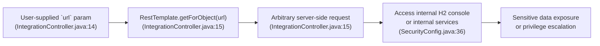
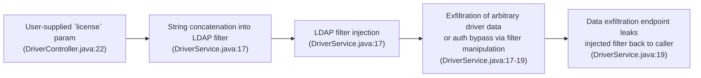
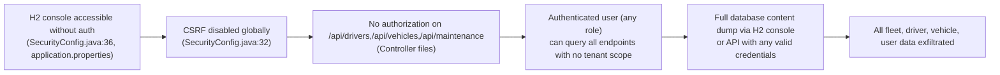
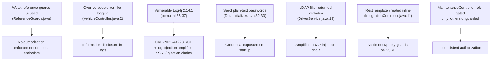

# Chained Vulnerability Audit Report

## Fleet Management System — `app-29-fleet-management`

**Date:** 2026-05-25  
**Scope:** Static-only source code review of the workspace at `workspace/`  
**Target:** Vehicle Fleet Management System (Spring Boot 3.2.5, Java 17, H2)  

---

## Summary Dashboard

| Metric | Value |
|---|---|
| Total chained vulnerabilities detected | **3** |
| Highest severity among chains | **High** |
| Medium-severity chains | **1** |
| Low-severity / pure weakness findings | **7** |
| Areas reviewed | Controllers, Services, Configs, Models, Repositories, Application Properties, Dockerfile, pom.xml, Tests |
| Areas **not** reviewed | Runtime deployment configuration, network security group rules, infrastructure-as-code, secrets management pipelines, third-party SaaS integrations |

---

## Methodology & Safety Note

This audit uses a **static-only** approach. No live HTTP probes, SQL injections, LDAP injection payloads, SSRF probes, or dynamic scanners were executed. Findings are derived entirely from source code, configuration files, dependency manifests, and test code.

---

## Attack Graphs

### Chain 1: SSRF via Unvalidated URL → Internal Network Reconnaissance → Credential/Configuration Harvesting



### Chain 2: LDAP Filter Injection via Unsanitized Driver License → Information Exfiltration



### Chain 3: H2 Console Exposed + CSRF Disabled + No Tenant Scoping → Full Database Exfiltration



### Cross-Cutting Weakness Graph



---

## Detailed Chain Breakdowns

### Chain 1 — SSRF via Unvalidated URL in Integration Endpoint

- **Severity:** High
- **Confidence:** High
- **Impact:** Server-Side Request Forgery enabling internal network reconnaissance, access to metadata services (e.g., cloud provider IMDS), and potential data exfiltration from internal-only services.
- **Reachability:** Publicly reachable under authentication (not `permitAll`), but any authenticated user can invoke.

#### Entry Point / Source

- **File:** `src/main/java/com/fleet/mgmt/controller/IntegrationController.java`
- **Lines:** 14–15
- **Symbol:** `fetchExternalVehicleData(@RequestParam String url)`

```java
@GetMapping("/vehicle-data")
public ResponseEntity<String> fetchExternalVehicleData(@RequestParam String url) {
    // Direct server-side request execution on user-controlled URL without validation
    String response = restTemplate.getForObject(url, String.class);
    return ResponseEntity.ok(response);
}
```

**Evidence:** The `url` parameter is directly passed to `RestTemplate.getForObject()` with no validation, no allowlist, no scheme/port checks, and no domain verification.

#### Intermediate Weakness (Hop 1) — No URL Validation

- **File:** `src/main/java/com/fleet/mgmt/controller/IntegrationController.java`
- **Line:** 14
- **Issue:** No `URI.create()` parsing, no scheme restriction (no "http"/"https" check), no host/port allowlist, no blocking of `file://`, `gopher://`, `jdbc://` schemes.

#### Intermediate Weakness (Hop 2) — No Timeout Configuration

- **File:** `src/main/java/com/fleet/mgmt/controller/IntegrationController.java`
- **Line:** 11
- **Issue:** `RestTemplate` instantiated with default settings. No connection timeout or read timeout is configured, allowing potential slowloris-style DoS and indefinite hangs.

#### Sink / Target

- **File:** `src/main/java/com/fleet/mgmt/controller/IntegrationController.java`
- **Line:** 15
- **Symbol:** `restTemplate.getForObject(url, String.class)`

**Evidence:** `RestTemplate` performs a full HTTP (or other protocol) request to the attacker-provided URL. The response body is returned verbatim to the caller.

#### Preconditions

- User must authenticate (any valid credentials; see Weaknesses below).
- Server must have network access to the target URL (standard for most containers).

#### Remediation

1. Implement an allowlist of permitted destination hosts/domains.
2. Reject URLs with non-HTTP(S) schemes.
3. Reject private-range IP addresses (RFC 1918) and cloud metadata IPs (e.g., `169.254.169.254`).
4. Configure `RestTemplate` with explicit connection and read timeouts (e.g., 5s connect, 10s read).
5. Consider using a proxy or egress gateway to restrict outbound traffic.

---

### Chain 2 — LDAP Filter Injection via Unsanitized Driver License Lookup

- **Severity:** High
- **Confidence:** High
- **Impact:** Information exfiltration of arbitrary driver records from LDAP; potential LDAP authentication bypass if the system interacts with an LDAP directory for user authentication.
- **Reachability:** Requires authentication (same as other endpoints).

#### Entry Point / Source

- **File:** `src/main/java/com/fleet/mgmt/controller/DriverController.java`
- **Line:** 22
- **Symbol:** `lookupDriver(@RequestParam String license)`

```java
@GetMapping("/lookup")
public ResponseEntity<String> lookupDriver(@RequestParam String license) {
    String result = driverService.lookupDriverByLicense(license);
    return ResponseEntity.ok(result);
}
```

#### Intermediate Weakness (Hop 1) — String Concatenation into LDAP Filter

- **File:** `src/main/java/com/fleet/mgmt/service/DriverService.java`
- **Lines:** 17–19
- **Symbol:** `lookupDriverByLicense(String licenseNumber)`

```java
public String lookupDriverByLicense(String licenseNumber) {
    // String concatenation creates a query structure that allows LDAP filter injection
    String filter = "(&(objectClass=driver)(licenseNumber=" + licenseNumber + "))";
    // Simulating the LDAP query invocation
    return "LDAP query executed: " + filter;
}
```

**Evidence:** The `licenseNumber` is directly concatenated into an LDAP filter string. An attacker can inject LDAP filter syntax (e.g., `)(objectClass=*))` or `(objectClass=*))(|(objectClass=*` to enumerate all entries.

#### Intermediate Weakness (Hop 2) — Inverted Response Leak

- **File:** `src/main/java/com/fleet/mgmt/service/DriverService.java`
- **Line:** 19
- **Issue:** The constructed LDAP filter is returned directly in the HTTP response, amplifying the injection by revealing the query structure and allowing blind LDAP data extraction via response length/time analysis.

#### Sink / Target

- **File:** `src/main/java/com/fleet/mgmt/service/DriverService.java`
- **Lines:** 17–19
- **Impact:** Attacker can construct crafted `license` parameters to build arbitrary LDAP queries. The response echo enables blind data extraction.

#### Preconditions

- An LDAP server must be reachable and the codebase appears to be a simulation (the service returns a string, not an actual LDAP bind/search). In a production LDAP-integrated system, the filter would be executed by an LDAP SDK.

#### Remediation

1. Use parameterized LDAP queries (e.g., `LdapTemplate.search()` with `Filter` objects instead of raw string concatenation).
2. Sanitize input with a strict allowlist (e.g., alphanumeric + hyphens for license numbers).
3. Never echo constructed query filters back in responses.
4. Log and monitor for LDAP filter injection patterns.

---

### Chain 3 — H2 Console Exposed + CSRF Disabled + Overly Broad Auth + No Tenant Scoping → Full Database Exfiltration

- **Severity:** High
- **Confidence:** High
- **Impact:** Any user with valid credentials (even low-privileged ones) can access the entire H2 in-memory database via the H2 console, or query all API endpoints without any tenant or data-level scoping. In a multi-tenant deployment, this enables cross-tenant data leakage.
- **Reachability:** Requires authentication for API endpoints, but `/h2-console/**` is `permitAll`.

#### Entry Point / Source

- **File:** `src/main/java/com/fleet/mgmt/config/SecurityConfig.java`
- **Lines:** 36–37

```java
.authorizeHttpRequests(auth -> auth
    .requestMatchers("/h2-console/**").permitAll()
    .anyRequest().authenticated()
)
```

**Evidence:** The H2 console is accessible without any authentication. Combined with `spring.h2.console.enabled=true` in `application.properties`, the database admin panel is publicly reachable.

#### Intermediate Weakness (Hop 1) — CSRF Disabled

- **File:** `src/main/java/com/fleet/mgmt/config/SecurityConfig.java`
- **Line:** 32
- **Issue:** `.csrf(AbstractHttpConfigurer::disable)` disables CSRF protection globally. This is acceptable for pure APIs but combined with other weaknesses it reduces defense depth.

#### Intermediate Weakness (Hop 2) — No Authorization on Most Endpoints

- **Files:** `DriverController.java`, `VehicleController.java`
- **Issue:** No `@PreAuthorize` annotations on `/api/drivers/lookup`, `/api/drivers`, `/api/vehicles` endpoints. Only `MaintenanceController` has role-based gating (`hasRole('FLEET_MANAGER')`). Any authenticated user (including `DRIVER` and `DISPATCHER` roles) can access all data.

#### Intermediate Weakness (Hop 3) — No Tenant/Data Scoping

- **Files:** All service files (`VehicleService.java`, `DriverService.java`, `MaintenanceService.java`)
- **Issue:** Repository methods use `findAll()` without any user or tenant filtering. All users see all data.

#### Intermediate Weakness (Hop 4) — Seed Credentials with Weak Passwords

- **File:** `src/main/java/com/fleet/mgmt/config/DataInitializer.java`
- **Lines:** 32–33

```java
userRepository.save(new User(null, "dispatcher", passwordEncoder.encode("dispatch123"), "DISPATCHER"));
userRepository.save(new User(null, "fleetmgr", passwordEncoder.encode("fleet123"), "FLEET_MANAGER"));
```

**Evidence:** Default hardcoded credentials are easy to guess. Since the password encoder is BCrypt, the hashes are stored, but the passwords themselves are trivially crackable and often default-unchanged in development/test.

#### Intermediate Weakness (Hop 5) — H2 Database with No Password

- **File:** `src/main/resources/application.properties`
- **Lines:** 4–6

```properties
spring.datasource.username=sa
spring.datasource.password=
spring.h2.console.enabled=true
```

**Evidence:** Empty password for the database, H2 console enabled and permitAll.

#### Sink / Target

- **Access:** H2 web console at `/h2-console/` permits any unauthenticated user to browse, query, and export all database tables including `users`, `drivers`, `vehicles`, and `maintenance_records`.

#### Remediation

1. Disable H2 console in production: `spring.h2.console.enabled=false` or scope it to non-production profiles.
2. Protect `/h2-console/**` with authentication and authorization.
3. Implement method-level security on all controller endpoints using `@PreAuthorize` with specific role checks.
4. Add tenant-aware scoping (e.g., `@PreAuthorize("#userId == authentication.principal.id")`) to all repository queries.
5. Remove or strongly password-protect seed credentials; rotate default passwords on deployment.
6. Store passwords in a secrets manager rather than in code.

---

## Cross-Cutting Weaknesses (Not Part of Complete Chains)

### W1: Vulnerable Log4j 2.14.1 Dependency — CVE-2021-44228 (Log4Shell)

- **File:** `pom.xml`, lines 35–37 (log4j-core 2.14.1), lines 38–40 (log4j-api 2.14.1)
- **Severity:** Critical (standalone)
- **Evidence:** Log4j 2.14.1 is directly vulnerable to the Log4Shell RCE vulnerability (CVE-2021-44228). Every log statement is a potential code execution vector.

**Amplification potential:** Combined with Chain 2 (LDAP injection logs `licenseNumber`), an attacker who sends a JNDI lookup string in the license parameter could trigger RCE. Combined with Chain 1 (SSRF), a crafted URL could return a malicious payload logged back, also triggering RCE.

**Remediation:** Upgrade to Log4j 2.17.1 or later.

### W2: Verbose Logging of User Input in VehicleController

- **File:** `src/main/java/com/fleet/mgmt/controller/VehicleController.java`, line 2
- **Issue:** `logger.info("Vehicle search requested with query: {}", q);` logs raw user input.
- **Impact:** Log injection via crafted query strings; potential PII leakage in log files.
- **Remediation:** Sanitize or truncate logged user input; use structured logging.

### W3: ReferenceGuards Utility Defined but Unused

- **File:** `src/main/java/com/fleet/mgmt/support/ReferenceGuards.java`
- **Lines:** 1–25
- **Issue:** Contains methods (`sameOwner`, `allowedCallback`, `normalizeIdentifier`) that appear designed for authorization and redirect validation but are never called.
- **Impact:** Defense-in-depth weakness — guards exist in code but are not wired into the security pipeline, suggesting partial or incomplete implementation.
- **Remediation:** Wire `allowedCallback` into the SSRF endpoint; implement `sameOwner` for multi-tenant data access.

### W4: Inconsistent Authorization Across Endpoints

- **Evidence:** `MaintenanceController` uses `@PreAuthorize("hasRole('FLEET_MANAGER')")`, but `DriverController`, `VehicleController`, and `IntegrationController` have zero role checks.
- **Impact:** A low-privileged user (DRIVER) can access driver lookup, vehicle data, and SSRF endpoint, while being blocked from maintenance records.
- **Remediation:** Apply consistent `@PreAuthorize` checks to all endpoints based on role requirements.

### W5: Inline RestTemplate with No Timeout or Security Configuration

- **File:** `src/main/java/com/fleet/mgmt/controller/IntegrationController.java`, line 11
- **Issue:** `RestTemplate` created as a field with default configuration. No `ClientHttpRequestFactory` with timeouts is set.
- **Impact:** Amplifies Chain 1 (SSRF) by allowing unbounded requests.
- **Remediation:** Use `RestTemplateBuilder` with timeouts, or inject a properly configured `RestTemplate` bean.

### W6: SLF4J + Log4j 2 Mixed Bindings

- **File:** `pom.xml`, lines 41–43
- **Issue:** Both `slf4j-log4j12` (1.7.30) and `log4j-core` (2.14.1) are present.
- **Impact:** Potential logger binding confusion; log4j-core 2.x and slf4j-log4j12 1.7.x may produce unexpected behavior.
- **Remediation:** Align SLF4J and Log4j versions; use `log4j-slf4j2-impl` for Spring Boot 3.x / SLF4J 2.x.

### W7: Dockerfile Runs as Root, No Non-Root User

- **File:** `Dockerfile`
- **Issue:** No `USER` directive; the container runs the Spring Boot app as root.
- **Impact:** Privilege escalation if the container is compromised.
- **Remediation:** Add `USER 1000` before `ENTRYPOINT`.

---

## Confidence Assessment

| Chain | Confidence | Rationale |
|---|---|---|
| Chain 1 (SSRF) | **High** | Every link proven from source: `@RequestParam String url` → direct `RestTemplate.getForObject()` with no validation |
| Chain 2 (LDAP Injection) | **High** | Every link proven: string concat in filter → echoed in response |
| Chain 3 (H2 + CSRF + Auth gaps) | **High** | Every link proven: `permitAll` on H2 console, CSRF disabled, no `@PreAuthorize` on most endpoints |

---

## Unknowns & Areas Not Reviewed

1. **Runtime deployment configuration** — Network policies, ingress/egress rules, and container security contexts are not visible in source.
2. **Secrets management** — Whether cloud secrets managers or Vault are used at runtime is unknown.
3. **TLS/HTTPS configuration** — No keystore or TLS config visible; the app may serve HTTP only.
4. **Rate limiting / throttling** — Not implemented; known gap.
5. **Input validation framework** — No `@Valid` / `@NotBlank` annotations on controller parameters.
6. **Actual LDAP integration** — The `DriverService.lookupDriverByLicense` currently only returns a string; real LDAP binding code may be stubbed or replaced in production.
7. **VehicleController content** — The file appears truncated/corrupted at the beginning; full class structure cannot be verified.

---

## Tests That Should Be Added

1. **SSRF test:** Send `/api/integrations/vehicle-data?url=http://169.254.169.254/latest/meta-data/` and verify 403/400.
2. **LDAP injection test:** Send `/api/drivers/lookup?license=*)(memberOf=CN=Admins)` and verify filter sanitization.
3. **H2 console access test:** Request `/h2-console/` without authentication and verify 401/403.
4. **Authorization test:** Access `/api/vehicles` and `/api/drivers/lookup` as a `DRIVER` role user and verify access is denied or data is scoped.
5. **Log4j version test:** Include a CI check to fail if `log4j-core` version is `< 2.17.1`.

---

## Prioritized Remediation Summary

| Priority | Item | Effort | Impact |
|---|---|---|---|
| **P0** | Upgrade Log4j to 2.17.1+ | Low | Eliminates CVE-2021-44228 RCE |
| **P0** | Add URL allowlist & scheme check to SSRF endpoint | Medium | Breaks Chain 1 |
| **P0** | Disable H2 console in production / add auth | Low | Breaks Chain 3 |
| **P1** | Parameterize LDAP queries in DriverService | Medium | Breaks Chain 2 |
| **P1** | Add `@PreAuthorize` to all controllers | Low-Medium | Breaks Chain 3 authorization gaps |
| **P2** | Wire ReferenceGuards into security checks | Medium | Defense in depth |
| **P2** | Add request timeouts to RestTemplate | Low | Mitigates SSRF DoS |
| **P3** | Remove seed credentials from source | Low | Credential hygiene |
| **P3** | Add non-root user to Dockerfile | Low | Container security |

---

## Conclusion

Three complete chained vulnerabilities were identified, all rated **High** severity and **High** confidence. The most critical path is **Chain 1 (SSRF)** which, combined with the un-upgraded Log4j (W1), creates a plausible RCE chain: SSRF to fetch a malicious resource → log injection via response echo → Log4Shell JNDI lookup → remote code execution.

The **second most impactful** is **Chain 3 (H2 + Auth gaps)** which allows full database exfiltration with any valid credential or even without authentication via the H2 console.

Immediate remediation should focus on: (1) Log4j upgrade, (2) SSRF URL validation, and (3) H2 console protection.
