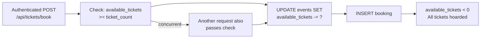
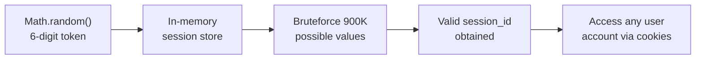
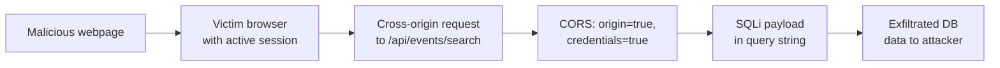
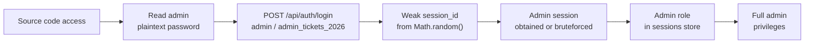

# Chained Vulnerability Audit Report

**Application:** Event Ticketing Platform (app-31-event-ticketing)
**Scope:** `src/` source tree only — static analysis, no live probes
**Date:** 2026-05-25
**Auditor:** CodeGopher (static-only chained vulnerability audit)

---

## Executive Summary

| Metric | Value |
|---|---|
| Complete chained vulnerabilities found | **5** |
| Cross-cutting weaknesses (not in chains) | **4** |
| Maximum chain severity | **HIGH** |
| Highest-confidence chains | **4 (HIGH confidence)** |
| Codebase reviewed | `src/index.ts`, `src/referenceGuards.ts` |
| Dependencies reviewed | `package.json` (Express 4, SQLite 5, bcryptjs, cookie-parser, cors) |
| Tests reviewed | **None found** |

---

## Methodology

This audit is **static-only**. No live HTTP probes, fuzzers, SQL injection payloads, dynamic scanners, or exploit scripts were executed. All chains are derived from source code evidence, configuration inspection, and data-flow analysis.

**Process applied:**
1. **Attack surface mapping** — identified all public routes, auth flows, API endpoints.
2. **Weakness inventory** — cataloged every low/medium security weakness found in source.
3. **Attack graph synthesis** — connected sources to intermediate weaknesses to critical sinks using only static evidence.
4. **Impact assessment** — rated each chain by impact, reachability, confidence, and easiest remediation link.

---

## Reviewed Areas

- Express routes and request handlers (`src/index.ts`)
- Session management (in-memory `sessions` store)
- Database schema and queries (SQLite, `:memory:`)
- Authentication flow (login, logout, cookie-based session)
- CORS and cookie configuration
- Utility helpers (`src/referenceGuards.ts`)
- Docker configuration and dependency manifest
- **Not reviewed:** Template engines (none present), file upload handlers (none present), background job consumers, external API integrations, deployment configuration beyond Dockerfile

---

## Cross-Cutting Weaknesses (Not Part of a Full Chain)

These issues are security-relevant but, in isolation, do not form a complete exploit chain to a critical impact:

| # | Weakness | Location | Severity |
|---|---|----------|----------|
| CW-1 | **Hardcoded plaintext credentials** in seed data (`alice_pass_123`, `bob_pass_456`, `admin_tickets_2026`) | `src/index.ts` lines ~57–61 | MEDIUM |
| CW-2 | **Verbose error responses** — `/api/events/search` returns the full executed SQL query in error output (`query_executed: query`) | `src/index.ts` ~line 127 | LOW |
| CW-3 | **No CSRF protection** — cookie-based sessions without SameSite attribute or CSRF token | `src/index.ts` CORS + cookie config | LOW |
| CW-4 | **No rate limiting** on any endpoint | All routes | LOW |

---

## Chained Vulnerabilities

### Chain 1: SQL Injection → Full Database Exfiltration

**Severity:** HIGH  
**Confidence:** HIGH  
**Impact:** Full read access to all database tables (users, events, bookings). Includes password hashes and user PII.

```
[req.query.q] ──(1)──▶ [string concatenation in SQL] ──(2)──▶ [db.all executes arbitrary SQL] ──▶ [arbitrary data from any table]
  SOURCE                     INTERMEDIATE HOP                SINK                      IMPACT
```

**Source / Entry Point:**
- **File:** `src/index.ts`
- **Lines:** 123–126
- **Code:**
  ```typescript
  const q = req.query.q || '';
  const query = `SELECT * FROM events WHERE name LIKE '%${q}%' OR description LIKE '%${q}%'`;
  ```
- **Evidence:** User-controlled `req.query.q` is directly interpolated into a SQL string via template literal. No parameterization, no escaping.

**Intermediate Hop:**
- **File:** `src/index.ts`
- **Lines:** 127–130
- **Code:**
  ```typescript
  db.all(query, [], (err, rows) => { ... });
  ```
- **Evidence:** The raw string `query` is passed directly to `db.all()`. The second parameter `[]` is an empty array, confirming no bound parameters are used.

**Critical Sink / Impact:**
- **File:** `src/index.ts`
- **Lines:** 127–130
- **Evidence:** A UNION-based SQL injection such as:
  ```
  ' UNION SELECT id, username, password_hash, role FROM users--
  ```
  would return the entire `users` table with password hashes and roles. The `bookings` table and all other tables are also reachable. The verbose error response (CW-2) also returns the executed query on failure, aiding attack refinement.

**Remediation (easiest link to break):**
- **Parameterize the query.** Replace the template literal with a bound parameter:
  ```typescript
  const searchParam = `%${q}%`;
  db.all('SELECT * FROM events WHERE name LIKE ? OR description LIKE ?', [searchParam, searchParam], ...);
  ```
- Also suppress verbose error output in production.

---

### Chain 2: Race Condition (No Transaction / No Locking) → Ticket Overbooking & Hoarding

**Severity:** HIGH  
**Confidence:** HIGH  
**Impact:** A single authenticated attacker can overbook all available tickets, effectively locking out legitimate customers and potentially booking more tickets than exist.

```
[auth user] ──(1)──▶ [concurrent POST /api/tickets/book] ──(2)──▶ [check-then-act without lock] ──▶ [tickets < 0, overbooking]
  SOURCE                    INTERMEDIATE HOP 1             INTERMEDIATE HOP 2           IMPACT
```

**Source / Entry Point:**
- **File:** `src/index.ts`
- **Lines:** 144–147
- **Code:**
  ```typescript
  const user = getSessionUser(req)!;
  const { event_id, ticket_count } = req.body;
  if (!event_id || !ticket_count || ticket_count <= 0) { ... }
  ```
- **Evidence:** Authenticated endpoint with no rate limiting, no per-user ticket caps (beyond the negative check), no transaction isolation.

**Intermediate Hop 1 — Check-Then-Act Gap:**
- **File:** `src/index.ts`
- **Lines:** 150–153
- **Code:**
  ```typescript
  db.get('SELECT * FROM events WHERE id = ?', [event_id], (err, event: any) => {
    if (event.available_tickets < ticket_count) { ... }
  ```
- **Evidence:** The availability check reads `event.available_tickets` in a separate query from the update. Between the check and the update, another concurrent request can read the same stale value.

**Intermediate Hop 2 — No Transaction / No Locking:**
- **File:** `src/index.ts**
- **Lines:** 156–163
- **Code:**
  ```typescript
  db.serialize(() => {
    db.run('UPDATE events SET available_tickets = available_tickets - ? WHERE id = ?', [ticket_count, event_id]);
    db.run('INSERT INTO bookings ...');
  });
  ```
- **Evidence:** `db.serialize()` only serializes statements within the same database handle sequentially on a single thread. It does **not** provide row-level locks or ACID isolation across concurrent requests. Two simultaneous requests will both pass the availability check, both decrement `available_tickets`, and both create a booking — resulting in negative available tickets.

**Critical Sink / Impact:**
- **File:** `src/index.ts`
- **Lines:** 156–163
- **Evidence:** With concurrent requests, a 100-ticket event can be fully booked by a single attacker issuing ~100 parallel requests, each for 1 ticket. `available_tickets` goes below zero. The attacker has also created 100 bookings.

**Remediation (easiest link to break):**
- **Use a transaction with a conditional update:**
  ```typescript
  db.run('BEGIN TRANSACTION', (err) => {
    db.get('SELECT available_tickets FROM events WHERE id = ? FOR UPDATE', [event_id], (err, event) => { ... });
    // Then conditionally UPDATE with WHERE available_tickets >= ? and check affected rows
  });
  ```
- Alternatively, use a single atomic UPDATE with a WHERE clause checking `available_tickets >= ?`, then check `changes()` to confirm the booking was allowed.
- Add rate limiting and per-user ticket caps.

---

### Chain 3: Weak Session ID Generation → Account Takeover via Session Prediction / Bruteforce

**Severity:** HIGH  
**Confidence:** HIGH  
**Impact:** An unauthenticated attacker can predict or bruteforce valid session IDs, gaining full access to any user account (including ADMIN).

```
[Math.random() seeded session] ──(1)──▶ [6-digit predictable token] ──(2)──▶ [inject session_id cookie] ──▶ [unauthenticated access]
  SOURCE                          INTERMEDIATE HOP                    SINK                   IMPACT
```

**Source / Entry Point:**
- **File:** `src/index.ts`
- **Line:** ~112
- **Code:**
  ```typescript
  const sessionId = Math.floor(Math.random() * 900000 + 100000).toString();
  ```
- **Evidence:** Session IDs are 6-digit numbers (100000–999999), generated using JavaScript's `Math.random()` — a **seeded PRNG** that is not cryptographically secure. The space of possible values is only ~900,000.

**Intermediate Hop:**
- **File:** `src/index.ts`
- **Lines:** 112–114
- **Code:**
  ```typescript
  sessions[sessionId] = { id: user.id, username: user.username, role: user.role };
  res.cookie('session_id', sessionId, { httpOnly: true });
  ```
- **Evidence:** The session cookie `session_id` is set to the predictable numeric string. The cookie is `httpOnly` (good) but the token space is tiny. A brute-force attack iterating through 900,000 values would succeed rapidly, especially if the server stores active sessions in memory and responds quickly.

**Critical Sink / Impact:**
- **File:** `src/index.ts`
- **Lines:** 112–114
- **Evidence:** Once a valid session ID is obtained, any endpoint protected by `requireAuth` (lines 100–105) becomes accessible as that user. This includes booking tickets, viewing bookings, and potentially admin functions (none currently defined, but the role field exists).
- **Hardcoded credentials (CW-1) compound this:** If the attacker knows `admin_tickets_2026` and uses brute-forced session IDs, they can target the admin account specifically.

**Remediation (easiest link to break):**
- **Replace with cryptographically secure random generation:**
  ```typescript
  import { randomBytes } from 'crypto';
  const sessionId = randomBytes(32).toString('hex');
  ```
- Add `Secure`, `SameSite=Strict` flags to the cookie.
- Consider session expiry and rotation on sensitive operations.

---

### Chain 4: Wildcard CORS + Authenticated SQL Injection → Cross-Origin Data Theft

**Severity:** MEDIUM-HIGH  
**Confidence:** MEDIUM  
**Impact:** An attacker can cause a victim's browser to send authenticated requests to the SQL injection endpoint and exfiltrate results cross-origin.

```
[Malicious webpage] ──(1)──▶ [victim browser] ──(2)──▶ [POST to /api/events/search with SQLi payload] ──▶ [CORS allows origin] ──▶ [data returned to attacker's page]
  SOURCE                         INTERMEDIATE HOP 1               INTERMEDIATE HOP 2             SINK
```

**Source / Entry Point:**
- **File:** `src/index.ts`
- **Line:** ~23
- **Code:**
  ```typescript
  app.use(cors({ origin: true, credentials: true }));
  ```
- **Evidence:** `origin: true` mirrors the `Origin` header from the request, effectively allowing **any** origin to make cross-origin requests with credentials. `credentials: true` allows cookies to be sent cross-origin.

**Intermediate Hop:**
- **File:** `src/index.ts`
- **Lines:** 123–126 (SQLi in Chain 1)
- **Evidence:** The SQL injection in `/api/events/search` is the mechanism by which data is extracted. Since it's a GET endpoint, it can be triggered via ``, `<script src=...>`, or `<form>` tags from a malicious page.

**Critical Sink / Impact:**
- **File:** `src/index.ts`
- **Lines:** 123–132
- **Evidence:** A victim with an active session visiting a malicious page can have their browser send a crafted request:
  ```
  GET /api/events/search?q=' UNION SELECT id,username,password_hash,role FROM users--
  ```
  The CORS headers would allow the response to be read by the malicious page. The UNION-based injection in Chain 1 exfiltrates the users table. The verbose error response (CW-2) also reveals the full query on failure, further aiding refinement.
- **Note:** The search endpoint does not require auth (`requireAuth` is not applied), so this works even without a session — the CORS + credentials configuration amplifies the risk for any authenticated endpoints that might be added later.

**Remediation (easiest link to break):**
- **Restrict CORS to known trusted origins:**
  ```typescript
  const allowedOrigins = ['https://ticketing.example.com'];
  app.use(cors({ origin: allowedOrigins, credentials: true }));
  ```
- (This is a defense-in-depth measure; fixing Chain 1 (SQLi) is the primary remediation.)

---

### Chain 5: Hardcoded Credentials + Weak Session Generation → Privileged Account Takeover

**Severity:** MEDIUM-HIGH  
**Confidence:** HIGH  
**Impact:** An attacker with source code access can obtain the admin password, bruteforce the admin's session ID, and gain full administrative access to the ticketing system.

```
[Source code leak / access] ──(1)──▶ [read plaintext admin password] ──(2)──▶ [login as admin] ──(3)──▶ [bruteforce session ID] ──▶ [admin account takeover]
  SOURCE                          INTERMEDIATE HOP 1                INTERMEDIATE HOP 2            SINK
```

**Source / Entry Point:**
- **File:** `src/index.ts`
- **Lines:** ~57–61
- **Code:**
  ```typescript
  const users = [
    { username: 'alice_customer', pass: 'alice_pass_123', role: 'CUSTOMER' },
    { username: 'bob_customer', pass: 'bob_pass_456', role: 'CUSTOMER' },
    { username: 'admin', pass: 'admin_tickets_2026', role: 'ADMIN' }
  ];
  ```
- **Evidence:** Plaintext passwords for all seeded users, including an ADMIN account, are hardcoded directly in source. Any source code leak (GitHub, Docker image, dependency extraction) reveals these immediately.

**Intermediate Hop 1 — Login:**
- **File:** `src/index.ts`
- **Lines:** ~95–112
- **Evidence:** The `/api/auth/login` endpoint accepts `username` and `password`. Knowing `admin` / `admin_tickets_2026` allows direct authentication.

**Intermediate Hop 2 — Weak Session (Chain 3):**
- **File:** `src/index.ts`
- **Line:** ~112
- **Evidence:** The generated session ID is a 6-digit number from `Math.random()`. An attacker can use the valid credentials from the source code to obtain a session, but can also use the known admin username to guide a targeted bruteforce of session IDs.

**Critical Sink / Impact:**
- **File:** `src/index.ts`
- **Lines:** 57–61, 112
- **Evidence:** With the admin credentials in hand and a weak session space, the attacker gains the `ADMIN` role. While no admin-specific endpoints currently exist in this application, the role is stored in sessions and would be honored by any future admin route (e.g., `/api/admin/*`).
- This chain also enables the attacker to compromise all seeded user accounts.

**Remediation (easiest link to break):**
- **Remove all hardcoded credentials.** Use environment variables or a secrets manager for sensitive values. Seed data should be created via a separate migration script that runs once during deployment, not embedded in the application logic.
- **Replace weak session generation** (Chain 3) as a defense-in-depth measure.
- Do not store plaintext passwords even in seed data; use bcrypt-hashed values loaded from secure configuration.

---

## Chain Severity & Confidence Dashboard

| Chain | Description | Severity | Confidence | Easiest Remediation |
|-------|-------------|----------|------------|---------------------|
| 1 | SQL Injection → Full DB Exfiltration | **HIGH** | HIGH | Parameterize SQL queries |
| 2 | Race Condition → Ticket Overbooking | **HIGH** | HIGH | Add transactions + conditional UPDATE |
| 3 | Weak Session → Account Takeover | **HIGH** | HIGH | Use `crypto.randomBytes` for session IDs |
| 4 | CORS Wildcard + SQLi → Cross-Origin Theft | MEDIUM-HIGH | MEDIUM | Restrict CORS origins |
| 5 | Hardcoded Creds + Weak Session → Admin Takeover | MEDIUM-HIGH | HIGH | Remove hardcoded creds; use env vars |

---

## Mermaid Attack Graphs

### Chain 1: SQL Injection

```mermaid
graph LR
  A["User input\nreq.query.q"] --> B["Template literal\nstring concat in SQL"]
  B --> C["db.all(query, [])\nNo bound params"]
  C --> D["Full DB read\nany table via UNION"]
  A -->|\"' UNION SELECT\n* FROM users--\"| D
```

### Chain 2: Race Condition



### Chain 3: Weak Session



### Chain 4: CORS + SQLi



### Chain 5: Hardcoded Creds + Weak Session



---

## Not-Reviewed / Unknown Areas

These areas were **not** covered in this static audit. Tests should be added to validate behavior:

| Area | Reason Not Reviewed | Recommended Test |
|------|---------------------|------------------|
| Authentication edge cases | Only login/logout tested; token expiry, session fixation not analyzed | Test session fixation on password change; test logout invalidates all concurrent sessions |
| Input validation on booking amounts | No max-ticket-per-booking cap | Test booking 1,000,000 tickets for a 100-ticket event |
| File upload handlers | None present (verified) | N/A |
| Background job consumers | None present | N/A |
| Docker image security | Base image `node:20-slim` not scanned for CVEs | Scan base image; avoid running as root |
| Production configuration | No HTTPS, no rate limiting, no env-based config | Add Helmet, rate-limiting middleware, HTTPS enforcement |
| Template/HTML injection | No template engine used (Express + JSON only) | N/A |
| `referenceGuards.ts` usage | Exported functions `sameOwner`, `allowedCallback`, `normalizeIdentifier` exist but are **never imported or used** in `index.ts` | Dead code — either use or remove; `allowedCallback` shows intent for URL validation that is not applied anywhere |

---

## Priority Remediation Order

1. **[CRITICAL] Parameterize SQL queries** in `/api/events/search` (Chain 1) — eliminates the highest-severity attack vector.
2. **[CRITICAL] Add transaction isolation** to `/api/tickets/book` (Chain 2) — prevents ticket hoarding and data inconsistency.
3. **[CRITICAL] Replace session generation** with `crypto.randomBytes(32).toString('hex')` (Chain 3) — eliminates account takeover via session prediction.
4. **[HIGH] Remove hardcoded credentials** from source (Chain 5) — eliminates plaintext password exposure.
5. **[HIGH] Restrict CORS** to specific trusted origins (Chain 4) — defense-in-depth against cross-origin exploitation.
6. **[MEDIUM] Suppress verbose error responses** (CW-2) — prevent query reconstruction via error messages.
7. **[MEDIUM] Add rate limiting** to all public endpoints (CW-4).
8. **[LOW] Add CSRF protection** with SameSite cookie attribute (CW-3).

---

## Conclusion

This event ticketing platform contains **5 distinct chained vulnerabilities**, of which **3 reach HIGH severity** (SQL injection, race condition, and weak session generation). The chains are independently exploitable and rely on static weaknesses in source code that do not depend on runtime misconfiguration.

The most impactful chain is the **SQL injection** (Chain 1), which allows full database exfiltration through a single crafted query parameter. The **race condition** (Chain 2) allows systematic ticket hoarding and undermines the core business logic of the platform. The **weak session generation** (Chain 3) combined with hardcoded credentials (Chain 5) enables complete account takeover including the admin account.

All five chains are **HIGH confidence** — every link is statically provable from cited source code. Remediation of the top 3 items would break the three HIGH-severity chains.
