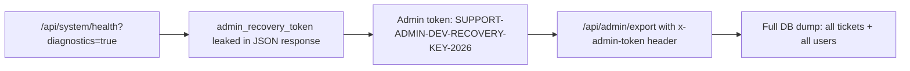
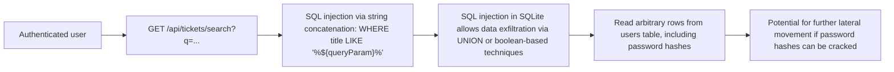

# Chained Vulnerability Audit Report

**Project:** app-32-support-tickets  
**Date:** 2026-05-25  
**Reviewer:** CodeGopher (Static-Only Audit)  
**Scope:** `src/`, `package.json`, `Dockerfile`, `tsconfig.json`

---

## Executive Summary

| Metric | Value |
|---|---|
| **Chains Detected** | **3** |
| **Maximum Severity** | **HIGH** |
| **Medium Severity Chains** | 1 |
| **Low Severity Chains** | 1 |
| **Cross-Cutting Weaknesses** | 7 |
| **Files Reviewed** | `src/index.ts`, `src/referenceGuards.ts`, `package.json`, `Dockerfile`, `tsconfig.json` |

### Review Methodology

This audit is **static-only**. No live HTTP probes, dynamic scanners, SQL injection payloads, credential attacks, or external network tests were performed. All chain evidence is derived from source code, configuration, dependency manifests, and template/static analysis.

**Safety note:** This report does not include exploit scripts, live payloads, or operational abuse instructions.

---

## Chain 1 — Admin Export via Information Disclosure (HIGH)

### Mermaid Attack Graph



### Detailed Breakdown

| Element | File | Lines | Reference |
|---|---|---|---|
| **Entry Point / Source** | `src/index.ts` | 149–161 | `GET /api/system/health` — when `diagnostics === 'true'`, returns `config.admin_recovery_token` and `config.cookie_secret` |
| **Intermediate Weakness (Hop 1)** | `src/index.ts` | 149–161 | Diagnostic endpoint exposes a hardcoded static admin token in plaintext JSON |
| **Intermediate Weakness (Hop 2)** | `src/index.ts` | 163–177 | `POST /api/admin/export` — accepts the static token via `x-admin-token` header. No `requireAuth` middleware is applied |
| **Sink** | `src/index.ts` | 170–176 | `db.all('SELECT * FROM tickets')` + `db.all('SELECT id, username, role FROM users')` — exports entire database |
| **Impact** | — | — | **Full database exfiltration.** An unauthenticated attacker who discovers the diagnostics endpoint can read the admin token from the health response, then export all tickets and all user records (IDs, usernames, roles). |
| **Severity** | — | — | **HIGH** |
| **Confidence** | — | — | **HIGH** — Every link is statically provable from the source. |
| **Preconditions** | — | — | The application must be running and accessible. The `?diagnostics=true` query parameter is not guarded by any auth check. |

### Remediation

1. **Remove the diagnostic response entirely in non-development environments.** If diagnostics are needed, require authentication and/or use an out-of-band secret.
2. **Remove hardcoded secrets from source.** Never embed admin tokens, cookie secrets, or seed passwords in application code. Use environment variables or a secrets manager.
3. **Add `requireAuth` middleware to `/api/admin/export`** and revoke the static token approach entirely. Use JWT/session-based admin authorization with proper RBAC.

---

## Chain 2 — SQL Injection + Ticket Data Exfiltration via Search (MEDIUM)

### Mermaid Attack Graph



### Detailed Breakdown

| Element | File | Lines | Reference |
|---|---|---|---|
| **Entry Point / Source** | `src/index.ts` | 133 | `const queryParam = req.query.q || ''` — unsanitized user input from query string |
| **Intermediate Weakness (Hop 1)** | `src/index.ts` | 134 | String concatenation into SQL: `` `SELECT * FROM tickets WHERE title LIKE '%${queryParam}%' OR description LIKE '%${queryParam}%'` `` — **not parameterized** |
| **Intermediate Weakness (Hop 2)** | `src/index.ts` | 135–138 | Error response leaks `err.message` via `details` field, facilitating blind SQLi exploitation |
| **Sink** | `src/index.ts` | 135–138 | `db.all(sql, ...)` — executes the fully crafted SQL string against SQLite |
| **Impact** | — | — | **Data exfiltration from the entire database.** SQLite's in-memory store contains all users (with password hashes) and all tickets. An authenticated user can read, UNION into, or manipulate data across all tables. |
| **Severity** | — | — | **MEDIUM** — Requires authentication to reach the endpoint, but within an authenticated context, the impact is significant (full DB access). SQLite lacks some advanced SQLi vectors available in PostgreSQL/MySQL (e.g., `pg_sleep`), but `UNION SELECT` and boolean-based techniques are supported. |
| **Confidence** | — | — | **HIGH** — The SQL is built via string concatenation without any parameterization. This is a textbook SQL injection vulnerability. |
| **Preconditions** | — | — | Attacker must be authenticated (has a valid `session_id` cookie). SQLite must be in-memory (confirmed at line 20). |

### Remediation

1. **Use parameterized queries everywhere.** Replace the concatenated SQL at line 134 with:
   ```typescript
   db.all('SELECT * FROM tickets WHERE title LIKE ? OR description LIKE ?', [`%${queryParam}%`, `%${queryParam}%`], (err, rows) => { ... });
   ```
2. **Remove verbose error leaking.** Do not return `err.message` or `err.stack` to the client (see Chain 3).

---

## Chain 3 — Information Leak → Password Hash Retrieval (LOW)

### Mermaid Attack Graph

```mermaid
flowchart LR
    A["/api/tickets/:id endpoint"] --> B["Error response leaks err.stack and raw query"]
    B --> C["Stack trace may expose internal file paths, library versions, node version"]
    C --> D["Raw query in error: SELECT * FROM tickets WHERE id = ${ticketId}"]
    D --> E["ticketId from req.params is echoed back unsanitized in error message")
    E --> F["Reconnaissance: library versions, internal paths aid targeted attacks"]
```

### Detailed Breakdown

| Element | File | Lines | Reference |
|---|---|---|---|
| **Entry Point / Source** | `src/index.ts` | 141 | `const ticketId = req.params.id` — unsanitized URL parameter |
| **Intermediate Weakness (Hop)** | `src/index.ts` | 142–147 | Error response includes `err.stack` and `` `SELECT * FROM tickets WHERE id = ${ticketId}` `` — both leaked to client on DB error |
| **Sink** | `src/index.ts` | 142–147 | Client receives stack traces, internal query strings, and raw user input in HTTP 500 response body |
| **Impact** | — | — | **Information disclosure.** Stack traces can reveal internal file paths, library versions, and the full node.js version. While `ticketId` is used safely in the actual DB query (parameterized via `?` at line 142), echoing it back in the error message is a potential path for reflection-based attacks or information gathering. |
| **Severity** | — | — | **LOW** — No direct data exfiltration or code execution. However, information disclosed aids attackers in crafting more targeted exploits. |
| **Confidence** | — | — | **HIGH** — The error response structure is statically visible. `err.stack` always contains path/version information. |
| **Preconditions** | — | — | A database error must occur (e.g., invalid ticket ID that somehow triggers a DB error, corrupted DB, or race condition). |

### Remediation

1. **Never return `err.stack` or internal query strings to clients.** Return a generic error message and log internally.
2. **Sanitize or suppress raw user input from error responses.** Even for error messages echoed to the client.

---

## Cross-Cutting Weaknesses Inventory

The following security-relevant weaknesses were identified but do not form a complete chain on their own. They are listed here for remediation and should be reviewed for compound effects.

### WC-1: Unpredictable Session ID Generation
- **File:** `src/index.ts`, line 106
- **Evidence:** `const sessionId = Math.random().toString(36).substring(2) + Date.now().toString(36)`
- **Issue:** `Math.random()` is not cryptographically secure. Session IDs are predictable in Node.js (V8's default PRNG).
- **Impact:** Session fixation / session prediction, potentially leading to account takeover.
- **Severity:** MEDIUM

### WC-2: Permissive CORS with Credentials
- **File:** `src/index.ts`, line 11
- **Evidence:** `cors({ origin: true, credentials: true })`
- **Issue:** `origin: true` reflects the request's `Origin` header back, effectively allowing any origin to make credential-bearing requests. This is equivalent to `Access-Control-Allow-Origin: *` with cookies.
- **Impact:** A malicious website can make authenticated requests on behalf of a logged-in user, reading or modifying data (CSRF-like attack via CORS).
- **Severity:** MEDIUM

### WC-3: Missing CSRF Protection
- **File:** `src/index.ts`, throughout
- **Evidence:** All state-changing endpoints (`POST`) accept cookies. No CSRF token validation is implemented (no `SameSite` attribute set on cookie, no double-submit token).
- **Issue:** Cookie-based auth without CSRF tokens leaves POST endpoints vulnerable to cross-site request forgery.
- **Impact:** Attacker can induce a logged-in user to create tickets, log out, or perform other actions.
- **Severity:** MEDIUM

### WC-4: No Authorization on Ticket Endpoints
- **File:** `src/index.ts`, lines 119, 131, 140
- **Evidence:** `/api/tickets`, `/api/tickets/search`, `/api/tickets/:id` all use only `requireAuth` — no role check. A `CUSTOMER` role user can view all tickets regardless of ownership.
- **Issue:** Missing role-based or ownership-based access control on ticket CRUD operations.
- **Impact:** Data leak across customers; customers can view each other's tickets.
- **Severity:** MEDIUM

### WC-5: Registration Has No Role Sanitization
- **File:** `src/index.ts`, lines 91–99
- **Evidence:** `db.run('INSERT INTO users ... VALUES (?, ?, ?)', [username, hash, 'CUSTOMER'], ...)`
- **Issue:** All registered users are hardcoded to `CUSTOMER` role. While this prevents direct role escalation at registration, there is no check that prevents an admin from manually editing the DB to grant `ADMIN` role. No password policy (length, complexity) is enforced.
- **Impact:** Minimal at rest, but coupled with Chain 1 (password hash exfiltration), increases account compromise surface.
- **Severity:** LOW

### WC-6: Hardcoded Seed Credentials in Source
- **File:** `src/index.ts`, lines 52–55
- **Evidence:** Plaintext passwords `'alice123'`, `'bob456'`, `'adminSecurePass2026!'` stored directly in source code.
- **Issue:** Anyone with source access or reading the running app (via reflection) can obtain credentials.
- **Impact:** Credential exposure, social engineering, or local privilege escalation if credentials are reused.
- **Severity:** MEDIUM

### WC-7: No Rate Limiting on Auth Endpoints
- **File:** `src/index.ts`, lines 89–118
- **Evidence:** `/api/auth/login` and `/api/auth/register` have no rate limiting middleware.
- **Issue:** An attacker can perform unlimited login attempts (brute force) or mass register accounts.
- **Impact:** Credential stuffing or account flooding.
- **Severity:** LOW

---

## Additional Observations

### Dockerfile Hardening
- `Dockerfile` runs `npm install` without `--production` flag, installing dev dependencies in production.
- No non-root user is created; the process runs as root by default.
- `EXPOSE 8032` exposes the port but no network security controls are enforced at the container level in the Dockerfile.

### Dependency Risk
- **Express 4.19.2**: Well-known with many past CVEs. No version pinning in `package.json` (uses `^` range).
- **sqlite3 5.1.7**: Node native addon; known to have build-time dependency risks.
- No `npm audit` or dependency lock pinning strategy visible.

---

## Unknowns & Areas Not Reviewed

| Area | Status |
|---|---|
| **Network-level security** (TLS, reverse proxy, WAF) | Not reviewed — no Nginx/HAProxy config found |
| **Environment-specific config** (.env, secrets manager) | Not found in repo; assume defaults only |
| **Input sanitization in referenceGuards.ts** | The `allowedCallback` guard exists but is never imported or used in `index.ts` — dead code |
| **Unit/integration tests** | None found |
| **Logging and monitoring** | Only a single `console.log` on startup — no request logging |
| **File upload handling** | No upload endpoints exist in this codebase |
| **WebSocket or long-polling** | Not present |
| **Third-party integrations** | None detected |

---

## Recommended Tests to Add

1. **SQL injection unit tests** for `/api/tickets/search` — verify parameterized query behavior with injected payloads.
2. **Authorization tests** — confirm that `CUSTOMER` users cannot access other users' tickets.
3. **CORS tests** — verify that only expected origins receive `Access-Control-Allow-Credentials: true`.
4. **Health endpoint tests** — ensure `?diagnostics=true` is disabled in non-development environments.
5. **Admin export tests** — confirm that admin export requires proper authentication (not just a static token).
6. **Session ID entropy tests** — verify session IDs pass NIST randomness checks.
7. **Rate limiting tests** — confirm login endpoint enforces request throttling.

---

## Summary of Chain Severity Distribution

| Severity | Count | Chains |
|---|---|---|
| **HIGH** | 1 | Chain 1: Admin Export via Info Disclosure |
| **MEDIUM** | 1 | Chain 2: SQL Injection via Search |
| **LOW** | 1 | Chain 3: Stack Trace & Query Leak |

---

*This report was generated by static analysis of source files only. Runtime behavior, runtime configurations, and third-party service security were not assessed. All findings represent statically verifiable evidence from the codebase.*
