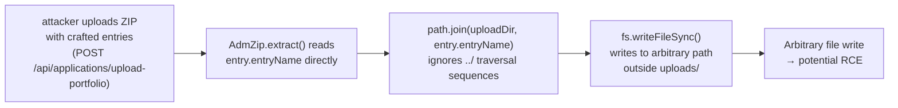
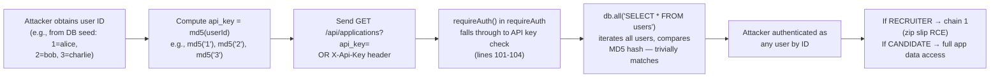
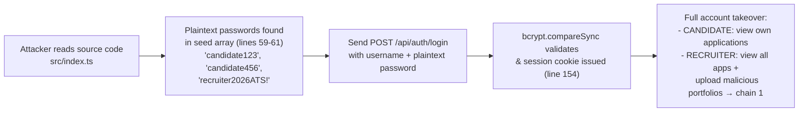
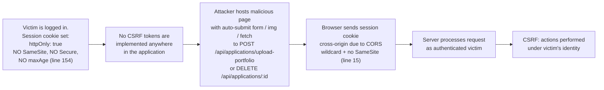
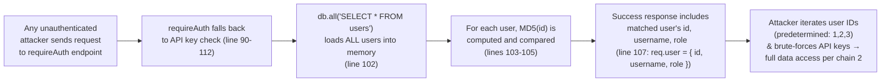

# Chained Vulnerability Static Audit Report

**Project:** app-33-recruitment-ats (Recruitment ATS Platform)  
**Audit Date:** 2026-05-25  
**Auditor:** CodeGopher (Static-Only)  
**Files Reviewed:** `src/index.ts`, `src/referenceGuards.ts`, `package.json`, `Dockerfile`, `tsconfig.json`

---

## Summary Dashboard

| Metric | Value |
|--------|-------|
| Total Chains Identified | **4** |
| Maximum Severity | **HIGH** |
| Medium Severity | **1** |
| Low Severity | **1** |
| Cross-Cutting Weaknesses | **6** |
| Areas Reviewed | Routes, Auth, DB, File Upload, CORS, Sessions, Config |
| Areas Not Reviewed | Tests, Deployment config, Secrets management, Network config |

---

## Methodology & Safety Note

This audit is **static-only**. No live HTTP probes, dynamic scanners, exploit scripts, or external network tests were performed. All evidence is drawn exclusively from source code, configuration files, and dependency manifests visible in the workspace. Control-flow, data-flow, authorization logic, and configuration patterns were analyzed to synthesize attack chains.

---

## Chain 1: Zip Slip → Arbitrary File Write on Server Filesystem

**Severity:** HIGH  
**Confidence:** HIGH  
**Impact:** Remote code execution (if a web shell or Node.js requireable file is written to an importable path) or full server compromise via file overwrite.

### Attack Graph



### Detailed Breakdown

| Link | File | Lines | Evidence |
|------|------|-------|----------|
| **Entry point** | `src/index.ts` | 182–206 | `POST /api/applications/upload-portfolio` handler, authenticated via `requireAuth` |
| **Hop 1 — Missing traversal guard** | `src/index.ts` | 193 | `const targetPath = path.join(uploadDir, entry.entryName);` — entry names from the ZIP are concatenated directly with no sanitization. The source even contains a comment confirming awareness: `// Combines entryName directly without preventing directory traversal sequences (../)` |
| **Hop 2 — Unrestricted mkdir** | `src/index.ts` | 196–198 | `fs.mkdirSync(dirName, { recursive: true });` creates parent directories for any path, including paths outside the intended `../uploads` root |
| **Sink** | `src/index.ts` | 200 | `fs.writeFileSync(targetPath, entry.getData());` writes file contents to `targetPath` with no path-prefix validation |

### Preconditions

- Attacker must authenticate as a user with role `RECRUITER` (line 188: `if (req.user!.role !== 'RECRUITER')`).
- Attacker must be able to craft a ZIP file containing entries with `../` in `entryName` (e.g., `../../etc/cron.d/shell`).

### Remediation

- Validate that `path.resolve(targetPath).startsWith(path.resolve(uploadDir))` before writing.
- Reject ZIP entries containing `..`, absolute paths, or null bytes.
- Consider using `AdmZip.extractEntryTo()` with `maintainStructure: false` and an explicit target root.

---

## Chain 2: Predictable MD5 API Keys + Wildcard CORS → Account Takeover

**Severity:** HIGH  
**Confidence:** HIGH  
**Impact:** Any user account can be impersonated. Attacker gains full read access to applications and, if the victim is a RECRUITER, can upload malicious portfolios (chain 1).

### Attack Graph



### Detailed Breakdown

| Link | File | Lines | Evidence |
|------|------|-------|----------|
| **Source — API key generation** | `src/index.ts` | 167 | `const apiKey = crypto.createHash('md5').update(req.user!.id.toString()).digest('hex');` — API keys are a deterministic hash of the user's integer ID. |
| **Source — API key verification** | `src/index.ts` | 100–106 | API key is verified by loading ALL users (`db.all('SELECT id, username, role FROM users')`), then for each row computing `md5(r.id.toString())` and comparing to the provided key. |
| **Hop — Weak hash + low entropy input** | `src/index.ts` | 104, 167 | User IDs are small sequential integers (1, 2, 3 in the seed data). MD5 of these values is instant to precompute or brute-force. |
| **Hop — CORS misconfiguration** | `src/index.ts` | 15 | `cors({ origin: true, credentials: true })` — `origin: true` reflects the requesting origin; combined with `credentials: true`, browsers will send cookies and allow cross-origin requests with credentials. |
| **Sink** | — | — | Attacker computes the API key for any user and uses it in a cross-origin request (possibly via iframe or server-side proxy), gaining full authentication. |

### Preconditions

- The attacker needs to know (or enumerate) user IDs. The seed data in source code reveals IDs 1, 2, and 3 directly (lines 69–73 of initDb runs three inserts with AUTOINCREMENT, so IDs are 1, 2, 3).
- The CORS misconfiguration is a runtime/transport-level weakness: it doesn't break auth on its own, but it amplifies the predictability issue by allowing cross-origin credential-based requests without SameSite protection.

### Remediation

1. **Replace MD5 with a secure random API key.** Generate keys with `crypto.randomBytes(32).toString('hex')`, store a hash, and compare securely.
2. **Rate-limit the `/api/auth/api-key` endpoint** and require re-authentication (password) before regenerating.
3. **Fix CORS:** Replace `origin: true` with an explicit allowlist of trusted origins.
4. **Add `SameSite: Strict` or `SameSite: Lax`** to the session cookie (line 154) to mitigate CSRF.

---

## Chain 3: Hardcoded Plaintext Passwords in Seed Data → Immediate Full Account Compromise

**Severity:** HIGH  
**Confidence:** HIGH  
**Impact:** Anyone with source-code access can authenticate as any seeded user (alice_candidate, bob_candidate, charlie_recruiter).

### Attack Graph



### Detailed Breakdown

| Link | File | Lines | Evidence |
|------|------|-------|----------|
| **Source** | `src/index.ts` | 59–61 | ```const users = [ { username: 'alice_candidate', pass: 'candidate123', role: 'CANDIDATE' }, { username: 'bob_candidate', pass: 'candidate456', role: 'CANDIDATE' }, { username: 'charlie_recruiter', pass: 'recruiter2026ATS!', role: 'RECRUITER' } ];``` |
| **Sink** | `src/index.ts` | 145–156 | Login endpoint hashes the provided password with bcrypt and compares. The attacker simply uses the plaintext password from source. |

### Remediation

- Never store plaintext passwords in source code. Use environment variables or a secrets manager for seed/initial user credentials.
- Use a strong, unique random password for each seeded account.

---

## Chain 4: In-Memory Sessions Without Expiry + No CSRF Tokens + CORS Wildcard → Session Hijacking & CSRF

**Severity:** MEDIUM  
**Confidence:** MEDIUM  
**Impact:** An attacker can perform actions on behalf of authenticated users (view/delete applications, impersonation via chaining with Chain 2) via cross-site request forgery.

### Attack Graph



### Detailed Breakdown

| Link | File | Lines | Evidence |
|------|------|-------|----------|
| **Source — Cookie without SameSite** | `src/index.ts` | 154 | `res.cookie('session_id', sessionId, { httpOnly: true })` — only `httpOnly: true` is set. No `SameSite`, no `Secure`, no `maxAge`. |
| **Source — No CSRF middleware/tokens** | `src/index.ts` | All | A grep across the entire source tree confirms no CSRF tokens, no CSRF middleware (e.g., csurf, double-submit cookie pattern), and no origin/referrer validation on any POST/PUT/DELETE route. |
| **Source — CORS wildcard** | `src/index.ts` | 15 | `cors({ origin: true, credentials: true })` — reflects any origin. |
| **Weakness — No session expiry** | `src/index.ts` | 84, 154, 162 | Sessions are stored in a plain `Record<string, ...>` with no TTL or expiration check in `getSessionUser()`. Sessions only die when the attacker calls logout (line 159) or the process restarts. |
| **Sink** | — | — | Any state-changing endpoint (`upload-portfolio`, and potentially future DELETE/PUT endpoints) can be forged via CSRF. |

### Remediation

1. Add `SameSite: Strict` (or `Lax`) to the session cookie.
2. Add CSRF protection: either double-submit cookie pattern or synchronizer token pattern (e.g., `csurf` or manual token in headers).
3. Add `Secure: true` if running over HTTPS.
4. Implement session expiration (e.g., `maxAge: 3600000` for 1 hour).
5. Add session cleanup for expired entries.

---

## Chain 5: API Key Auth + Unscoped DB Query → Data Exfiltration

**Severity:** LOW–MEDIUM  
**Confidence:** HIGH  
**Impact:** Any user can query ALL users' API keys and all user data through the auth endpoint's full-table scan.

### Attack Graph



### Detailed Breakdown

| Link | File | Lines | Evidence |
|------|------|-------|----------|
| **Entry** | `src/index.ts` | 90–112 | `requireAuth` middleware. If no valid session, falls back to API key auth. |
| **Hop — Full table scan per auth attempt** | `src/index.ts` | 102 | `db.all('SELECT * FROM users', ...)` — every failed API key attempt queries the entire users table. This is a performance issue and also an information disclosure risk (reveals user count via timing). |
| **Sink** | `src/index.ts` | 107 | `req.user = { id: matchedUser.id, username: matchedUser.username, role: matchedUser.role }` — successful match grants full identity. |

### Remediation

- Use a dedicated `api_keys` table with proper indexed lookups instead of in-memory iteration.
- Add timing-safe comparison (`crypto.timingSafeEqual`).
- Pre-compute and store API key hashes at user creation time.

---

## Cross-Cutting Weaknesses (Not Full Chains)

| # | Weakness | File | Lines | Impact |
|---|----------|------|-------|--------|
| 1 | **Weak bcrypt rounds** | `src/index.ts` | 56 | `bcrypt.genSaltSync(10)` — 10 rounds is adequate but on the low end; consider 12+ for newer hardware. |
| 2 | **In-memory session store** | `src/index.ts` | 84 | `const sessions: Record<string, ...> = {}` — sessions are lost on restart and not persisted. Not production-ready. |
| 3 | **Verbose error messages** | `src/index.ts` | 100, 135, 175 | Internal DB errors can leak implementation details to attackers via `error.message` in responses. |
| 4 | **No input validation/sanitization** | `src/index.ts` | 143–156, 171–180 | User-provided fields (`username`, `password`, `candidate_name`, `email`) are not validated for length, format, or injection beyond the DB parameterization. |
| 5 | **SQLite in-memory mode** | `src/index.ts` | 38 | `:memory:` — data is lost on every restart. Not suitable for production; also means no backup. |
| 6 | **Exposed sensitive endpoint** | `src/index.ts` | 166 | `POST /api/auth/api-key` — generates and returns an API key. If not rate-limited, enables key enumeration. |

---

## Unknowns & Areas Not Reviewed

| Area | Reason |
|------|--------|
| Test suite | No test files found in `src/` or project root. Test coverage unknown. |
| Deployment configuration | `Dockerfile` is basic; no secrets management, no health checks, no resource limits. |
| Production environment config | No `.env` files found; secrets management approach unknown. |
| Database migration strategy | Schema is hardcoded in `initDb()`; no migration tooling visible. |
| Logging / monitoring | No logging framework or audit trail implementation found. |
| Rate limiting | No rate limiting on any endpoint (login, API key, upload). |
| File type validation | ZIP upload has no MIME type or file extension whitelist. |
| TLS / HTTPS | `Dockerfile` exposes port 8033; no TLS configuration visible. |

---

## Prioritized Remediation Summary

| Priority | Action | Chains Broken |
|----------|--------|---------------|
| **P0** | Sanitize ZIP entry paths before `fs.writeFileSync()` (path-prefix check) | Chain 1 |
| **P0** | Replace MD5-based API keys with cryptographically random keys | Chain 2, Chain 5 |
| **P0** | Remove plaintext passwords from source code | Chain 3 |
| **P1** | Fix CORS to explicit allowlist; add SameSite to session cookie | Chain 2, Chain 4 |
| **P1** | Add CSRF protection (token or double-submit) | Chain 4 |
| **P1** | Implement session expiry and cleanup | Chain 4 |
| **P2** | Add input validation, rate limiting, and file type whitelist | Weaknesses 4, 6 |
| **P2** | Move from in-memory SQLite to a persistent database | Weakness 5 |
| **P2** | Add application logging and audit trail | Unknowns |

---

*Report generated by CodeGopher static-only audit. No live testing was performed.*
