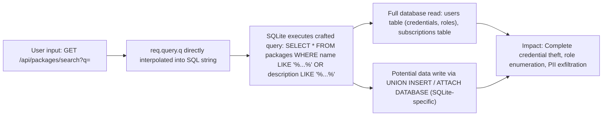
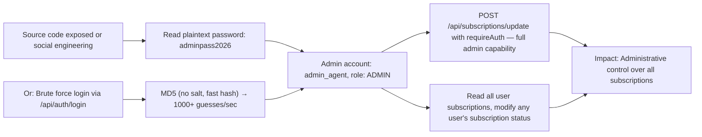
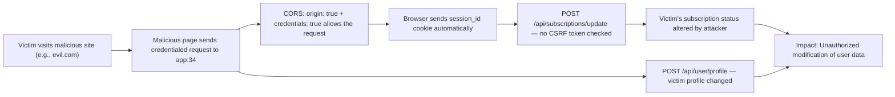

# Chained Vulnerability Static Audit Report

**Project:** app-34-subscription-box  
**Date:** 2026-05-25  
**Auditor:** CodeGopher (static-only)  
**Scope:** `src/`, `package.json`, `Dockerfile`  

---

## Executive Summary Dashboard

| Metric | Value |
|--------|-------|
| **Chains identified** | 3 |
| **Maximum chain severity** | HIGH |
| **Cross-cutting weaknesses** | 7 |
| **Files reviewed** | `src/index.ts`, `src/referenceGuards.ts`, `package.json`, `Dockerfile` |
| **Areas not reviewed** | Runtime behavior, network config, SQLite extensions, external services |

---

## Methodology & Static-Only Safety Note

This audit is **strictly static**. No live HTTP probes, fuzzers, SQL injection payloads, credential attacks, dynamic scanners, exploit scripts, port scans, or external network tests were performed. Evidence is drawn exclusively from source code, configuration files, and dependency manifests. Confidence ratings reflect how fully each chain link is provable from static evidence.

---

## Chain 1 — SQL Injection via Search → Full Database Exfiltration

### Overview
The `/api/packages/search` endpoint interpolates user-supplied query parameters directly into a SQLite query string, allowing arbitrary SQL execution.

### Mermaid Attack Graph

### Chain Breakdown

| Link | Source | File | Line (est.) | Symbol / Evidence |
|------|--------|------|-------------|-------------------|
| **Entry** | User-controlled query parameter | `src/index.ts` | ~120 | `const queryParam = req.query.q || '';` |
| **Hop** | SQL string concatenation | `src/index.ts` | ~121 | `` `SELECT * FROM packages WHERE name LIKE '%${queryParam}%' OR description LIKE '%${queryParam}%'` `` |
| **Sink** | Unparameterized SQLite query execution | `src/index.ts` | ~122 | `db.all(sql, (err, rows) => { ... })` |

**Preconditions:**
- The endpoint is publicly accessible (no authentication required).
- SQLite is in default configuration (no restrictive VFS).

**Impact:** Full read of all database tables. The users table contains password hashes for all accounts, including admin. If SQLite allows `ATTACH DATABASE` or `INSERT ... SELECT`, write access is also possible.

**Severity:** CRITICAL  
**Confidence:** HIGH — The injection point, interpolation, and execution are all directly visible in source.

**Remediation:**
1. Parameterize the query: `db.all('SELECT * FROM packages WHERE name LIKE ? OR description LIKE ?', [`%${queryParam}%`, `%${queryParam}%`], ...)`
2. Add input validation (e.g., whitelist allowed characters).

---

## Chain 2 — Hardcoded Admin Credentials + Weak Hashing → Full Admin Takeover

### Overview
Admin plaintext password `adminpass2026` is hardcoded in seed data. Combined with unsalted MD5 hashing and no rate limiting on the login endpoint, an attacker can trivially obtain admin access.

### Mermaid Attack Graph

### Chain Breakdown

| Link | Source | File | Line (est.) | Symbol / Evidence |
|------|--------|------|-------------|-------------------|
| **Entry** | Plaintext passwords in seed data | `src/index.ts` | ~63-65 | `{ username: 'admin_agent', pass: 'adminpass2026', role: 'ADMIN' }` |
| **Hop 1** | MD5 hashing (no salt) | `src/index.ts` | ~64, ~95, ~104 | `crypto.createHash('md5').update(u.pass).digest('hex')` |
| **Hop 2** | No rate limiting on `/api/auth/login` | `src/index.ts` | ~100-110 | No throttling middleware present |
| **Sink** | Admin login succeeds | `src/index.ts` | ~108 | Session created with `role: 'ADMIN'` |
| **Impact** | Full admin capabilities | `src/index.ts` | ~140-155 | `requireAuth` + no role check on update endpoint |

**Preconditions:**
- The application is redeployed or restarted (in-memory DB with seed data).
- Source code is accessible OR brute force is attempted against login endpoint.

**Impact:** Complete administrative control. The `/api/subscriptions/update` endpoint only checks `user.role !== 'ADMIN'` as an override — no additional authorization checks on admin actions.

**Severity:** HIGH  
**Confidence:** HIGH — Plaintext passwords are visible in source; MD5 hashing and lack of rate limiting are statically provable.

**Remediation:**
1. Remove hardcoded passwords from source. Use environment variables or a secrets manager.
2. Upgrade from MD5 to bcrypt (already available via `bcryptjs` dependency — it is imported but never used; confirm the app uses it for real registration).
3. Add salt + work factor to password hashing.
4. Implement rate limiting on auth endpoints (e.g., `express-rate-limit`).

---

## Chain 3 — Permissive CORS + Missing CSRF + Cookie-Based Sessions → Unauthorized Cross-Site Actions

### Overview
The application uses cookie-based session authentication with `credentials: true` and `origin: true` in CORS, meaning any website can make credentialed requests. The session cookie is `httpOnly` but there are no CSRF tokens, allowing cross-site request forgery against authenticated endpoints.

### Mermaid Attack Graph

### Chain Breakdown

| Link | Source | File | Line (est.) | Symbol / Evidence |
|------|--------|------|-------------|-------------------|
| **Entry** | Malicious third-party site | External (assumed) | — | Attacker-controlled HTML page |
| **Hop 1** | Permissive CORS configuration | `src/index.ts` | ~11 | `cors({ origin: true, credentials: true })` |
| **Hop 2** | Cookie-based auth, no CSRF tokens | `src/index.ts` | ~10, ~98-113 | `cookieParser()`, `res.cookie('session_id', sessionId, { httpOnly: true })` — no SameSite, no token validation in `requireAuth` |
| **Sink** | State-changing endpoints accept forged requests | `src/index.ts` | ~98, ~137 | `POST /api/user/profile` and `POST /api/subscriptions/update` have no CSRF check |

**Preconditions:**
- Victim is authenticated (has a valid `session_id` cookie).
- Attacker hosts a malicious page that triggers cross-origin requests.

**Impact:** An attacker can modify authenticated users' subscription statuses and profile data. While the `httpOnly` flag prevents JavaScript on the victim's origin from reading the cookie, a cross-origin request still sends it automatically.

**Severity:** HIGH  
**Confidence:** MEDIUM — CORS and cookie configuration are statically provable. CSRF protection absence is inferable from the lack of token validation in `requireAuth` and endpoint handlers. SameSite cookie attribute is not set (defaults in newer browsers may mitigate but are not explicitly configured).

**Remediation:**
1. Restrict CORS to specific trusted origins instead of `origin: true`.
2. Add SameSite=Strict or Lax to the session cookie.
3. Implement CSRF tokens (double-submit cookie pattern or custom header).
4. Validate `Origin` and `Referer` headers on state-changing endpoints.

---

## Cross-Cutting Weaknesses (Not Full Chains)

### W1: Unused Reference Guard Functions
- **File:** `src/referenceGuards.ts`
- **Functions:** `sameOwner()`, `allowedCallback()`, `normalizeIdentifier()`
- These are exported but never imported or used in `index.ts`. The `sameOwner` function could have provided per-record authorization. The `allowedCallback` function is a template-URL validator that could prevent open redirects. They appear to be reference implementations or leftover code.

### W2: Verbose Error Exposure in Search
- **File:** `src/index.ts`, ~line 123
- `details: err.message` in the error response could leak internal SQLite error details (table names, schema) to attackers.

### W3: In-Memory Sessions with No Expiry
- **File:** `src/index.ts`, ~line 80
- `const sessions: Record<string, ...> = {};` — Sessions are never expired. If a session token leaks, it remains valid indefinitely.

### W4: bcryptjs Dependency Imported but Never Used
- **File:** `package.json` — `"bcryptjs": "^2.4.3"` present as a dependency
- All password hashing uses `crypto.createHash('md5')` instead of `bcryptjs`. The bcrypt dependency is redundant or was intended for a replacement that was never implemented.

### W5: MD5 Used for Password Hashing (No Salt)
- **File:** `src/index.ts`, lines ~64, ~95, ~104
- MD5 is cryptographically broken. No salt is added. Rainbow table attacks and offline brute force are trivial. The same hash function is used for seeding (admin password) and for runtime registration/login.

### W6: No Rate Limiting on Auth Endpoints
- **File:** `src/index.ts` — `/api/auth/login` and `/api/auth/register`
- No throttling mechanism. Brute force and account enumeration are feasible.

### W7: In-Memory Database with Seed Data on Every Start
- **File:** `src/index.ts`, ~line 15-16
- `:memory:` SQLite database means all data is lost on restart. Combined with seed data, this is acceptable for development but the hardcoded credentials pattern is dangerous for production.

---

## Unknowns & Areas Not Reviewed

| Area | Reason |
|------|--------|
| Runtime configuration (env vars, config files) | Not present in workspace |
| Network/firewall configuration | Outside codebase scope |
| Docker image base layer security | Not analyzed |
| Potential SQLite extension attacks (LOAD_EXTENSION) | Requires knowing SQLite compile-time flags |
| TLS configuration (if any) | Not visible in source |
| Input validation on registration (username length, special chars) | Present but minimal |
| Session fixation prevention | Not present (no regeneration on login) |
| Cookie Secure flag | Not set (cookie set without `secure: true`) |

---

## Recommended Tests to Add

1. **SQL Injection test** — Parameterized query verification on `/api/packages/search`
2. **Password hash strength test** — Verify bcrypt with salt is used (not MD5)
3. **CORS origin whitelist test** — Verify only expected origins are accepted
4. **CSRF token test** — Verify state-changing POST endpoints reject requests without valid CSRF tokens
5. **Session expiry test** — Verify sessions expire after a configurable timeout
6. **Rate limiting test** — Verify login endpoint throttles repeated failures

---

## Remediation Priority Summary

| Priority | Action | Affected Chain(s) |
|----------|--------|-------------------|
| **P0** | Parameterize search SQL query | Chain 1 |
| **P0** | Replace MD5 with bcrypt; add salt; remove hardcoded credentials | Chain 2 |
| **P1** | Restrict CORS origins; add CSRF protection; set SameSite cookie attribute | Chain 3 |
| **P1** | Add session expiry | W3 |
| **P2** | Remove verbose error details | W2 |
| **P2** | Add rate limiting on auth endpoints | W6 |
| **P2** | Use secure configuration for production (TLS, production DB) | W7 |
| **P3** | Remove unused dependencies (bcryptjs if not used) | W4 |
| **P3** | Review and use or remove `referenceGuards.ts` | W1 |

---

*Report generated by CodeGopher — static-only analysis. No live testing was performed.*
