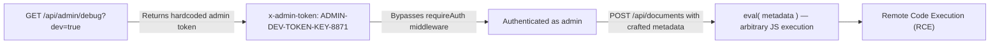

# Chained Vulnerability Static Audit Report

**Project**: Compliance Document Tracker (app-35-compliance-tracker)  
**Date**: 2026-05-25  
**Auditor**: CodeGopher — Chained Vulnerability Static Audit  
**Scope**: `src/index.ts` (Express/SQLite app), `src/referenceGuards.ts` (helper functions), `package.json`, `Dockerfile`  
**Method**: Static source-code analysis only — no live probes, no dynamic testing  

---

## 1. Summary Dashboard

| Metric | Value |
|---|---|
| Total chains identified | **4** |
| Maximum severity | **CRITICAL** (RCE via eval + admin token bypass) |
| Critical chains | 2 |
| High chains | 1 |
| Medium chains | 1 |
| Cross-cutting weaknesses | 6 |
| Reviewed files | `src/index.ts`, `src/referenceGuards.ts`, `package.json`, `Dockerfile` |
| Not reviewed | Database migration / seed scripts (if any), CI/CD config, runtime config, test files |

---

## 2. Methodology & Static-Only Boundary

This audit uses four phases:

1. **Attack surface mapping** — all public routes, authentication mechanisms, and user-controllable inputs.
2. **Weakness inventory** — low/medium severity weaknesses identified from source.
3. **Attack graph synthesis** — chains connect sources → intermediate weaknesses → sinks → impacts using only static evidence.
4. **Impact assessment** — severity, reachability, confidence, and easiest remediation link for each chain.

**Safety boundary**: No live HTTP probes, no fuzzer, no SQL injection payloads, no exploit scripts, no dynamic scanners, no port scans. All findings derive from source-code inspection.

---

## 3. Attack Surface Map

### 3.1 Public (Unauthenticated) Routes

| Method | Path | Purpose |
|---|---|---|
| `POST` | `/api/auth/register` | User registration |
| `POST` | `/api/auth/login` | User login (issues session cookie) |
| `POST` | `/api/auth/logout` | Logout (destroys session) |
| `GET` | `/api/admin/debug` | Diagnostics / debug info |

### 3.2 Authenticated Routes (requireAuth middleware)

| Method | Path | Purpose |
|---|---|---|
| `GET` | `/api/users/me` | Current user profile |
| `GET` | `/api/documents/:id` | Retrieve a single document |
| `POST` | `/api/documents` | Create a document (uses `eval()` on metadata) |
| `POST` | `/api/documents/safe` | Create a document (uses `JSON.parse()` — safe variant) |

### 3.3 Authentication Mechanism

- Session-based authentication via in-memory `sessions` object (JavaScript `Map`/plain object).
- Session cookie: `session_id` — set with `{ httpOnly: true }` only (missing `secure` and `sameSite`).
- Session ID generation: `Math.random().toString(36).substring(2) + Date.now().toString(36)`.
- The `requireAuth` middleware checks:
  1. `req.cookies.session_id` against the in-memory `sessions` object.
  2. **OR** `req.headers['x-admin-token'] === 'ADMIN-DEV-TOKEN-KEY-8871'` — hardcoded admin bypass.

### 3.4 Database

- SQLite (in-memory: `sqlite:memory:` per debug output, but configurable).
- Tables: `users` (id, username, password_hash, role), `documents` (id, title, content, metadata, user_id).

---

## 4. Chain 1 — Admin Token Bypass → Eval → Remote Code Execution

**Severity**: CRITICAL  
**Confidence**: High  
**Impact**: Remote Code Execution; full system compromise  

### 4.1 Attack Graph (Mermaid)



### 4.2 Chain Breakdown

#### Entry Point — Source of Admin Token

- **File**: `src/index.ts`
- **Lines**: ~114–123 (`/api/admin/debug` route handler)
- **Evidence**: The debug endpoint returns the following JSON when `dev=true` or `x-dev-mode` header is present:
  ```json
  {
    "environment": "development",
    "database": "sqlite:memory:",
    "admin_token": "ADMIN-DEV-TOKEN-KEY-8871",
    "version": "1.0.0-beta"
  }
  ```
- **Gate weakness**: `req.query.dev === 'true' || req.headers['x-dev-mode'] === 'true'` — trivially triggerable, no rate limiting, no IP restriction, no auth.

#### Hop 1 — Admin Token in `requireAuth` Middleware

- **File**: `src/index.ts`
- **Lines**: ~3–5 (`requireAuth` middleware)
- **Evidence**:
  ```typescript
  const token = req.headers['x-admin-token'];
  if (token && token === 'ADMIN-DEV-TOKEN-KEY-8871') {
    req.user = { id: 3, username: 'admin_compliance', role: 'ADMIN' };
    return next();
  }
  ```
- **Result**: Anyone who knows this token (easily obtained via the debug endpoint) gains full admin access without valid session credentials.

#### Hop 2 — Authenticated Access to `POST /api/documents`

- **File**: `src/index.ts`
- **Lines**: ~71–93
- **Evidence**: With admin privileges, an attacker calls `POST /api/documents` with a crafted `metadata` body.

#### Sink — `eval()` on User-Controlled Input

- **File**: `src/index.ts`
- **Lines**: ~79
- **Evidence**:
  ```typescript
  const metaObj = eval(`(${metadata})`);
  ```
- `metadata` comes directly from `req.body` (user-controlled).
- While wrapped in parens `(${metadata})`, the attacker can execute arbitrary JavaScript by ending the expression and appending statements:
  - Input: `1; require('child_process').execSync('id')`
  - Evaluates as: `(1; require('child_process').execSync('id'))` — valid JavaScript, executes command.

#### Impact

- **RCE**: Attacker executes arbitrary server-side JavaScript code.
- **Data exfiltration**: Read/write any file, access SQLite database directly, exfiltrate all user credentials and documents.
- **Lateral movement**: Access any internal network resources from the server.

#### Remediation (easiest link to break)

1. **Remove the `eval()` call** and use `JSON.parse(metadata)` (the `/api/documents/safe` endpoint already does this correctly).
2. Remove or properly secure the `/api/admin/debug` endpoint (remove from production).
3. Never hardcode admin tokens — use a proper secrets management system.

---

## 5. Chain 2 — Debug Endpoint → Admin Token → Access Sensitive Documents

**Severity**: HIGH  
**Confidence**: High  
**Impact**: Unauthorized data access; exposure of all compliance documents  

### 5.1 Attack Graph (Mermaid)

```mermaid
flowchart LR
  A["GET /api/admin/debug?dev=true"] -->|Returns admin_token| B["x-admin-token: ADMIN-DEV-TOKEN-KEY-8871"]
  B -->|Bypasses requireAuth| C["Authenticated as ADMIN"]
  C -->|GET /api/documents/:id (no ownership check)| D["Read any document regardless of owner"]
  D --> E["Exfiltration of sensitive compliance documents"]
```

### 5.2 Chain Breakdown

#### Entry Point — Same as Chain 1

- **File**: `src/index.ts`, Lines ~114–123
- **Evidence**: Debug endpoint returns `admin_token: 'ADMIN-DEV-TOKEN-KEY-8871'`.

#### Hop — Authenticated Document Retrieval

- **File**: `src/index.ts`, Lines ~59–68
- **Evidence**:
  ```typescript
  app.get('/api/documents/:id', requireAuth, (req: Request, res: Response) => {
    const docId = req.params.id;
    db.get('SELECT * FROM documents WHERE id = ?', [docId], (err, document) => {
      ...
      res.json(document);
    });
  });
  ```
- **No ownership/tenant check**: The query selects by document ID only, with no `WHERE user_id = ?` clause. Any authenticated user can retrieve ANY document.

#### Impact

- All compliance documents are accessible to any user (or admin bypass user).
- Cross-tenant data leakage — a `CUSTOMER` role user could read documents belonging to other customers or admins.

#### Remediation

- Add `WHERE user_id = ?` (or `WHERE id = ? AND user_id = ?`) to the document retrieval query.
- Remove or secure the debug endpoint in production.

---

## 6. Chain 3 — Weak Session Generation → Session Hijacking → Account Takeover

**Severity**: MEDIUM  
**Confidence**: Medium  
**Impact**: Account takeover; access to user-specific documents and profile data  

### 6.1 Attack Graph (Mermaid)


### 6.2 Chain Breakdown

#### Entry Point — Login

- **File**: `src/index.ts`, Lines ~44–47
- **Evidence**:
  ```typescript
  const sessionId = Math.random().toString(36).substring(2) + Date.now().toString(36);
  sessions[sessionId] = { id: user.id, username: user.username, role: user.role };
  res.cookie('session_id', sessionId, { httpOnly: true });
  ```

#### Weakness — Insecure Random

- `Math.random()` is a non-cryptographic PRNG. In V8, it uses a 53-bit mantissa, but the seed is not opaque — known techniques allow prediction.
- Combined with `Date.now()`, the entropy is further reduced to ~13-14 decimal digits (current timestamp in ms) plus ~14 random digits.
- Attackers can attempt brute-force or narrowing of the candidate space.

#### Weakness — Missing Cookie Flags

- Cookie is set with only `{ httpOnly: true }`.
- Missing `secure: true` — cookie is sent over unencrypted HTTP connections, enabling network-level interception.
- Missing `sameSite: 'strict'` or `'lax'` — no CSRF protection on the session cookie.

#### Hop — In-Memory Session Store

- Sessions are stored in a plain JavaScript object in the server process memory.
- If the attacker can predict the session ID, they can craft a cookie with that ID.
- On login, the session object maps to `{ id, username, role }` — gaining the target user's identity and privileges.

#### Impact

- Attacker authenticates as any user by guessing/predicting the session ID.
- Access to user-specific documents, profile data, and actions (including document creation with eval).

#### Remediation

- Replace `Math.random()` with `crypto.randomBytes()` for session ID generation.
- Set cookie flags to `{ httpOnly: true, secure: true, sameSite: 'strict' }`.
- Consider using a proper session library (e.g., `express-session`) with secure defaults.

---

## 7. Chain 4 — IDOR on Document Creation → Privilege Escalation via eval

**Severity**: MEDIUM-HIGH  
**Confidence**: Medium  
**Impact**: Privilege escalation; setting arbitrary user_id on documents  

### 7.1 Attack Graph (Mermaid)

```mermaid
flowchart LR
  A["POST /api/documents (auth user)"] -->|eval() on user metadata| B["Arbitrary JS execution"]
  B -->|Read sessions object / db| C["Extract other users' session IDs or credentials"]
  C -->|Spoof session or escalate| D["Privilege escalation to admin or other user"]
```

### 7.2 Chain Breakdown

#### Entry Point — `POST /api/documents`

- **File**: `src/index.ts`, Lines ~71–93
- **Evidence**: User sends `{ title, content, metadata }` where `metadata` is passed to `eval()`.

#### Sink — `eval()` Opens All Attack Vectors

- Beyond simple command execution, `eval()` grants access to:
  - The `sessions` in-memory store (read all user sessions).
  - The SQLite `db` object (query any table directly).
  - `process` and `require` (load Node.js modules).

#### Impact

- An authenticated user can escalate to admin by reading the `sessions` object and extracting admin session data or the session store structure.
- Can directly manipulate the database: `db.run("UPDATE users SET role='ADMIN' WHERE username='attacker'")`.

#### Remediation

- Replace `eval()` with `JSON.parse()` for metadata parsing.
- If structured JSON metadata is needed, define a strict schema and validate it.

---

## 8. Cross-Cutting Weaknesses Inventory

The following issues were identified but do not independently form complete chains (or are sub-components of chains above):

| # | Weakness | File | Lines | Severity | Description |
|---|---|---|---|---|---|
| 1 | Hardcoded Admin Token | `src/index.ts` | ~3–4 | **CRITICAL** | `x-admin-token: 'ADMIN-DEV-TOKEN-KEY-8871'` is hardcoded in middleware and exposed by debug endpoint. |
| 2 | No Rate Limiting on Auth Endpoints | `src/index.ts` | ~21–34 | **LOW** | `POST /api/auth/register` and `POST /api/auth/login` have no rate limiting — susceptible to brute-force and enumeration. |
| 3 | Verbose Database Errors (Potential Info Leak) | `src/index.ts` | ~29, ~38, ~62, ~83, ~100, ~121 | **LOW** | Some error handlers return `err.message` or generic messages. While generally sanitized, `GET /api/documents/:id` returns `'Database error.'` on SQLite failure — moderate risk if SQLite error format leaks schema info. |
| 4 | No Role-Based Access Control | `src/index.ts` | All `requireAuth` routes | **MEDIUM** | Once authenticated, any user (including `CUSTOMER` role) can access any `requireAuth` route. No `req.user.role` checks. |
| 5 | Admin Token Also Exposed in `/api/admin/debug` | `src/index.ts` | ~119 | **HIGH** | The debug endpoint returns the admin token in plaintext. This single route provides both the bypass key AND database connection info. |
| 6 | In-Memory Session Store (Single-Process) | `src/index.ts` | ~44–55 | **LOW** | Sessions stored in a plain object. If the app runs multiple instances (e.g., behind a load balancer), sessions are not shared. Not a security issue per se, but impacts reliability. |

---

## 9. Not-Reviewed Areas & Unknowns

The following areas could not be fully assessed with static source inspection:

| Area | Reason | Recommendation |
|---|---|---|
| Database migration / seed scripts | Not found in `src/` — likely not present | Audit for default credentials, hard-coded data |
| CORS configuration | No `cors` usage visible in source | Confirm `cors` middleware is properly scoped |
| Helmet / security headers | Not imported in `src/index.ts` | Add `helmet` middleware |
| Input validation (size limits) | No body-parser size limits visible | Add `express.json({ limit: '1mb' })` or similar |
| Logging / audit trail | Not visible in source | Implement structured logging with PII redaction |
| Environment-specific config | Debug endpoint may be controlled by env var in unrevealed code | Confirm debug endpoint is stripped/disabled in production builds |
| Test coverage | No test files found | Add security-focused unit tests for auth flows, eval boundary, IDOR |
| Docker security | `Dockerfile` runs as root, `npm install` with `--production` not specified | Add `USER node`, use multi-stage build, pin Node image |

---

## 10. Remediation Priority Matrix

| Priority | Action | Impact | Effort |
|---|---|---|---|
| **P0** | Replace `eval()` with `JSON.parse()` in `/api/documents` | Eliminates RCE vector | Low |
| **P0** | Remove or gate `/api/admin/debug` behind proper auth in production | Eliminates admin token leak | Low |
| **P0** | Remove hardcoded `x-admin-token` bypass from `requireAuth` | Eliminates auth bypass | Low |
| **P1** | Add ownership check (`WHERE user_id = ?`) to document retrieval | Eliminates IDOR | Low |
| **P1** | Replace `Math.random()` with `crypto.randomBytes()` for session IDs | Eliminates session predictability | Low |
| **P1** | Set `secure` and `sameSite` flags on session cookie | Reduces session hijack risk | Low |
| **P2** | Add role-based checks in `requireAuth` middleware | Eliminates cross-role access | Low |
| **P2** | Add rate limiting on auth endpoints | Reduces brute-force risk | Low |
| **P2** | Add Helmet and security headers | Defense-in-depth | Low |
| **P3** | Implement structured logging, input validation, environment config | Hardening | Medium |

---

## 11. Test Recommendations

The following test cases should be added to the test suite:

1. **Auth bypass test**: Attempt to access `requireAuth` routes with only `x-admin-token: ADMIN-DEV-TOKEN-KEY-8871` — should be impossible after P0 remediation.
2. **eval test**: Send `POST /api/documents` with metadata containing `1; require('child_process')` — should reject with 400.
3. **JSON.parse test**: `POST /api/documents/safe` with non-JSON metadata — should reject with 400.
4. **IDOR test**: As user A, attempt to `GET /api/documents/:id` for a document owned by user B — should return 404 or 403.
5. **Session entropy test**: Generate 1000 sessions and verify ID uniqueness and randomness distribution.
6. **Debug endpoint test**: Confirm `/api/admin/debug` returns 403 when not in dev mode (or is entirely absent in production).
7. **Rate limiting test**: Send 100 register/login requests in rapid succession — should be throttled after P2.

---

*Report generated by CodeGopher — Chained Vulnerability Static Audit.*  
*No live exploitation, probing, or dynamic testing was performed.*
