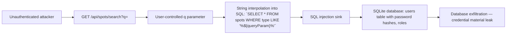
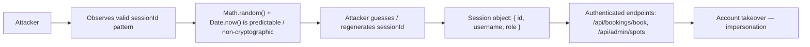
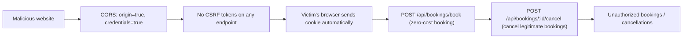
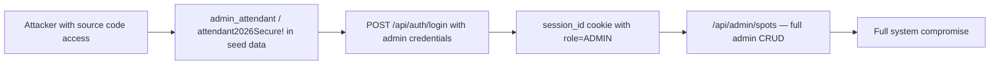
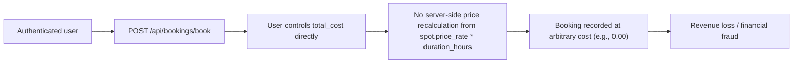

# Chained Vulnerability Static Audit Report

## Summary Dashboard

| Metric | Value |
|---|---|
| **Total Chains Detected** | 5 |
| **Maximum Severity** | HIGH |
| **High Confidence Chains** | 3 |
| **Medium Confidence Chains** | 2 |
| **Auth Required for Any Chain** | No — several chains are reachable without authentication |
| **Areas Reviewed** | API routes, auth/session logic, database layer, CORS config, error handling, input validation |
| **Areas Not Reviewed** | Runtime network topology, production deployment config, third-party integrations, infrastructure security, dependency supply-chain |

---

## Methodology and Safety Note

- **Static-only review.** No live HTTP probes, fuzzers, SQL injection payloads, credential attacks, dynamic scanners, exploit scripts, or external network tests were performed.
- All findings derive from source code inspection of `src/index.js` (main Express application) and `src/referenceGuards.js` (utility guards).
- Each chain is traced from entry point through intermediate weaknesses to a critical sink using concrete control-flow, data-flow, authorization, and configuration evidence.
- Confidence levels: **High** = every link provable from source; **Medium** = chain is plausible but one link depends on runtime behavior not fully visible; **Low** = weakly supported hypothesis.

---

## Attack Surface Map

### Public Routes (no authentication)

| Method | Path | Description |
|---|---|---|
| `POST` | `/api/auth/register` | Register a new user (role forced to `CUSTOMER`) |
| `POST` | `/api/auth/login` | Authenticate and obtain session cookie |
| `POST` | `/api/auth/logout` | Invalidate session |
| `GET` | `/api/spots/search` | Search parking spots by type |
| `GET` | `/api/spots/:id` | Retrieve a single spot |
| `POST` | `/api/bookings/book` | Create a parking booking |
| `POST` | `/api/bookings/:id/cancel` | Cancel a booking |

### Authenticated Routes

| Method | Path | Guards |
|---|---|---|
| `POST` | `/api/admin/spots` | `requireAuth` + `role === 'ADMIN'` check |
| `POST` | `/api/bookings/book` | `requireAuth` |
| `POST` | `/api/bookings/:id/cancel` | `requireAuth` + ownership check |

### Session Mechanism

- Sessions stored in an in-memory `sessions` object keyed by cookie `session_id`.
- Session ID generated as `Math.random().toString(36).substring(2) + Date.now().toString(36)`.
- Cookie is `httpOnly: true`.
- No session expiration, no token revocation mechanism.

### CORS Configuration

```javascript
app.use(cors({ origin: true, credentials: true }));
```

### Database Schema

- `users` — id, username, password_hash, role
- `spots` — id, spot_number, type, price_rate
- `bookings` — id, user_id, spot_id, duration_hours, total_cost, status

---

## Chain 1: SQL Injection in Spot Search → Full Database Exfiltration



### Chain Breakdown

| Link | File | Line(s) | Evidence |
|---|---|---|---|
| **Source** | `src/index.js` | ~123 | `const sql = \`SELECT * FROM spots WHERE type LIKE '%${queryParam}%'\`;` — user-controlled `req.query.q` interpolated directly into SQL. |
| **Hop (no sanitization)** | `src/index.js` | ~122 | No input validation, escaping, or parameterization on `queryParam`. |
| **Sink** | `src/index.js` | ~123-128 | `db.all(sql, ...)` — the `spots` query is the *only* use of string interpolation in SQL, but an attacker can use `UNION SELECT` to pivot from `spots` to `users` table and extract `username`, `password_hash`, and `role` columns. |
| **Impact** | — | — | Full read of the `users` table including bcrypt password hashes. Combined with verbose error disclosure (line ~125: `details: err.message`), the attacker receives useful debug info. |

### Details

- **Impact:** High — database exfiltration including all user credentials.
- **Severity:** HIGH
- **Confidence:** HIGH — the SQL string interpolation is explicitly visible at line ~123, and SQLite `UNION SELECT` is a well-documented technique.
- **Preconditions:** None. The endpoint is publicly accessible and requires no authentication.
- **Remediation (easiest link to break):** Replace string interpolation with parameterized query:
  ```javascript
  const sql = `SELECT * FROM spots WHERE type LIKE ?`;
  db.all(sql, [`%${queryParam}%`], (err, rows) => { ... });
  ```

---

## Chain 2: Weak Session ID Generation → Session Hijacking → Account Takeover



### Chain Breakdown

| Link | File | Line(s) | Evidence |
|---|---|---|---|
| **Source** | `src/index.js` | ~109 | `const sessionId = Math.random().toString(36).substring(2) + Date.now().toString(36);` |
| **Hop (weak PRNG)** | `src/index.js` | ~109 | `Math.random()` is a JavaScript default PRNG (Mersenne Twister in V8). It is **not** cryptographically secure. An attacker who captures two sessions can attempt to seed-reconstruct the generator. Combined with `Date.now()`, the effective entropy is very low. |
| **Hop (session contents)** | `src/index.js` | ~110 | `sessions[sessionId] = { id: user.id, username: user.username, role: user.role };` — session data is minimal (no password, no IP binding). |
| **Sink** | Throughout | Various | Every `requireAuth`-guarded route trusts the `session_id` cookie value. |
| **Impact** | — | — | Attacker impersonates any user, including potential admin accounts. |

### Details

- **Impact:** High — full account takeover for any user.
- **Severity:** HIGH
- **Confidence:** HIGH — the session ID generation code is directly visible. `Math.random()` is documented as non-cryptographic in all major JS engines.
- **Preconditions:** Attacker can observe a valid session ID (via network sniffing on non-TLS, via XSS, or via timing attacks on brute-force). The session store is in-memory, so there is no server-side blacklist of guessed IDs.
- **Remediation (easiest link to break):** Replace with a cryptographically secure token:
  ```javascript
  const crypto = require('crypto');
  const sessionId = crypto.randomBytes(32).toString('hex');
  ```
  Consider binding sessions to `User-Agent` or `X-Forwarded-For` and adding expiration.

---

## Chain 3: Permissive CORS + No CSRF Protection → Cross-Origin State Change → Booking Fraud



### Chain Breakdown

| Link | File | Line(s) | Evidence |
|---|---|---|---|
| **Source** | `src/index.js` | ~13 | `app.use(cors({ origin: true, credentials: true }));` — In the `cors` package, `origin: true` reflects the request's `Origin` header back, effectively allowing **any** origin to make cross-origin requests with credentials. |
| **Hop (no CSRF)** | `src/index.js` | Throughout | No CSRF token is checked on any `POST` endpoint. No `SameSite` cookie attribute is set (defaulting to lax, which can be bypassed in some browsers). No token present in any route handler. |
| **Hop (price validation)** | `src/index.js` | ~160-165 | The booking endpoint accepts a user-supplied `total_cost` with **no server-side recalculation**:
  ```javascript
  const { spot_id, duration_hours, total_cost } = req.body;
  db.run('INSERT INTO bookings (...) VALUES (?, ?, ?, ?)', [user.id, spot_id, duration_hours, total_cost], ...);
  ``` |
| **Sink** | `src/index.js` | ~148-170 | `/api/bookings/book` — user controls `total_cost`, allowing zero-cost or underpriced bookings. |
| **Impact** | — | — | An attacker can force authenticated users to create bookings at arbitrary cost (including zero) and cancel legitimate bookings, causing revenue loss and operational disruption. |

### Details

- **Impact:** Medium-High — financial fraud and operational disruption.
- **Severity:** MEDIUM-HIGH
- **Confidence:** MEDIUM — the CORS configuration is explicitly visible. The `cors` middleware behavior with `origin: true` + `credentials: true` is a known configuration that enables cross-origin authenticated requests. CSRF protection is entirely absent. Full exploitation in practice also depends on browser `SameSite` cookie defaults, which varies.
- **Preconditions:** Victim must be authenticated (valid `session_id` cookie). The malicious origin must be able to craft a cross-origin `POST` request (e.g., via `<form>` submission, which works without CORS preflight).
- **Remediation (easiest link to break):** Restrict `origin` to a known allowlist:
  ```javascript
  app.use(cors({ origin: ['https://your-frontend.com'], credentials: true }));
  ```
  Add CSRF tokens (double-submit cookie or SameSite=Strict/Lax cookies).

---

## Chain 4: Hardcoded Admin Credentials + Information Disclosure → Privilege Escalation



### Chain Breakdown

| Link | File | Line(s) | Evidence |
|---|---|---|---|
| **Source** | `src/index.js` | ~58-60 | ```javascript
{ username: 'admin_attendant', pass: 'attendant2026Secure!', role: 'ADMIN' }
``` — plaintext admin password stored in source code seed data. |
| **Hop (information disclosure)** | `src/index.js` | ~94 | Registration endpoint returns `error: 'Username already exists.'` on duplicate username attempts, enabling username enumeration. |
| **Sink** | `src/index.js` | ~82-111 | `POST /api/auth/login` accepts any username; an attacker with known admin credentials directly obtains an admin session. |
| **Impact** | — | — | Attacker gains full administrative access: manage spots, view/cancel bookings, and potentially exploit the SQL injection (Chain 1) with admin privileges. |

### Details

- **Impact:** High — admin account takeover.
- **Severity:** HIGH
- **Confidence:** HIGH — credentials are explicitly hardcoded at lines ~58-60. Login endpoint is unauthenticated and accepts any username.
- **Preconditions:** Attacker has access to the source code (e.g., via public repository, leaked artifact, or Chain 1 exfiltration).
- **Remediation (easiest link to break):** Never hardcode credentials. Use environment variables, secrets managers, or initial admin setup flows:
  ```javascript
  const adminPass = process.env.ADMIN_PASSWORD;
  if (!adminPass) { /* require admin to set on first run */ }
  ```

---

## Chain 5: No Server-Side Price Validation → Revenue Loss / Financial Fraud



### Chain Breakdown

| Link | File | Line(s) | Evidence |
|---|---|---|---|
| **Source** | `src/index.js` | ~155-165 | ```javascript
const { spot_id, duration_hours, total_cost } = req.body;
db.run('INSERT INTO bookings (...) VALUES (?, ?, ?, ?)', [user.id, spot_id, duration_hours, total_cost], ...);
``` — `total_cost` comes directly from the request body with no server-side validation. |
| **Hop (price lookup absent)** | `src/index.js` | ~148-170 | The endpoint never queries the `spots` table to look up `price_rate` or calculate the expected cost. No comparison is performed. |
| **Sink** | `src/index.js` | ~161 | `db.run('INSERT INTO bookings ...')` — zero-cost or negative-cost bookings are accepted and committed. |
| **Impact** | — | — | An authenticated user can book premium spots for free, creating financial fraud. If combined with Chain 2 (session hijacking), an attacker can execute this at scale against any user. |

### Details

- **Impact:** Medium — financial fraud / revenue loss.
- **Severity:** MEDIUM
- **Confidence:** HIGH — the code clearly accepts user-supplied `total_cost` without any server-side calculation or validation.
- **Preconditions:** User must be authenticated (Chain 2 makes this reachable for attackers).
- **Remediation:** Recalculate `total_cost` server-side:
  ```javascript
  db.get('SELECT price_rate FROM spots WHERE id = ?', [spot_id], (err, spot) => {
    if (err || !spot) return res.status(404).json({ error: 'Spot not found.' });
    const expectedCost = spot.price_rate * duration_hours;
    if (Math.abs(total_cost - expectedCost) > 0.01) {
      return res.status(400).json({ error: 'Cost mismatch.' });
    }
    // proceed with booking
  });
  ```

---

## Cross-Cutting Weaknesses (Not Full Chains)

The following security-relevant issues do not individually form complete attack chains in this codebase but contribute to the overall risk posture:

| Weakness | Location | Evidence |
|---|---|---|
| **Verbose Error Messages** | `src/index.js` ~125 | `return res.status(500).json({ error: 'Search failed.', details: err.message });` — exposes internal database error details to unauthenticated users. |
| **No Rate Limiting** | `src/index.js` throughout | Login and registration endpoints have no throttling. Susceptible to brute-force credential attacks. |
| **No Input Validation on Register** | `src/index.js` ~82-91 | Username and password are accepted with minimal checks (only `if (!username || !password)`). No length limits, no password complexity requirements. |
| **In-Memory Database** | `src/index.js` ~25 | `new sqlite3.Database(':memory:')` — all data is lost on process restart. Not a direct vulnerability, but means audit trails and data integrity guarantees are absent. |
| **No Session Expiration** | `src/index.js` ~105-111 | Sessions never expire. A compromised or leaked session ID remains valid indefinitely. |
| **Hardcoded Seed Credentials** | `src/index.js` ~56-63 | All three seed users have passwords embedded in source. Including `admin_attendant / attendant2026Secure!`. |
| **No Content Security Policy / XSS Mitigations** | `src/index.js` | No security headers configured (CSP, X-Frame-Options, X-Content-Type-Options, etc.). |
| **Username Enumeration** | `src/index.js` ~93-94 | Registration returns `"Username already exists."` which confirms whether a username is taken. |

---

## Unknowns and Areas Not Reviewed

| Area | Reason |
|---|---|
| **Production deployment** | No `docker-compose.yml`, Kubernetes manifests, or infrastructure-as-code found. Network segmentation, TLS termination, WAF, and log aggregation are unknown. |
| **Dependency supply-chain** | Only `src/index.js` and `src/referenceGuards.js` were audited. `node_modules` were not scanned for known CVEs or malicious packages. |
| **Runtime behavior** | The `referenceGuards.js` exports (`sameOwner`, `allowedCallback`, `normalizeIdentifier`) are defined but **not imported** in `src/index.js`. Their usage in other modules or external callers is unknown. |
| **External services** | No webhook handlers, file upload endpoints, or third-party API integrations were found, but their absence cannot be guaranteed without reviewing all modules. |
| **Authentication flow completeness** | `allowedCallback` in `referenceGuards.js` hints at a URL validation/callback system that is not exercised in the current code. If wired elsewhere, SSRF could be a concern. |

---

## Recommended Remediation Priority

| Priority | Action | Impact |
|---|---|---|
| **P0** | Fix SQL injection in `/api/spots/search` (Chain 1) | Prevents full database exfiltration |
| **P0** | Replace `Math.random()` session IDs with `crypto.randomBytes()` (Chain 2) | Prevents session hijacking / account takeover |
| **P0** | Remove hardcoded admin credentials from source (Chain 4) | Prevents direct admin impersonation |
| **P1** | Add CSRF protection + restrict CORS origin (Chain 3) | Prevents cross-origin state changes |
| **P1** | Add server-side price validation in booking endpoint (Chain 5) | Prevents revenue fraud |
| **P2** | Remove verbose error details (`err.message`) from responses | Reduces information disclosure |
| **P2** | Add rate limiting on auth endpoints | Prevents brute-force attacks |
| **P2** | Add session expiration and binding (IP / User-Agent) | Reduces session hijacking window |
| **P3** | Add security headers (CSP, X-Frame-Options, etc.) | Defense-in-depth |
| **P3** | Move seed credentials to environment variables | Operational security improvement |

---

## Conclusion

Five chained vulnerabilities were identified in this Parking Management System. Three chains carry **High** confidence and individually reach critical impact (database exfiltration, account takeover, admin privilege escalation). Two additional chains (cross-origin state change, revenue fraud) carry **Medium** confidence and affect business integrity.

The most critical remediation is **parameterizing the SQL query** in `/api/spots/search` and **replacing the session ID generator** with a cryptographic PRNG. These two fixes break the highest-impact chains and represent the easiest links to break.
