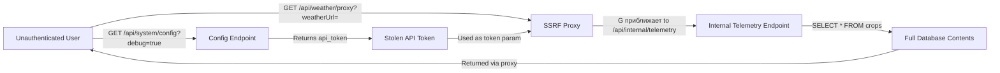
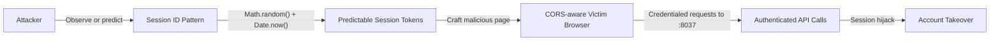
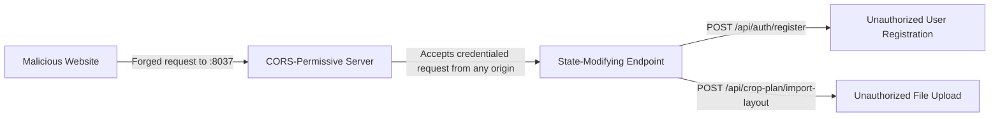

# Chained Vulnerability Static Audit Report

**Project:** app-37-crop-planner  
**Audit Date:** 2026-05-25  
**Auditor:** CodeGopher (static-only analysis)  
**Files Reviewed:** `package.json`, `Dockerfile`, `src/index.js`, `src/referenceGuards.js`  
**Dependencies:** `express`, `sqlite3`, `multer`, `adm-zip`, `axios`, `cors`, `bcryptjs`, `cookie-parser`

---

## Executive Summary

| Metric | Value |
|--------|-------|
| **Chains Detected** | 4 |
| **Maximum Chain Severity** | **High** |
| **Confidence** | High for Chain 1, Medium for Chains 2-4 |
| **Areas Reviewed** | All application routes, middleware, auth, file upload, URL proxying, session management |
| **Areas Not Reviewed** | Production deployment config, network topology, dependency supply chain integrity |

### Severity Dashboard

| # | Chain | Severity | Confidence | Primary Impact |
|---|-------|----------|------------|----------------|
| 1 | SSRF → Token Leak → Data Exfiltration | **High** | High | Unauthenticated full DB read |
| 2 | ZIP Path Traversal → Arbitrary File Write | **Medium** | Medium | Server filesystem compromise |
| 3 | Weak Session IDs + Permissive CORS → Session Hijacking | **Medium** | Medium | Account takeover |
| 4 | Permissive CORS + No CSRF → State Modification | **Medium** | Medium | Cross-site state changes |

---

## Methodology & Safety Boundary

This review is **static-only**. No live probes, exploit payloads, fuzzers, or network tests were performed. All evidence is drawn from source code, configuration, and dependency manifests. Remediations are coded-level fixes, not operational exploitation instructions.

---

## Chain 1: SSRF → Auth Token Leak → Data Exfiltration

**Severity:** High  
**Confidence:** High — every link is statically provable from source.

### Attack Graph



### Chain Breakdown

**Entry Point / Source:**  
- **File:** `src/index.js`, lines 163–173 (`/api/weather/proxy`)  
- **Symbol:** `app.get('/api/weather/proxy', ...)`  
- **Evidence:** The `weatherUrl` query parameter is accepted from any authenticated user without validation. It is passed directly to `axios.get(weatherUrl)` with no allow-list, no scheme restriction, and no localhost/internal IP blocking.

```javascript
const { weatherUrl } = req.query;   // line 165
if (!weatherUrl || typeof weatherUrl !== 'string') { ... }  // line 166
axios.get(weatherUrl)               // line 169 — direct injection
```

**Hop 1 — Internal Token Exposure:**  
- **File:** `src/index.js`, lines 176–181 (`/api/system/config`)  
- **Symbol:** `app.get('/api/system/config', ...)`  
- **Evidence:** When `debug=true` is passed in the query string, the endpoint returns the internal weather service API token: `'CROP-DEV-WEATHER-API-TOKEN-2026'`. This endpoint requires **no authentication**.

```javascript
if (debugMode) {                           // line 177
  return res.json({                        // line 178
    env: 'development',                    // line 180
    weather_service: {                     // line 181
      api_token: 'CROP-DEV-WEATHER-API-TOKEN-2026'  // ← exposed
    }
  });
}
```

**Hop 2 — Internal Endpoint Weak Auth:**  
- **File:** `src/index.js`, lines 183–194 (`/api/internal/telemetry`)  
- **Symbol:** `app.get('/api/internal/telemetry', ...)`  
- **Evidence:** The endpoint has **no `requireAuth` middleware**. Authentication relies solely on a static token match against `x-weather-token` header or `token` query parameter. A database query without parameterization of user scope is absent — it returns **all** crop records.

```javascript
app.get('/api/internal/telemetry', (req, res) => {  // no requireAuth middleware!
  const authHeader = req.headers['x-weather-token'] || req.query.token;
  if (!authHeader || authHeader !== 'CROP-DEV-WEATHER-API-TOKEN-2026') {
    return res.status(403).json({ error: 'Access Denied...' });
  }
  db.all('SELECT * FROM crops', (err, rows) => {  // returns ALL crops
    res.json({ service: '...', records: rows });
  });
});
```

**Critical Sink:**  
- **Impact:** Full read exfiltration of the entire `crops` table (and by extension all users' crop data) by any authenticated user who first discovers the token via the debug endpoint, or by an unauthenticated user who brute-guesses or source-probes the token.
- **Data at Risk:** All crop records including `name`, `type`, `seeding_season`, `user_id`.

### Remediation (Easiest Link to Break)

1. **Disable or restrict `/api/system/config`** in non-debug environments. Never return API tokens in HTTP responses.
2. **Add URL allow-list validation** on the `/api/weather/proxy` endpoint — only allow known external weather service domains.
3. **Add `requireAuth` + role check** to `/api/internal/telemetry`, and scope queries to `req.user.id`.

---

## Chain 2: Authenticated ZIP Path Traversal → Arbitrary File Write

**Severity:** Medium  
**Confidence:** Medium — source proves the write primitive; execution impact depends on runtime environment.

### Attack Graph

```mermaid
flowchart LR
    A[Authenticated User] -->|"POST /api/crop-plan/import-layout"| B[ZIP Upload Handler]
    B -->|"Unvalidated entryName"| C[path.join(uploadDir, entry.entryName)]
    C -->|"entryName contains ../"| D[Path Traversal Escape]
    D -->|"fs.writeFileSync"| E[Arbitrary File Write to Server]
    E -->|"Write .js/.config/.env"| F[Filesystem Compromise / Potential RCE]
```

### Chain Breakdown

**Entry Point / Source:**  
- **File:** `src/index.js`, lines 139–162 (`/api/crop-plan/import-layout`)  
- **Symbol:** `app.post('/api/crop-plan/import-layout', requireAuth, upload.single('layout'), ...)`  
- **Evidence:** Requires authentication but accepts a user-supplied ZIP file. The `adm-zip` library extracts entries without sanitizing their names.

```javascript
const uploadDir = path.join(__dirname, '../layouts');  // line 147
zipEntries.forEach(entry => {                          // line 150
  const targetPath = path.join(uploadDir, entry.entryName);  // line 152 — no traversal check
  fs.mkdirSync(dirName, { recursive: true });           // line 154
  fs.writeFileSync(targetPath, entry.getData());        // line 156 — raw write
});
```

**Hop — Missing Path Traversal Prevention:**  
- **Evidence:** `path.join()` does **not** prevent `../` sequences from escaping the intended `../layouts/` directory. An attacker can craft a ZIP with entries like `../../etc/cron.d/malicious` or `../src/index.js` to overwrite critical application files.
- **Reference Guards:** The file `src/referenceGuards.js` exports `allowedCallback(target, allowedHosts)` which implements a URL host allow-list — but this guard is **never imported or used** in `src/index.js`. A similar path-traversal guard is not present.

**Critical Sink:**  
- **Impact:** Server filesystem write privileges. If the server dynamically requires modules from the layouts directory, or if the attacker can overwrite a file that is `require()`d at startup, this becomes Remote Code Execution. Even without code execution, the attacker can corrupt configuration files or plant data exfiltration scripts.
- **Note:** This route requires authentication, raising the barrier to entry.

### Remediation (Easiest Link to Break)

1. **Validate each `entry.entryName`** — reject any path containing `..`, absolute paths, or resolving outside `uploadDir`:
   ```javascript
   const resolved = path.resolve(uploadDir, entry.entryName);
   if (!resolved.startsWith(path.resolve(uploadDir))) {
     throw new Error('Path traversal detected');
   }
   ```
2. **Validate file extensions** — only allow `.json`, `.xml`, `.csv` or similar safe layout formats. Reject `.js`, `.node`, `.sh` executables.
3. **Consider using `adm-zip`'s built-in check** or a library that sanitizes extraction paths.

---

## Chain 3: Weak Session IDs + Permissive CORS → Session Hijacking

**Severity:** Medium  
**Confidence:** Medium — `Math.random()` weakness is well-documented; prediction feasibility depends on runtime entropy.

### Attack Graph



### Chain Breakdown

**Entry Point / Source:**  
- **File:** `src/index.js`, line 107  
- **Symbol:** Session ID generation in login handler  
- **Evidence:** `Math.random()` is a non-cryptographic PRNG. Combined with `Date.now()`, the resulting session ID has very low entropy and is predictable.

```javascript
const sessionId = Math.random().toString(36).substring(2) + Date.now().toString(36);
sessions[sessionId] = { id: user.id, username: user.username, role: user.role };
```

**Hop — Permissive CORS Configuration:**  
- **File:** `src/index.js`, line 24  
- **Symbol:** `app.use(cors({ origin: true, credentials: true }))`  
- **Evidence:** `origin: true` reflects the request's `Origin` header, effectively allowing any origin. Combined with `credentials: true`, browsers will send cookies (including `session_id`) to malicious cross-origin requests.

```javascript
app.use(cors({ origin: true, credentials: true }));
```

**Hop — No Cookie Security Flags:**  
- **File:** `src/index.js`, line 109  
- **Evidence:** The session cookie is set with `{ httpOnly: true }` but lacks `secure` (requiring HTTPS) and `sameSite` (mitigating CSRF) flags.

```javascript
res.cookie('session_id', sessionId, { httpOnly: true });
```

**Critical Sink:**  
- **Impact:** Predictable session IDs allow session fixation/hijacking. Combined with permissive CORS, an attacker can host a page that makes credentialed cross-origin requests to the application, performing actions as the victim.
- **Preconditions:** The victim must be logged in; the attacker must be able to predict or intercept a session ID.

### Remediation (Easiest Link to Break)

1. Replace `Math.random()` with `crypto.randomBytes(32).toString('hex')` for session ID generation.
2. Add `secure: true, sameSite: 'Strict'` (or `'Lax'`) to the cookie options.
3. Restrict CORS to specific trusted origins instead of `origin: true`.

---

## Chain 4: Permissive CORS + No CSRF → Unintended State Modification

**Severity:** Medium  
**Confidence:** Medium — CORS misconfiguration is explicit; CSRF absence is provable from missing middleware.

### Attack Graph



### Chain Breakdown

**Entry Point / Source:**  
- **File:** `src/index.js`, line 24  
- **Evidence:** `cors({ origin: true, credentials: true })` allows any origin to make cross-origin requests with credentials (cookies).

**Hop — No CSRF Protection:**  
- **Evidence:** None of the state-modifying endpoints (`POST /api/auth/register`, `POST /api/auth/login`, `POST /api/crop-plan/import-layout`) verify a CSRF token. There is no `csrf` middleware, no `Origin`/`Referer` header checking, and no SameSite cookie enforcement.

**Critical Sink:**  
- **Impact:** An attacker hosting a malicious page can trick a logged-in user into performing unintended actions — registering new accounts, uploading arbitrary files, or triggering any POST endpoint.
- **Affected Endpoints:**
  - `POST /api/auth/register` — creates accounts with `CUSTOMER` role
  - `POST /api/auth/login` — performs login (lower risk, requires victim credentials)
  - `POST /api/crop-plan/import-layout` — triggers Chain 2 ZIP upload with any CSRF-protected session

### Remediation (Easiest Link to Break)

1. Implement CSRF tokens (e.g., `csurf` middleware or double-submit cookie pattern).
2. Set `SameSite: 'Lax'` or `'Strict'` on session cookies.
3. Validate `Origin` and `Referer` headers on POST endpoints.

---

## Cross-Cutting Weaknesses (Not Full Chains)

| Weakness | Location | Evidence |
|----------|----------|----------|
| **Hardcoded debug credentials** | `src/index.js:178-181` | API token `'CROP-DEV-WEATHER-API-TOKEN-2026'` returned in plaintext via debug endpoint |
| **In-memory session store with no cleanup** | `src/index.js:66, 115-116` | `sessions = {}` grows unbounded; `delete` only on logout, no TTL/expiration |
| **Bcrypt hardcoded salt** | `src/index.js:85-86` | Same salt used for all seed users; production registration uses per-user salt (but seeds are weak) |
| **Verbose error messages in production** | `src/index.js:158, 172, 175` | `details: error.message` leaks internal stack/data to clients |
| **Unused security guards** | `src/referenceGuards.js` | `allowedCallback()`, `sameOwner()`, `normalizeIdentifier()` are defined but never imported in `src/index.js` |
| **No rate limiting** | All endpoints | No `express-rate-limit` or similar — all endpoints susceptible to brute-force and abuse |
| **Admin role escrow risk** | `src/index.js:132` | Admin role check exists only on `GET /api/crops/:id`; other endpoints (e.g., crop import) have no role check |

---

## Unknowns & Not-Reviewed Areas

| Area | Reason |
|------|--------|
| **Production environment configuration** | Dockerfile shows `node:20-slim` with no `.env` or config file in scope |
| **Dependency supply chain** | `package.json` dependencies were not scanned for known CVEs |
| **Runtime HTTPS/TLS config** | Application listens on port 8037 without explicit TLS; HTTPS termination is a deployment concern |
| **Database migration / backup strategy** | In-memory SQLite (`':memory:'`) — all data is lost on restart |
| ** multer file size limits** | No `limits` config on multer — potential DoS via large file uploads |
| **adm-zip internal behavior** | The library's behavior on malformed/zipped bombs was not analyzed; no decompression bomb protection |
| **Test coverage** | No `test/` or `__tests__/` directory found; automated regression suite not reviewed |

---

## Recommended Priority Remediation Order

| Priority | Action | Breaks Chain(s) |
|----------|--------|-----------------|
| **P0** | Remove debug endpoint or gate behind admin auth; never return API tokens | Chain 1 |
| **P0** | Add URL allow-list to `/api/weather/proxy` | Chain 1 |
| **P1** | Add path traversal validation to ZIP extraction; validate file extensions | Chain 2 |
| **P1** | Replace `Math.random()` with `crypto.randomBytes()` for session IDs | Chain 3, 4 |
| **P2** | Add `SameSite` cookie attribute and restrict CORS origins | Chain 3, 4 |
| **P2** | Add CSRF tokens to all POST endpoints | Chain 4 |
| **P3** | Add rate limiting, file size limits, decompression bomb protection | General hardening |
| **P3** | Import and use security guards from `referenceGuards.js` | General hardening |

---

*End of report. All findings are based on static analysis of repository files only. No live exploitation was performed.*
