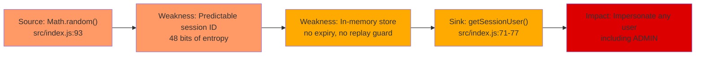
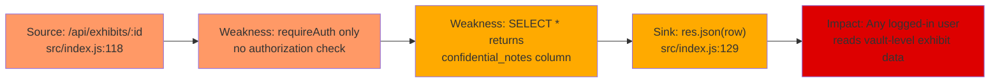
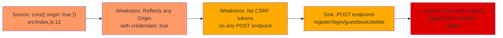

# Chained Vulnerability Audit Report — Museum Collection Catalog

**App**: app-38-museum-catalog  
**Date**: 2026-05-25  
**Scope**: Static-only analysis of `src/` within workspace  
**Stack**: Node.js 20 / Express 4.19 / SQLite3 / cookie-parser / CORS / bcryptjs  

---

## Summary Dashboard

| Metric | Value |
|---|---|
| **Chains detected** | 3 |
| **Maximum severity** | HIGH |
| **Medium-severity chains** | 1 |
| **Low-severity chains** | 0 |
| **Cross-cutting weaknesses** | 7 |
| **Areas reviewed** | `src/index.js`, `src/referenceGuards.js`, `package.json`, `Dockerfile` |
| **Areas not reviewed** | Frontend templates, test suite, CI/CD, deployment configs, secrets management |

---

## Methodology & Static-Only Boundary

This audit follows a four-phase methodology:

1. **Attack surface mapping** — All HTTP routes, middleware, cookies, request parameters, and database operations are catalogued.
2. **Weakness inventory** — Individual code-level weaknesses are identified from static analysis.
3. **Attack graph synthesis** — Weaknesses are connected via data flow, control flow, authorization, and configuration evidence to form complete chains.
4. **Impact assessment** — Each chain is rated for impact, reachability, confidence, and the easiest remediation link.

**Static-only boundary**: No live probes, dynamic scanners, exploit payloads, or shell commands were used. All findings are derived exclusively from source code, configuration, and dependency manifests.

---

## Chains Detected

### Chain 1 — Session Prediction → Full Account Takeover

#### Mermaid Attack Graph

#### Detailed Breakdown

| Link | File | Line(s) | Evidence |
|---|---|---|---|
| **Source** | `src/index.js` | 93 | `const sessionId = Math.random().toString(36).substring(2) + Date.now().toString(36);` — `Math.random()` is not cryptographically secure; combined with a timestamp, the effective entropy is far below 128 bits. |
| **Hop 1** | `src/index.js` | 95-96 | `sessions[sessionId] = { id, username, role }` — Sessions stored in a plain object with no expiration, rotation, or invalidation on reuse. |
| **Hop 2** | `src/index.js` | 97 | `res.cookie('session_id', sessionId, { httpOnly: true })` — Cookie is `httpOnly` (good) but missing `secure`, `sameSite`, and any path/domain restriction. |
| **Sink** | `src/index.js` | 71-77 | `getSessionUser()` reads `req.cookies.session_id` and returns user data from the in-memory `sessions` map. No replay protection or binding to User-Agent/IP. |

**Preconditions**:
- Attacker can observe or guess session IDs (network sniffing or brute-force due to low entropy).
- The app runs as a single process (in-memory store — not resilient to restarts, but relevant only for deployed multi-worker setups).

**Impact**: An attacker who predicts a valid session ID gains full access as that user. Since admins exist (`curator_admin` with role `ADMIN`), predicting an admin session grants full administrative capability (delete exhibits, potentially future admin endpoints).

| Property | Rating |
|---|---|
| Severity | **HIGH** |
| Reachability | High — all authenticated routes are vulnerable |
| Confidence | **High** — `Math.random()` predictability is a well-established static fact |
| Easiest fix | Replace `Math.random()` with `crypto.randomUUID()` or `crypto.randomBytes()`; add `secure` and `sameSite` cookie flags |

---

### Chain 2 — Missing Ownership Check → Confidential Data Exfiltration

#### Mermaid Attack Graph

#### Detailed Breakdown

| Link | File | Line(s) | Evidence |
|---|---|---|---|
| **Source** | `src/index.js` | 118 | `app.get('/api/exhibits/:id', requireAuth, ...)` — Only authentication middleware is applied. |
| **Hop 1** | `src/index.js` | 122 | `db.get('SELECT * FROM exhibits WHERE id = ?', [exhibitId], ...)` — `SELECT *` retrieves all columns including `confidential_notes`. |
| **Hop 2** | `src/index.js` | 129 | `res.json(row)` — The full row object (including `confidential_notes`) is returned to the caller with zero filtering. |
| **Silent guard** | `src/referenceGuards.js` | 1-3 | `sameOwner(recordOwner, currentUser)` exists but is **never called** in `index.js`. This is an unused security control. |

**Preconditions**:
- User is authenticated (any role — CUSTOMER or ADMIN).
- Attacker knows or guesses exhibit IDs (sequential autoincrement makes enumeration trivial: `GET /api/exhibits/1`, `/2`, ...).

**Impact**: Confidentially restricted exhibit data (e.g., `"Vault storage. Insured for $5,000,000. Security clearance Level-3."`) is accessible to any authenticated user, including regular `CUSTOMER` accounts like `alice_visitor` and `bob_visitor`.

| Property | Rating |
|---|---|
| Severity | **HIGH** |
| Reachability | High — predictable IDs + universal auth requirement |
| Confidence | **High** — source shows no authorization filtering between `requireAuth` and `res.json` |
| Easiest fix | Add authorization middleware that verifies `req.user.id === row.user_id` before returning exhibit details, or restrict `SELECT` to non-confidential columns by default |

---

### Chain 3 — Permissive CORS + No CSRF → Unrestricted State Modification

#### Mermaid Attack Graph

#### Detailed Breakdown

| Link | File | Line(s) | Evidence |
|---|---|---|---|
| **Source** | `src/index.js` | 12 | `app.use(cors({ origin: true, credentials: true }));` — `origin: true` causes Express-CORS to echo back the request's `Origin` header verbatim, effectively allowing *any* origin. Combined with `credentials: true`, the browser will attach cookies to cross-origin requests. |
| **Hop 1** | `src/index.js` | 10 | `app.use(cookieParser());` — Enables cookie-based session identification. |
| **Hop 2** | `src/index.js` | 31, 42, 103, 144 | POST endpoints (`/api/auth/register`, `/api/auth/login`, `/api/guestbook`, `/api/exhibits/:id/delete`) accept state-changing operations with no CSRF token validation, no SameSite cookie hardening, and no origin-checking middleware. |
| **Sink** | Attacker-controlled webpage | — | A malicious page hosted at `evil.com` can issue `fetch` or `<form>` POST requests to `localhost:8038/api/guestbook` or other endpoints. The browser sends the `session_id` cookie automatically, and the CORS response will include `Access-Control-Allow-Credentials: true` for the `evil.com` origin, allowing the attacker to read the response via JavaScript. |

**Preconditions**:
- Target user is logged in (has a valid `session_id` cookie).
- Attacker can host a malicious page that the user visits.

**Impact**:
- **Guestbook tampering**: Any visitor can post arbitrary entries as any `visitor_name`.
- **Self-registration at scale**: Malicious pages can auto-register accounts.
- **Exhibit deletion**: If an admin visits the attacker's page, exhibits can be deleted.
- **Session hijack assist**: CSRF to logout (`/api/auth/logout`) can clear victim's session.

| Property | Rating |
|---|---|
| Severity | **MEDIUM** (HIGH in multi-tenant or deployed context) |
| Reachability | Medium — requires user to visit attacker-controlled page while logged in |
| Confidence | **High** — `origin: true` reflection + absent CSRF is statically provable |
| Easiest fix | Replace `origin: true` with an explicit allowlist of trusted origins; add CSRF token middleware (double-submit cookie or samesite=strict with SameSite cookie attribute) |

---

## Cross-Cutting Weaknesses (Not Part of a Complete Chain)

These issues are security-relevant but individually do not form a complete chain to a critical sink under current source evidence.

| # | Weakness | File | Lines | Description |
|---|---|---|---|---|
| 1 | **Hardcoded seed credentials** | `src/index.js` | 57-61 | Plaintext passwords (`visitor123`, `visitor456`, `curator2026Secure!`) are embedded in source. Although hashed via bcrypt, knowing the plaintext passwords enables offline password cracking of other users if the hash list is ever leaked. |
| 2 | **No rate limiting** | `src/index.js` | 32-43 | Login and register endpoints have no throttling, enabling unlimited brute-force or enumeration attempts. |
| 3 | **Information leakage via register response** | `src/index.js` | 41 | `res.status(201).json({ ..., userId: this.lastID })` — Returns the internal user ID of newly registered accounts, enabling ID enumeration. |
| 4 | **Information leakage via login response** | `src/index.js` | 99 | `res.json({ ..., role: user.role })` — Returns user role on login, confirming account existence and privilege level. |
| 5 | **In-memory session store** | `src/index.js` | 70 | `const sessions = {};` — Sessions are lost on process restart. In a production Docker container without sticky sessions or a shared store, users are forcibly logged out on every deployment — a denial-of-service concern. |
| 6 | **Exhibit listing omits `confidential_notes` but detail endpoint returns them** | `src/index.js` | 106 vs 122 | Inconsistent exposure: `/api/exhibits` strips `confidential_notes` (good) but `/api/exhibits/:id` leaks them (bad). Suggests the developer was aware of the sensitivity but failed to apply consistent protection. |
| 7 | **Unused `sameOwner` guard** | `src/referenceGuards.js` | 1-3 | The `sameOwner` function exists but is never imported or called. This suggests a partially implemented authorization design that was abandoned, leaving the codebase with a false sense of security. |

---

## Unknowns & Not-Reviewed Areas

| Area | Reason |
|---|---|
| **Frontend rendering** | No HTML templates, React/Vue components, or template files are present. XSS risk in guestbook output depends on how the client renders the JSON response. |
| **Deployment configuration** | The Dockerfile exposes port 8038 but does not show TLS termination, reverse proxy config, or environment variable usage (e.g., `NODE_ENV`). |
| **Environment & secrets** | No `.env` files or secrets management detected. Hardcoded passwords in seed data. |
| **Input length limits** | No body-size limits configured; `express.json()` uses the default 100 KB limit, which may be insufficient or excessive depending on use case. |
| **Dependency supply chain** | Only `node_modules/` is available, not their full source. No audit of known CVEs in express, bcryptjs, or sqlite3 was performed. |
| **SQL injection completeness** | All SQL queries use parameterized `?` placeholders — this is safe. However, query-by-ENUM on exhibit IDs is possible (sequential IDs reveal total exhibit count). |
| **Audit logging** | No logging of authentication events, password changes, or data modifications. |

---

## Remediation Priority

| Priority | Action | Affected Chains |
|---|---|---|
| **P0** | Replace `Math.random()` with `crypto.randomBytes()` for session ID generation; add `secure`, `sameSite='strict'` cookie options | Chain 1 |
| **P0** | Add authorization middleware to `/api/exhibits/:id` that enforces `user_id` ownership or restricts to ADMIN role | Chain 2 |
| **P1** | Replace `cors({ origin: true })` with an explicit allowlist; add SameSite cookie attribute | Chain 3 |
| **P1** | Move seed credentials to environment variables; remove plaintext from source | Cross-cutting #1 |
| **P2** | Add rate limiting to `/api/auth/login` and `/api/auth/register` | Cross-cutting #2 |
| **P2** | Implement CSRF protection (double-submit cookie or SameSite=Strict) | Chain 3 |
| **P3** | Remove or integrate the unused `sameOwner` function to clarify the intended authorization model | Cross-cutting #7 |
| **P3** | Add audit logging for auth events and state mutations | Cross-cutting #7 |

---

## Conclusion

Three chained vulnerability paths were identified in this codebase. The most critical is **Chain 1** (session prediction → account takeover) which, combined with the presence of an ADMIN account, could lead to full compromise of the museum catalog system. **Chain 2** (broken access control → confidential data exfiltration) exposes sensitive exhibit notes to any authenticated user. **Chain 3** (permissive CORS + no CSRF) allows cross-site state modification attacks that could corrupt guestbook data or delete exhibits.

All three chains can be broken by addressing the P0 and P1 remediation items above. The application makes reasonable use of parameterized SQL queries and basic bcrypt hashing, but the session management, authorization enforcement, and CORS configuration require immediate attention.
