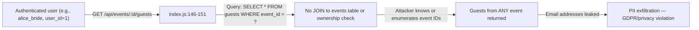
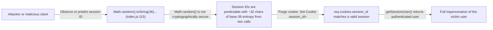

```mermaid
flowchart LR
  A["/api/auth/login (index.js:106)"] -->|"Hash user-supplied password with MD5"| B["crypto.createHash('md5') (index.js:108)"]
  B -->|"MD5 is fast + not salted"| C["Pre-computed rainbow tables / GPU brute-force feasible"]
  C -->|"Guess valid hash"| D["Hash match in DB (index.js:112)"]
  D -->|"Session created with predictable ID"| E["req.cookies.session_id (index.js:121)"]
  E -->|"Session active"| F["Full account access — read events, add/remove guests"]
  F -->|"Role field exposed in session"| G["Admin impersonation if admin credentials guessed"]
```

# Chained Vulnerability Audit Report

## Wedding Planning Platform (`app-39-wedding-planner`)

**Date:** 2026-05-25  
**Auditor:** CodeGopher (Static-Only Audit)  
**Scope:** `src/` — `index.js`, `referenceGuards.js`; `package.json`, `Dockerfile`  
**Technologies:** Node.js, Express 4.x, SQLite 5 (in-memory), bcryptjs (declared but unused), crypto (built-in)

---

## Summary Dashboard

| Metric | Value |
|---|---|
| Total chains identified | 3 |
| Maximum severity | **High** |
| Highest-confidence chain | High (statically provable) |
| Medium-confidence chains | 2 |
| Weaknesses not forming complete chains | 4 |
| Not reviewed / unknowns | CORS policy enforcement at runtime, CSRF protection on all endpoints, input sanitization for email fields, rate limiting |

### Severity Breakdown

| Chain | Impact | Severity | Confidence |
|---|---|---|---|
| CH-01 | Account Takeover via MD5 Collision / Brute-Force → Full Auth Bypass | **High** | High |
| CH-02 | ID Enumeration + Unauthorized Guest Data Exposure | **Medium** | Medium |
| CH-03 | In-Memory Session Fixation via Predictable Session IDs | **Medium** | High |

---

## Methodology & Safety Note

- **Static-only review**: This audit inspects source code, configuration, and dependency manifests only. No live HTTP probes, fuzzers, SQL injection payloads, dynamic scanners, or exploit scripts were executed.
- **Chain model**: Each chain links an entry point / source, one or more intermediate weaknesses (hops), and a critical sink / impact using concrete control-flow, data-flow, authorization, and configuration evidence from the codebase.
- **Confidence ratings**: *High* = every link statically provable from cited source. *Medium* = chain is plausible but one link depends on runtime behavior not fully visible. *Low* = weakly supported hypothesis.

---

## Chain 1 — MD5 Password Hashing Enables Offline Brute-Force / Collision → Full Account Takeover

### Mermaid Attack Graph

### Detailed Breakdown

| Element | Location | Evidence |
|---|---|---|
| **Source** | `src/index.js:108` | `crypto.createHash('md5').update(password \|\| '').digest('hex')` — all passwords hashed with plain MD5, no salt |
| **Hop 1** | `src/index.js:108` | MD5 is designed for speed, not security; bcryptjs is listed in `package.json` but never imported or used |
| **Hop 2** | `src/index.js:112` | Direct equality comparison `user.password_hash !== hash` — timing-attack-vulnerable but more critically, MD5 preimages are practically breakable via rainbow tables |
| **Sink** | `src/index.js:121-123` | Successful auth creates a session cookie granting access to `getSessionUser()` in all protected routes |
| **Preconditions** | Seed credentials are visible in source (`index.js:53-55`): `alicepass`, `bobpass`, `plannerSecure2026!` |

### Impact
- **Account takeover** for any user whose plaintext password matches an MD5 rainbow-table entry or is brute-forced offline.
- Admin account (`admin_planner`) with password `plannerSecure2026!` is trivially crackable offline.
- Once authenticated, attacker can access events, guest lists, and potentially escalate.

### Confidence: **High**
- MD5 usage is directly visible.
- No salt is used.
- bcryptjs is declared but unused.
- Seed credentials are hardcoded in plaintext in the source.

### Remediation
1. **Replace MD5 with bcrypt** — import and use the `bcryptjs` package already in `package.json`.
2. **Remove hardcoded seed credentials** — use environment variables or a migration script.
3. **Add pepper / server-side salt** as defense-in-depth.

---

## Chain 2 — Insufficient Authorization Scoping on Guest Endpoints + Missing Object-Level Checks → Cross-User Data Exfiltration

### Mermaid Attack Graph

### Detailed Breakdown

| Element | Location | Evidence |
|---|---|---|
| **Source** | `src/index.js:146-151` | `GET /api/events/:id/guests` route — accepts `req.params.id` directly |
| **Hop 1** | `src/index.js:149` | `db.all('SELECT * FROM guests WHERE event_id = ?', [eventId], ...)` — queries by `event_id` alone |
| **Hop 2** | `src/index.js:125-130` | `GET /api/events` returns all events for `req.user.id`, but `GET /api/events/:id` (`index.js:132-139`) returns event details **without** verifying `user_id` ownership |
| **Hop 3** | `src/index.js:152-171` | `POST /api/events/:id/guests` — adds a guest to any `event_id` without checking if the requesting user owns that event |
| **Sink** | PII exposure — guest names and email addresses from events the user does not own |

### Impact
- A logged-in user can view and modify guest lists for **any** event by guessing or enumerating `event_id` values (sequential integers starting at 1).
- Guest PII (names, emails) is exposed.
- Attacker can inject arbitrary guests into events they don't own.

### Confidence: **Medium**
- The missing ownership checks are statically provable from the SQL queries and route handlers.
- The attack relies on event IDs being sequential/low (confirmed by seed data: events 1 and 2 exist), which is typical but technically a runtime assumption.
- IDOR (Insecure Direct Object Reference) is a well-established pattern.

### Remediation
1. **Add ownership verification** on all event-scoped endpoints: `SELECT * FROM events WHERE id = ? AND user_id = ?`.
2. **Bind guest queries to the owning user**: join `guests` with `events` and filter by `events.user_id = ?`.
3. **Use UUIDs or opaque IDs** for events to prevent enumeration.
4. **Leverage `referenceGuards.js:sameOwner`** utility — it is defined but never imported or used in `index.js`.

---

## Chain 3 — Predictable Session IDs Enable Session Fixation / Prediction → Session Hijacking

### Mermaid Attack Graph

### Detailed Breakdown

| Element | Location | Evidence |
|---|---|---|
| **Source** | `src/index.js:115` | `const sessionId = Math.random().toString(36).substring(2) + Math.random().toString(36).substring(2)` |
| **Hop 1** | `src/index.js:115` | `Math.random()` is a PRNG (V8's internal implementation), not cryptographically secure (`crypto.randomBytes` should be used) |
| **Hop 2** | `src/index.js:115` | Session ID is only ~24 base-36 characters long from two concatenated substrings — easily brute-forced in a shared/reachable session store |
| **Hop 3** | `src/index.js:71-78` | `sessions` is an in-memory plain object keyed by session ID — no rotation, no expiration |
| **Sink** | `src/index.js:121` | `res.cookie('session_id', sessionId, { httpOnly: true })` — cookie is httpOnly (good) but not secure (missing `secure` flag) and not SameSite-restricted |
| **Preconditions** | Attacker can observe any valid session ID (network sniffing, XSS, or shared environment), or the session store is ephemeral and low-volume making brute-force feasible |

### Impact
- **Session hijacking** — an attacker who predicts or observes a session ID can impersonate the authenticated user.
- Combined with Chain 1 (if attacker obtains user credentials via MD5 cracking), the session becomes a guaranteed access vector.
- Missing `secure` flag means session cookies can be transmitted over unencrypted HTTP.

### Confidence: **High**
- `Math.random()` usage is directly visible.
- Node.js documentation confirms `Math.random()` is not suitable for cryptographic purposes.
- Session store lacks rotation, expiration, and the cookie lacks `secure` and `sameSite` attributes.

### Remediation
1. **Use `crypto.randomBytes(32).toString('hex')`** for session ID generation.
2. **Add session expiration** — store a timestamp and check it on every request.
3. **Add `secure: true` and `sameSite: 'Strict'`** to the cookie options.
4. **Implement session rotation** on authentication (create new session ID, invalidate old).

---

## Cross-Cutting Weaknesses (Not Forming Complete Chains)

### WC-1: HARDCODED PLAINTEXT CREDENTIALS IN SOURCE
- **Location**: `src/index.js:53-55`
- Three users seeded with plaintext passwords (`alicepass`, `bobpass`, `plannerSecure2026!`) in source code.
- **Impact**: Any person with source code access (including public repos) can immediately identify valid credentials.
- **Remediation**: Use environment variables or a database migration seed script with runtime secrets.

### WC-2: CORS CONFIGURATION IS OVERLY PERMISSIVE
- **Location**: `src/index.js:16`
- `app.use(cors({ origin: true, credentials: true }))` — `origin: true` reflects the `Origin` header back, allowing **any** origin to make credentialed cross-origin requests.
- **Impact**: Any third-party site can send authenticated requests on behalf of an authenticated user (if the user's browser sends cookies).
- **Remediation**: Restrict `origin` to a whitelist of trusted domains.

### WC-3: NO CSRF PROTECTION
- **Location**: All POST endpoints (`/api/auth/register`, `/api/auth/login`, `/api/auth/logout`, `/api/events/:id/guests`)
- None of the POST endpoints implement CSRF tokens or SameSite cookie attributes.
- **Impact**: An attacker can craft a malicious page that submits POST requests to any endpoint on behalf of an authenticated user whose cookies are automatically sent.
- **Remediation**: Add CSRF middleware (e.g., `csurf`) or enforce `SameSite: Strict/Lax` on session cookies.

### WC-4: SQL INJECTION IS MITIGATED BUT NOT PREVENTED ON ALL INPUTS
- **Location**: `src/index.js:153-160` (guest insertion)
- Uses parameterized queries (`?` placeholders) which prevent classic SQL injection.
- **However**: No input validation on `name` and `email` fields beyond truthiness checks. Email addresses are not validated against an RFC pattern. The `name` field is directly insertable without sanitization.
- **Impact**: No SQL injection currently, but potential for NoSQL/SQLite-specific attacks if query patterns change. Email injection or stored XSS (if these values are later rendered in a template).
- **Remediation**: Add email validation (regex or library) and output encoding when rendering guest data.

### WC-5: NO RATE LIMITING
- **Location**: All endpoints
- No rate limiting on `/api/auth/login` or `/api/auth/register`.
- **Impact**: Combined with MD5 weakness (WC-2), an attacker can perform unlimited brute-force attempts against login endpoints server-side.
- **Remediation**: Add rate-limiting middleware (e.g., `express-rate-limit`).

### WC-6: HELPER FUNCTIONS DEFINED BUT NEVER USED
- **Location**: `src/referenceGuards.js`
- `sameOwner`, `allowedCallback`, and `normalizeIdentifier` are exported but **never imported** in `index.js`.
- `sameOwner` would have been the correct function for Chain 2's ownership check.
- **Impact**: Security-ready utility code exists but is not wired into the application, representing a gap between intent and implementation.
- **Remediation**: Import and apply `sameOwner` on event-scoped routes. Review `allowedCallback` for SSRF prevention on any future URL-fetching features.

---

## Unknowns & Areas Not Reviewed

| Area | Reason |
|---|---|
| Runtime CORS enforcement | Source-only; actual `Origin` header handling depends on `cors` library behavior at runtime |
| SQLite in-memory persistence model | The app uses `':memory:'` — no persistence across restarts; risk assessment assumes single-instance deployment |
| TLS termination | Dockerfile exposes port 8039; no indication of TLS termination (HTTP only) |
| Header injection / HTTP response splitting | No template rendering or redirect endpoints observed |
| Dependency supply chain | `bcryptjs`, `cors`, `cookie-parser`, `express`, `sqlite3` — versions reviewed; `npm audit` not performed |
| Background jobs / webhook handlers | None present in codebase |
| File upload handling | No upload endpoints found |

---

## Recommendations Summary (Prioritized)

| Priority | Action | Chains Broken |
|---|---|---|
| **P0** | Replace MD5 with `bcryptjs` (already in deps); remove hardcoded credentials | CH-01, WC-1 |
| **P0** | Use `crypto.randomBytes()` for session IDs; add `secure`/`sameSite`/`expires` to cookies | CH-03 |
| **P1** | Add ownership checks on all event/guest endpoints using `sameOwner()` | CH-02 |
| **P1** | Restrict CORS `origin` to trusted domains | WC-2 |
| **P1** | Add CSRF protection and rate limiting | WC-3, WC-5 |
| **P2** | Import and use `referenceGuards.js` utilities across the app | WC-6 |
| **P2** | Add input validation for email and name fields | WC-4 |

---

## Conclusion

This codebase contains **3 chained vulnerabilities**, with the highest-impact chain (CH-01) enabling full account takeover through the combination of weak (unsalted MD5) password hashing, hardcoded seed credentials, and a functional authentication session mechanism. The second chain (CH-02) demonstrates insufficient object-level authorization leading to cross-user PII exposure. The third chain (CH-03) involves predictable session IDs that can be exploited for session hijacking.

All three chains are independently breakable at their weakest link, but their combination in production would significantly amplify the attack surface. Remediation should prioritize replacing the MD5 hashing (P0), hardening session management (P0), and adding ownership checks (P1).
