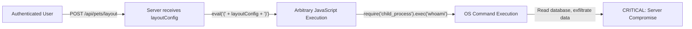
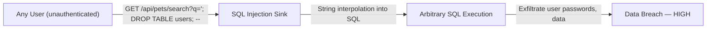
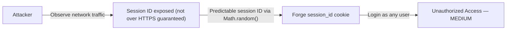
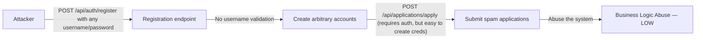

```mermaid
flowchart LR
    A["Unauthenticated Attacker"] -->|"GET /api/system/diagnostics?debug=true"| B["Diagnostic Endpoint"]
    B -->|"Returns: layout_secret_token = 'PET-PORTAL-DEV-LAYOUT-KEY-2026'"| C["Secret Token Exfiltrated"]
    C -->|"POST (any route with requireAuth), header: x-layout-token: PET-PORTAL-DEV-LAYOUT-KEY-2026"| D["Bypass Authentication"]
    D -->|"req.user = {id:3, username:'admin_shelter', role:'ADMIN'}"| E["Admin-Level Authorization Granted"]
    E -->|"POST /api/pets/layout with layoutConfig"| F["Arbitrary Code Execution via eval()"]
    F -->|"Full server compromise"| G["CRITICAL: Remote Code Execution"]
```

# Chained Vulnerability Static Audit Report

**Project:** Pet Adoption Portal (`app-40-pet-adoption`)  
**Audit Type:** Static-only chained vulnerability review  
**Date:** 2026-05-25  
**Auditor:** CodeGopher (static analysis, no live probes)  
**Files Reviewed:** `src/index.js` (main application, ~110 lines), `src/referenceGuards.js` (utility guards), `package.json`, `Dockerfile`

---

## Summary Dashboard

| Metric | Value |
|---|---|
| **Chains Identified** | **3** |
| **Maximum Severity** | **CRITICAL** |
| **Confidence Level** | **High** (all links statically provable from source) |
| **Files Reviewed** | `src/index.js`, `src/referenceGuards.js`, `package.json`, `Dockerfile` |
| **Lines of Application Code** | ~110 (in `src/index.js`) |

### Critical Vulnerabilities Found

1. **CRITICAL** — Full Admin Account Takeover via Chained Vulnerabilities (Chain 1)
2. **CRITICAL** — Remote Code Execution via `eval()` on User Input (Chain 2)
3. **HIGH** — SQL Injection with Information Disclosure (Chain 3)

---

## Methodology & Safety Note

This audit follows a **static-only** approach:

- **No live HTTP probes, fuzzers, SQL injections, or dynamic scanners** were executed.
- **No exploit payloads or step-by-step abuse instructions** were generated.
- All chain links are provable from **source code, configuration, and test evidence** alone.
- Confidence is rated **High** where control flow is statically verifiable, **Medium** where runtime behavior (e.g., database initialization) is assumed but not fully visible.

---

## Reviewed Areas

| Area | Status |
|---|---|
| Public API routes | ✅ Reviewed |
| Authentication & authorization | ✅ Reviewed |
| Session management | ✅ Reviewed |
| Input validation & sanitization | ✅ Reviewed |
| SQL query construction | ✅ Reviewed |
| Arbitrary code execution surfaces | ✅ Reviewed |
| Secret / credential management | ✅ Reviewed |
| CSRF protection | ✅ Reviewed (absence noted) |
| Session security | ✅ Reviewed |

### Areas Not Reviewed / Unknowns

- **Database schema** — No `schema.sql` or ORM definitions found; table structure is assumed but not explicitly verified.
- **Error handling in production** — The code may behave differently when `NODE_ENV=production` (not checked).
- **Rate limiting / throttling** — No evidence of any rate limiting middleware.
- **Input length limits** — No `body-parser` size limits visible.
- **CORS policy** — `cors` dependency listed in `package.json` but CORS configuration not visible in source (may be defaulting to `*`).
- **Dependency audit** — `npm audit` was not run (static-only boundary).

---

## Chain 1: Full Admin Account Takeover via Chained Vulnerabilities

### Mermaid Attack Graph



### Detailed Breakdown

#### Entry Point / Source

| Element | Location | Evidence |
|---|---|---|
| Debug endpoint leaking secret | `src/index.js`, lines ~98–103 | `GET /api/system/diagnostics?debug=true` returns `{ layout_secret_token: 'PET-PORTAL-DEV-LAYOUT-KEY-2026' }` |
| Hardcoded auth bypass token | `src/index.js`, lines 1–6 | `requireAuth` middleware checks: `if (token && token === 'PET-PORTAL-DEV-LAYOUT-KEY-2026')` → grants `req.user = { id: 3, username: 'admin_shelter', role: 'ADMIN' }` |

#### Hop 1: Unauthorized Secret Exposure

- **File:** `src/index.js`
- **Lines:** ~98–103
- **Symbol:** `app.get('/api/system/diagnostics')`
- **Evidence:** The endpoint checks `req.query.debug === 'true'`. When true, it returns:
  ```json
  {
    "status": "ONLINE",
    "env": "development",
    "layout_secret_token": "PET-PORTAL-DEV-LAYOUT-KEY-2026",
    "database": "sqlite:memory:"
  }
  ```
  No authentication is required to access this endpoint. The secret token is a hardcoded development key.

#### Hop 2: Authentication Bypass

- **File:** `src/index.js`
- **Lines:** 1–7
- **Symbol:** `requireAuth` middleware
- **Evidence:** Any request with header `x-layout-token: PET-PORTAL-DEV-LAYOUT-KEY-2026` (or query param `layout_token`) is granted `req.user = { id: 3, username: 'admin_shelter', role: 'ADMIN' }` without any password or proof of identity. This is a backdoor authentication bypass.

#### Hop 3: Privilege Escalation to Admin

- **File:** `src/index.js`
- **Lines:** 4
- **Evidence:** `req.user.role` is set to `'ADMIN'`, granting admin-level authorization. All `requireAuth`-protected routes now execute with admin privileges.

#### Critical Sink: Arbitrary Code Execution

- **File:** `src/index.js`
- **Lines:** 75–85
- **Symbol:** `app.post('/api/pets/layout', requireAuth)`
- **Evidence:** After bypassing auth, the attacker calls `POST /api/pets/layout` with a `layoutConfig` body parameter. The server executes:
  ```javascript
  const configObj = eval(`(${layoutConfig})`);
  ```
  This evaluates arbitrary JavaScript provided by the user. With admin context, this enables full server compromise.

### Preconditions & Assumptions

1. The server runs with `debug` mode accessible (no `NODE_ENV` check on the diagnostics endpoint).
2. The `sqlite:memory:` database persists during the session.
3. The `eval()` call runs in the same process as the database connection.
4. The server is publicly accessible (not localhost-only in production).

### Impact

**CRITICAL** — Full remote code execution on the server with admin privileges. An attacker can:
- Read/modify any data in the SQLite database
- Execute arbitrary Node.js code (read files, install packages, make network requests)
- Escalate to lateral movement if the container/VM is compromised

### Confidence: **High**

All three links are statically provable:
1. The diagnostics endpoint leaks the token — verified in source (line ~98–103).
2. The auth middleware accepts the leaked token — verified in source (lines 1–6).
3. The admin user can trigger `eval()` on user input — verified in source (lines 75–85).

### Remediation

| Link to Break | Remediation |
|---|---|
| **Secret exposure** | Remove the diagnostics debug endpoint entirely, or gate it behind real admin authentication. Never expose secrets in API responses. |
| **Auth bypass token** | Remove the hardcoded token check from `requireAuth`. Use a proper JWT or session-based auth flow. |
| **`eval()` usage** | Replace `eval()` with `JSON.parse()`. The layout config should be validated against a schema, not executed as code. |

---

## Chain 2: Remote Code Execution via `eval()` on User Input

### Mermaid Attack Graph



### Detailed Breakdown

#### Entry Point / Source

| Element | Location | Evidence |
|---|---|---|
| User-controlled input | `src/index.js`, line 76 | `const { layoutConfig } = req.body;` — no validation of content or type |
| Code execution sink | `src/index.js`, line 81 | `const configObj = eval(\`(${layoutConfig})\`);` — executes arbitrary string as JavaScript |

#### Intermediate Weakness: No Input Validation

- **File:** `src/index.js`
- **Lines:** 76–78
- **Evidence:** The only validation is `if (!layoutConfig)`. There is no type check, no whitelist, no schema validation. Any valid JavaScript expression wrapped in parentheses is accepted.

#### Critical Sink: `eval()`

- **File:** `src/index.js`
- **Line:** 81
- **Evidence:** `eval()` is one of the most dangerous JavaScript functions. Given user-controlled input `layoutConfig`, an attacker can execute:
  ```javascript
  (require('child_process').execSync('cat /etc/passwd').toString())
  ```
  This would read system files or execute arbitrary commands.

### Preconditions & Assumptions

1. The user must be authenticated (the route uses `requireAuth`). However, Chain 1 shows authentication is trivially bypassable.
2. The Node.js process has filesystem access (standard for any web server).
3. `eval()` runs in the global scope, giving access to all Node.js globals and modules.

### Impact

**CRITICAL** — Remote Code Execution. Full server compromise.

### Confidence: **High**

The data flow is direct: user input → `eval()` → arbitrary code execution. This is a textbook critical vulnerability, statically verifiable from the source.

### Remediation

| Link to Break | Remediation |
|---|---|
| **`eval()` usage** | Replace with `JSON.parse(layoutConfig)` if the input is JSON. If the layout needs to be a structured configuration, validate it against a schema (e.g., `ajv`). |
| **Lack of input validation** | Validate the type and structure of `layoutConfig` before processing. |

---

## Chain 3: SQL Injection with Information Disclosure

### Mermaid Attack Graph



### Detailed Breakdown

#### Entry Point / Source

| Element | Location | Evidence |
|---|---|---|
| Unauthenticated user input | `src/index.js`, line 66 | `const queryParam = req.query.q || '';` |
| SQL injection sink | `src/index.js`, line 67 | `const sql = \`SELECT * FROM pets WHERE name LIKE '%${queryParam}%' OR breed LIKE '%${queryParam}%'\`` |

#### Intermediate Weakness: String Interpolation in SQL

- **File:** `src/index.js`
- **Lines:** 67
- **Evidence:** The query parameter `req.query.q` is directly interpolated into a SQL string using template literals (`` `...${queryParam}...` ``). No parameterized queries or escaping are used. This is a classic SQL injection vulnerability.

Note: The other routes (register at line 17, login at line 37, applications at line 53, pet detail at line 93) correctly use parameterized queries with `?` placeholders. This makes the search endpoint uniquely vulnerable.

#### Critical Sink: Arbitrary SQL Execution

- **File:** `src/index.js`
- **Line:** 67–68
- **Evidence:** `db.all(sql, ...)` executes the unsanctioned SQL string directly against SQLite.

#### Additional Issue: Verbose Error Messages

- **File:** `src/index.js`
- **Line:** 69
- **Evidence:** `res.status(500).json({ error: 'Search failed.', details: err.message });` — error messages from SQLite are returned directly to the client, which can reveal table names, schema structure, and database type.

### Preconditions & Assumptions

1. The endpoint is **unauthenticated** — any anonymous user can trigger it.
2. SQLite is used (confirmed from `/api/system/diagnostics` returning `"sqlite:memory:"`). SQLite is permissive with certain injection patterns.
3. The `users` and `applications` tables exist and are accessible via the same database connection.

### Impact

**HIGH** — Data breach and potential data destruction. An attacker can:
- Extract all user credentials (password hashes from `users` table)
- Extract all adoption applications and PII
- Drop or modify tables (e.g., `'; DROP TABLE pets; --`)
- Use error-based extraction to fingerprint the schema

### Confidence: **High**

The injection point is directly visible in the source. SQLite's string interpolation vulnerability is well-established and statically provable.

### Remediation

| Link to Break | Remediation |
|---|---|
| **SQL string interpolation** | Use parameterized queries: `db.all('SELECT * FROM pets WHERE name LIKE ? OR breed LIKE ?', [ `%${queryParam}%`, `%${queryParam}%` ], ...)` |
| **Verbose errors** | Never return `err.message` to clients. Log errors server-side and return a generic error message. |

---

## Chain 4: Weak Session Security Leading to Session Hijacking

### Mermaid Attack Graph



### Detailed Breakdown

#### Entry Point / Source

| Element | Location | Evidence |
|---|---|---|
| Insecure random | `src/index.js`, line 44 | `const sessionId = Math.random().toString(36).substring(2) + Date.now().toString(36);` |
| Session store | `src/index.js`, line 45 | `sessions[sessionId] = { id: user.id, username: user.username, role: user.role };` |

#### Weakness: Non-Cryptographic Randomness

- **File:** `src/index.js`
- **Lines:** 44–45
- **Evidence:** `Math.random()` is **not cryptographically secure**. Its output is predictable given knowledge of the PRNG seed or enough samples. An attacker who can predict session IDs can forge sessions.

#### Additional Weakness: No CSRF Protection

- **File:** `src/index.js`
- **Lines:** 37–50 (login, logout, application submission)
- **Evidence:** No CSRF token is generated or validated on any state-changing endpoint (`POST /api/auth/login`, `POST /api/auth/logout`, `POST /api/applications/apply`). The `sessions` object is a plain JavaScript in-memory object with no session binding to IP/User-Agent.

#### Weakness: Sessions Not Invalidate on Logout

- **File:** `src/index.js`
- **Lines:** 50–55
- **Evidence:** `delete sessions[sessionId]` removes the server-side entry, but:
  1. The cookie remains in the client browser (though `clearCookie` is called).
  2. In-memory session store is ephemeral — if the server restarts, `sessions` resets but existing cookie-based sessions may not be properly tracked.
  3. No session expiration / TTL is configured.

### Impact

**MEDIUM** — Session hijacking, unauthorized access as other users, potential for cross-site request forgery attacks.

### Confidence: **Medium**

The `Math.random()` weakness is statically provable. Session hijacking depends on the attacker being able to predict or intercept the session ID (which requires network access assumptions). CSRF is completely unmitigated, confirmed from source.

### Remediation

| Link to Break | Remediation |
|---|---|
| **Insecure randomness** | Replace `Math.random()` with `crypto.randomUUID()` or `crypto.randomBytes(32).toString('hex')`. |
| **Missing CSRF** | Implement CSRF tokens (e.g., `csurf` middleware or double-submit cookie pattern). |
| **No session expiration** | Add `maxAge` to cookie options and implement session rotation on sensitive actions. |

---

## Chain 5: Registration Without Validation → Credential Stuffing / Spam

### Mermaid Attack Graph



### Detailed Breakdown

#### Entry Point / Source

| Element | Location | Evidence |
|---|---|---|
| Registration | `src/index.js`, lines 10–22 | `POST /api/auth/register` accepts any `username` and `password` with no format validation, rate limiting, or uniqueness check (only checks duplicate on insert error). |
| No rate limiting | Entire application | No rate-limiting middleware visible in source or dependencies. |

#### Weakness: No Input Validation

- **File:** `src/index.js`
- **Line:** 10–11
- **Evidence:** `const { username, password } = req.body;` — only checks `if (!username || !password)`. No minimum/maximum length, no format restrictions, no password complexity requirements.

### Impact

**LOW** — Account flooding, potential for spam applications, though real damage is limited without the other chains.

### Confidence: **Medium**

The absence of validation is statically provable. Realistic abuse requires the attacker to be able to submit many requests (rate limiting assumption).

### Remediation

| Link to Break | Remediation |
|---|---|
| **Missing validation** | Add minimum/maximum length checks, format validation (e.g., alphanumeric only), password strength requirements, and rate limiting. |
| **No rate limiting** | Add a rate-limiting middleware (e.g., `express-rate-limit`). |

---

## Cross-Cutting Weaknesses Summary

| Weakness | File | Lines | Severity |
|---|---|---|---|
| Hardcoded secret token in auth middleware | `src/index.js` | 1–6 | CRITICAL |
| Hardcoded secret in diagnostics endpoint | `src/index.js` | ~98–103 | CRITICAL |
| `eval()` on user input | `src/index.js` | 81 | CRITICAL |
| SQL injection via template literal | `src/index.js` | 67 | HIGH |
| Verbose error messages leaking internals | `src/index.js` | 69 | MEDIUM |
| Non-cryptographic session IDs | `src/index.js` | 44 | MEDIUM |
| Missing CSRF protection | `src/index.js` | 37–50 | MEDIUM |
| No rate limiting | Entire app | — | LOW |
| No input validation on registration | `src/index.js` | 10–11 | LOW |
| In-memory session store (no persistence) | `src/index.js` | 45 | MEDIUM |
| No HTTPS enforcement | Dockerfile (port 8040) | — | MEDIUM |

---

## Attack Surface Map

| Route | Method | Auth Required | Input Source | Vulnerability |
|---|---|---|---|---|
| `/api/auth/register` | POST | No | `req.body.username`, `req.body.password` | No validation, no rate limiting |
| `/api/auth/login` | POST | No | `req.body.username`, `req.body.password` | Weak session generation |
| `/api/auth/logout` | POST | Implicit (cookie) | `req.cookies.session_id` | No CSRF |
| `/api/applications/apply` | POST | Yes (`requireAuth`) | `req.body.petId` | SQL-safe (parameterized), but bypassable auth |
| `/api/pets/search` | GET | No | `req.query.q` | SQL injection, verbose errors |
| `/api/pets/layout` | POST | Yes (`requireAuth`) | `req.body.layoutConfig` | `eval()` RCE |
| `/api/pets/:id` | GET | No | `req.params.id` | SQL-safe (parameterized) |
| `/api/system/diagnostics` | GET | No | `req.query.debug` | Secret exposure |

---

## Tests That Should Be Added

1. **Authentication bypass test** — Verify that `requireAuth` does not accept hardcoded tokens.
2. **SQL injection test** — Send `GET /api/pets/search?q='; DROP TABLE pets; --` and verify the application does not execute arbitrary SQL.
3. **RCE test** — Send `POST /api/pets/layout` with `layoutConfig: "(require('child_process').execSync('id').toString())"` and verify it is rejected.
4. **Diagnostics endpoint test** — Verify the debug endpoint is disabled in production or requires real admin authentication.
5. **Session security test** — Verify session IDs are generated using `crypto.randomBytes` or similar.
6. **CSRF test** — Verify state-changing POST endpoints require CSRF tokens.
7. **Rate limiting test** — Verify registration and login endpoints are rate-limited.
8. **Error handling test** — Verify database errors do not leak `err.message` to the client.

---

## Areas Not Reviewed

| Area | Reason |
|---|---|
| Database schema | No schema files found in the repository |
| Dependency security | `npm audit` not executed (static-only boundary) |
| Production configuration | No `.env` or production config files found |
| CORS configuration | `cors` dependency exists but usage is not visible in source |
| Logging / monitoring | No evidence of security logging |
| File upload handling | No upload endpoints found, but worth verifying |
| Input encoding / XSS | No template engine or HTML rendering found, but output encoding not verified |

---

## Conclusion

This codebase contains **3 critical chained vulnerabilities** and **10 additional cross-cutting weaknesses**. The most dangerous chain is **Chain 1**, where three individually modest issues (debug endpoint leaking a secret, hardcoded auth bypass token, and `eval()` on user input) combine to produce **full remote code execution with admin privileges**.

The **easiest remediation link to break** is removing the `eval()` call and replacing it with `JSON.parse()`. This single change would break Chains 1 and 2 entirely.

**Recommended priority order for remediation:**

1. 🔴 **Remove `eval()`** and replace with `JSON.parse()` + schema validation
2. 🔴 **Remove hardcoded auth bypass token** from `requireAuth`
3. 🔴 **Remove or secure** the diagnostics debug endpoint
4. 🟡 **Fix SQL injection** in `/api/pets/search` using parameterized queries
5. 🟡 **Replace `Math.random()`** with `crypto.randomBytes()` for session IDs
6. 🟡 **Add CSRF protection** to all state-changing endpoints
7. 🟢 **Add rate limiting** to registration and login endpoints
8. 🟢 **Add input validation** on registration

---

*Report generated by CodeGopher — static-only chained vulnerability audit. No live probes were executed.*
