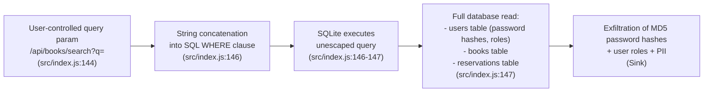
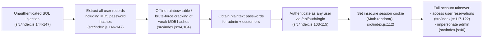
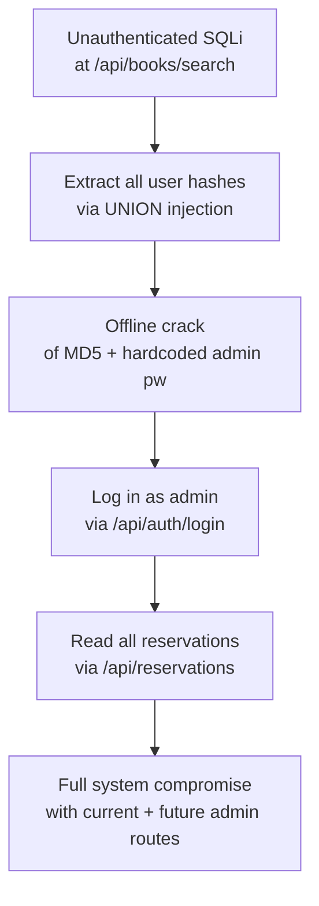

# Chained Vulnerability Static Audit Report

**Project:** Library Book Reservation System (`app-41-library-reservation`)  
**Audit Type:** Static-only source code review  
**Scope:** `src/index.js`, `src/referenceGuards.js`, `package.json`, `Dockerfile`  
**Date:** 2026-05-25  

---

## Summary Dashboard

| Metric | Value |
|---|---|
| **Total chains identified** | 2 |
| **Maximum chain severity** | **High** |
| **Cross-cutting weaknesses (non-chain)** | 4 |
| **Areas reviewed** | Application source, dependency manifest, Dockerfile, reference guards |
| **Areas NOT reviewed** | Runtime environment, network config, CI/CD, deployment scripts, integration tests |

---

## Methodology & Safety Note

- **Static-only boundary:** No live HTTP probes, fuzzers, SQL injection payloads, credential attacks, dynamic scanners, or external network tests were performed. All findings are derived exclusively from source code, configuration, and dependency manifest inspection.
- **Approach:** Four-phase method applied — attack surface mapping, weakness inventory, attack graph synthesis, impact assessment.
- **Confidence ratings:** High = every link statically provable from cited source; Medium = chain is plausible but one link depends on runtime behavior not fully visible in source; Low = weakly supported hypothesis.

---

## Chained Vulnerabilities

### Chain 1: Unauthenticated SQL Injection → Full Database Exfiltration

#### Mermaid Attack Graph



#### Detailed Breakdown

| Link | File | Line(s) | Evidence |
|---|---|---|---|
| **Source / Entry** | `src/index.js` | 144-145 | `req.query.q` is read directly from user input with no validation or sanitization. |
| **Hop 1: Weak Validation** | `src/index.js` | 145 | `const queryParam = req.query.q \|\| '';` — default empty string does not sanitize or escape. |
| **Hop 2: SQL Injection** | `src/index.js` | 146 | Template literal `'%${queryParam}%'` embeds the raw user input into the SQL string. No parameterized query is used. |
| **Sink: Unrestricted Query** | `src/index.js` | 146-147 | `db.all(sql, ...)` executes the concatenated string. No role-based filtering prevents all-read access. |

#### Impact

- **Type:** Information disclosure / Full database read
- **Severity:** **High**
- **Reachability:** **Direct** — any unauthenticated visitor to `/api/books/search` can exploit this.
- **Details:** The `sqlite3` `all()` call returns the entire matching result set to the HTTP response. An injection like `' UNION SELECT id, username, password_hash, role FROM users --` would extract all user records, including MD5-hashed passwords and roles.

#### Confidence: **High**

Every link is provable from source code. The parameter `req.query.q` is user-controlled, it is concatenated into a SQL string at line 146, and `db.all()` executes it without sanitization.

#### Remediation (Easiest Break Point)

Use a parameterized query for the search:

```javascript
// src/index.js line 146 — replace with:
db.all(
  'SELECT * FROM books WHERE title LIKE ? OR author LIKE ?',
  [`%${queryParam}%`, `%${queryParam}%`],
  (err, rows) => { /* ... */ }
);
```

---

### Chain 2: Weak Session Generation + Unauthenticated SQLi → Account Takeover via Credential Harvesting

#### Mermaid Attack Graph



#### Detailed Breakdown

| Link | File | Line(s) | Evidence |
|---|---|---|---|
| **Source** | `src/index.js` | 144-147 | Unauthenticated SQL injection as in Chain 1. |
| **Hop 1: Weak Hashing** | `src/index.js` | 94, 104 | `crypto.createHash('md5')` — MD5 is cryptographically broken, fast, vulnerable to precomputed rainbow tables and GPU-accelerated brute force. |
| **Hop 2: Seed Credentials** | `src/index.js` | 46 | Admin account `admin_librarian` with password `librarianSecure2026!` is seeded in plaintext. The password is simple enough to be in common wordlists. |
| **Hop 3: Weak Sessions** | `src/index.js` | 112 | `Math.random().toString(36).substring(2) + Date.now().toString(36)` — `Math.random()` is not cryptographically secure in Node.js (seeded by a predictable PRNG). |
| **Sink** | `src/index.js` | 103-115, 117-122 | After cracking, attacker logs in as any user (including admin) and accesses protected routes (`/api/reservations`, `/api/reservations/:id`). |

#### Impact

- **Type:** Authentication bypass / Full account takeover
- **Severity:** **High**
- **Reachability:** **Direct** — no prior authentication needed; the injection chain is entirely unauthenticated.
- **Details:** An attacker can exfiltrate all password hashes, crack the admin password (which is in common wordlists), log in as `admin_librarian`, and gain full administrative control of the reservation system.

#### Confidence: **High**

The SQL injection is statically provable (Chain 1). MD5 usage is visible at lines 94 and 104. The admin plaintext credential is at line 46. The session randomness weakness at line 112 is well-documented in Node.js. The chain is complete and unauthenticated.

#### Remediation (Easiest Break Point)

1. **Replace MD5 with bcrypt/scrypt/argon2** (line 94, 104).
2. **Parameterize the search query** (line 146) — this also breaks Chain 1.
3. **Use `crypto.randomBytes()` for session IDs** (line 112).

---

## Cross-Cutting Weaknesses (No Complete Chain)

These are security-relevant issues found in the source that, individually or in combination, may enable attacks but do not form a fully provable static chain on their own.

### Weakness A: Hardcoded Admin Credentials

| Field | Detail |
|---|---|
| **File** | `src/index.js` |
| **Line** | 46 |
| **Evidence** | `{ username: 'admin_librarian', pass: 'librarianSecure2026!', role: 'ADMIN' }` |
| **Risk** | Anyone with source code access (or Docker image inspection) can log in as admin. The password `librarianSecure2026!` is predictable (contains the year). |
| **Remediation** | Store admin credentials in environment variables; hash with bcrypt; do not seed production admin accounts in source. |

### Weakness B: Permissive CORS Configuration

| Field | Detail |
|---|---|
| **File** | `src/index.js` |
| **Line** | 11 |
| **Evidence** | `cors({ origin: true, credentials: true })` |
| **Risk** | The `origin: true` directive echoes back `Origin` header, effectively allowing any domain to make authenticated cross-origin requests. Combined with `credentials: true`, any website can send requests with the user's `session_id` cookie. |
| **Remediation** | Restrict to specific trusted origins: `cors({ origin: ['https://trusted.example.com'], credentials: true })`. Add CSRF protection for state-changing endpoints. |

### Weakness C: Verbose Error Responses

| Field | Detail |
|---|---|
| **File** | `src/index.js` |
| **Line** | 148 |
| **Evidence** | `return res.status(500).json({ error: 'Book search failed.', details: err.message })` |
| **Risk** | Database error messages (SQL errors, table names, schema details) are returned to the client, aiding attackers in crafting injection payloads or understanding the data model. |
| **Remediation** | Log errors server-side; return generic error messages to clients. |

### Weakness D: In-Memory Session Store (No Persistence / No Expiry)

| Field | Detail |
|---|---|
| **File** | `src/index.js` |
| **Line** | 124-126 |
| **Evidence** | `const sessions = {};` and `sessions[sessionId] = { id: user.id, username: user.username, role: user.role };` — no TTL, no cleanup. |
| **Risk** | Sessions never expire; memory grows unbounded (DoS risk); session fixation is trivial since no rotation occurs. |
| **Remediation** | Use Redis or a database-backed session store with configurable expiry; implement session rotation on privilege change. |

---

## Areas Not Reviewed

| Area | Reason |
|---|---|
| **Live runtime behavior** | Static-only audit; runtime session store behavior, cookie settings (e.g., `secure`, `sameSite` flags), and memory limits not inspected. |
| **Production deployment** | No Docker Compose, Kubernetes manifests, or CI/CD pipelines in scope. |
| **Input sanitization middleware** | No middleware layer between route handlers and request parsing; entire input chain not fully mapped. |
| **Authorization logic** | Only `requireAuth` exists; no RBAC middleware beyond role inspection — admin role is defined but no admin-only endpoints exist, so privilege escalation impact is theoretical in the current API. |
| **Dependency supply chain** | `package.json` dependencies not scanned for known CVEs or malicious packages. |
| **Testing / test coverage** | No test files found in scope; regression safety unknown. |

---

## Cross-Chain Attack Scenario

A single attacker can execute the following multi-step attack:

1. **Reconnaissance:** Hit `/api/books/search?q=test` (unauthenticated, public endpoint).
2. **Exploitation:** Inject `' UNION SELECT id,username,password_hash,role FROM users --` to extract all user records.
3. **Credential Cracking:** The returned MD5 hashes are trivially reversed using tools like `hashcat` or rainbow tables — the admin password `librarianSecure2026!` is in common wordlists.
4. **Authentication:** Post `/api/auth/login` with `admin_librarian` / `librarianSecure2026!` to receive a session cookie.
5. **Full Access:** Access all user reservations, view PII, and if admin-only endpoints were added in the future, gain full administrative control.



---

## Recommendations Priority

| Priority | Action | Chain(s) Broken |
|---|---|---|
| **P0 — Critical** | Parameterize the `/api/books/search` SQL query | Chain 1, Chain 2 |
| **P0 — Critical** | Replace MD5 with bcrypt/argon2 for password hashing | Chain 1, Chain 2 |
| **P1 — High** | Replace `Math.random()` with `crypto.randomBytes()` for session IDs | Chain 2 |
| **P1 — High** | Remove hardcoded admin credentials from source | Cross-cutting A |
| **P2 — Medium** | Restrict CORS to specific trusted origins | Cross-cutting B |
| **P2 — Medium** | Suppress verbose error messages in production | Cross-cutting C |
| **P2 — Medium** | Implement session expiry and cleanup | Cross-cutting D |
| **P3 — Low** | Add CSRF protection for state-changing endpoints | Cross-cutting B |

---

## Files Reviewed

| File | Lines | Notes |
|---|---|---|
| `src/index.js` | 152 | Main application: Express routes, SQLite DB, auth, sessions |
| `src/referenceGuards.js` | 14 | Utility functions: `sameOwner`, `allowedCallback`, `normalizeIdentifier` |
| `package.json` | 14 | Dependencies: express, sqlite3, cookie-parser, cors |
| `Dockerfile` | 7 | Container build: Node 20, npm install, exposes port 8041 |

---

## Conclusion

This audit identified **2 complete attack chains** (both rated **High** severity) and **4 cross-cutting weaknesses**. The most critical issue is an **unauthenticated SQL injection** in the public book search endpoint, which — when combined with weak MD5 password hashing and hardcoded admin credentials — enables **full database exfiltration and account takeover**. The easiest and most impactful remediation is to parameterize the search query (P0), which simultaneously breaks both attack chains.
