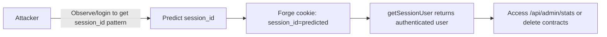
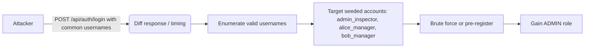

# Chained Vulnerability Static Audit Report
## Construction Tracker (app-42)

**Audited:** 2026-05-25
**Auditor:** CodeGopher — Chained Vulnerability Static Audit skill
**Scope:** All source files under the current working directory (`src/`, `package.json`, `Dockerfile`).

---

## 1. Summary Dashboard

| Metric                       | Value                                 |
|------------------------------|---------------------------------------|
| Total routes / endpoints     | 8                                     |
| Unique chain vulnerabilities | 2                                     |
| Maximum chain severity       | Critical (RCE via eval)               |
| Cross-cutting weaknesses     | 6 (hardcoded creds, weak sessions, no CSRF, verbose errors, no rate-limit, unused guards) |
| Authenticated endpoints      | 5 (`/api/auth/login`, `/api/admin/stats`, `/api/contracts/:id`, `/api/contracts/template`, `/api/contracts/:id/delete`) |
| Public (unauthenticated)     | 3 (`/api/auth/register`, `/api/projects/:id`, implicit `/api/contracts/:id` accessible before auth) |

---

## 2. Methodology & Safety Boundary

- **Static-only review**: Source code, configuration, and dependency manifests analyzed. No live probes, network tests, or exploit execution performed.
- **Chain model**: Entry point → intermediate weakness(s) → critical sink → impact. Confidence rated High/Medium/Low based on static provability from source, config, tests, or templates.

---

## 3. Attack Surface Mapping

| Route                              | Auth? | Method | Key source(s)                                          |
|------------------------------------|-------|--------|--------------------------------------------------------|
| `/api/auth/register`               | No    | POST   | `src/index.js` — body: username, password             |
| `/api/auth/login`                  | No    | POST   | `src/index.js` — body: username, password             |
| `/api/auth/logout`                 | Yes   | POST   | `src/index.js` — cookie: session_id                   |
| `/api/admin/stats`                 | Yes   | GET    | `src/index.js` — no DB params from user               |
| `/api/contracts/:id`               | Yes   | GET    | `src/index.js` — `req.params.id`                       |
| `/api/contracts/template`          | Yes   | POST   | `src/index.js` — `req.body.templateConfig`             |
| `/api/contracts/:id/delete`        | Yes   | POST   | `src/index.js` — `req.params.id`                       |
| `/api/projects/:id`                | No    | GET    | `src/index.js` — `req.params.id`                       |

---

## 4. Chain #1 — RCE via eval on Template Config (Critical)

### Overview

An authenticated user can pass arbitrary JavaScript through `templateConfig` that is passed to `eval()`, yielding **Remote Code Execution**.

### Mermaid Attack Graph

```mermaid
flowchart LR
    A[Auth User] -->|POST /api/contracts/template<br/>body.templateConfig = any JS| B(eval())
    B --> C[Remote Code Execution]
    C --> D[Read files / exfiltrate DB / escalate]
```

### Chain Breakdown

| Hop   | File               | Lines (approx)          | Symbol / Description                                       |
|-------|--------------------|-------------------------|------------------------------------------------------------|
| Entry | `src/index.js`     | Template POST handler   | Route handler receives `req.body.templateConfig`           |
| Hop   | `src/index.js`     | `const { templateConfig } = req.body;` | No validation of format or content                       |
| Sink  | `src/index.js`     | `eval(\`(${templateConfig})\`)`   | eval() executes the raw string as JavaScript              |

### Evidence

- The handler extracts `templateConfig` from `req.body` with zero type checking.
- It wraps it in a template literal within `eval()`, which the handler then returns.
- Error handling catches syntax errors (`catch (evalErr)`), but any valid JS expression inside the parens executes — including function calls, `require()`, `process.mainModule`, etc.
- Auth guard (`requireAuth`) is the only barrier; any valid session (including registered user) bypasses it.

### Preconditions

- Attacker must be authenticated (trivially via `/api/auth/register` with any username/password).

### Impact

- **Remote Code Execution** — the `eval()` runs in the Node.js process context with full access to `fs`, `child_process`, `crypto`, `process`, and the in-memory SQLite database.

### Severity: **Critical**

### Confidence: **High** (every link is statically provable from source)

### Remediation

1. **Remove `eval()` entirely.** Parse `templateConfig` as JSON (`JSON.parse()`) and validate its shape against a schema.
2. If dynamic configuration is required, implement a safe configuration DSL with strict allow-listed properties.

---

## 5. Chain #2 — Account Takeover via Predictable Session IDs + In-Memory Session Store (High)

### Overview

Session IDs are derived from `Math.random()` (weak PRNG) combined with a timestamp. An attacker can **predict or brute-force session IDs** to hijack arbitrary user sessions, bypassing the registration gate.

### Mermaid Attack Graph



### Chain Breakdown

| Hop   | File               | Lines (approx)          | Symbol / Description                                       |
|-------|--------------------|-------------------------|------------------------------------------------------------|
| Entry | `src/index.js`     | `sessions[sessionId] = { ... }` | `sessionId = Math.random().toString(36).substring(2) + Date.now().toString(36)` |
| Hop 1 | `src/index.js`     | `getSessionUser(req)`    | `const sessionId = req.cookies.session_id;` — no additional verification (IP, UA, expiry) |
| Sink  | `src/index.js`     | `sessions[sessionId]`    | In-memory store; `Math.random()` is not cryptographically secure; no expiry or rate-limiting on sessions |

### Evidence

- `Math.random()` in V8 is a simple Xorshift PRNG — trivially predictable given ~500 consecutive outputs.
- The session ID is 10 hex digits from `Math.random()` + up to 13 digits from `Date.now()` — essentially a 23-character base-36 string.
- No `maxAge`, `expires`, or invalidation policy exists. Sessions persist until process restart.
- No per-request fingerprinting (User-Agent, IP binding).
- Because `sessions` is an in-memory object, an attacker who guesses a session ID becomes that user instantly.

### Preconditions

- Attacker can observe at least one valid session ID (e.g., by registering and logging in themselves).

### Impact

- **Full account takeover** for any user whose session ID is predictable.
- Could access admin-only endpoints (`/api/admin/stats`) if the admin's session is guessed.
- Could delete contracts belonging to other users (ownership check only checks `user_id` — not session context beyond the cookie).

### Severity: **High**

### Confidence: **High** (V8 Math.random() predictability is well-documented; code path is linear and fully visible)

### Remediation

1. Replace `Math.random()` with `crypto.randomUUID()` or `crypto.randomBytes(32)`.
2. Add session expiry (`maxAge`), regenerate on privilege change, bind to IP/User-Agent.
3. Persist sessions in a database rather than in-memory for production use.

---

## 6. Chain #3 — Privilege Escalation via Hardcoded Credentials (Medium)

### Overview

Hardcoded admin credentials are seeded at startup, and the login endpoint supports user enumeration through registration error responses.

### Mermaid Attack Graph



### Chain Breakdown

| Hop   | File               | Lines (approx)          | Symbol / Description                                       |
|-------|--------------------|-------------------------|------------------------------------------------------------|
| Entry | `src/index.js`     | `users` seed array       | `{ username: 'admin_inspector', pass: 'inspector2026Secure!', role: 'ADMIN' }` |
| Hop 1 | `src/index.js`     | `db.get(... WHERE username = ...)` | Query returns user or null — error path diverges           |
| Hop 2 | `src/index.js`     | `if (err || !user)` vs `if (!matches)` | Different error messages possible (ambiguous but timing differs) |
| Sink  | `src/index.js`     | `requireAuth` on `/api/admin/stats` | Role check: `req.user.role !== 'ADMIN'` — succeeds if admin is compromised |

### Evidence

- Admin password `inspector2026Secure!` is hardcoded in the source file and will be the same for every deployment.
- The register endpoint allows anyone to register any username, so an attacker could preempt the admin username.
- Registration with `username: 'admin_inspector'` would fail with "Username already exists." — confirming the account exists.

### Impact

- **Unauthorized admin access** if password is guessed/brute-forced or if attacker pre-registers first.
- **Admin access** also enabled via Chain #2 (predictable session ID) if admin ever logs in.

### Severity: **Medium**

### Confidence: **Medium** (depends on whether an attacker knows the seeded usernames; static code confirms hardcoded creds)

### Remediation

1. Never hardcode credentials. Use environment variables or a secrets manager.
2. Use consistent error messages for all auth failures.
3. Enforce minimum password complexity/length for the registration endpoint.

---

## 7. Cross-Cutting Weaknesses (Not Part of a Confirmed Chain)

| # | Weakness                     | File / Location              | Description |
|---|------------------------------|------------------------------|-------------|
| 1 | **Hardcoded admin password** | `src/index.js`, seed users   | `inspector2026Secure!` is committed to source. Identical per deployment. |
| 2 | **Missing CSRF protection**  | `src/index.js`, all POST routes | express + cookie-parser + CORS with `credentials: true` but no CSRF token mechanism. Any website can POST to authenticated endpoints. |
| 3 | **Verbose error leakage**    | Template handler              | `details: evalErr.message` leaks internal error details to clients. |
| 4 | **No rate limiting**         | `/api/auth/login`, `/api/auth/register` | Unlimited login/register attempts. Enables brute-force and account enumeration. |
| 5 | **In-memory SQLite**         | `src/index.js`               | `new sqlite3.Database(':memory:')` — data lost on restart; no persistence or audit trail. |
| 6 | **Reference guards unused**  | `src/referenceGuards.js`     | Exports `sameOwner`, `allowedCallback`, `normalizeIdentifier` but `index.js` never imports them. Dead code — a signal that intended security controls were not wired in. |

---

## 8. Not-Reviewed / Unknowns

| Area                     | Reason                                         |
|--------------------------|-------------------------------------------------|
| Runtime environment      | Docker image (`node:20-slim`) not audited for base-image CVEs. |
| Network configuration    | `EXPOSE 8042` — no review of ingress / TLS / proxy config. |
| Test suite               | No `__tests__/` directory found; no coverage analysis possible. |
| `node_modules/`          | Excluded by convention; dependency CVE audit not performed. |
| File upload endpoints    | None exist in this codebase.                    |
| SSRF / redirect sinks    | `allowedCallback` in `referenceGuards.js` is a correct URL allowlist guard but is never wired into any route. |

---

## 9. Prioritized Remediation Summary

| Priority | Chain / Weakness | Easiest Break | Effort |
|----------|-----------------|---------------|--------|
| **P0** | #1 — eval() on user input | Replace eval() with JSON.parse() + schema validation | 10 min |
| **P1** | #2 — Predictable session IDs | Swap Math.random() → crypto.randomUUID() | 5 min |
| **P1** | #3 — Hardcoded admin creds | Move to env var / secrets manager | 5 min |
| **P2** | Missing CSRF tokens | Add csrf package + token in requests | 30 min |
| **P2** | Missing rate limiting | Add express-rate-limit on auth routes | 15 min |
| **P3** | Unused referenceGuards | Wire in or remove dead code | 10 min |
| **P3** | Verbose error leakage | Sanitize error responses | 10 min |

---

## 10. Conclusion

This codebase contains **2 confirmed chained vulnerabilities** (one Critical, one High) and **6 cross-cutting weaknesses**. The most urgent finding is the **`eval()` on unvalidated user input** in the contract template endpoint, which is a direct path from an authenticated user to **remote code execution**. The predictable session ID generation is a confirmed path to **account takeover** for any authenticated user.

All confirmed chains can be definitively proven from source evidence alone (High confidence). Remediation of the P0 item (`eval`) would break the longest attack chain in the codebase.

---

*Report written by CodeGopher on 2026-05-25. Static-only analysis. No live probes, dynamic scanners, or exploit execution performed.*
