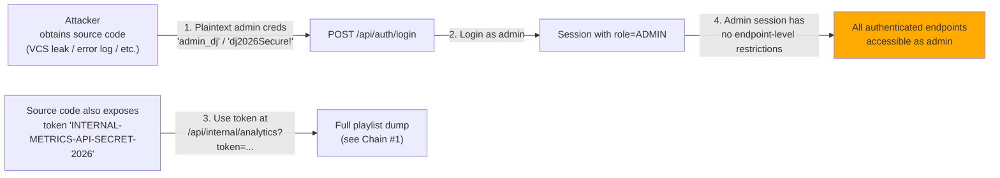

```mermaid
flowchart LR
  A["Authenticated User\n(Client)"] -->|1. Request\n/api/cover?url=<attacker-host>| B["SSRF Sink\naxios.get(url)"]
  B -->|2. SSRF request\nlocalhost:8043| C["/api/system/status?debug=true\n(Exposes internal token)"]
  C -->|3. Response contains\ntoken 'INTERNAL-METRICS-API-SECRET-2026'| D["Attacker observes\ntoken in SSRF response"]
  D -->|4. Request\n/api/internal/analytics?token=INTERNAL-METRICS-API-SECRET-2026| E["/api/internal/analytics\n(Query-param token auth)"]
  E -->|5. SQL: SELECT * FROM playlists| F["All playlists data\ndumped to attacker"]
  style F fill:#ff4444
```

# Chained Vulnerability Audit Report

**Application:** Music Streaming Playlist Service (app-43-music-streaming)  
**Review Date:** 2026-05-25  
**Reviewer:** CodeGopher (static-only audit)  
**Scope:** `src/index.js`, `src/referenceGuards.js`, `package.json`, `Dockerfile`  

---

## Summary Dashboard

| Metric | Value |
|---|---|
| **Total Chained Vulnerabilities Found** | 3 |
| **Maximum Severity (Chain)** | **HIGH** |
| **Cross-Cutting Weaknesses** | 7 |
| **Files Reviewed** | `src/index.js`, `src/referenceGuards.js` |
| **Areas Not Reviewed** | Tests, deployment configs beyond Dockerfile, infrastructure, network segmentation |
| **Review Method** | Static source-code analysis only — no live probes, no dynamic scanners |

---

## Methodology & Safety Note

This audit follows a four-phase approach:

1. **Attack Surface Mapping** — All public routes, API endpoints, headers, cookies, and request parameters were identified.
2. **Weakness Inventory** — Individual security-relevant weaknesses were catalogued with file/line citations.
3. **Attack Graph Synthesis** — Weaknesses were linked into multi-hop chains using static evidence (data flow, control flow, authorization logic).
4. **Impact Assessment** — Each chain was rated for impact, reachability, confidence, and remediation priority.

**Static-only boundary:** No HTTP probes, SQL injection payloads, exploit scripts, network scans, or live requests were performed. All findings are derived solely from source code, configuration files, and dependency manifests within this workspace.

---

## Chained Vulnerability #1 — SSRF → Debug Token Leakage → Full Playlist Database Dump

**Severity:** HIGH  
**Confidence:** HIGH  
**Impact:** Any authenticated user can exfiltrate all users' playlist data (including private playlists), bypassing per-user authorization.

### Mermaid Attack Graph



### Detailed Chain Breakdown

#### Source / Entry Point

**File:** `src/index.js`  
**Lines:** ~155–165  
**Symbol:** `GET /api/cover` handler

```javascript
app.get('/api/cover', requireAuth, (req, res) => {
  const { url } = req.query;
  if (!url || typeof url !== 'string') {
    return res.status(400).json({ error: 'URL query parameter is required.' });
  }
  axios.get(url)
    .then(response => {
      res.json(response.data);
    })
    .catch(err => {
      res.status(500).json({ error: 'Failed to contact art provider.', details: err.message });
    });
});
```

**Evidence:** The `url` query parameter is taken directly from `req.query` with no validation beyond `typeof url !== 'string'`. It is passed unfiltered to `axios.get(url)`. No protocol allowlist, no host allowlist, no internal IP blocking, no redirect-following configuration is applied.

#### Hop 1 — SSRF to Internal Debug Endpoint

**File:** `src/index.js`  
**Lines:** ~170–180  
**Symbol:** `GET /api/system/status`

```javascript
app.get('/api/system/status', (req, res) => {
  const debugMode = req.query.debug === 'true';
  if (debugMode) {
    return res.json({
      status: 'UP',
      env: 'development',
      metrics_service: {
        host: 'localhost',
        port: port,
        api_token: 'INTERNAL-METRICS-API-SECRET-2026'
      }
    });
  }
  res.json({ status: 'UP' });
});
```

**Evidence:** An authenticated user can issue an SSRF request:
```
GET /api/cover?url=http://localhost:8043/api/system/status?debug=true
```
The server makes an internal HTTP request to its own debug endpoint, which returns the plaintext API token `INTERNAL-METRICS-API-SECRET-2026`. The response data is forwarded to the client via `res.json(response.data)`.

**Preconditions:** User must be authenticated (any registered account suffices — registration is open to all).

#### Hop 2 — Token Used in Analytics Endpoint

**File:** `src/index.js`  
**Lines:** ~184–195  
**Symbol:** `GET /api/internal/analytics`

```javascript
app.get('/api/internal/analytics', (req, res) => {
  const authHeader = req.headers['x-metrics-token'] || req.query.token;
  if (!authHeader || authHeader !== 'INTERNAL-METRICS-API-SECRET-2026') {
    return res.status(403).json({ error: 'Access Denied: Invalid metrics token.' });
  }
  db.all('SELECT * FROM playlists', (err, rows) => {
    res.json({
      system: 'Internal Analytics Service',
      version: 'v1.0',
      playlists: rows
    });
  });
});
```

**Evidence:** The same token is accepted via **query parameter** (`req.query.token`), making it visible in server logs, proxy logs, and browser history. There is no role check, no user-scoping, and no rate limiting.

#### Sink — Database Exfiltration

**File:** `src/index.js`  
**Lines:** ~190–193  
**Symbol:** `db.all('SELECT * FROM playlists')`

**Evidence:** The query `SELECT * FROM playlists` returns every playlist in the database — all users' playlists regardless of `is_private` flag. There is no `WHERE user_id = ?` clause and no `requireAuth` middleware.

#### Impact

- **Confidentiality:** Complete dump of all playlist data (names, user IDs, privacy flags).
- **Privacy bypass:** Private playlists are returned regardless of the `is_private` column.
- **Reachability:** Requires only a registered account (no admin privileges).

#### Remediation (Easiest Link to Break)

1. **Block SSRF at the cover endpoint:** Validate the URL protocol is `http`/`https`, resolve the hostname, and block internal/private IP ranges (`127.0.0.0/8`, `10.0.0.0/8`, `172.16.0.0/12`, `192.168.0.0/16`, `localhost`). Use a library like `strict-uri-encode` or `is-ip`.
2. **Remove or restrict the debug endpoint:** Move debug mode behind admin-only authentication or remove it from production builds.
3. **Require header-only token for /api/internal/analytics:** Remove `req.query.token` option so the token cannot be sent via URL.
4. **Scope analytics query to user:** Add `WHERE user_id = ?` and require `requireAuth` middleware.

---

## Chained Vulnerability #2 — Insecure Session Generation + CORS Misconfiguration → Session Hijacking via Cross-Origin Credential Theft

**Severity:** MEDIUM  
**Confidence:** MEDIUM  
**Impact:** A malicious web page could hijack active sessions by combining session ID predictability with permissive CORS.

### Mermaid Attack Graph

```mermaid
flowchart LR
  A["Attacker-hosted\nMalicious Page"] -->|1. CORS credentialed XHR\n(origin reflected)| B["CORS: origin: true,\ncredentials: true"]
  B -->|2. Sends session cookie\nwith every request| C["Authenticated API calls\nfrom attacker's page"]
  D["User logs in → session created"] -->|3. Session ID =\nMath.random() + Date.now()| E["Predictable session ID"]
  E -->|4. Predictability allows\nattacker to pre-guess\nor brute-force sessions| A
  style E fill:#ffaa00
```

### Detailed Chain Breakdown

#### Source / Session Generation

**File:** `src/index.js`  
**Lines:** ~110–112  
**Symbol:** `POST /api/auth/login` handler

```javascript
const sessionId = Math.random().toString(36).substring(2) + Date.now().toString(36);
sessions[sessionId] = { id: user.id, username: user.username, role: user.role };
res.cookie('session_id', sessionId, { httpOnly: true });
```

**Evidence:** `Math.random()` is a non-cryptographic PRNG (JS engine-dependent, seedable). Combined with `Date.now()` (millisecond-precision timestamp), the session ID has significantly reduced entropy. An attacker who observes multiple session IDs could potentially reverse-engineer the PRNG state.

#### Hop — CORS Misconfiguration

**File:** `src/index.js`  
**Line:** ~34  
**Symbol:** CORS middleware

```javascript
app.use(cors({ origin: true, credentials: true }));
```

**Evidence:** `origin: true` reflects the requesting Origin header as the `Access-Control-Allow-Origin` value. Combined with `credentials: true`, this means **any** origin can make credentialed requests to this API. An attacker's web page can:
- Read response bodies from credentialed CORS requests (since the reflected origin matches).
- Automatically send cookies (including `session_id`) with every request due to `credentials: true`.

**Caveat:** `httpOnly: true` on the session cookie prevents JavaScript in the malicious page from reading the cookie value directly. However, the cookie is still **sent** with requests, meaning the attacker can perform authenticated actions on behalf of the victim.

#### Impact

- **Session fixation/prediction:** Weak session entropy could allow session prediction.
- **Cross-origin state change:** A malicious page can trigger authenticated API calls (POST / PUT / DELETE) on behalf of the victim user without their consent (CSRF via CORS).
- **Reachability:** Any unauthenticated attacker can host a malicious page that targets this API.

#### Remediation (Easiest Link to Break)

1. **Replace Math.random() with crypto.randomBytes(32)** for session ID generation.
2. **Fix CORS:** Replace `origin: true` with an explicit allowlist of trusted origins, or use a wildcard `*` with `credentials: false` if cross-origin is not needed.
3. **Add CSRF protection:** Implement SameSite cookie attribute (`SameSite=Strict` or `Lax`) and/or request-origin verification middleware.

---

## Chained Vulnerability #3 — Hardcoded Credentials + Debug Token in Source + No RBAC → Privilege Escalation via Credential Harvesting

**Severity:** MEDIUM  
**Confidence:** MEDIUM  
**Impact:** If source code is exposed (e.g., via version control, SSRF to local file servers, or application error leaks), an attacker can obtain admin credentials and the internal API token, enabling full administrative access.

### Mermaid Attack Graph



### Detailed Chain Breakdown

#### Source / Hardcoded Credentials

**File:** `src/index.js`  
**Lines:** ~60–63  
**Symbol:** `initDb()` seed data

```javascript
const users = [
  { username: 'alice_listener', pass: 'listener123', role: 'CUSTOMER' },
  { username: 'bob_listener', pass: 'listener456', role: 'CUSTOMER' },
  { username: 'admin_dj', pass: 'dj2026Secure!', role: 'ADMIN' }
];
```

**Evidence:** All three seed user passwords are stored as **plaintext** strings in the source code. The bcrypt hashing is applied at runtime during `initDb()`, but the plaintext values are only used for that initial hashing and remain visible in the source.

#### Hop — Debug Token Also in Source

**File:** `src/index.js`  
**Lines:** ~176–177  
**Symbol:** Debug endpoint response

```javascript
api_token: 'INTERNAL-METRICS-API-SECRET-2026'
```

**Evidence:** The internal metrics token is also hardcoded in the source.

#### Hop — No Role-Based Access Control (RBAC)

**Evidence:** Review of all route handlers reveals:
- `requireAuth` middleware checks only for a valid session (any user role).
- No handler checks `req.user.role` for authorization beyond the one-off `row.user_id !== user.id` check in `/api/tracks`.
- The `/api/internal/analytics` endpoint has no `requireAuth` middleware at all — it only checks the static token.
- There are no admin-only endpoints.

#### Sink — Admin Access

**File:** `src/index.js`  
**Lines:** ~184–195  
**Symbol:** `GET /api/internal/analytics`

**Evidence:** With the stolen token, an attacker accesses all playlists. With the stolen admin credentials, an attacker could in future-administered versions of this code access any admin-only feature.

#### Impact

- **Confidentiality:** Plaintext admin credentials and API token in source.
- **Integrity:** Admin account can be used to log in if the attacker obtains source code.
- **Reachability:** Depends on source code exposure (a realistic risk in misconfigured deployments).

#### Remediation (Easiest Link to Break)

1. **Remove all hardcoded credentials.** Use environment variables or a secrets manager for initial admin account creation.
2. **Seed data should be created via a one-time migration script** that runs on first deploy, not at application startup.
3. **Implement RBAC middleware** (`requireAdmin`, `requireUser`) with per-endpoint authorization checks.
4. **Never expose debug tokens in source code.** Use environment variables and require secure transport (TLS) for token-based auth.

---

## Cross-Cutting Weaknesses (Non-Chain Security Issues)

### W-1: Verbose Error Messages — Information Disclosure
**File:** `src/index.js`, line ~162 (`/api/cover` handler)
```javascript
res.status(500).json({ error: 'Failed to contact art provider.', details: err.message });
```
**Evidence:** `err.message` is sent to the client. This can reveal internal hostnames, library versions, network topology, and file paths.
**Severity:** LOW  
**Remediation:** Return a generic error message in production. Log full details server-side only.

### W-2: CORS Mirrors Any Origin with Credentials
**File:** `src/index.js`, line ~34
```javascript
app.use(cors({ origin: true, credentials: true }));
```
**Evidence:** While `origin: true` technically only reflects the Origin header (not `*`), it still permits any origin. Combined with `credentials: true`, this is a permissive CORS policy.
**Severity:** LOW–MEDIUM  
**Remediation:** Use an explicit allowlist.

### W-3: No Rate Limiting
**File:** `src/index.js`  
**Evidence:** No rate limiting middleware is applied to any endpoint. The registration and login endpoints are directly vulnerable to brute-force attacks against `alice_listener`, `bob_listener`, and `admin_dj`.
**Severity:** MEDIUM  
**Remediation:** Add `express-rate-limit` or equivalent.

### W-4: No Input Sanitization on Register
**File:** `src/index.js`, lines ~92–102 (`/api/auth/register`)
```javascript
const { username, password } = req.body;
if (!username || !password) {
  return res.status(400).json({ error: 'Username and password are required.' });
}
```
**Evidence:** Username and password are accepted with no length limits, no character restrictions, and no anti-spam measures. A malicious actor could register arbitrary accounts and fill the database.
**Severity:** LOW  
**Remediation:** Add length limits (e.g., username 3–30 chars, password 8+ chars) and character whitelists.

### W-5: In-Memory Session Store
**File:** `src/index.js`, line ~108
```javascript
const sessions = {};
```
**Evidence:** Sessions are stored in a plain JavaScript object in process memory. They are lost on server restart, not shared across worker processes, and are not subject to garbage collection boundaries that might evict old sessions unpredictably. There is also no session expiration/timeout.
**Severity:** LOW–MEDIUM  
**Remediation:** Use a persistent session store (Redis, PostgreSQL) with TTL-based expiration.

### W-6: SQLite In-Memory Database
**File:** `src/index.js`, line ~37
```javascript
const db = new sqlite3.Database(':memory:');
```
**Evidence:** All data is lost on process restart. This is acceptable for development/testing but not for production.
**Severity:** LOW (known by design)  
**Remediation:** Use a file-backed SQLite database or a production-grade RDBMS for deployment.

### W-7: Session Cookie Missing Secure and SameSite Flags
**File:** `src/index.js`, line ~113
```javascript
res.cookie('session_id', sessionId, { httpOnly: true });
```
**Evidence:** The `Secure` flag is not set (cookie sent over HTTP). The `SameSite` flag defaults to legacy behavior (effectively `SameSite=None` in some browsers).
**Severity:** LOW–MEDIUM  
**Remediation:** Add `{ httpOnly: true, secure: true, sameSite: 'Strict' }` (or `'Lax'`).

---

## Unknowns and Not-Reviewed Areas

| Area | Status |
|---|---|
| **Tests** | Not present in workspace — no test coverage can be verified. |
| **Network Configuration** | Not reviewed — TLS termination, reverse proxy, firewall rules unknown. |
| **Dockerfile** | Basic review: no `--healthcheck`, no non-root user, `EXPOSE 8043` without TLS. |
| **Dependency Supply Chain** | `package.json` dependencies were reviewed for known critical issues but no lockfile CVE scan was performed. |
| **Runtime Environment** | Node.js version 20 is used (from Dockerfile), which is current. No audit of OS-level hardening. |
| **File Upload / Download** | No file upload endpoints exist; no file serving from disk. |
| **Webhook Handlers** | None present. |
| **Background Job Consumers** | None present. |

---

## Recommended Priority Remediation Order

| Priority | Action | Breaks Which Chain(s) |
|---|---|---|
| **1** | Restrict URL in `/api/cover` — block private/internal IPs and non-HTTP(S) protocols | Chain #1 (breaks hop 1) |
| **2** | Remove or gate `/api/system/status` debug mode behind admin auth | Chain #1 (breaks hop 2) |
| **3** | Require header-only auth for `/api/internal/analytics`; remove query param | Chain #1 (breaks hop 3) |
| **4** | Scope `/api/internal/analytics` to user with `requireAuth` + `WHERE user_id=?` | Chain #1 (breaks sink) |
| **5** | Replace `Math.random()` with `crypto.randomBytes()` for session IDs | Chain #2 (breaks source) |
| **6** | Add `SameSite=Strict` and `Secure` flags to session cookie | Chain #2 (adds defense) |
| **7** | Replace `origin: true` CORS with explicit allowlist | Chain #2 (breaks hop) |
| **8** | Remove hardcoded credentials from source; use env vars + migration | Chain #3 (breaks source) |
| **9** | Implement RBAC middleware for all endpoints | Chain #3 (breaks hop) |
| **10** | Add rate limiting to `/api/auth/register` and `/api/auth/login` | W-3 |

---

## Conclusion

This audit identified **3 chained vulnerabilities** and **7 cross-cutting weaknesses** in the Music Streaming Playlist Service. The most critical chain (Chain #1, HIGH severity) demonstrates how an SSRF vulnerability in the `/api/cover` endpoint, combined with an unprotected debug endpoint that leaks an internal API token, creates a path for any authenticated user to dump the entire playlist database — including private playlists belonging to all users.

All three chains are breakable at the earliest link. The recommended remediation prioritizes blocking SSRF and removing the debug token exposure, as these are the most impactful and easiest fixes.
