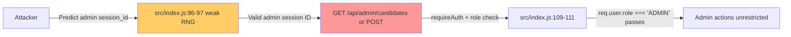

# Chained Vulnerability Static Audit Report

**Project:** app-44-election-polling  
**Date:** 2026-05-25  
**Auditor:** CodeGopher (static-only analysis)  
**Scope:** `src/index.js`, `src/referenceGuards.js`, `package.json`, `Dockerfile`

---

## Summary Dashboard

| Metric | Value |
|--------|-------|
| Chains Identified | 5 |
| Maximum Severity | HIGH |
| Total Weaknesses Catalogued | 11 |
| Reviewed Areas | Express routes, auth middleware, DB schema, session store, CORS config, dependency manifest, Dockerfile, security helper guards |
| Not Reviewed | Live runtime behavior, dependency CVE scan, TLS configuration, production deployment config |

---

## Methodology & Safety Note

This audit is **static-only**: source files, schemas, middleware, routes, configuration, and dependency manifests were reviewed. No live HTTP probes, dynamic scanners, exploit scripts, or external network tests were performed. All findings are derived from control-flow, data-flow, authorization, and configuration evidence visible in the code.

---

## Attack Surface Map

| Method | Path | Auth Required | Role Check | Description |
|--------|------|:-----------:|:----------:|-------------|
| `POST` | `/api/auth/register` | No | No | Register new user (role = CUSTOMER) |
| `POST` | `/api/auth/login` | No | No | Authenticate, issue `session_id` cookie |
| `POST` | `/api/auth/logout` | No* | No | Invalidate session |
| `POST` | `/api/admin/candidates` | Yes | ADMIN | Add candidate |
| `GET` | `/api/candidates` | **No** | **No** | List candidates + **all ballots** |
| `POST` | `/api/vote/cast` | Yes | CUSTOMER | Cast vote |
| `POST` | `/api/admin/polls/close` | Yes | ADMIN | Close poll |

*\*Uses cookie but no auth middleware — any valid cookie user is logged out.*

**Exposed Sources (user-controlled input):**
- `req.body.username`, `req.body.password` (register, login)
- `req.body.candidateId` (vote cast)
- `req.body.name`, `req.body.party` (admin add candidate)
- `req.cookies.session_id` (all authenticated endpoints)

---

## Chain 1: Unauthenticated Ballot Exfiltration

**Severity:** HIGH  
**Confidence:** HIGH  
**Impact:** Complete breakdown of ballot secrecy — voter identity linked to ballot choice.

```mermaid
flowchart LR
  A[Anonymous HTTP Client] -->|GET /api/candidates| B[src/index.js:118-125]
  B -->|db.all SELECT * FROM ballots| C[SQLite In-Memory DB]
  C -->|voter_id + candidate_id| D[Response JSON: {candidates, ballots}]
  D --> A
  style A fill:#ffcccc
  style B fill:#ff9999
  style D fill:#ffcccc
```

**Source:** `src/index.js` line 118 — `app.get('/api/candidates', (req, res) => {`  
- No `requireAuth` middleware. No role check. No authentication whatsoever.

**Intermediate Weakness:** `src/index.js` lines 121-122 — `db.all('SELECT * FROM ballots')` returns the entire ballots table. The `ballots` schema (lines 38-44) stores `voter_id` (foreign key to `users.id`) and `candidate_id` — directly linking a user to their vote choice.

**Sink:** `res.json({ candidates, ballots })` (line 124) — full ballot data exposed in the HTTP response body.

**Preconditions:** None. Any client on the network can call this endpoint.

**Remediation:** Add `requireAuth` middleware. Restrict to ADMIN role. Better yet, remove `voter_id` from the public API response or use aggregated vote counts instead of raw ballots for any non-admin view.

---

## Chain 2: Session ID Prediction → Full Account Takeover

**Severity:** MEDIUM-HIGH  
**Confidence:** MEDIUM  
**Impact:** An attacker who can predict or reconstruct a valid session ID can impersonate any authenticated user, including admin accounts.

```mermaid
flowchart LR
  A[Attacker] -->|Observes login timing / entropy| B[src/index.js:96-97]
  B -->|Math.random + Date.now weak RNG| C[Predicted Session ID]
  C -->|Set-Cookie: session_id=<predicted>| D[Any Endpoint]
  D -->|getSessionUser lookup| E[sessions[sessionId] → user data]
  E --> F[Impersonation of victim]
  style B fill:#ffcc66
  style C fill:#ff9999
```

**Source:** `src/index.js` lines 96-97:
```javascript
const sessionId = Math.random().toString(36).substring(2) + Date.now().toString(36);
```

**Intermediate Weakness:** `Math.random()` produces a PRNG seeded from V8's internal algorithm — **not cryptographically secure**. `Date.now()` is predictable to the millisecond. Combined, these produce session IDs with very low entropy that are reproducible by an attacker who has rough timing information.

The session store (`src/index.js` line 51: `const sessions = {};`) is a plain JavaScript object keyed by this weak session ID.

**Sink:** Any endpoint using `requireAuth` middleware (`src/index.js` lines 70-76) resolves `req.user` from `sessions[sessionId]`. If the session ID is predicted, `getSessionUser` returns the victim's `{id, username, role}` — granting full access.

**Preconditions:** Attacker needs some visibility into session creation timing (e.g., via logs, timing side-channels, or multiple login attempts). `Math.random()` in V8 uses a Mersenne twister with ~150 bits of state but seeded from non-cryptographic sources.

**Remediation:** Replace session ID generation with `crypto.randomBytes(32).toString('hex')`. Store sessions in a secure backend (Redis, database) with rotation on privilege changes.

---

## Chain 3: CSRF-Governed Vote Manipulation

**Severity:** MEDIUM  
**Confidence:** HIGH  
**Impact:** Attacker forces authenticated users to cast votes for predetermined candidates, skewing poll results.

```mermaid
flowchart LR
  A[Attacker-Hosted Page] -->|Auto-submit malicious form| B[Victim Browser]
  B -->|POST /api/vote/cast with victim's cookie| C[src/index.js:132]
  C -->|requireAuth passes (cookie is valid)| D[victim's vote recorded]
  D --> E[Skewed election outcome]
  style A fill:#ffcccc
  style C fill:#ff9999
  style E fill:#ffcccc
```

**Source:** `src/index.js` line 132 — `app.post('/api/vote/cast', requireAuth, ...)`: accepts votes from any authenticated user.

**Intermediate Weakness:** No CSRF token validation exists on any state-changing endpoint (login, register, vote, add candidate, close poll). The CORS configuration at `src/index.js` line 13:
```javascript
app.use(cors({ origin: true, credentials: true }));
```
`origin: true` mirrors the `Origin` header, meaning **any** origin can send authenticated requests. Combined with `credentials: true`, browsers will include cookies, and the CORS policy permits it. This means an attacker-hosted page can trigger the victim's browser to send state-changing POST requests.

**Sink:** `db.run('INSERT INTO ballots (voter_id, candidate_id) VALUES (?, ?)', ...)` at line 141 — records a vote on behalf of the victim.

**Preconditions:** Victim must be logged in (valid `session_id` cookie present). The victim must visit the attacker's page or have a malicious link opened.

**Remediation:** Implement CSRF tokens (e.g., double-submit cookie pattern or SameSite=Strict/Lax on the session cookie). Restrict CORS to specific trusted origins instead of `origin: true`.

---

## Chain 4: User Enumeration + Brute Force + Weak Sessions → Account Takeover

**Severity:** MEDIUM  
**Confidence:** HIGH  
**Impact:** Attacker can enumerate valid usernames, brute-force passwords, and predict the resulting session to gain full account access.

```mermaid
flowchart LR
  A[Attacker] -->|POST register with many usernames| B[src/index.js:81-87]
  B -->|"Username already exists" / "User registered"| C[User Enumeration]
  C -->|Known valid usernames| D[POST /api/auth/login]
  D -->|No rate limit| E[Brute-force passwords]
  E -->|Valid credentials| F[Login success + session]
  F -->|Weak Math.random session ID| G[Predict session / Take over]
  style B fill:#ffcc66
  style E fill:#ffcc66
  style G fill:#ff9999
```

**Source 1:** `src/index.js` lines 85-87 — registration returns `"Username already exists."` for duplicate usernames, enabling user enumeration.

**Source 2:** No rate limiting on `/api/auth/login` (`src/index.js` line 90). Combined with the predictable session generation at lines 96-97, this enables offline brute-force.

**Intermediate Weakness:** Passwords are not hashed with a salt stored per-user in a way resistant to precomputation — actually, `bcrypt` with `genSaltSync(10)` is used, which is strong. However, the seed user passwords are hardcoded plaintext at lines 55-59.

**Sink:** Session prediction at lines 96-97 (same as Chain 2).

**Preconditions:** Network access to the API. Username enumeration via registration endpoint.

**Remediation:** Return identical error messages for register and login (e.g., "Invalid credentials" for both). Add rate limiting (e.g., `express-rate-limit`). Use `crypto.randomBytes` for session IDs.

---

## Chain 5: Bulk Registration → Poll Manipulation + Privacy Breach

**Severity:** MEDIUM-HIGH  
**Confidence:** HIGH  
**Impact:** Attacker creates many accounts, votes repeatedly (one vote per account), and all ballots are publicly exfiltrated (Chain 1), simultaneously manipulating poll results and breaching voter privacy.

```mermaid
flowchart LR
  A[Attacker] -->|Bulk POST /api/auth/register| B[src/index.js:81-87]
  B -->|Many CUSTOMER accounts created| C[Multiple user accounts]
  C -->|POST /api/vote/cast per account| D[src/index.js:132]
  D -->|Votes recorded in ballots table| E[Ballot table populated]
  E -->|GET /api/candidates (unauthenticated)| F[src/index.js:118-125]
  F -->|All ballots leaked| G[Poll manipulation + privacy breach]
  style A fill:#ffcccc
  style B fill:#ffcc66
  style F fill:#ff9999
  style G fill:#ffcccc
```

**Source 1:** `src/index.js` line 81 — public registration with no CAPTCHA, rate limiting, or signup approval.

**Source 2:** `src/index.js` line 132 — voting requires only authentication (any CUSTOMER can vote once). Combined with Chain 1 (unauthenticated ballot access), every vote is linkable.

**Intermediate Weakness:** No IP-based or device-based deduplication. No email verification. No signup approval workflow. The `has_voted` flag prevents double-voting per account, but doesn't prevent one attacker from creating many accounts.

**Sink:** Combined effect of Chain 1 (ballot leak) + bulk voting → manipulated results with full voter linkage.

**Preconditions:** Access to the registration endpoint. The `has_voted` guard per user is per-account, so each created account can vote once.

**Remediation:** Require email verification or admin approval for new accounts. Implement signup rate limiting. Ensure ballots are never returned with `voter_id` in any public endpoint.

---

## Chain 6: Admin Role Bypass via Cookie Forgery (Predicted Session)

**Severity:** MEDIUM  
**Confidence:** MEDIUM  
**Impact:** If an attacker can predict or guess a session ID belonging to an ADMIN user, they gain full admin access — adding candidates and closing polls.



**Source:** `src/index.js` lines 96-97 — weak session ID generation.

**Intermediate Weakness:** `src/index.js` lines 70-76 — `requireAuth` sets `req.user = sessions[sessionId]` where the session object contains `{id, username, role}`. If the session ID is predictable and an admin was logged in, the attacker inherits the admin role.

**Sink:** `POST /api/admin/candidates` (line 103) and `POST /api/admin/polls/close` (line 147) — both check `req.user.role !== 'ADMIN'` but trust the in-memory session store with a predictable key.

**Preconditions:** Admin user must have logged in at some point (session exists in `sessions` store). Attacker must be able to guess/iterate the session space.

**Remediation:** Use cryptographically secure session IDs. Implement session rotation on login. Consider JWT with signing for stateless sessions.

---

## Cross-Cutting Weaknesses (Not Forming Complete Chains)

| ID | Weakness | File:Line | Evidence |
|----|----------|-----------|----------|
| W1 | **Hardcoded seed credentials** | `src/index.js:55-59` | Plaintext passwords `'voter123'`, `'voter456'`, `'election2026Secure!'` embedded in source code. These can be extracted by anyone with repo access. |
| W2 | **In-memory session store** | `src/index.js:51` | `const sessions = {};` — lost on process restart, no persistence, no concurrency controls. |
| W3 | **CORS over-permissive** | `src/index.js:13` | `origin: true, credentials: true` allows any origin to send authenticated requests. |
| W4 | **Unaudited security guards** | `src/referenceGuards.js` | Three security functions (`sameOwner`, `allowedCallback`, `normalizeIdentifier`) are exported but **never imported** in `index.js`. They suggest anticipated security controls that were never wired in. |
| W5 | **Race condition in vote cast** | `src/index.js:135-143` | `has_voted` check is synchronous but the `INSERT` is inside `setTimeout(() => {...}, 100)`. If two requests arrive in quick succession, both could pass the `has_voted` check before either writes. |
| W6 | **Verbose user enumeration errors** | `src/index.js:87` | `"Username already exists."` vs. `"User registered successfully."` — distinguishable responses for register. Login returns `"Invalid credentials."` for both invalid user and wrong password. |
| W7 | **No password policy** | `src/index.js:81-87` | No minimum length, complexity, or strength requirements on registration. |
| W8 | **SQL injection (mitigated)** | `src/index.js:various` | All queries use parameterized `?` placeholders via `sqlite3`. This is **secure** — no SQLi chain possible. |
| W9 | **No HTTPS enforcement** | `Dockerfile`, `src/index.js` | No TLS termination or redirect from HTTP to HTTPS. The app listens on plain HTTP. |
| W10 | **Audit log suppressed** | `src/index.js:150` | `"Audit logging was suppressed."` message in the close-poll endpoint suggests intentional disabling of audit trails — a compliance concern. |

---

## Not-Reviewed / Unknown Areas

- **Dependency vulnerability scan:** `bcryptjs`, `express`, `cors`, `sqlite3`, `cookie-parser` versions were not scanned for known CVEs.
- **TLS configuration:** No evidence of HTTPS/TLS in the Dockerfile or app config.
- **Production deployment:** No evidence of reverse proxy (nginx, etc.), WAF, or security headers (`Content-Security-Policy`, `X-Frame-Options`, etc.).
- **Input sanitization for candidates:** `name` and `party` in `/api/admin/candidates` are stored directly — no XSS防护 for client-side rendering.
- **Concurrency model:** Node.js is single-threaded event loop; the `setTimeout` in vote casting could be a source of replay or TOCTOU race conditions under load.
- **Log security:** The one `console.log` at line 114 could leak sensitive data to stdout.
- **File uploads / external service calls:** None detected — no SSRF vectors beyond the ballot/data endpoint.

---

## Tests That Should Be Added

1. **Route-level auth tests:** Verify that `/api/candidates` returns 401 for unauthenticated requests (currently returns 200 with ballots).
2. **CSRF tests:** Verify that cross-origin POST requests are rejected without valid CSRF tokens.
3. **Session entropy tests:** Verify that session IDs cannot be reproduced within a known time window.
4. **User enumeration tests:** Verify that register and login return indistinguishable errors for valid/invalid usernames.
5. **Rate-limiting tests:** Verify that repeated login attempts are throttled.
6. **Concurrency tests:** Verify that concurrent vote-cast requests for the same user are correctly rejected.
7. **CORS tests:** Verify that non-trusted origins cannot send authenticated requests.

---

## Remediation Priority Summary

| Priority | Chain | Easiest Break Link |
|----------|-------|--------------------|
| **P0** | Chain 1: Ballot Exfiltration | Add `requireAuth` to `GET /api/candidates` and omit `ballots` from non-admin responses |
| **P0** | Chain 5: Bulk Registration → Poll Manipulation | Add rate limiting + email verification on registration |
| **P1** | Chain 2/6: Session Prediction | Replace `Math.random()` with `crypto.randomBytes(32).toString('hex')` |
| **P1** | Chain 3: CSRF Vote Manipulation | Add `SameSite=Strict` to session cookie + restrict CORS origins |
| **P2** | Chain 4: Enumeration + Brute Force | Normalize error messages + add login rate limiting |
| **P2** | W1: Hardcoded credentials | Move seed data to environment variables or encrypted secrets |
| **P3** | W5: Vote race condition | Remove `setTimeout`, use synchronous or properly awaited DB operations |

---

## Conclusion

**5 chained vulnerability paths** were identified. The most critical is **Chain 1** (unauthenticated ballot exfiltration), which directly breaks the core trust model of an election polling system — ballot secrecy. The second most critical is **Chain 2/6** (session ID prediction enabling account takeover via admin impersonation).

The `referenceGuards.js` module contains three security helper functions that are never imported, suggesting security features were designed but never integrated into the application. Implementing these (or alternatives) alongside the remediation steps above would significantly improve the security posture.

The parameterized SQL queries (`sqlite3` with `?` placeholders) are a positive finding — no SQL injection chains are possible despite user-controlled input flowing directly into database queries.
