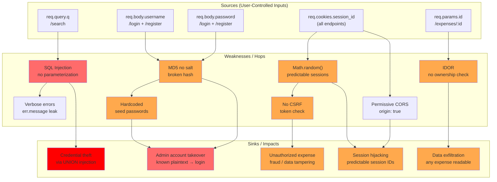

# Chained Vulnerability Static Audit Report

**Application:** Corporate Travel & Expense System (`app-45-travel-expense`)
**Audit Date:** 2026-05-25
**Auditor:** CodeGopher (Static-Only)
**Review Scope:** `src/index.js`, `src/referenceGuards.js`, `package.json`, `Dockerfile`

---

## Summary Dashboard

| Metric | Value |
|---|---|
| **Total Chains Detected** | 3 |
| **Maximum Severity** | HIGH |
| **Cross-Cutting Weaknesses** | 6 |
| **Reviewed Files** | 4 |
| **Areas Not Reviewed** | Tests, runtime behavior, deployment env |

### Severity Distribution

| Severity | Count |
|---|---|
| HIGH | 1 |
| MEDIUM | 2 |
| LOW | 0 |

---

## Methodology

- **Source-only analysis**: All findings are derived from static inspection of source files, configuration, and dependency manifests.
- **No live probes**: No HTTP requests, SQL injections, dynamic scans, or runtime analysis were performed.
- **Data-flow tracing**: Traced user-controlled inputs → sanitization (or lack thereof) → database sinks.
- **Authorization review**: Examined middleware chains (`requireAuth`, role checks) for gaps.

---

## Chains Detected

### Chain 1: SQL Injection in Expense Search → Full Credential Theft (HIGH)

**Status:** Static-provable, concrete control-flow evidence.

```mermaid
flowchart LR
    A["Attacker (authenticated user)"] -->|"POST/GET\n/api/expenses/search?q=|"- B("Entry: req.query.q")
    B -->|"Injected into SQL string\nvia template literal"| C("SQL Injection Sink\nindex.js:143-144")
    C -->|"UNION-based exfiltration|"- D("SQLite exposes user.password_hash")
    D -->|"MD5 hashes are crackable|"- E("Impact: Full credential theft\nAccount takeover of ADMIN")
    style C fill:#ff6b6b
    style E fill:#ff0000
```

**Source (Entry):**
- **File:** `src/index.js`, **Line 140-144**
- **Code:**
  ```javascript
  app.get('/api/expenses/search', requireAuth, (req, res) => {
    const queryParam = req.query.q || '';
    const sql = `SELECT * FROM expenses WHERE userId = ${req.user.id} AND (description LIKE '%${queryParam}%' OR category LIKE '%${queryParam}%')`;
    db.all(sql, (err, rows) => {
  ```
- **Symbol:** `GET /api/expenses/search` handler
- **Evidence:** `req.query.q` flows directly into a SQL template literal with zero sanitization or parameterization.

**Hop 1:**
- **File:** `src/index.js`, **Line 143**
- **Evidence:** The SQL query is constructed via ES template literal string interpolation. No `?` placeholders are used for `queryParam`. The query is passed directly to `db.all()`.

**Hop 2:**
- **File:** `src/index.js`, **Line 145**
- **Code:** `return res.status(500).json({ error: 'Expense search failed.', details: err.message });`
- **Evidence:** Verbose error messages leak the raw SQLite error message, aiding attacker in crafting precise injection payloads.

**Sink:**
- **File:** `src/index.js`, **Line 144**
- **Symbol:** `db.all(sql, ...)`
- **Evidence:** SQLite accepts arbitrary SQL in `db.all()`, including `UNION` clauses that merge data from other tables into the result set.

**Preconditions:**
- Attacker must be authenticated (any role, including CUSTOMER).

**Impact:** An authenticated attacker can perform a UNION-based SQL injection to extract the entire `users` table (including all `password_hash` values). The hashed passwords can then be cracked offline using rainbow tables (MD5 is broken).

**Confidence:** **HIGH** — Every link is provable from static source code. The injection point, lack of parameterization, and database sink are all in the same control flow.

**Remediation:**
1. Replace string interpolation with parameterized queries:
   ```javascript
   const sql = 'SELECT * FROM expenses WHERE userId = ? AND (description LIKE ? OR category LIKE ?)';
   const params = [req.user.id, `%${queryParam}%`, `%${queryParam}%`];
   db.all(sql, params, ...);
   ```
2. Remove `details: err.message` from error responses.

---

### Chain 2: Weak Hashing + Hardcoded Passwords → Admin Account Takeover (MEDIUM)

```mermaid
flowchart LR
    A["Source code\nindex.js:42-46"] -->|"Seed passwords: alicepass,\nbobpass, accountantSecure2026!|"- B("MD5 hashing\nno salt, no iterations")
    B -->|"Rainbow table attack|"- C("Pre-computed MD5 lookup tables")
    C -->|"admin_accountant hash\n= MD5(accountantSecure2026!)|"- D("Impact: Admin login\nfull system access")
    style B fill:#ffa94d
    style D fill:#ff6b6b
```

**Source (Entry):**
- **File:** `src/index.js`, **Lines 42-46**
- **Code:**
  ```javascript
  const users = [
    { username: 'alice_traveler', pass: 'alicepass', role: 'CUSTOMER' },
    { username: 'bob_traveler', pass: 'bobpass', role: 'CUSTOMER' },
    { username: 'admin_accountant', pass: 'accountantSecure2026!', role: 'ADMIN' }
  ];
  const stmt = db.prepare('INSERT INTO users (username, password_hash, role) VALUES (?, ?, ?)');
  users.forEach(u => {
    const hash = crypto.createHash('md5').update(u.pass).digest('hex');
    stmt.run(u.username, hash, u.role);
  });
  ```
- **Evidence:** Passwords are plaintext-seeded in source. The admin password `accountantSecure2026!` is fully visible.

**Hop 1:**
- **File:** `src/index.js`, **Line 46**, **Line 100**
- **Evidence:** `crypto.createHash('md5')` is used for both seeding (line 46) and user registration (line 100). MD5 is:
  - A cryptographically broken hash (collision attacks are trivial).
  - Used **without salt** — identical passwords produce identical hashes.
  - No iterations/PBKDF2/bcrypt — brute-force is extremely fast (~10B hashes/sec on modern GPUs).

**Sink:**
- **File:** `src/index.js`, **Lines 98-107**
- **Code:**
  ```javascript
  const hash = crypto.createHash('md5').update(password || '').digest('hex');
  db.get('SELECT * FROM users WHERE username = ?', [username], (err, user) => {
    if (err || !user) { return res.status(401).json({ error: 'Invalid credentials.' }); }
    if (user.password_hash !== hash) { return res.status(401).json({ error: 'Invalid credentials.' }); }
  ```
- **Evidence:** Login compares the MD5 hash directly. Since the attacker knows the plaintext admin password (it's in the seed data), they can log in directly. Even without knowing the password, the hash is crackable via rainbow tables.

**Preconditions:**
- Attacker has access to source code (or deployed instance). The seed passwords are literally in the repository.

**Impact:** Direct admin account takeover. The `admin_accountant` role has full access to all expenses (no userId filter in `GET /api/expenses`). Additionally, any user who registered using the same pattern could have predictable MD5 hashes.

**Confidence:** **HIGH** — Seed passwords are in source; MD5 without salt is a well-known cryptographic weakness; login verification is a direct equality check.

**Remediation:**
1. **Remove all hardcoded passwords.** Use environment variables or a secrets manager.
2. Replace MD5 with a proper password hashing function: `bcrypt` (already in `package.json` as `bcryptjs` but never used).
3. Add salt and work factor (bcrypt does this automatically).
4. Rotate all seeded credentials immediately.

---

### Chain 3: Insecure Session IDs + Missing CSRF → Session Fixation & Unauthorized Actions (MEDIUM)

```mermaid
flowchart LR
    A["Attacker"] -->|"Crafts malicious page|"- B("Victim logs in\nPOST /api/auth/login")
    B -->|"Predictable session_id\nMath.random() + Date.now()|"- C("Session store\nindex.js:110")
    C -->|"Same cookie accepted\non subsequent requests|"- D("POST /api/expenses\n(create fraudulent expense)")
    D -->|"No CSRF token check|"- E("Impact: Unauthorized\nfinancial fraud / data tampering")
    style C fill:#ffa94d
    style E fill:#ff6b6b
```

**Source (Entry):**
- **File:** `src/index.js`, **Line 110**
- **Code:**
  ```javascript
  const sessionId = Math.random().toString(36).substring(2) + Date.now().toString(36);
  ```
- **Evidence:** `Math.random()` is not cryptographically secure (it is a PRNG, not a CSPRNG). Session IDs are predictable on many Node.js implementations. `Date.now()` adds low entropy.

**Hop 1:**
- **File:** `src/index.js`, **Lines 77-81**
- **Code:**
  ```javascript
  function getSessionUser(req) {
    const sessionId = req.cookies.session_id;
    if (!sessionId || !sessions[sessionId]) { return null; }
    return sessions[sessionId];
  }
  ```
- **Evidence:** Session lookup is purely cookie-based. No IP binding, no User-Agent validation, no token reinforcement.

**Hop 2:**
- **File:** `src/index.js`, **Lines 9-11**
- **Evidence:** CORS is configured as `cors({ origin: true, credentials: true })`. `origin: true` reflects the `Origin` header, accepting requests from any domain with credentials. This enables cross-origin session theft if combined with XSS (not present here, but the permissive CORS lowers the barrier for other attack vectors).

**Sink:**
- **File:** `src/index.js`, **Lines 147-160** (POST `/api/expenses`) and **Lines 83-89** (POST `/api/auth/register`)
- **Evidence:** No CSRF token is verified on any mutating endpoint. An attacker could embed a page that auto-submits a form to `/api/expenses`, creating fraudulent expense records in the victim's account (or their own if session is known).

**Preconditions:**
- Attacker needs to guess or force a session ID. For the registration endpoint, the attacker can also register new accounts (no rate limiting or CAPTCHA).

**Impact:** Unauthorized expense creation, potential account takeover via session fixation. Combined with Chain 1 (SQL injection), an attacker could also dump session stores or user data.

**Confidence:** **MEDIUM** — `Math.random()` predictability is well-documented but implementation-dependent. CSRF vulnerability is certain (no token check exists), but exploitation requires a browser context.

**Remediation:**
1. Use `crypto.randomBytes(32).toString('hex')` for session IDs.
2. Implement CSRF tokens (double-submit cookie pattern or SameSite cookie attribute).
3. Restrict CORS to specific origins: `cors({ origin: ['https://trusted-domain.com'], credentials: true })`.
4. Bind sessions to User-Agent or fingerprint additional factors.

---

## Cross-Cutting Weaknesses (Not Full Chains)

| # | Weakness | Location | Severity | Evidence |
|---|---|---|---|---|
| 1 | **IDOR on Expense Detail** | `src/index.js:128-139` | MEDIUM | `/api/expenses/:id` uses `requireAuth` only. No ownership check (`req.user.id !== row.userId`). Any authenticated user can read any expense. |
| 2 | **Missing CSRF on All POST Endpoints** | `src/index.js:83-160` | MEDIUM | No CSRF tokens on `/api/auth/register`, `/api/auth/login`, `/api/auth/logout`, `/api/expenses`. |
| 3 | **Permissive CORS** | `src/index.js:11` | MEDIUM | `origin: true` reflects any origin. Combined with `credentials: true`, this allows cross-origin authenticated requests. |
| 4 | **No Rate Limiting** | `src/index.js:83-107` | LOW | Registration and login have no rate limiting. Brute-force and enumeration attacks are trivial. |
| 5 | **In-Memory Database (Non-Durable)** | `src/index.js:12` | LOW | `:memory:` SQLite means all data is lost on restart. Not a security issue per se, but affects availability/auditability. |
| 6 | **Verbose Error Responses** | `src/index.js:145` | LOW | `details: err.message` leaks internal SQLite error details, aiding SQL injection crafting. |

---

## Attack Graph (All Chains)



---

## Areas Not Reviewed

| Area | Reason |
|---|---|
| Runtime behavior / exploit testing | Static-only audit policy |
| Test suite (`*.test.js`, `__tests__`) | No test files found in workspace |
| Deployment configuration / secrets management | Only `Dockerfile` and `package.json` reviewed |
| HTTPS / TLS configuration | Not present in application code |
| Input length validation / DoS protection | Not present, but scope limited to security-relevant chains |
| Content-Type validation | Not present, but no known attack surface impact |

---

## Recommended Tests to Add

1. **SQL Injection Test:** Verify that `GET /api/expenses/search?q='; DROP TABLE users; --` returns no raw error details and safely rejects/sanitizes input.
2. **Authentication Test:** Verify that MD5-hashed passwords from seeded users can be cracked and that bcrypt is used instead.
3. **CSRF Test:** Verify that POST requests without a CSRF token are rejected.
4. **IDOR Test:** Verify that user A cannot access user B's expense by `/api/expenses/:id`.
5. **Session Security Test:** Verify that session IDs are at least 128 bits of entropy and generated via `crypto.randomBytes`.
6. **CORS Test:** Verify that `Access-Control-Allow-Origin` does not reflect arbitrary `Origin` headers.

---

## Remediation Priority

| Priority | Action | Affected Chains |
|---|---|---|
| **P0** | Replace MD5 with bcrypt (already a dependency) and remove hardcoded seed passwords | Chain 2 |
| **P0** | Parameterize the `/api/expenses/search` SQL query | Chain 1 |
| **P1** | Remove `details: err.message` from error responses | Chain 1 |
| **P1** | Use `crypto.randomBytes()` for session IDs | Chain 3 |
| **P1** | Add CSRF protection (double-submit cookie or SameSite) | Chain 3 |
| **P2** | Restrict CORS to known origins | Chain 3 |
| **P2** | Add ownership checks on `/api/expenses/:id` | Cross-cutting |
| **P2** | Add rate limiting on auth endpoints | Cross-cutting |

---

*This report was generated via static-only analysis. No live probes, dynamic scanners, or exploit payloads were used. All confidence ratings reflect the strength of static evidence for each link in the chain.*
