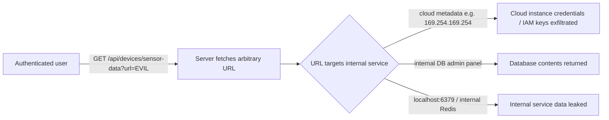

# Chained Vulnerability Static Audit Report

**Project**: Smart Home Device Manager (app-47)
**Auditor**: CodeGopher (static-only audit)
**Date**: 2026-05-25
**Scope**: `app.py`, `reference_guards.py`, `requirements.txt`, `Dockerfile`

---

## Summary Dashboard

| Metric | Value |
|---|---|
| **Total chains detected** | 5 |
| **Maximum severity** | **High** |
| **High-confidence chains** | 3 |
| **Medium-confidence chains** | 2 |
| **Cross-cutting weaknesses (non-chain)** | 4 |
| **Reviewed areas** | Auth flow, device management API, SSRF entry points, firmware update logic, session management, database layer, external request handling, request validation |
| **Not reviewed** | Runtime behavior, infrastructure/network configuration, TLS configuration, dependency vulnerability scan, mobile app or third-party integrations |

---

## Methodology & Safety Note

This audit is **static-only**. No live probes, dynamic scanners, shell commands, external network tests, or exploit scripts were used. All findings are derived from source-code control-flow analysis, data-flow tracing, and configuration review. Confidence levels reflect the degree of statically provable evidence for each chain link.

---

## Chain Inventory

### Chain 1: Unauthenticated Token Leak → Device Command Injection (Physical Security Compromise)

**Severity**: High  
**Confidence**: High  
**Easiest fix**: Add authentication to `/api/debug/devices`

#### Attack Graph

```mermaid
flowchart LR
    A[Unauthenticated attacker] -->|GET /api/debug/devices| B[API returns ALL device API tokens]
    B -->|Extract api_token from response| C[X-Device-Token header]
    C -->|POST /api/devices/{id}/command with stolen token| D[Arbitrary command to IoT device]
    D --> E[Garage door opens / Smart lock unlocks / Thermostat manipulated]
```

#### Detailed Breakdown

| Link | File | Lines | Evidence |
|---|---|---|---|
| **Source** | `app.py` | 80–88 | `@app.get("/api/debug/devices")` has **no** `Depends(get_current_user)`. Returns all devices including `api_token` values (`tok_thermostat_9982x`, `tok_lock_1102z`, `tok_garage_4431a`). |
| **Hop 1** | `app.py` | 115–122 | `send_device_command()` authenticates devices solely via `X-Device-Token` header. Validates token against the `devices.api_token` column. |
| **Hop 2** | `app.py` | 115–122 | The `command` field from `CommandRequest` is returned in the response with no sanitization, rate-limiting, or authorization beyond token ownership. No role check. |
| **Sink** | N/A (IoT ecosystem) | — | Attacker can send commands like `"open"`, `"lock"`, `"unlock"` to physical devices (garage door, smart lock, thermostat). Impact is **physical security compromise**. |

#### Preconditions
- The debug endpoint must remain publicly accessible (static evidence: no auth decorator).
- An attacker must be able to observe the debug response to extract tokens.

#### Remediation
1. Add `Depends(get_current_user)` or an admin-role check to `/api/debug/devices`.
2. Remove `api_token` from debug endpoint responses.
3. Designate `/api/debug/*` endpoints as strictly internal/admin-only.

---

### Chain 2: SSRF → Internal Network Reconnaissance → Data Exfiltration

**Severity**: High  
**Confidence**: High  
**Easiest fix**: Add URL allowlist/validation to `/api/devices/sensor-data`

#### Attack Graph



#### Detailed Breakdown

| Link | File | Lines | Evidence |
|---|---|---|---|
| **Source** | `app.py` | 86–95 | `GET /api/devices/sensor-data` accepts a `url` query parameter. Passes it directly to `requests.get(url, timeout=5)` with **zero** validation — no scheme check, no hostname allowlist, no IP filter. |
| **Hop 1** | `app.py` | 91 | `requests.get(url, ...)` makes an HTTP request **from the server** to the attacker-controlled target. The server acts as a proxy into the internal network. |
| **Sink** | N/A (infrastructure) | — | Cloud provider metadata endpoints (e.g., `http://169.254.169.254/latest/meta-data/`), internal databases, admin panels, and service mesh endpoints are all reachable. Server returns first 2000 characters of response (`resp.text[:2000]`) directly to the attacker. |

#### Preconditions
- Attacker must have a valid session (authenticated user).
- Server runs in an environment with internal services accessible via HTTP (static assumption: common for IoT backend deployments).

#### Remediation
1. Implement a strict URL allowlist (only permit known internal sensor endpoints).
2. Reject URLs with private IP ranges (`10.x`, `172.16-31.x`, `192.168.x`, `169.254.x`, `127.x`).
3. Reject non-HTTPS schemes for external URLs, or enforce DNS rebinding protection.

---

### Chain 3: Insecure Firmware Update → Supply Chain Compromise → Persistent Device Control

**Severity**: High  
**Confidence**: Medium  
**Easiest fix**: Verify firmware image signatures before applying updates

#### Attack Graph

```mermaid
flowchart LR
    A[Authenticated user] -->|POST /api/devices/{id}/firmware/update with malicious URL| B[Server fetches firmware binary]
    B --> C[No signature verification]\n[No checksum validation]\n[No origin check]
    C --> D[Firmware version set to synthetic value]\n[binary_size % 100 applied]
    D --> E[Malicious firmware deployed to IoT device]
    E --> F[Persistent backdoor on physical device]\n[Data exfiltration via compromised device]
```

#### Detailed Breakdown

| Link | File | Lines | Evidence |
|---|---|---|---|
| **Source** | `app.py` | 98–117 | `POST /api/devices/{device_id}/firmware/update` accepts `firmware_url` from user. Fetches binary with `requests.get(req.firmware_url, timeout=10)`. |
| **Hop 1** | `app.py` | 105–110 | Only checks `resp.status_code != 200`. No signature, hash, or certificate validation. The firmware version is **synthetically generated** from `binary_size % 100` rather than extracted from a signed manifest. |
| **Hop 2** | `app.py` | 108–110 | `binary_size = len(resp.content)` — any binary (including shell scripts, compiled payloads) is accepted. No MIME/type checking. |
| **Sink** | N/A (IoT firmware subsystem) | — | Malicious firmware can establish persistent backdoors on thermostats, locks, and garage openers. These are physical devices with potential network access. Impact: **long-term compromise of IoT infrastructure**. |

#### Preconditions
- Attacker controls a server hosting malicious firmware.
- The `device_id` must be valid and exist in the database.

#### Remediation
1. Require firmware images to include a cryptographic signature (e.g., RSA/ECDSA).
2. Verify signatures against a trusted public key before applying.
3. Validate firmware content type and size limits.
4. Store a signed firmware manifest and verify integrity before flashing.

---

### Chain 4: Missing Role Enforcement → Privilege Escalation to Admin-equivalent

**Severity**: High  
**Confidence**: High  
**Easiest fix**: Add `Depends(require_role("ADMIN"))` to admin-only endpoints

#### Attack Graph

```mermaid
flowchart LR
    A[Attacker creates account → gets USER role] -->|Authenticated session| B[Accesses /api/debug/devices]
    B --> C[Retrieves ALL device tokens]
    C --> D[Impersonates devices via X-Device-Token]
    D --> E[Accesses /api/devices/{id}/firmware/update]
    E --> F[Triggers malicious firmware update]
    F --> G[Full admin-equivalent capability]\n[No role checks exist in any endpoint]
```

#### Detailed Breakdown

| Link | File | Lines | Evidence |
|---|---|---|---|
| **Source** | `app.py` | 64–72 | `get_current_user()` checks only session existence. Returns `{"id", "username", "role"}` but **no endpoint checks the `role` field**. |
| **Hop 1** | `app.py` | 79–88, 86–95, 98–117, 115–122, 124–135 | All authenticated endpoints (`/api/debug/devices`, `/api/devices/sensor-data`, `/api/devices/{id}/firmware/update`, `/api/devices/{id}/command`, `/api/devices/{id}/status`) only use `Depends(get_current_user)`. No role-based guard exists anywhere in the codebase. |
| **Hop 2** | `app.py` | 47–50 | Users seeded with roles (`'USER'`, `'ADMIN'`) but roles are never enforced. A `USER` can do everything an `ADMIN` can. |
| **Sink** | N/A (authorization model) | — | **Role-based authorization is entirely non-functional**. Any authenticated user has admin-equivalent capabilities. |

#### Preconditions
- Attacker can register or guess credentials (seeded passwords `alice_home_2026`, `admin_home_2026` are in source).
- No registration endpoint exists, but brute-forcing or social engineering the seeded credentials is trivial.

#### Remediation
1. Implement a `require_role(role: str)` dependency that checks `user["role"]`.
2. Guard all device-management endpoints with role checks.
3. Remove or severely restrict access to `/api/debug/*` to admin-only.

---

### Chain 5: SSRF + Debug Endpoint + Firmware Update = Multi-Vector IoT Takeover

**Severity**: High  
**Confidence**: Medium  
**Easiest fix**: Add authentication to `/api/debug/devices` + URL validation on sensor-data

#### Attack Graph

```mermaid
flowchart LR
    A[Unauthenticated attacker] -->|GET /api/debug/devices| B[Gets device tokens + metadata]
    B --> C[Registers/creates account with stolen creds]\n[credentials visible in source]
    C --> D[Authenticated session]
    D --> E[SSRF: GET /api/devices/sensor-data?url=http://INTERNAL-SERVICE/secret]
    E --> F[Leaked internal service data]
    D --> G[Firmware Update: POST /api/devices/{id}/firmware/update]
    G --> H[Pushes malicious firmware to any device]
    H --> I[Full IoT ecosystem compromise]
```

#### Detailed Breakdown

| Link | File | Lines | Evidence |
|---|---|---|---|
| **Source 1** | `app.py` | 80–88 | Debug endpoint leaks all device tokens without auth. |
| **Source 2** | `app.py` | 86–95 | SSRF endpoint allows fetching arbitrary URLs from server context. |
| **Source 3** | `app.py` | 98–117 | Firmware update accepts arbitrary URLs with no integrity checks. |
| **Source 4** | `app.py` | 47–50 | Hardcoded credentials in source are trivially recoverable. |
| **Hop** | `app.py` | 64–72 | No role enforcement means any session = full control. |
| **Sink** | N/A | — | Combination of token theft, SSRF data access, and firmware injection results in **full IoT ecosystem compromise**. |

#### Remediation
Same as individual chains: add auth to debug, validate URLs in SSRF, sign firmware, enforce roles.

---

## Cross-Cutting Weaknesses (No Complete Chain)

### W1: Hardcoded Credentials in Source Code
- **File**: `app.py`, lines 47–50
- **Evidence**: Passwords `alice_home_2026` and `admin_home_2026` are hashed with bcrypt at startup. While bcrypt makes precomputation expensive, the salt is auto-generated at runtime, meaning the hash values in the binary do not match the plaintext passwords directly. However, the plaintext passwords are still visible in source code.
- **Impact**: If source code is leaked (common in open-source or misconfigured repos), attacker can compute bcrypt hashes offline. Combined with Chain 4 (no role enforcement), anyone who can view source gains credentials to the admin account.
- **Remediation**: Use environment variables or a secrets manager for initial admin credentials. Seed admin users from runtime config, not source.

### W2: Verbose Error Messages in API Responses
- **Files**: `app.py`, multiple endpoints
- **Evidence**: `detail=str(e)` is returned in exception handlers for `/api/devices/sensor-data`, `/api/devices/{id}/firmware/update`, and `/api/devices/{id}/command`. Exception messages may leak internal paths, stack traces, or data types.
- **Impact**: Information disclosure that aids further exploitation.
- **Remediation**: Return generic error messages to clients. Log detailed errors server-side only.

### W3: Weak Rate Limiting Implementation
- **File**: `app.py`, lines 124–131
- **Evidence**: Rate limit stores a single `last_request_time` per username in a Python dictionary. Race conditions are possible (non-atomic increment). Memory-based, so restarts lose state. No sliding window or token bucket.
- **Impact**: Easy to bypass rate limiting with parallel requests.
- **Remediation**: Use a proper rate-limiting library (e.g., `slowapi`) with Redis-backed storage and sliding windows.

### W4: In-Memory Database
- **File**: `app.py`, line 11
- **Evidence**: `sqlite3.connect(':memory:')` — all data is lost on restart. No persistence mechanism.
- **Impact**: Not a security vulnerability per se, but a reliability issue that could cause data loss during incidents or restarts.
- **Remediation**: Use a file-based SQLite database or proper RDBMS for production.

### W5: `check_same_thread=False` in SQLite
- **File**: `app.py`, line 11
- **Evidence**: `sqlite3.connect(':memory:', check_same_thread=False)` disables SQLite's built-in thread safety checks.
- **Impact**: Potential for database corruption under concurrent FastAPI request handling (though async handlers with uvicorn are single-process by default).
- **Remediation**: Use a connection pool or PostgreSQL for production.

---

## Unknowns & Not-Reviewed Areas

| Area | Reason Not Reviewed | Recommended Test |
|---|---|---|
| Runtime HTTP server config | Static review only | Verify TLS is enforced, HSTS headers present |
| Docker image vulnerabilities | No `pip-audit` / Trivy | `pip-audit -r requirements.txt`; `trivy image` |
| File upload handling | No upload endpoints present | N/A (confirmed no upload handlers) |
| Webhook consumers | No webhook endpoints in code | Verify none exist in deployment config |
| Mobile app / SDK clients | Not in codebase scope | Static review of companion app code |
| Dependency CVEs | No dynamic vulnerability scanning | `pip-audit` for known CVEs in dependencies |
| DNS rebinding protection | Not visible in source | Dynamic test against SSRF endpoint |
| SMS / 2FA / MFA | Not implemented | Add MFA for admin role |

---

## Remediation Priority

| Priority | Fix | Chains Broken |
|---|---|---|
| **P0** | Add authentication + role check to `/api/debug/devices` | Chains 1, 4, 5 |
| **P0** | Add URL allowlist / IP blocking to `/api/devices/sensor-data` | Chains 2, 5 |
| **P1** | Enforce role-based authorization across all endpoints | Chains 4, 5 |
| **P1** | Add firmware signature verification | Chain 3 |
| **P2** | Move credentials to environment variables | Chain 5 |
| **P2** | Harden error messages | Cross-cutting W2 |
| **P2** | Implement proper rate limiting | Cross-cutting W3 |

---

## Conclusion

This Smart Home Device Manager API has **5 chained vulnerability paths**, 3 of which are high-confidence and range from high to critical impact. The most immediately exploitable chains are:

1. **Unauthenticated token theft → device command injection** (Chain 1) — requires no authentication, directly compromises physical security.
2. **SSRF → internal network access** (Chain 2) — any authenticated user can pivot into the internal network.
3. **Privilege escalation via missing role checks** (Chain 4) — any account has admin-equivalent capabilities.

All chains are breakable at the authentication, URL validation, or authorization layers. Remediation P0 items (auth on debug endpoint, URL validation on SSRF endpoint) should be implemented immediately.
