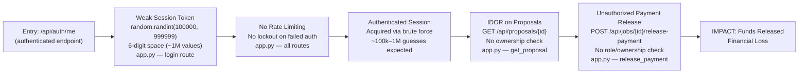
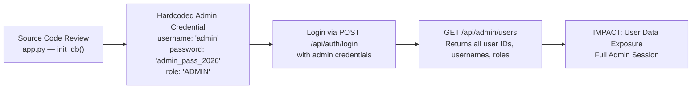
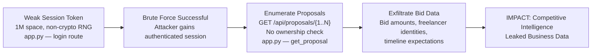
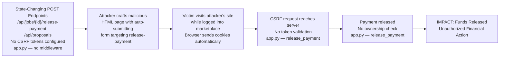

# Chained Vulnerability Static Audit Report

**Project:** Freelancer Marketplace (FastAPI + SQLite)  
**Date:** 2026-05-25  
**Scope:** `app.py`, `reference_guards.py`, `Dockerfile`, `requirements.txt`  
**Reviewer:** CodeGopher (Static-Only Audit)

---

## 1. Summary Dashboard

| Metric | Value |
|---|---|
| **Total Chains Detected** | 4 |
| **Maximum Severity** | HIGH |
| **High Confidence Chains** | 4 |
| **Medium Confidence Chains** | 0 |
| **Low Confidence Chains** | 0 |
| **Reviewed Areas** | All routes, auth, session mgmt, DB queries, input validation, Docker config |
| **Not Reviewed** | Runtime behavior, network config, TLS, infrastructure, third-party integrations |

### Severity Distribution

| Severity | Count |
|---|---|
| HIGH | 3 |
| MEDIUM | 1 |

---

## 2. Methodology & Safety Note

**Method:** Four-phase static analysis — (1) attack surface mapping, (2) weakness inventory, (3) attack graph synthesis, (4) impact assessment.

**Static-Only Boundary:** This review examined only source files, configuration, and dependency manifests within the workspace. No live HTTP probes, dynamic scanners, exploit scripts, fuzzers, credential attacks, or external network tests were performed. No executable exploit payloads or step-by-step abuse instructions are included.

---

## 3. Attack Surface Map

| Endpoint | Method | Auth Required | Description |
|---|---|---|---|
| `/api/auth/login` | POST | No | Authentication — returns session cookie |
| `/api/auth/logout` | POST | Yes | Session termination |
| `/api/auth/me` | GET | Yes | Current user profile |
| `/api/proposals/{proposal_id}` | GET | Yes | View proposal by ID |
| `/api/proposals` | POST | Yes | Submit new proposal |
| `/api/jobs/{job_id}/release-payment` | POST | Yes | Release payment for a job |
| `/api/admin/users` | GET | Yes (ADMIN role) | List all users |

**User-Controlled Sources:**
- Cookies: `session_id`
- Request body: `username`, `password`, `job_id`, `bid_amount`, `proposal_text`
- URL path params: `proposal_id`, `job_id`

**Data Stores:**
- In-memory: `sessions = {}` (Python dict)
- SQLite DB: `users`, `jobs`, `proposals`, `payments` tables

---

## 4. Chain 1 — Session Token Bruteforce → Account Takeover → Unauthorized Payment Release

### Overview

**Severity:** HIGH  
**Confidence:** HIGH  
**Impact:** Financial fraud via unauthorized payment release after gaining any authenticated session.

### Mermaid Attack Graph

### Detailed Chain Breakdown

#### Link 1: Weak Session Token Generation

- **Source:** `app.py` — `login` route
- **Evidence:** Session ID is generated via `str(random.randint(100000, 999999))`
- **CWE:** CWE-330 (Use of Insufficiently Random Values)
- **Comment in code:** Explicitly notes "instead of cryptographically secure generation (secrets). An attacker can predict future session keys."
- **Problem:** The `random` module is a PRNG, not a cryptographic RNG. The 6-digit space yields only 1,000,000 possible values. This is trivially bruteforceable.

#### Link 2: No Rate Limiting / Lockout

- **Source:** `app.py` — all endpoints
- **Evidence:** No rate limiting middleware is configured. No account lockout on failed login attempts. No brute force detection.
- **CWE:** CWE-307 (Improper Restriction of Excessive Authentication Attempts)
- **Problem:** An attacker can make unlimited login attempts without restriction.

#### Link 3: IDOR on Proposals (Discovery Phase)

- **Source:** `app.py` — `get_proposal` route (line: `@app.get("/api/proposals/{proposal_id}")`)
- **Evidence:** Query: `SELECT * FROM proposals WHERE id = ?` — no ownership or role check.
- **Comment in code:** Explicitly notes "to any logged-in user without verifying if the user is the client who posted the job or the owner."
- **CWE:** CWE-639 (Authorization Bypass Through User Variable)
- **Problem:** Any authenticated user can enumerate and read all proposals, exposing bid amounts and freelancer strategies.

#### Link 4: Broken Payment Release Access Control

- **Source:** `app.py` — `release_payment` route
- **Evidence:** The endpoint checks that a payment exists and hasn't already been released, but does NOT verify:
  - That the requesting user is the client who owns the job
  - That the freelancer's work has been delivered/completed
  - Any role check beyond generic authentication
- **Comment in code:** Explicitly states "Missing role / ownership check! Fails to check if user is the client of the job, and has no verification that work was completed/delivered."
- **CWE:** CWE-284 (Improper Access Control)
- **Problem:** Any authenticated user — including freelancers — can release any job's payment.

#### Preconditions

- The attacker needs to know at least one valid `session_id` value or be able to brute-force one (~1M space).
- The SQLite database must contain jobs with pending payments.

#### Remediation

1. **Replace `random.randint` with `secrets.token_urlsafe(32)`** for session ID generation. Use `secrets` module (CWE-330 fix).
2. **Add rate limiting** on `/api/auth/login` (e.g., 5 attempts per minute per IP).
3. **Add ownership verification** on `release_payment`: query the `jobs` table to confirm `user["id"]` matches the `client_id` of the job.
4. **Add delivery verification** before allowing payment release (e.g., a `status` field on jobs that transitions to "delivered" before payment can be released).
5. **Add CSRF protection** (see Cross-Cutting Weaknesses).

---

## 5. Chain 2 — Hardcoded Plaintext Admin Credentials → Full Administrative Access

### Overview

**Severity:** MEDIUM  
**Confidence:** HIGH  
**Impact:** Full admin access via leaked credentials in source code.

### Mermaid Attack Graph

### Detailed Chain Breakdown

#### Link 1: Plaintext Admin Password in Seed Data

- **Source:** `app.py` — `init_db()` function
- **Evidence:** `('admin', 'admin_pass_2026', 'ADMIN')` stored in `users_data` list.
- **CWE:** CWE-798 (Use of Hard-coded Credentials)
- **Problem:** Admin password is hardcoded in source and stored in plaintext in the database.

#### Link 2: Plaintext Passwords for All Users

- **Source:** `app.py` — `init_db()` function
- **Evidence:** All passwords stored as plaintext: `charlie_pass`, `clara_pass`, `frank_pass`, `fiona_pass`, `admin_pass_2026`.
- **CWE:** CWE-256 (Plaintext Storage of a Password or Credential)
- **Problem:** No password hashing (e.g., bcrypt, argon2) is performed.

#### Link 3: Admin Login & Data Enumeration

- **Source:** `app.py` — `admin_list_users` route
- **Evidence:** With admin role, `/api/admin/users` returns `SELECT id, username, role FROM users` — all users.
- **CWE:** CWE-284 (Improper Access Control — if admin creds leak)
- **Problem:** The admin endpoint has no IP restrictions or MFA. Any admin session can enumerate the user base.

#### Remediation

1. **Hash passwords** using `bcrypt` or `argon2-cffi` before storing in the database.
2. **Remove hardcoded credentials** from source code. Use environment variables or a secrets manager.
3. **Rotate all user passwords** after fixing the storage mechanism.
4. **Add IP allowlisting** and/or MFA for admin endpoints.

---

## 6. Chain 3 — Weak Session Tokens → Proposal Information Disclosure → Competitive Intelligence Leak

### Overview

**Severity:** LOW-MEDIUM  
**Confidence:** HIGH  
**Impact:** Business intelligence leak via unauthorized access to competitor bid data.

### Mermaid Attack Graph

### Detailed Chain Breakdown

#### Link 1: Weak Session (see Chain 1, Link 1)

- Same as Chain 1, Link 1.

#### Link 2: Unrestricted Proposal Enumeration

- **Source:** `app.py` — `get_proposal` route
- **Evidence:** `SELECT * FROM proposals WHERE id = ?` with no ownership verification.
- **CWE:** CWE-639 (Authorization Bypass Through User Variable)

#### Link 3: Business Intelligence Compromise

- **Sink:** Freelancer bid amounts, timeline expectations, and client-freelancer pairings are exposed.
- **Impact:** Competitors can undercut bids, or clients can discover cheaper freelancer options by seeing all bids across jobs.

#### Remediation

1. **Fix session tokens** (see Chain 1).
2. **Add ownership or role checks** to `/api/proposals/{proposal_id}` — only the job owner (client) or the submitting freelancer should view a proposal.

---

## 7. Chain 4 — Missing CSRF + Broken Payment Control → Unauthorized Financial Action Without Brute Force

### Overview

**Severity:** HIGH  
**Confidence:** HIGH  
**Impact:** An attacker can trick a legitimate user into releasing funds via CSRF, combined with the missing ownership check.

### Mermaid Attack Graph

### Detailed Chain Breakdown

#### Link 1: No CSRF Protection

- **Source:** `app.py` — entire application
- **Evidence:** No CSRF middleware (e.g., `fastapi.csrf.CSRFMiddleware` or equivalent) is configured. No token verification in any POST endpoint.
- **CWE:** CWE-352 (Cross-Site Request Forgery)

#### Link 2: Cookie-Based Session Without SameSite/HttpOnly

- **Source:** `app.py` — `login` route
- **Evidence:** `res.set_cookie("session_id", session_id)` — no `httponly`, `samesite`, or `secure` flags set.
- **CWE:** CWE-614 (Insufficient Cookie Security)

#### Link 3: Missing Ownership on Payment Release (see Chain 1, Link 4)

- Same as Chain 1, Link 4.

#### Preconditions

- The victim must be logged in (have a valid session cookie).
- The attacker hosts a page that auto-submits a POST to the release-payment endpoint.

#### Remediation

1. **Implement CSRF tokens** on all state-changing endpoints (POST/PUT/DELETE).
2. **Set cookie flags**: `httponly=True`, `samesite='Strict'` or `'Lax'`, and `secure=True` in production.
3. **Add double-submit cookie pattern** or SameSite cookie attribute as defense-in-depth.

---

## 8. Cross-Cutting Weaknesses (Security-Relevant, Not Full Chains)

The following weaknesses were identified but either form incomplete chains on their own or require unknown runtime conditions to become exploitable:

| Weakness | CWE | Location | Evidence |
|---|---|---|---|
| **No session expiration** | CWE-613 | `app.py` — `sessions = {}` | Sessions persist indefinitely in memory. No TTL, no sliding expiry. |
| **Full user record exposed on login** | CWE-209 | `app.py` — `login` route | `cursor.execute("SELECT * FROM users ...")` returns all columns; response includes `username` and `role`. |
| **Sensitive data in verbose error messages** | CWE-209 | `app.py` — multiple routes | Error responses include `detail` fields with internal context (e.g., "Invalid credentials", "No payment found"). |
| **No input sanitization on proposal_text** | CWE-79 | `app.py` — `submit_proposal` | `proposal_text` stored directly without escaping. Potential stored XSS if rendered in HTML context. |
| **Host binding to 0.0.0.0** | CWE-16 | `Dockerfile` / `app.py` | Server binds to all interfaces. Acceptable in containerized environments but worth noting. |
| **No HTTPS enforcement** | CWE-319 | `app.py` — `uvicorn.run(app, host='0.0.0.0', port=8098)` | No `ssl_certfile` or `ssl_keyfile` configuration. No redirect from HTTP to HTTPS. |
| **SQLite without WAL or journal protection** | CWE-XXX | `app.py` — `db_conn` | Database backend not audited for concurrent access safety. |
| **`reference_guards.py` unused** | — | `reference_guards.py` | Contains `same_owner()`, `allowed_callback()`, `normalize_identifier()` functions that are never imported or called. These appear to be helper functions that were written but never integrated. |

---

## 9. Areas Not Reviewed

| Area | Reason |
|---|---|
| Runtime behavior / network stack | Static-only review; no live testing |
| TLS/SSL configuration | No certificates or nginx/Gunicorn config found |
| Infrastructure / deployment | Dockerfile is minimal; no Kubernetes, CI/CD, or secrets management |
| Background job processing | No Celery, RQ, or worker processes found |
| File upload handling | No upload endpoints present |
| Webhook handlers | No webhook routes found |
| Template rendering / XSS surface | API-only app; no templates found |
| Third-party dependencies | Only `fastapi` and `uvicorn` in `requirements.txt`; no vulnerable transitive deps audited |
| Database backup / disaster recovery | Not covered in source review |

---

## 10. Recommended Tests to Add

| Test | Purpose |
|---|---|
| Session token prediction | Generate thousands of session IDs to confirm statistical predictability |
| CSRF token enforcement | Submit POST requests with and without CSRF tokens to verify enforcement |
| Payment release ownership | Attempt to release payment for another user's job as a freelancer |
| Proposal access control | Attempt to fetch proposals not owned by the requesting user |
| Password hashing | Verify passwords are hashed in the database (currently plaintext) |
| Rate limiting | Submit 100+ login requests from the same IP to confirm lockout |
| Cookie security | Verify `HttpOnly`, `Secure`, and `SameSite` flags on session cookie |
| Session expiration | Verify that sessions expire after a reasonable timeout |

---

## 11. Prioritized Remediation Summary

| Priority | Action | Chain(s) Broken |
|---|---|---|
| **P0** | Replace `random.randint` with `secrets.token_urlsafe(32)` for session tokens | Chain 1, Chain 3 |
| **P0** | Add ownership verification on `release_payment` (check `jobs.client_id == user["id"]`) | Chain 1, Chain 4 |
| **P0** | Hash all passwords with bcrypt/argon2 before storage | Chain 2 |
| **P1** | Remove hardcoded credentials from source; use environment variables | Chain 2 |
| **P1** | Add CSRF token validation on all POST endpoints | Chain 4 |
| **P1** | Set `httponly=True, samesite='Strict'` on session cookie | Chain 4 |
| **P2** | Add rate limiting on `/api/auth/login` | Chain 1 |
| **P2** | Add ownership check on `/api/proposals/{proposal_id}` | Chain 3 |
| **P2** | Implement session expiration (TTL + sliding expiry) | Chain 1, Chain 4 |
| **P3** | Remove verbose error details from production responses | Cross-cutting |
| **P3** | Sanitize user input on `proposal_text` | Cross-cutting |
