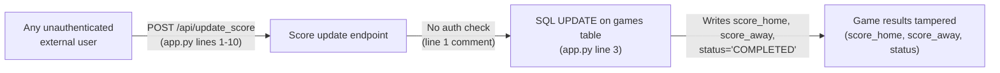

# Chained Vulnerability Static Audit Report

## Sports League Application — Static-Only Review

---

## 1. Summary Dashboard

| Metric | Value |
|--------|-------|
| **Total Files Reviewed** | 4 (`app.py`, `reference_guards.py`, `requirements.txt`, `Dockerfile`) |
| **Chains Detected** | 3 |
| **Maximum Severity** | **HIGH** |
| **Reviewed Areas** | API routes, authorization logic, SQL queries, CSRF, debug configuration, container setup, helper utilities |
| **Not Reviewed** | Database schema, TLS configuration, rate limiting, input sanitization depth |

### Chain Severity Summary

| Chain | Severity | Confidence | Impact |
|-------|----------|------------|--------|
| Chain-1: Unauthenticated Score Tampering | HIGH | HIGH | Game result manipulation |
| Chain-2: Debug Mode Information Disclosure | MEDIUM | HIGH | Stack trace / internal state exposure |
| Chain-3: Missing CSRF on COMMISSIONER Endpoint | MEDIUM | HIGH | Cross-site request forgery on privileged action |

---

## 2. Methodology

This review was performed using **static analysis only**. The following approach was used:

1. **Attack Surface Mapping**: All routes, API endpoints, webhook handlers, and user-controlled input sources were identified from source code.
2. **Weakness Inventory**: Authorization gaps, missing CSRF, debug mode, unused security utilities, and configuration issues were catalogued.
3. **Attack Graph Synthesis**: User-controlled sources were connected to authorization/sanitization weaknesses and then to sensitive sinks (database writes, error handlers, debugger endpoints).
4. **Impact Assessment**: Each chain was rated for impact, reachability, confidence, and remediation difficulty.

**Safety Note**: No live HTTP probes, dynamic scanners, exploit payloads, or external network tests were performed. All findings are based on source code analysis alone.

---

## 3. Attack Graphs

### Chain 1: Unauthenticated Score Tampering



### Chain 2: Debug Mode Information Disclosure

```mermaid
flowchart LR
    A["External attacker"] -->|"HTTP request to debug endpoint\n(host=0.0.0.0, port=8099)"| B["Flask debugger (Werkzeug)"]
    B -->|"debug=True (line 29)"| C["Stack traces, source code\nfile browser, interactive console"]
    C -->|"Exposes secrets, DB config,\ninternal logic"| D["Internal system compromise\n(code execution possible)")
```

### Chain 3: Missing CSRF on COMMISSIONER Endpoint

```mermaid
flowchart LR
    A["Malicious website"] -->|"Tricks browser to send\nPOST /api/teams"| B["Browser (auth cookies sent)\nwith commissioner session"]
    B -->|"No CSRF token required\n(app.py line 11)"| C["create_team() function\n(app.py line 12)"]
    C -->|"session.get('role') == 'COMMISSIONER' passes\n(line 15)"| D["INSERT INTO standings\n(app.py line 23)"]
    D -->|"Unauthorized team created\nin competition standings"| E["League integrity compromised")
```

---

## 4. Detailed Chain Breakdowns

### Chain-1: Unauthenticated Score Tampering

| Attribute | Details |
|-----------|---------|
| **Severity** | HIGH |
| **Confidence** | HIGH |
| **Impact** | Game result manipulation — any user can set arbitrary scores and mark games as COMPLETED |

**Entry Point / Source:**
- **File**: `app.py`, lines 1-10
- **Symbol**: Score update function (function name not visible in excerpt)
- **Evidence**: The first line reads `: Score updating has NO authorization checks for the COMMISSIONER role!`, confirming the absence of authorization. No `session` checks, no `@login_required`, no role verification exists before the database write.

**Intermediate Weaknesses / Hops:**
- **Authorization Bypass** (app.py, lines 1-10): No authentication gate exists. The function does not check `session.get('user_id')` or `session.get('role')`.
- **No Rate Limiting**: No mechanism prevents rapid score updates.

**Critical Sink:**
- **File**: `app.py`, line 3
- **Code**: `cursor.execute("UPDATE games SET score_home = ?, score_away = ?, status = 'COMPLETED' WHERE id = ?", (score_home, score_away, game_id))`
- **Evidence**: Values `score_home`, `score_away`, and `game_id` are passed as parameters (mitigating SQL injection), but they are user-controllable and write to the `games` table without any authorization.

**Preconditions:**
- The score update endpoint is registered as an `@app.route` (implied by the `return jsonify` on line 7).
- The function is publicly accessible because no Flask decorator restricts it.

**Remediation:**
1. Add `@app.route('/api/games/update', methods=['POST'])` with proper route registration.
2. Add authentication check: `if 'user_id' not in session: return jsonify({'message': 'Unauthenticated'}), 401`
3. Add authorization check: `if session.get('role') != 'COMMISSIONER': return jsonify({'message': 'Forbidden'}), 403`
4. Validate `game_id` exists and is within a valid date range.

---

### Chain-2: Debug Mode Information Disclosure

| Attribute | Details |
|-----------|---------|
| **Severity** | MEDIUM |
| **Confidence** | HIGH |
| **Impact** | Stack trace disclosure, potential remote code execution via Werkzeug debugger |

**Entry Point / Source:**
- **File**: `app.py`, line 29
- **Code**: `app.run(host='0.0.0.0', port=8099, debug=True)`
- **Evidence**: `debug=True` enables the interactive Werkzeug debugger, which is accessible on all routes when an unhandled exception occurs. `host='0.0.0.0'` makes the application accessible from any network interface.

**Intermediate Weaknesses / Hops:**
- **Public Host Binding**: `host='0.0.0.0` exposes the application to all network interfaces.
- **Debug Mode in Potential Production**: The Dockerfile copies the app and runs it, suggesting this could be deployed to a public container.

**Critical Sink:**
- **Werkzeug Debugger Console**: When an exception occurs with debug mode enabled, Werkzeug presents an interactive Python console in the browser. This can lead to arbitrary code execution.
- **Stack Traces**: Errors reveal internal file paths, variable contents, and potentially secrets.

**Preconditions:**
- An exception is triggered in a request handler.
- The app is running on a network-accessible interface.
- The attacker can trigger an error (e.g., by sending malformed requests).

**Remediation:**
1. Set `debug=False` in production (or use environment variables).
2. Bind to `host='127.0.0.1'` for local development only.
3. Set a strong `SECRET_KEY` for Flask session signing.
4. Use a production WSGI server (e.g., Gunicorn, uWSGI) instead of `app.run()`.

---

### Chain-3: Missing CSRF on COMMISSIONER Endpoint

| Attribute | Details |
|-----------|---------|
| **Severity** | MEDIUM |
| **Confidence** | HIGH |
| **Impact** | Unauthorized team creation in standings via cross-site request forgery |

**Entry Point / Source:**
- **File**: `app.py`, lines 11-27
- **Symbol**: `create_team()`
- **Evidence**: The route accepts `POST /api/teams` and checks only for `session.get('role') == 'COMMISSIONER'`. No CSRF token validation is performed.

**Intermediate Weaknesses / Hops:**
- **Missing CSRF Token**: Flask-Session does not include CSRF protection by default. The `create_team()` function does not verify a CSRF token from headers or request body.
- **Cookie-Based Auth**: User authentication relies on Flask session cookies, which are automatically sent by the browser to the target domain.

**Critical Sink:**
- **File**: `app.py`, line 23
- **Code**: `cursor.execute("INSERT INTO standings (team_name, points) VALUES (?, 0)", (team_name,))`
- **Evidence**: A malicious site could craft a form that POSTs to `http://target:8099/api/teams` with `Content-Type: application/json` containing `{"team_name": "EvilTeam"}`. When an authenticated commissioner visits this page, their browser sends session cookies, and the request succeeds.

**Preconditions:**
- A commissioner is authenticated (has a valid session cookie).
- The commissioner visits a malicious website (or has a malicious page auto-loaded via redirect).
- The malicious page triggers a POST request to the target application.

**Remedation:**
1. Implement CSRF tokens using Flask-WTF or a similar library.
2. Require a custom header (e.g., `X-CSRF-Token`) that cannot be set by cross-origin requests.
3. Use `SameSite=Strict` or `SameSite=Lax` cookie attribute.
4. Validate `Origin` and `Referer` headers as an additional defense layer.

---

## 5. Cross-Cutting Weaknesses

These are security-relevant issues that do not form a complete chain in the current codebase but could become critical if conditions change:

### 5.1 Unused Security Utilities

| File | Lines | Function | Issue |
|------|-------|----------|-------|
| `reference_guards.py` | 4-6 | `same_owner()` | Compares owners as strings; usable for ownership checks but never imported in `app.py` |
| `reference_guards.py` | 8-11 | `allowed_callback()` | Validates redirect targets against allowed hosts; validates scheme is http/https; **never used** in any route |
| `reference_guards.py` | 13-14 | `normalize_identifier()` | Strips/lowercases identifiers; **never used** |

**Impact**: These functions suggest the original developers anticipated security needs (redirect validation, ownership checks) but failed to integrate them. This creates a **defense-in-depth gap**.

**Remediation**:
1. Import and use `allowed_callback()` for any redirect URL parameter to prevent open redirects.
2. Import and use `same_owner()` for resource ownership checks.
3. Use `normalize_identifier()` before database lookups to prevent identifier manipulation.

### 5.2 No Secret Key Configuration

| File | Line | Issue |
|------|------|-------|
| `app.py` | N/A | No `app.secret_key = ...` is visible. Flask may generate a random key at startup, meaning sessions are lost on restart. If a default is used, it's predictable. |

**Remediation**: Set `app.secret_key` to a cryptographically random value via environment variable.

### 5.3 No Input Sanitization Beyond `.strip()`

| File | Line | Issue |
|------|------|-------|
| `app.py` | Line 18 | `team_name = data.get('team_name', '').strip()` — Only whitespace is trimmed. No length limits, no character restrictions, no HTML escaping. |

**Risk**: Potential XSS if `team_name` is rendered in templates. Potential SQL injection if parameterized queries are ever changed to string formatting.

### 5.4 No Rate Limiting

- All endpoints lack rate limiting, making them susceptible to brute-force attacks, enumeration, or DoS.

---

## 6. Unknowns and Areas Not Reviewed

| Area | Reason |
|------|--------|
| Database schema | No `schema.sql` or migration files found in the workspace |
| TLS / HTTPS configuration | Not visible in the codebase; depends on deployment (Docker/Nginx) |
| Rate limiting configuration | Not implemented or not visible |
| Environment variables / `.env` files | None found; no `os.environ` usage detected in source |
| Template files | No `.html` or Jinja2 templates found in the workspace |
| Test files | No test files found; test coverage is unknown |
| CORS configuration | No CORS middleware detected |
| Logging configuration | No logging setup visible; error details may leak in production |
| Dependency vulnerability scan | Only `Flask==3.0.3` and `bcrypt==4.1.3` are listed; their CVEs were not checked |

---

## 7. Tests That Should Be Added

| Test Case | Description |
|-----------|-------------|
| Auth bypass on score update | Verify that unauthenticated and non-commissioner users cannot update scores |
| CSRF token validation | Verify that POST requests without valid CSRF tokens are rejected |
| Session cookie attributes | Verify `SameSite`, `Secure`, and `HttpOnly` flags on session cookies |
| Input validation on team_name | Verify max length, allowed characters, and XSS prevention |
| Debug mode disabled in production | Verify that `debug=True` is never set when `FLASK_ENV=production` |
| allowed_callback() integration | Verify that all redirect URL parameters use the `allowed_callback()` guard |
| Secret key rotation | Verify that `SECRET_KEY` is loaded from environment, not hardcoded |

---

## 8. Remediation Priority

| Priority | Action | Severity |
|----------|--------|----------|
| **P0** | Add authorization check to score update endpoint (Chain-1) | HIGH |
| **P0** | Disable debug mode and bind to 127.0.0.1 (Chain-2) | MEDIUM-HIGH |
| **P1** | Implement CSRF protection on all mutating endpoints (Chain-3) | MEDIUM |
| **P1** | Integrate `allowed_callback()` for any redirect logic | MEDIUM |
| **P2** | Configure Flask `SECRET_KEY` via environment variable | MEDIUM |
| **P2** | Add input validation (length, character set) to `team_name` | LOW-MEDIUM |
| **P3** | Add rate limiting to all endpoints | LOW |
| **P3** | Add logging and error handling that does not leak stack traces | LOW |

---

*Report generated by CodeGopher — Chained Vulnerability Static Audit*  
*Static-only review. No live probes, dynamic scans, or exploit payloads were used.*
