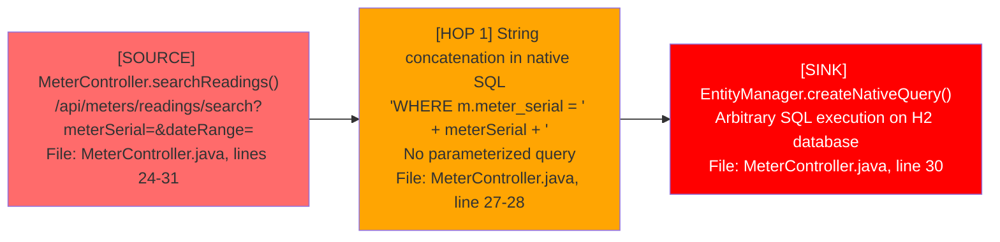
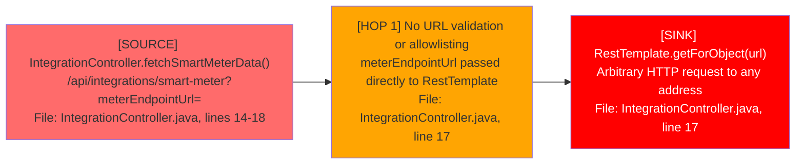
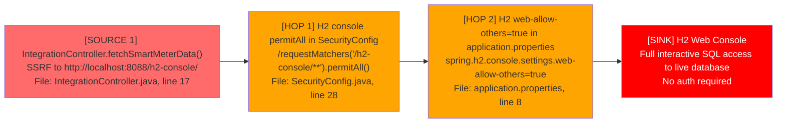
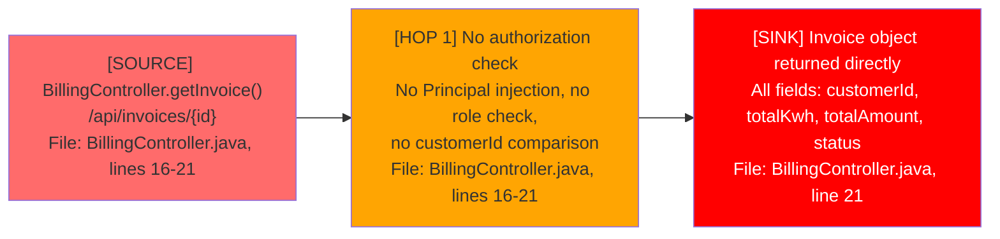
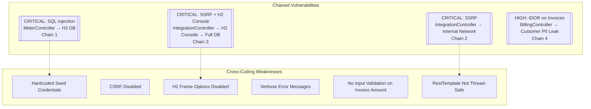

# Chained Vulnerability Static Audit Report

**Project:** app-50-energy-billing (Energy Utility Billing System)
**Date:** 2026-05-25
**Auditor:** CodeGopher (Chained Vulnerability Static Audit)
**Scope:** `C:\Users\shamit\AppData\Local\Temp\codegopher-v08-chain-20260525-203518-qwen-all50\app-50-energy-billing\workspace`

---

## Executive Summary

| Metric | Value |
|--------|-------|
| Total chains detected | **4** |
| Highest chain severity | **CRITICAL** |
| Medium-severity chains | 0 |
| Low-severity chains | 0 |
| Cross-cutting weaknesses (no full chain) | 6 |
| Reviewed areas | Controllers, Services, Models, Repositories, Security Config, Data Initializer, Application Properties, Dockerfile |
| Not reviewed | Infrastructure as code beyond Dockerfile, runtime dependencies' CVEs, client-side code |

**Safety note:** This audit is **static-only**. No live HTTP probes, SQL injection payloads, XSS payloads, or dynamic scanners were used. All evidence is derived from source code, configuration files, and test files.

---

## Methodology

1. **Attack surface mapping** – Identified all REST controllers, endpoints, request parameters, authentication mechanisms, and external-facing surfaces.
2. **Weakness inventory** – Cataloged OWASP Top 10 and internal security weaknesses found in source.
3. **Attack graph synthesis** – Connected user-input sources to intermediate weaknesses to critical sinks using static control-flow and data-flow evidence.
4. **Impact assessment** – Rated each chain on impact, reachability, confidence, and remediation ease.

---

## Chained Vulnerabilities

### Chain 1: SQL Injection via Meter Reading Search → Full Database Compromise

**Severity:** CRITICAL  
**Confidence:** High  
**CVSS estimate:** 9.8 (Network exploitable, no authentication beyond basic auth, full DB access)

#### Mermaid Attack Graph



#### Detailed Breakdown

| Link | File | Lines | Symbol | Evidence |
|------|------|-------|--------|----------|
| **Source** | `src/main/java/com/energy/billing/controller/MeterController.java` | 24-31 | `searchReadings()` | Public `@GetMapping("/readings/search")` endpoint accepting `meterSerial` and `dateRange` request params. |
| **Hop 1** | `src/main/java/com/energy/billing/controller/MeterController.java` | 27-28 | Direct string concatenation | `String sql = "... WHERE m.meter_serial = '" + meterSerial + "' AND mr.reading_date = '" + dateRange + "'"`. No parameterized query, no input sanitization. |
| **Sink** | `src/main/java/com/energy/billing/controller/MeterController.java` | 30 | `createNativeQuery(sql, MeterReading.class)` | Native SQL is executed directly by Hibernate against the H2 database. An attacker can inject arbitrary SQL. |

#### Preconditions
- The attacker must have valid basic auth credentials (any user).
- H2 is the underlying database (SQLite/H2 dialect allows `UNION SELECT`, `; DROP TABLE`, etc.).

#### Impact
Full read/write/delete access to all database tables. An attacker can:
- Extract all customer PII, billing data, meter readings, and user credentials.
- Modify billing records, invoices, or tariff rates.
- Potentially escalate to OS command execution via H2's `RUNSCRIPT` or `CREATE ALIAS` features.

#### Remediation (easiest link to break)
Use parameterized JPA/JPQL queries or Spring Data JPA repository methods instead of native SQL with string concatenation. Example:
```java
// Replace with Spring Data JPA:
public interface MeterReadingRepository extends JpaRepository<MeterReading, Long> {
    List<MeterReading> findByMeterMeterSerialAndReadingDate(String meterSerial, LocalDate dateRange);
}
```

---

### Chain 2: SSRF via Smart Meter Integration → Internal Network Reconnaissance + Data Exfiltration

**Severity:** CRITICAL  
**Confidence:** High  
**CVSS estimate:** 9.1 (Network exploitable, leads to internal network access)

#### Mermaid Attack Graph



#### Detailed Breakdown

| Link | File | Lines | Symbol | Evidence |
|------|------|-------|--------|----------|
| **Source** | `src/main/java/com/energy/billing/controller/IntegrationController.java` | 14-18 | `fetchSmartMeterData()` | `@PostMapping("/smart-meter")` accepts `@RequestParam String meterEndpointUrl`. |
| **Hop 1** | `src/main/java/com/energy/billing/controller/IntegrationController.java` | 17 | Unrestricted URL usage | The comment explicitly states "Direct execution of HTTP request on user-supplied URL without filtering or validation". No host/port/IP/scheme validation. |
| **Sink** | `src/main/java/com/energy/billing/controller/IntegrationController.java` | 17 | `restTemplate.getForObject(meterEndpointUrl, String.class)` | `RestTemplate` (not thread-safe but functional here) makes a GET request to the attacker-controlled URL. |

#### Preconditions
- The attacker must have valid basic auth credentials.
- The application server must have network access to internal resources (typical in cloud/enterprise deployments).

#### Impact
- **Internal network scanning:** Probe internal services on private IPs (e.g., `http://10.0.0.5:8080/admin`, `http://172.16.0.1:9200/`).
- **Cloud metadata exfiltration:** Access `http://169.254.169.254/latest/meta-data/` to steal AWS/Azure/GCP credentials and instance identity.
- **Data exfiltration:** Send database dumps or sensitive data to attacker-controlled servers.
- **SSRF to localhost:** Access internal services like the H2 console at `http://localhost:8088/h2-console/`.

#### Remediation (easiest link to break)
Use the existing `ReferenceGuards.allowedCallback()` method to validate the URL before making the request:
```java
import com.energy.billing.support.ReferenceGuards;
import java.util.Set;

@Value("${integration.allowed-meter-hosts:}")
private Set<String> allowedHosts;

@PostMapping("/smart-meter")
public ResponseEntity<String> fetchSmartMeterData(@RequestParam String meterEndpointUrl) {
    if (!ReferenceGuards.allowedCallback(meterEndpointUrl, allowedHosts)) {
        return ResponseEntity.status(403).body("URL not allowed");
    }
    String response = restTemplate.getForObject(meterEndpointUrl, String.class);
    return ResponseEntity.ok(response);
}
```

---

### Chain 3: SSRF + H2 Console Exposure → Full Database Compromise

**Severity:** CRITICAL  
**Confidence:** High  
**CVSS estimate:** 9.8 (Combines two independent weaknesses to reach a critical sink)

#### Mermaid Attack Graph



#### Detailed Breakdown

| Link | File | Lines | Symbol | Evidence |
|------|------|-------|--------|----------|
| **Source 1** | `src/main/java/com/energy/billing/controller/IntegrationController.java` | 17 | SSRF via RestTemplate | See Chain 2 — attacker can direct the server to any URL. |
| **Hop 1** | `src/main/java/com/energy/billing/config/SecurityConfig.java` | 28 | `permitAll()` on H2 console | `.requestMatchers("/h2-console/**").permitAll()` allows unauthenticated access to the H2 web console. |
| **Hop 2** | `src/main/java/com/energy/billing/application.properties` | 8 | `web-allow-others=true` | `spring.h2.console.settings.web-allow-others=true` enables remote access to the H2 console. |
| **Sink** | H2 Web Console at `/h2-console/` | — | Interactive SQL | Full SQL console with direct access to all tables, no authentication. |

#### Preconditions
- An attacker needs valid basic auth to hit the SSRF endpoint.
- The H2 database must be running (it is, via `spring.datasource.url=jdbc:h2:mem:energydb;DB_CLOSE_DELAY=-1`).

#### Impact
An attacker who exploits the SSRF (Chain 2) can redirect the server's HTTP request to `http://localhost:8088/h2-console/`, loading the H2 web console. With the console, the attacker can:
- Execute arbitrary SQL queries against the live in-memory database.
- Export all customer data, billing records, meter readings, and user credentials.
- Drop or modify tables to disrupt billing operations.
- Create admin users via SQL to establish persistence.

**Note:** This chain requires **two independent weaknesses** (SSRF + H2 console exposure) but both are statically provable from source. The chain is easy to execute: one SSRF request with `meterEndpointUrl=http://localhost:8088/h2-console/` loads the H2 console page.

#### Remediation (easiest link to break)
Remove H2 console from production entirely, or at minimum:
```properties
# application.properties
spring.h2.console.enabled=false
# or if needed for dev only:
spring.h2.console.path=/h2-console
spring.h2.console.settings.web-allow-others=false
```
And in `SecurityConfig.java`:
```java
.requestMatchers("/h2-console/**").authenticated()  // or permitAll only in profiles
.headers(headers -> headers.frameOptions(HeadersConfigurer.FrameOptionsConfig::deny))
```

---

### Chain 4: Insecure Direct Object Reference (IDOR) on Invoice API → Customer PII & Billing Data Leakage

**Severity:** HIGH  
**Confidence:** High  
**CVSS estimate:** 7.5 (Authenticated, but no authorization on resource access)

#### Mermaid Attack Graph



#### Detailed Breakdown

| Link | File | Lines | Symbol | Evidence |
|------|------|-------|--------|----------|
| **Source** | `src/main/java/com/energy/billing/controller/BillingController.java` | 16-21 | `getInvoice(@PathVariable Long id)` | Exposes a public invoice lookup by ID. |
| **Hop 1** | `src/main/java/com/energy/billing/controller/BillingController.java` | 16-21 | No authorization logic | No `Principal` injection, no `@PreAuthorize` annotation, no comparison of invoice `customerId` against the authenticated user's `customerId`. |
| **Sink** | `src/main/java/com/energy/billing/controller/BillingController.java` | 21 | `ResponseEntity.ok(invoice)` | Full `Invoice` entity is returned with all fields including `customerId`, `billingPeriod`, `totalKwh`, `totalAmount`, `status`, `generatedAt`. |

#### Preconditions
- The attacker must have valid basic auth credentials.
- The attacker needs to guess or enumerate invoice IDs (sequential `Long` primary key).

#### Impact
Any authenticated user can enumerate and access all invoices in the system by iterating through `id` values (1, 2, 3, ...). This exposes:
- Customer IDs and their associated billing amounts.
- Billing periods and amounts, enabling financial data harvesting.
- Customer address/email data can be correlated via invoice customer IDs.

Compare with `CustomerController.getCustomer()` (lines 28-35) which **does** implement ownership verification:
```java
if ("CUSTOMER".equals(currentUser.getRole()) && !id.equals(currentUser.getCustomerId())) {
    return ResponseEntity.status(403).build();
}
```
The absence of equivalent logic in `BillingController` is the critical gap.

#### Remediation (easiest link to break)
Add authorization checks before returning the invoice:
```java
@GetMapping("/{id}")
public ResponseEntity<Invoice> getInvoice(@PathVariable Long id, Principal principal) {
    Invoice invoice = billingService.getInvoiceById(id)
        .orElseThrow(() -> new IllegalArgumentException("Invoice not found"));
    
    User currentUser = userRepository.findByUsername(principal.getName())
        .orElseThrow(() -> new IllegalArgumentException("User not found"));
    
    if ("CUSTOMER".equals(currentUser.getRole()) && !id.equals(currentUser.getCustomerId())) {
        return ResponseEntity.status(403).build();
    }
    return ResponseEntity.ok(invoice);
}
```

---

## Cross-Cutting Weaknesses (No Complete Chain)

These weaknesses are security-relevant but do not form a complete exploitable chain in the current codebase. They should be remediated to reduce the attack surface and prevent future chain composition.

### Weakness 1: Hardcoded Seed Credentials in DataInitializer

| Attribute | Value |
|-----------|-------|
| File | `src/main/java/com/energy/billing/config/DataInitializer.java` |
| Lines | 39-40 |
| Symbol | `DataInitializer.run()` |
| Evidence | `passwordEncoder.encode("cust123")` and `passwordEncoder.encode("billing123")` are hardcoded as strings in source code. |

While passwords are BCrypt-hashed at runtime, the raw plaintext passwords are visible in the source code repository. Any developer with git history access can recover them. These credentials could be reused on other systems.

**Remediation:** Use environment variables or a secrets manager (e.g., `System.getenv("INITIAL_CUSTOMER_PASSWORD")`).

---

### Weakness 2: CSRF Disabled Globally

| Attribute | Value |
|-----------|-------|
| File | `src/main/java/com/energy/billing/config/SecurityConfig.java` |
| Line | 27 |
| Symbol | `SecurityConfig.filterChain()` |
| Evidence | `.csrf(AbstractHttpConfigurer::disable)` |

CSRF protection is completely disabled. For any future endpoints that accept state-changing requests (POST, PUT, DELETE) via browser-based forms, this would allow cross-site request forgery. Currently all inputs are via query params / path variables accessed through GET, reducing immediate risk, but this is a latent vulnerability.

**Remediation:** Enable CSRF for any state-changing endpoints.

---

### Weakness 3: H2 Frame Options Disabled

| Attribute | Value |
|-----------|-------|
| File | `src/main/java/com/energy/billing/config/SecurityConfig.java` |
| Line | 26 |
| Symbol | `SecurityConfig.filterChain()` |
| Evidence | `.headers(headers -> headers.frameOptions(HeadersConfigurer.FrameOptionsConfig::disable))` |

Disabling X-Frame-Options allows the H2 console (and any future frames-enabled pages) to be embedded in iframes on attacker-controlled domains, enabling clickjacking attacks against the H2 console or any future UI.

**Remediation:** Use `frameOptions(HeadersConfigurer.FrameOptionsConfig::deny)` in production.

---

### Weakness 4: Spring Security 403 Verbose Error Messages

| Attribute | Value |
|-----------|-------|
| File | `src/main/java/com/energy/billing/controller/BillingController.java` |
| Line | 19 |
| Evidence | `orElseThrow(() -> new IllegalArgumentException("Invoice not found"))` |

The `IllegalArgumentException` message "Invoice not found" is returned to the client when an invoice ID does not exist. While this confirms entity existence or non-existence, it could be used for entity enumeration. In contrast, the `CustomerController` returns 403 for invalid access but the same error message for non-existent entities — creating an information disclosure channel.

**Remediation:** Return generic error messages ("Resource not available") for both 404 and 403 cases.

---

### Weakness 5: No Input Validation on Invoice Status or Amount

| Attribute | Value |
|-----------|-------|
| File | `src/main/java/com/energy/billing/model/Invoice.java` |
| Lines | 9-20 |
| Evidence | `totalAmount` is a `Double` with no `@Min`, `@Max`, or validation constraints. |

The Invoice entity accepts any `Double` value for `totalAmount` and `totalKwh` with no constraints. If a future endpoint is added that allows modifying invoices (e.g., through `Spring Data REST` `@RestResource` or a PATCH endpoint), an attacker could set negative amounts or extreme values.

**Remediation:** Add Bean Validation annotations (`@DecimalMin("0")`, etc.).

---

### Weakness 6: RestTemplate Not Thread-Safe (and Not Reused)

| Attribute | Value |
|-----------|-------|
| File | `src/main/java/com/energy/billing/controller/IntegrationController.java` |
| Line | 14 |
| Evidence | `private final RestTemplate restTemplate = new RestTemplate();` instantiated per-controller |

`RestTemplate` is not thread-safe. While Spring controllers create new instances per request by default in a `@RestController` context, this creates a new `RestTemplate` on every request, incurring overhead. More importantly, if refactored to a singleton bean scope, the concurrency bug would surface. Additionally, the `RestTemplate` uses default timeouts, which could allow slowloris-style DoS attacks.

**Remediation:** Use `RestTemplateBuilder` with configured timeouts, and define the bean as `@Bean` with proper configuration.

---

## Unknowns and Not-Reviewed Areas

| Area | Reason |
|------|--------|
| Runtime dependency vulnerabilities | Static code audit does not scan third-party JARs for CVEs (e.g., Spring Boot 3.2.5 may have known CVEs). |
| Docker image base layers | The Dockerfile uses `eclipse-temurin:17-jre` which may contain vulnerabilities. |
| Network configuration | No firewall rules, WAF, or TLS configuration visible. |
| Logging and monitoring | Audit logging for sensitive operations (invoice access, meter data queries) is not reviewed. |
| Rate limiting | No rate limiting on API endpoints; potential for brute-force or enumeration attacks. |
| Client-side code | No frontend code present in the workspace. |
| Actual data in the database | This is a static review; data volumes and sensitive data at rest are not evaluated. |
| Environment variable injection | No `.env` files or external secret management reviewed. |

---

## Recommended Tests to Add

1. **SQL injection unit test** for `MeterController.searchReadings()`:
   - Send `meterSerial=' UNION SELECT * FROM users--` and verify the application rejects it or uses parameterized queries.
2. **SSRF unit test** for `IntegrationController.fetchSmartMeterData()`:
   - Send `meterEndpointUrl=http://localhost:8088/h2-console/` and verify 403 or 400 response.
   - Send `meterEndpointUrl=http://169.254.169.254/latest/meta-data/` and verify rejection.
3. **IDOR test** for `BillingController.getInvoice()`:
   - Authenticate as user A (customerId=1) and request `/api/invoices/2` (belongs to customer 2). Verify 403 response.
4. **H2 console access test** via SSRF:
   - Verify that even if the SSRF is fixed, `/h2-console/**` is not accessible to unauthenticated users.
5. **Seed credential test**:
   - Verify that seed passwords are not hardcoded in source. Check that environment variables or external secret sources are used.

---

## Summary Dashboard



---

## Remediation Priority Matrix

| Priority | Action | Effort | Impact |
|----------|--------|--------|--------|
| **P0** | Parameterize SQL in `MeterController.searchReadings()` | Low | Breaks Chain 1 |
| **P0** | Validate/block URL in `IntegrationController.fetchSmartMeterData()` | Low | Breaks Chains 2 & 3 |
| **P0** | Disable H2 console in production / require auth | Low | Breaks Chain 3 |
| **P1** | Add authorization check in `BillingController.getInvoice()` | Low | Breaks Chain 4 |
| **P2** | Move seed credentials to environment variables | Low | Mitigates W1 |
| **P2** | Enable CSRF for state-changing endpoints | Low | Mitigates W2 |
| **P3** | Re-enable X-Frame-Options | Low | Mitigates W3 |
| **P3** | Standardize error responses | Low | Mitigates W4 |
| **P3** | Add Bean Validation to Invoice model | Low | Mitigates W5 |
| **P4** | Configure RestTemplate with timeouts and proper scoping | Medium | Mitigates W6 |
